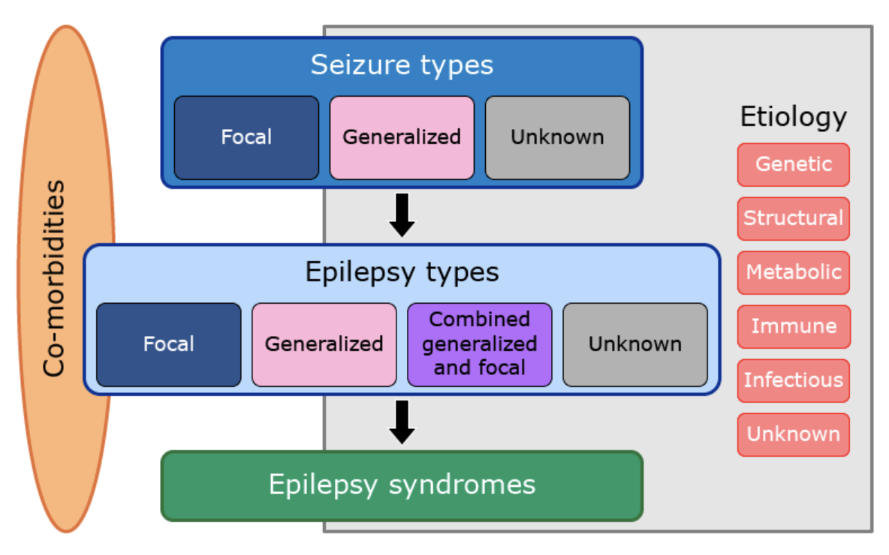
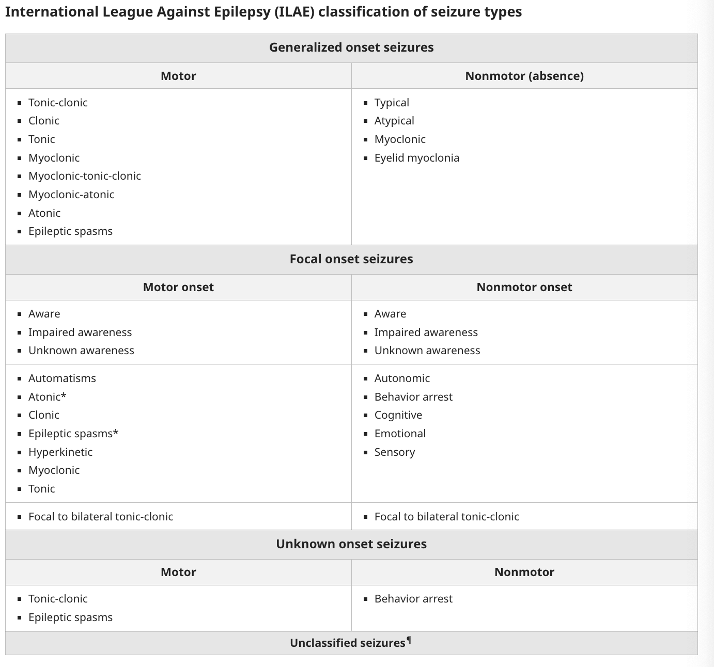
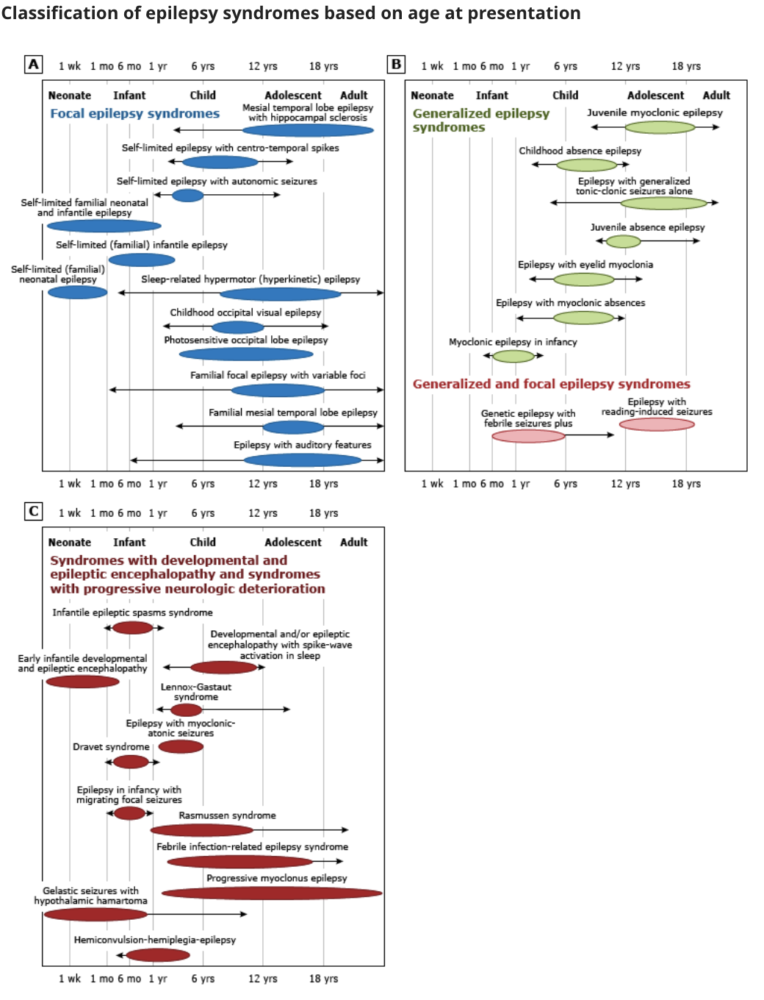

# Epilepsy

- **Definition** - heterogenous disorder of the brain characterised by an enduing predisposition to epileptic seizures, with many possible seizure types and syndromes, diverse etiology, and variable prognosis
- **Epidemiology** - prevalence of active epilepsy around 0.5%
- **Pathophysiology of seizure and epilepsy:**
    - **Imbalance between excitation and inhibition** - paroxysmal depolarisation shift in neuronal membrane potential, predisposing to recurrent action potentials with **repetitive discharges involving large neuronal networks**:
        - <u>Inhibitory neurotransmitters</u> - GABA (gamma-aminobutyric acid) acts on ion channels to enhance chloride influx and **hyperpolarisation**, preventing action potential formation
        - <u>Excitatory neurotransmitters</u> - Glutamate and asparate act on ion channels to enhance sodium and calcium influx and hence **depolarisation**, promoting action potential formation
    - **Principles of focal onset seizures:**
        - <u>Localised pathology causing focal seizure at first instance</u> - from focal infections, tumours, vascular event, or trauma-related scarring
        - <u>Semiology is dependent on cortical area affected</u> - e.g. origin in temporal lobe results in impaired awareness but w/o tonic-clonic movement
        - <u>Seizure activity can spread</u> - spread to different cortical areas will result in different clinical features, and subsequently secondary generalisation when spread to the contralateral hemisphere
    - **Principles of generalised seizures:**
        - <u>Seizures can be generalised in onset</u> - caused by genetic basis (e.g. channelopathies) involving **central mechnisms** controlling cortical activations (<u>diencephalic activating system</u>) and spreads rapidly
        - <u>Secondary generalisation after focal onset seizures</u> - caused by focal seizures that spread to bilateral hemispheres via spreading of abnormal electrical activity to the diencephalic activating pathways

    
    
- **International league against epilepsy (ILAE) framework** - guides diagnosis at 3 levels based on details of Hx and availability of testing:
    - <u>Level 1</u> - seizure types
    - <u>Level 2</u> - epilepsy type based on seizure type
    - <u>Level 3</u> - epilepsy syndrome

  
  
- **Seizure types** (Level 1 Dx) - determine 1) whether there is a focal onset, and 2) whether it conforms to a recognised pattern of seizures:
    - **Aims of seizure diagnosis:**
        - 1\. Determine whether there is a focal onset
        - 2\. Whether it conforms to a recognised pattern by ILAE classification
    - **Classification of seizures by onset** - focal seizures vs generalised seizures:
        - <u>Generalised onset seizure</u> - seizures that arise from abnormal event arising in the **diencephalon cortical activating pathway** (further broken down into motor and nonmotor \[absence\] seizures)
        - <u>Focal onset seizure</u> - seizures that arise from abnormal cortical activity, often associated with a focal pathology (further subdivided based on level of wareness, nature of manifestation, and elemental features)
        - <u>Unknown onset seizure</u> - where the initial manifestation may be motor or non-motor
        - <u>Unclassified seizures</u> - inadequate information or inability to place into other categories

    
    
    - **Classification of generalised features** - see details below, but primarily into:
        - <u>Generalised motor seizures</u> - 'Grand mal' seizures
        - <u>Generalised absence seizures</u> - 'Petit mal' seizures
    - **Classification of focal onset seizures by level of awareness** - often a/w preceding neurological phenomena mapping to the affected cortical area:
        - <u>Focal aware seizures</u> - 'simple partial seizures'
        - <u>Focal impaired awareness seizures</u> - 'complex partial aware seizures'
- **Focal seizures:**
    - **Causes of focal seizures:**

        - <u>Idiopathic</u> - benign rolandic epilepsy of childhood, benign occipital epilepsy of childhood
        - <u>Genetic structural lesions</u> - Tuberous sclerosis, von Hippel-Lindau disease, Neurofibromatosis
        - <u>Neoplastic</u> - primary or secondary tumours
        - <u>Infective</u> - e.g. cerebral abscess, subdural empyema, encephalitis, tuberculoma, toxoplasmosis, cysticercosis (parasitic)
        - <u>Vascular</u> - ICH, AVM, cerebral infarction

    
    

        - **Clinical features of focal seizures** - +ve neurological phenomena corresponding to the cortical area affected: 
        
            - <u>Occipital lobe involvement</u> - +ve visual phenomena (e.g. light and blobs of colour)
            - <u>Parietal onset</u> - sensory strip involvement results in sensory alterations (e.g. burning sensation, tingling)
            - <u>Frontal lobe involvement</u> - results in +ve motor Sx or bizzare behavioural patterns:
                - **Focal Motor Sx** - jerking (e.g. myoclonus)
                - **Bizzare behavioural patterns** - e.g. abnormal posturing, sleep walking, or even frenetic ill-directed motor activity (e.g. incoherent screening)
            - <u>Temporal lobe involvement</u> - results in impaired awareness, false recognition, or other features of automatism:
                - **Impaired awareness** - initially evident by its vacant stare and unresponsiveness
                - **False recognition** - sense of 'deja vu', occassionally presenting w/ <u>epigastric discomfort</u>
                - **Features of automatism** - repetitive, seemingly purposeful behaviour:
                    - Repetitive blinking
                    - Lip-smacking
                    - Fiddling of clothes (from simple picking to repetitive dressing and undressing)
                    - Pill-rolling movements
                    - Hand-clapping or rubbing

          
          
        - **Classification into focal aware seizures and focal impaired aware seizures:**
            - <u>Focal aware seizures</u> ('simple partial seizures') - if abnormal cortical activity never involves the temporal lobe, where individual retains awareness, and is often characterised by positive neurological S/S correspond to the normal function of the area
            - <u>Focal impaired aware seizures</u> ('complex partial seizures') - if abnormal cortical activity involves the temporal lobe, resulting in **impaired awareness**, and a/w signs of automatism
- **Generalised seizures** - may either be 1) generealised onset, or 2) secondary generalisation of focal seizures:
    - **Classification of generalised seizures** - based on whether there is a recognisable pattern of seizures:
        - <u>Generalised tonic-clonic seizures</u> - LOC a/w increased rigidity as a result of rapid discharge (tonic phase), followed by what appears to be jerking motions due to reduced discharge frequency (clonic phase), often associated w/ 1) central cyanosis, 2) tongue biting, 3) urinary incontinence, 4) post-ictal drowsiness and 5) sustained injury from fall
        - <u>Absence seizures</u> (previously petit mal) - brief periods of loss of awareness in childhood, mistakened for daydreaming or poor concentration in school
        - <u>Myoclonic seizures</u> - brief jerking movements predominantly in the arms, more marked in the morning, on awakening, and provoked by fatigue, alcohol or sleep deprivation
        - <u>Atonic seizures</u> - brief loss of muscle tone resulting in falls w/ or w/o LOC, and only occurs in epileptic syndromes w/ other seizure types
        - <u>Tonic seizures</u> - LOC a/w generalised increase in tone w/o being followed by a clonic phase, only occurs as part of an epielpsy syndrome
        - <u>Clonic seizures</u> - LOC a/w generalised jerking without a preceding tonic phase, similar to GTCS
- **Seizures of uncertain generalised or focal nature:**
    - <u>Epileptic spasms</u> - takes form w/ widespread marked contractions of axial musculature lasting \< 1s but recurring in clusters of 5-10, often on awakening (highlighted in classification system but seldom used in adulthood)
- **Epilepsy types** (Level 2 Dx) - determine whether there is a focal onset, based on 1) clinical findings (Hx of seizure), and 2) EEG findings:
    - **Generalised vs focal epilepsies** - a tendancy of either developing unprovoked generalised or focal seizures:
        - <u>Generalised epilepsies</u> - defects of the central cortical activating systems that is typically genetic in origin, resulting in immediate onset of generalised seizures
        - <u>Focal epilepsies</u> - focal cerebral events that results in focal seizure activity, but may subsequently undergo secondary generalisation if activity spreads to the central contrical activating systems
        - <u>Generalised and focal epilepsies</u> - tendancy for focal and generalised seizure to occur at different times (usually indicates certain epilepsy syndrome)
    - **Differentiating by age of onset:**
        - <u>Onset before 35y</u> - increases likelihood of **generalised epilepsies**, which have a genetic basis and thus almost always becomes apparant before 35y
        - <u>Onset after 35y</u> - invariably will be **focal epilepsies**, secondary generalisation to GTCS will often be preceded by focal +ve neurological Sx
    - **Confirmation on EEG** - epilepsy type is an <u>electrophysiological diagnosis</u>:
        - <u>Generalised epilepsy</u> - **generalised** spike-wave or generalised paroxysmal fast activity
        - <u>Focal epilepsy</u> - focal discharges at normal state, but may show multifocal discharges on interictal EEG
- **Epilepsy syndromes** (Level 3 Dx):
    - Distinctive, recognisable seizure disorders by compatible clinical features, S/S, and known etiology (e.g. genetic or genetic-structural)

  
  
- **Etiological classification** - 6 recognised etiologies for epilepsy:
    - <u>Genetic</u> - known genetic defect or presumed genetic origin based on family Hx and twin studies, where seizure is the main manifestation of the disease
    - <u>Structural</u> - visible lesions of the brain a/w substantially increased risk of developing epilepsy, which may be congenital (e.g. cortical dysplasia, TSC), or acquired (e.g. stroke, trauma, infection, immune-mediated)
    - <u>Metabolic</u> - documente metabolic conditions a/w increased risk of developing epilepsy (e.g. glucose transporter deficiency, creatinine deficiency syndromes, mitochondrial cytopathies) which often have a genetic basis
    - <u>Immune</u> - small group of conditions a/w CNS inflammation and a/w increased risk of epilepsy, such as Rasmussen encephalitis, anti-NMDA receptor encephalitis
    - <u>Infectious</u> - CNS infections can result in both acute symptomatic seizures as well as epilepsy (e.g. HIV, malaria, TB)
    - <u>Unknown</u> - nature of the underlying cause is not currently known, with normal imaging, no documented, genetic, metabolic, immune or infectious etiology
- **Mx:**
    - **Principles of Mx:**
        - <u>Patient and carer education</u> - educate patient and carer on nature and cause of seizures, and to instruct carer in the first aid Mx of seizures
        - <u>Patient reassurance</u> - inform patient that they should not feel stigmatised and emphasise that it is a common disorder (0.5-1% depending on age), and that most patients (70%) can be seizure free
        - <u>General measures</u> - lifestyle modification including avoiding seizure triggers, avoiding dangerous activities if seizure occurs, and driving regulations
        - <u>Anti-seizure medications</u> - anticonvulsants should be iniitiated once a diagnosis of epilepsy is made
    - **Carer education** - on provision of the <u>immediate care during active seizure</u>:
        - Little can be done by the observer except not to leave the person actively seazing
        - If convulsions persist for more than 5 min, summon urgent medical attention
        - Ensure patent airway in actively seizing individuals, and do not insetrt anything in the mouth to avoid tongue biting

    
    
    - **Lifestyle modification** - Avoiding actities that place themselves or others at risk during active seizure:
        - Baths (consider only shallow baths or showers to avoid drowning)
        - Activities a/w prolonged proximity to water (e.g. swimming, fishing or boating), should be carried in company who is aware of the risk and potential need for rescue measures
        - Cooking alone
        - Driving (regulation dependent on country)
        - Certain occupations are not open to anyone w/ previous seizures

    
    
    - **Anti-seizure medications:**
        - **Principles of ASM** - balance cortical stimulatory and inhibitory neurotransmission:
            - <u>Increased inhibitory neurotransmission</u> - e.g. GABA agonists
            - <u>Na channel inhibition</u> - e.g. valproate
        - **Classification of anti-seizure medications by MOA** - often multiple MOA other than the primary pathway:
            - <u>Effects on Na channel</u> - carbamazepine, lamptrigine, phenytoin
            - <u>Effects on Ca current</u> - ethosuximide
            - <u>Effects of GABA activity</u> - benzodiazepine, phenobarbital
            - <u>Effects on glutamate receptors</u> - topiramate
            - <u>Effects on synaptic vesicle proteins</u> - levatiracetam
        - **Classification based on spectrum:**
            - <u>Broad-spectrum ASM</u> - works for both focal and generalised epilepsies:
                - Valproate
                - Lamotrigine
                - Levetiracetam
                - Topiramate
                - Clobazam
            - <u>Narrow-spectrum ASM</u> - works for selected focal onset epilepsies (older drugs):
                - Carbamazepine/ Oxycarbazepine
                - Phenytoin
                - Phenobarbitone
                - Lacosamide
                - Gabapentin/ pregabalin
        - **Selection of anti-seizure medications** - different 1st-line agents based on the epilepsy type:
            - **Principles of selection of ASM for seizure type:**
                - <u>Focal onset seizure</u> (w/ or w/o secondary generalisation) - lamotrigine is considered first-line monotherapy as RCTs suggests its superioriority (SANAD II study), although levetiracetam and zonosamide are acceptable alternatives
                - <u>Other seizure subtypes</u> - sodium valpropate a/w best resonse although levatiracetam is also used
            - **Other considerations for selection of ASM:**
                - **Contraception and pregnancy wishes** - lamotrigine and levatiracetam
                    - <u>Sodium valproate</u> - generally avoided in women of reproductive ages due to problems w/ pregnancy
                    - <u>Lamotrigine</u> - caution if used together w/ COC pills
                - **Medical comorbidities:**
                    - <u>Consider drug-interctions</u> - most are enzyme inducers except for valproate (which is enzyme inhibitor)
                    - <u>Liver disease</u> - levetiracetam preferred
                    - <u>Renal disease</u> - dose adjustment
                - **Psychiatric comorbidities** - avoid levetiracetam

      
      
        - **Approach to initiation of anticonvulsant therapy** - using as few drugs at as low-doses as possible to control seizures:
            - <u>Initial Tx</u> - initiate first-line drug for epilepsy subtype at low doses, increased dose incrementally until seizure controlled or S/E intolerable
            - <u>Escalation of Tx</u> - if seizures persist at maximal or intolerable doses:
                - Second-line drug monotherapy with gradual withdrawal of first
                - Combination therapy of second-line drug w/ first-line drug at maximally tolerable doses (beware of drug-drug interactions)
                - Replace second-line drug with alternative second-line drug

      
      
        - **Valproate:**
            - <u>MOA</u> - multiple mechanisms:
                - Voltage-depdent Na channels
                - GABA activity
                - Calcium current
            - <u>Pharmacokinetics</u>:
                - CYP enzyme inhibitor - increases dose of other ASM, warfarin, DOAC
                - Highly protein bound
            - <u>S/E</u>:
                - Weight gain
                - Hepatitis
                - Tremors
                - Dizziness and somnolence
        - **Lamotrigine:**
            - <u>MOA</u> - blockade of voltage-dependent sodium channels
            - <u>Pharmacokinetics</u>:
                - Hepatic metabolism
                - Urinary excretion
                - Contraceptive failure w/ OC pills
                - Slow in action
            - <u>S/E</u>:
                - Rash and SJS (stop ASAP and seek medical advice if rash occurs)
                - Dizziness and somnolence
        - **Levatiracetam:**
            - <u>MOA</u> - effects on synaptic vesicle protein
            - <u>Pharmacokinetics</u>:
                - Urinary excretion
                - Metabolism by hydrolysis and not CYP (favoured in patient w/ liver impairment)
            - <u>S/E</u>:
                - Mood manifestations
                - Dizziness and somnolence
        - **Carbamazepine:**
            - <u>MOA</u> - blockade of voltage-dependent sodium channels:
                - Effective for partial or generalised seizures
                - Aggravate absence or myoclonic seizures
            - <u>Pharmacokinetics</u> - hepatic metabolism:
                - CYP450 inducer - lowers dose of itself, other ASM, **warfarin**, **DOAC**, anti-TB drugs, prednisolone, and **OC pills**
                - Requires increased dose after 1st mo due to inducing own metabolism
            - <u>Caution</u> - check HLAB1502 (+ve a/w increased risk of SJS/TEN)
            - <u>S/E</u>:
                - Somnolence
                - Dizziness
                - Hyponatraemia
                - Cardiac arrhythmia
        - **Phenytoin:**
            - <u>Indications</u> - 1L medication for status epilepticus
            - <u>MOA</u> - blockade of voltage-dependent sodium channels:
                - Effective for partial or generalised seizures
                - Aggravate absence or myoclonic seizures
            - <u>Pharmacokinetics</u> - hepatic metabolism:
                - CYP450 inducer - lowers dose of other ASM, **warfarin**, **DOAC**, anti-TB drugs, prednisolone, and **OC pills**
                - Hepatic metabolism limited by CYP450, such that accumulation occurs when enzyme system at saturation ppoint (small change in dose can result in dramatic changes in drug concentration)
                - Protein bound (hypoalbuminaemia can change concentration of unbound)
                - Rapid onset (most common 1L drug for status)
            - <u>S/E</u>:
                - Gingival hyperplasia and coarsening of facial features
                - Hirsutism
                - Hepatotoxiciy
                - Neurotoxicity
                - Dizziness and somnolence
                - Hypocalcaemia
        - **Withdrawal of ASM** - if considered, done gradually over weeks or months:
            - May be considered for patients who have been <u>seizure-free for \> 2y</u>
            - Prognosis and <u>recurrence rate</u> on drug withdrawal <u>dependent on epilepsy subtype</u>:
                - Childhood onset epilepsy (esp ebsence seizures) has best prognosis w/ documented success of seizure withdrawal
                - Other known epilepsy syndromes tend to reccur
                - Epilepsy a/w structural lesions tend to recur but depends on the individuals epilepsy history
            - A <u>shared decision making</u> and ultimately comes down to patients concerns of risk of recurrence and medication S/E
        - **Relations w/ contraceptives:**
            - <u>Pathophysiology</u> - some drugs are CYP450 inducers that metabolise hormones
            - <u>ASM a/w contraceptive failure</u>:
                - Carbamazepine
                - Phenytoin
                - Barbiturates
                - Lamotrigine
                - Topiramate
            - <u>ASM w/o interactions w/ COC pills</u>:
                - Sodium valproate (although avoided in women of reproductive age)
                - Levetiracetam
            - **Relations w/ pregnancy** - valproate icnreased risk of teratogenesis
    - **Non-pharmacological intervention** - considered for patients who experience seizures despite appropriate drug Tx (requires balancing against dispensability of target neurological function):
        - <u>Epilepsy surgery</u> - surgical resection of epileptogenic brain tissue
        - <u>Vagal nerve stimulation</u> - less invasive than eipelsy surgery
