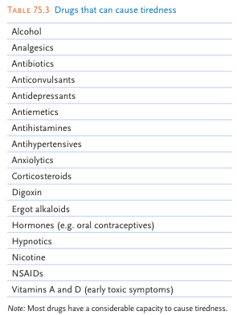
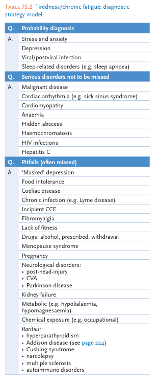
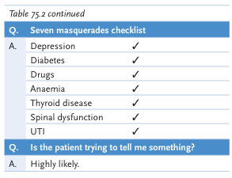

# Fatigue

- **Terminology** - vague term that requires further clarification, and may reflect:
    - Initial subtle manifestation of a serious physical illness
    - Inability to deal with the problems of everyday life
    - Physiological tiredness after excessive physical activity
- **DDx of chronic fatigue/ tiredness:**
    - **Non-organic cause** - psychogenic causes pertaining to psychiatric disorders or lifestyle factors:
        - <u>Primary psychiatric disorders</u> - anxiety disorders, depression, somatisation disorders
        - <u>Lifestyle factors</u>:
            - Biological factors - sleep deprivation, obesity, inappropriate diet, sedentary lifestyle, exposure to irritants
            - Psychological factors - mental stress and emotional demands
            - Social factors - workaholic tendancies and 'burnout'
    - **Organic causes:**
        - <u>Cardiopulmonary conditions</u> - congestive heart failure (of any cause), COPD, OSA, other sleep disorders
        - <u>Renal conditions</u> - chronic liver disease
        - <u>Endocrine disorders</u> - hypothyroidism/ thyrotoxicosis, hyperparathyroidism, Cushing's syndrome, Addison disease, **DM**
        - <u>Haematological conditions</u> - anaemia
        - <u>Neurological conditions</u> - Parkinson's disease, Multiple sclerosis, myasthenia gravis
        - <u>Rheumatological conditions</u> - fibromyalgia, polymyalgia rheumatica, systemic lupus erythromatosus, rheumatoid arthritis, Sjogren's disease
        - <u>Electrolyte disturbances</u> - hypokalaemia, hypomagnesaemia
        - <u>Infectious disorders</u> - Infective mononucleosis, viral hepatitis, malaria, TB, infective endocarditis, HIV infection, post-infectious fatigue syndrome (e.g. influenza)
        - <u>Substance and medications</u>: 
        
    - **Others** - chronic fatigue syndrome
- **Murtaugh's diagnostic approach to chronic fatigue:**  

- **Salient points of Hx:**
    - **HPI** - onset, duration, progression, quality, functional limitations:
        - <u>Onset and duration</u> - acute vs chronic
        - <u>Progression</u> - stable, improving or worsening (why present now)
        - <u>Quality</u> - characterise nature of fatigue:
            - Physical tiredness - due to excessive physical activity
            - Generalised tiredness - may be a subtle sign of serious physical illness (but may be masquerades for psychogenic problems)
            - Psychological tiredness - tiredness due to inability to cope with everyday living
        - <u>Functional limitations</u> - energy, performance, ability to cope:
            - Energy - excessive daytime sleepniness and fatigue
            - Performance - poor attention and concentration, occupational/educational disturbances
            - Ability to cope - effects on mood, behaviour (look out for **low mood** and **anhedonia**)
    - **Ideas, concerns, and expectations:**
        - <u>Ideas</u> - Do you have any explanation for your tiredness? Has any major event coincided to the onset of your fatigue?
        - <u>Concerns</u> - excessive fears regarding fatigue and fear of severe physical illness may represent anxiety state or somatisation disorders (e.g. hypochodndriasis)
        - <u>Expectation</u> - e.g. thorough workup for underlying cause
    - **Detailed sleep Hx** - start with open ended questions, e.g. "<u>How is your sleep?</u>":
        - <u>Onset</u> - acute vs chronic insomnia (ask about frequency of insomnia in a week)
        - <u>Detailed description of sleep problems</u> - may require sleep diary for objective assessment if significant variability:
            - **Difficulty to initiate sleep** - patients often overestimate amount a time it takes to fall asleep but reported time of \> 30 min raises suspicion of insomnia
            - **Difficulty maintaining sleep** - characterise **number** and **duration** of awakenings and ask if attributable to somatic Sx (e.g. nocturia, orthopnea, PND, cough, pain etc.)
            - **Early morning awakening** - ask if patient wakes up before desired wake up time
        - <u>Comprimised daytime function</u> - if yet to ask, ask about excessive daytime tiredness, fatigue, malaise, difficulty in concentration, functional impairments etc.
        - <u>Sleep hygiene</u> - any recent changes or variability in bedtime, wakeup time, and naps
        - <u>Sleep environment</u> - is it atiributable to sleep deprivation where environment is not conducive asleep?
    - **Associated Sx:**
        - <u>Weight fluctuations</u> - significant unexplained weight loss is a red flag for tiredness (e.g. occult malignancy)
        - <u>Fever</u> - persistent fever is a red flag for tiredness as it reflects underlying chronic infection (e.g. IM, subacute IE, TB)
        - <u>Snoring and apnoeic episodes</u> - sleep apnoea suspected
        - <u>Dizziness and weakness</u> - reflects anaemia, but requires further clarification as it may be attributed to cardiac conditions
        - <u>Exertional dyspnoea and reduced ET</u> - reflects cardiopulmonary conditions and anaemia
        - <u>Diffuse musculoskeletal pain</u> - consider fibromyalgia
        - <u>Other unexplained medical Sx</u> - consider somatisation disorder
    - **Menstrual Hx** - especially if it seems to be anaemia-related in a pre-menopausal women
    - **PMH** - look for prior infections, cardiopulmonary conditions, and old malignancies
    - **Drug Hx** - including OTC medications
    - **SHx and psychological Hx:**
        - <u>Occupation</u> - ask about nature of work, determine occupational stressors, relationship with colleagues and supervisors (think bullying), and determine relationship w/ work (e.g. workaholic)
        - <u>Leisure</u> - any leisure activities to relieve stress (look for anhedonia)
        - <u>Interpersonal relationship</u> - relationship with family and friends
        - <u>Psychological survey</u> - low mood, anxiety and precipitating factors
        - <u>Substance</u> - any self medication for fatigue (e.g. smoking, alcohol, analgesic, stimulants) especially in drug addiction-prone groups (doctors, nurses, chemists, liquor industry, truck drivers)
    - **Final questions:**
        - Is there anything else you feel you should tell me?
- **P/E:**
    - <u>General examination</u> - vital signs, pallor, cervical LN
    - <u>Abdominal examination</u> - hepatosplenomegaly (mononucleosis syndrome), +/- PR bleeding if suspected anaemia
- **Ix** - selected judiciously:
    - **Routine bloods** - CBC, LRFT, ESR/CRP, TFT, electrolytes (incl. CaPO4, Mg), glucose
    - **Additional investigations:**
        - <u>Iron profile</u> - if suspected iron-deficiency anaemia
        - <u>Initial Ix for cardiorespiratory function</u> - CXR +/- spirometry
        - <u>Chronic infection screening</u> - HIV, viral hepatitis (A-E), CMV, EBV, TB, IE etc.
        - <u>Autoimmune panel</u> - ANA, RF
        - <u>Endocrine Ix</u> - e.g. early morning cortisol, late night salivary cortisol, 24h urinary cortisol, dexamethasone test
        - <u>Tumour markers</u> - for malignancy
