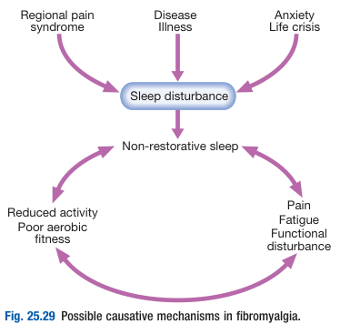
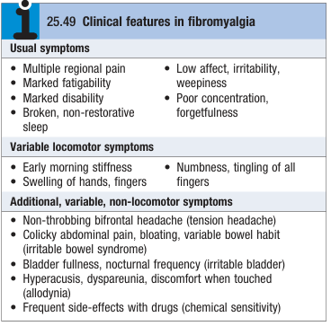
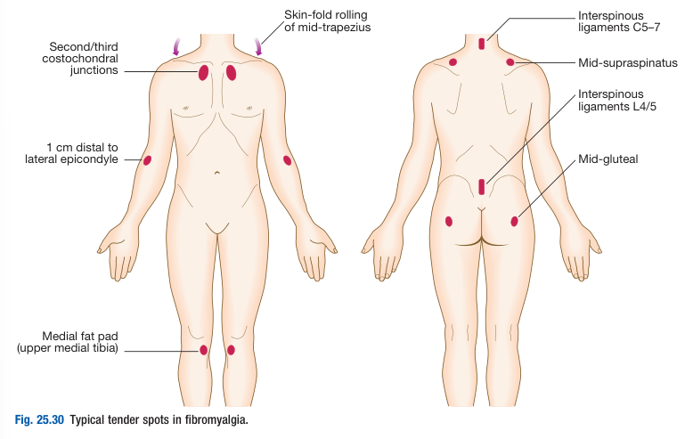
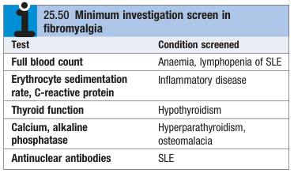

# Fibromyalgia

- **Definition** - common cause of generalised regional pain and disability in absence of organic pathology
- **Epidemiology:**
    - <u>Prevalence</u> - 2-3% in US and UK (increasing prevalence w/ age)
    - <u>Demographic</u>:
        - **Age** - increasing incidence w/ age (up to 7% of F \> 70y)
        - **Sex** - extreme female preponderance (F:M = 10:1)
- **Risk factors for fibromyalgia** - life events that causes psychosocial distress and altered pain modulation:
    - Marital dysharmony
    - Alcoholism in family
    - Injury or assault
    - Low income
    - Self-reported childhood abuse
- **Pathophysiology of fibromyalgia** - poorly understood, but two abnormalities may be interrelated:
    - **Sleep abnormality** - non-restorative sleep disorder where patients have reduced non-REM sleep that is a/w restorative functions (cf poor sleep in REM and non-REM phases in depression):
        - <u>Evidence</u> - points towards insufficient delta (non-REM) sleep:
            - Patients w/ fibromyalgia demonstrate reduced delta sleep in pattern distinct from that seen w/ depression
            - Normal volunteers with deprivation of delta, but not REM sleep have reproducible S/S of fibromyalgia
        - <u>Proposed mechanisms</u> - viscious cycle:
            - Non-restorative sleep results in poor aerobic fitness, overall reduced activity and S/S of fibromyalgia
            - S/S of fibromyalgi are disruptive to sleep, and thus prevents delta sleep

      
      
    - **Abnormal peripheral and central pain modulation** - altered pain percept in characteristic sites is commonly seen in fibromyalgia due to abnormal peripheral and central pain modulation:
        - <u>Abnormal peripheral pain processing</u> - **peripheral hypersensitisation**, and abnormal cord gating of pain (pain amplification by **spinal cord 'wind-up'**)
        - <u>Abnormal central pain processing</u> - as suggested by high substance P, low serotonin in CSF; abnormal perfusion to caudate and thalamus; and abnormal responses in functional MRI
        - <u>Abnormal systemic factors</u> - low basal free cortisol and reduction in evening trough, and altered descending inhibition of HPA axis, and growth-hormone somatomedin axis
- **Clinical features of fibromyalgia:**
    - **Multiple regional pain and tenderness** - widespread pain and tenderness that is often worse in the neck and back:
        - <u>Site</u> - typically neck and back
        - <u>Onset and progression</u> - gradual onset and chronic
        - <u>Quality</u> - diffuse
        - <u>Severity</u> - variable, but characteristically **unresponsive to analgesia and PT**
    - **Marked fatigability and disability** - most prominent in the morning affecting daily living (unable to perform tasks such as chores and shopping)
    - **Other usual Sx related to poor sleep quality:**
        - <u>Mood</u> - low affect, irritability and weepiness
        - <u>Cognitive function</u> - poor concentration, forgetfulness
        - <u>Sleep</u> - broken, non-restorative sleep

  
  
- **Signs of fibromyalgia:**
    - <u>Hyperalgesia over classical sites on moderate digital pressure</u>: 
    
- **Ix** - to r/o other causes of Sx:
    - **Bloods** - CBC, ESR/CRP, TFT, Ca, ALP, ANA: 
    
- **Mx:**
    - **Principles of Mx:**
        - <u>Patient and family education</u> - on nature of disease and relation w/ poor sleep
        - <u>Lifestyle modifications</u> - establishment of sleep hygiene, graded increase aerobic exercise, self-help strategies
        - <u>Pharmacological therapy</u> - anti-depressants, with limited evidence on SNRIs, anticonvulsants (pregabalin, gabapentin) and tramadol
        - <u>Psychological therapy</u> - CBT, relaxation techniques, and counselling important especially in cases related to **sublimated anxiety**
