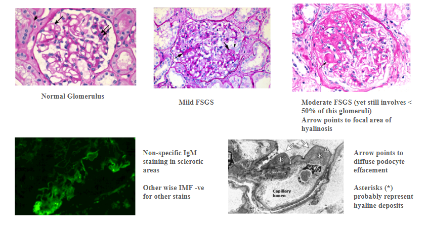

# Focal Segmental Glomerulosclerosis

- **Definition** - Glomerular disease characterised by segmental sclerosis of glomeruli as a focal process (not all glomerulus is affected)
- **Epidemiology:**
    - <u>Demographic</u> - occurs in all age groups
- **Pathophysiology of FSGS** - unknown mechanism of podocyte injury
- **Etiology of FSGS:**
    - <u>Primary FSGS</u> - idiopathic
    - <u>Secondary FSGS</u> - morbid obesity, heroin misuse, HIV infection, healing of previous local glomerular injury
- **Pathology of FSGS:**
    - <u>LM</u> - segmental scarring in some glomeruli (ocassionally missed in renal Bx resulting in misdiagnosis as MCD)
    - <u>IMF</u> - non-specific deposition of IgM and C3 in focal scars
    - <u>EM</u> - non-specific podocyte effacement
- **Clinical features of FSGS** - varying presentation depending on primary vs secondary:
    - **Primary FSGS** - presents with massive proteinuria and idiopathic <u>nephrotic syndrome</u>
    - **Secondary FSGS** - variable proteinuria, ocassionally presenting as typical nephrotic syndrome
- **Mx of primary FSGS:**
    - **High dose corticosteroids:**
        - <u>Dosage</u> - 0.5-2.0 mg/kg/d
        - <u>Clinical efficacy</u> - less responsive to Tx than MCD
    - **Immunosuppressants** - e.g. cyclosporin, cyclophosphamide, mycophenolate mofetil (clinical efficacy uncertain)
- **Definition** - morphological pattern of glomerular injury primarily involving podocytes and is defined by presence of sclerosis in parts (segmental) of some of the glomeruli (focal) and is thus, by definition, a <u>histopathological diagnosis</u>
- **Etiology of FSGS** - 4 distinct types of FSGS with <u>different clinico-pathological features</u>:
    - <u>Primary FSGS</u> - also known as permeability-factor related FSGS, reflects a pathological process in which putative circulating factors are toxic to podocytes and lead to diffuse podocyte effacement
    - <u>Secondary FSGS</u> - FSGS caused by an adaptive response to 1) glomerular hyperfiltration, 2) another primary glomerular abnormality or 3) direct podocyte injuries (e.g. drugs, viruses)
    - <u>Genetic FSGS</u> - various genetic causes resulting in glucocorticoid-resistant nephrotic syndrome in children
    - <u>Unknown forms of FSGS</u> - unknown cause of FSGS that is not attributable to primary, secondary, or genetic causes
- **Pathogenesis of primary FSGS** - presumed circulating permeability factors causing podocyte injury and diffuse podocyte effacement (e.g. suPAR, anti-nephrin Ab)
- **Pathogenesis of secondary FSGS** - adaptive response to:
    - <u>Glomerular hyperfiltration</u> - intraglomerular hypertension which can be as a result of 1) reduced renal mass (i.e. other renal diseases), 2) reflux nephropathy, 3) **obesity**
    - <u>Other glomerular disease</u> - often superimposes diabetic nephropathy
    - <u>Direct injury to podocytes</u> - caused by drugs and viruses:
        - **Common drugs a/w FSGS** - heroin, interferon, pamidronate, anabolic steroids
        - **Common viruses a/w FSGS** - HIV
- **Clinical presentation** - different types of FSGS may present differently:
    - <u>Assymptomatic proteinuria</u> - secondary FSGS (except pamidronate-associated FSGS) usually presents w/ sub-nephrotic proteinuria that is slowly increasing, accompanied by decline in renal function, where there serum Alb remains normal even if proteinuria is nephrotic range
    - <u>Nephrotic syndrome</u> - primary FSGS, pamidronate-associaed FSGS and certain genetic FSGS often presents w/ symptomatic nephrotic presentation
- **Histopathological findings** - on renal Bx:
    - <u>LM</u> - segmental consolidation of capillary loops w/ obliteration of capillary lumens, a/w hyalinosis, macrophage infiltration fo the sclerotic tufts
    - <u>IMF</u> - absence of immune deposits, or ocassionally presence of non-specific binding of IgM and complement (C3) in focal sclerotic lesions
    - <u>EM</u> - enables **differentiation between primary and secondary FSGS:**
        - **Primary FSGS** - associated w/ diffuse (\>= 80%) podocyte effacement
        - **Secondary FSGS** - associated w/ segmental (\< 80%) podocyte efacement

  
  
- **Approach to assessment** - identify whether 1) frank nephrotic syndrome or isolated proteinuria, 2) causes of secondary FSGS:
    - **Prence of nephrotic syndrome:**
        - Hx/PE taking for proteinuria and presence of peripheral oedema
        - Ix for quantification of proteinuria (\> 3.5 g/d) and LFT + lipids for hypoalbuminaemia and hypercholesterolaemia
    - **Identify causes of secondary FSGS** - Hx and Ix:
        - <u>Low renal mass</u> - e.g. single kidney, reflux nephropathy
        - <u>BMI</u> - higher risk if obese
        - <u>Prior renal disease</u> - e.g. prior haematuric disease
        - <u>Drug Hx</u> - IFN, pamidronate, heroin, anabolic steroids
        - <u>Viral infections</u> - HIV, HCV
- **Ix** - as per nephrotic syndrome (renal Bx necessary to detect superimposed diseases and differentiate between primary and secondary FSGS)
- **Mx:**
    - **Principles of Mx:**
        - **Aims of Mx:**
            - <u>Prevent complications</u> associated w/ nephrotoxic syndrome (i.e. general measures for nephrotic syndrome)
            - <u>Prevent disease progression</u> to CKD and ESRD
        - **Approach to Mx:**
            - <u>General measures</u> - general Mx of nephrotic syndrome (e.g. RAAS blockade, statins, SGLT2i, salt and protein restriction +/- diuretics)
            - <u>Differentiate between underlying cause</u>:
                - **Primary FSGS** - Tx by high-dose corticosteroids or calcineurin inhibitors
                - **Secondary FSGS** - identification and Tx of underlying cause
    - **High-dose steroids:**
        - <u>Indications</u> - for all patients presenting w/ <u>nephrotic syndrome</u>, and a <u>clinico-pathological diagnosis of primary FSGS</u>
        - <u>C/I</u>:
            - Isolated proteinuria with normal renal functions
            - Secondary, genetic or unknown cause of FSGS
            - Histology shows extensive glomerulosclerosis and interstitial fibrosis (irreversible damage and unlikely benefit from immunosuppression)
            - Other reasons where corticosteroids are relatively contra-indicated (e.g. severe osteoporosis, where CNI + low-dose steroids is acceptable)
        - <u>Dosing and Duration of regimen</u> - 1 g/kg/d (60-80 mg/d) for 8-12 mo, and subsequent tapering depending on response
    - **Calcineurin inhibitors** (cyclosporin or tacrolimus):
        - <u>Indications</u>:
            - High-dose steroids not indicated due to excessive risk
            - Glucocorticoid-dependent primary FSGS (relapsing during or after completing glucococorticoid therapy)
            - Glucocorticoid-resistant primary FSGS (\<= 50% reduction from baseline proteinuria after completing at least 16 week course of glucocorticoid therapy)
        - <u>Duration</u> - trial of 6mo
- **Prognosis:**
    - <u>Progression to CKD</u> - common in patients non-responsive to steroids
    - <u>Recurrence after transplatnt</u> - frequently recurs, with immediate return of proteinuria post-transplant in some cases
