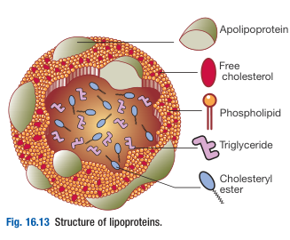
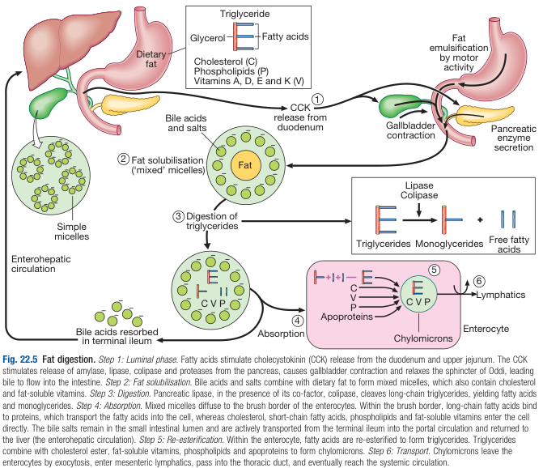
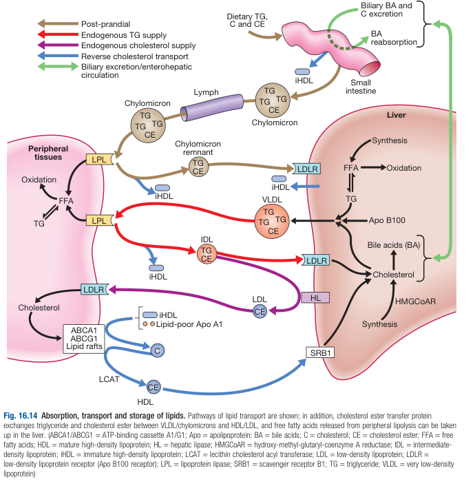

# Functional Anatomy and Physiology of Lipid and Lipoprotein Metabolism

- **Transport of lipids:**
    - <u>Lipoproteins</u> - combine with lipids to form spherical or disc-shaped lipoproteins, containing a hydrophobic core, less hydrophobic coat, and surface apolipoproteins

  
  
- **Processing of dietary lipids** - takes 6-10h for complete absorption:
    - <u>Digestion</u> - dependent on presence of bile and pancreatic lipase
    - <u>Absorption</u>:
        - **Enterocyte handling of monoglycerides and FFA** - Enterocytes extract monoglycerides and FFA in micelles and **re-esterify them into TG**, and combined with ApoB48, a truncated form of apolipoprotein B
        - **Enterocyte handling of cholesterol** - specific intestinal membrane transporters termed NPCIL1
        - **Chylomicron formation and exocytosis** - contains TG and cholesterol secreted basolaterally into lymphactic lacteals and carried to circulation through thoracic duct
    - <u>Assimilation</u>:
        - **Maturation of chylomicrons** - mascent chylomicrons are modified by further additions of lipoprotein (incl. <u>ApoE</u>)
        - **Peripheral uptake of TG** - liporotein lipase hydrolyses TG into glycerol and fatty acid which is used locally for metabolism or stalled in muscles or fat as TG
        - **Liver uptake of remnant chylomicrons** - cleared by <u>low-density lipoprotein</u> (LDL)-receptor in liver

  
  
- **Endogenous lipid synthesis:**
    - <u>Liver as source of lipids at fast state</u> - acquisition of lipids through uptake, de novo synthesis, or conversion from other macronutrients and are released as **very low-density lipoproteins** (VLDL)
    - <u>Peripheral distribution</u> - same process as chylomicrons (see 'assimilation' above):
        - **Intermediate-density lipoproteins** (IDL) - remnant lipoproteins which may be removed from circulation by liver (via lipoprotein receptors)
        - **Conversion of IDL to low-density lipoproteins** (LDL) - by hepatic lipase, through removal of all TG, and most materials except <u>ApoB100</u>
    - <u>Delivery of cholesterol</u>:
        - **Uptake of cholesterol from LDL** - LDL is internalised by receptor-mediated endocytosis via LDL receptor
        - **Cholesterol uptake is regulated** - tight intracellular free cholesterol level control through downregulation of LDL receptors and reduce synthesis and activity of HMG-CoA
- **Reverse cholesterol transport** - additional layer to guard excessive cholesterol accumulation in peripheral tissues:
    - <u>Apo A1 removes cellular cholesterol</u> - a lipid poor apolipoprotein derived from liver, intestine, and outer layer of chylomicrons and VLDL can **take up cellular cholesterol** through ATP-binding cassette A1 (ABCA1), forming a **small HDL**
    - <u>HDL accepts additional free cholesterol</u> - small HDL formed accepts more free cholesterol in cholesterol-rich regions of the cell membrane called lipid 'rafts' via ABCG1, which is **esterified by LCAT to maintain an uptake gradient**
    - <u>HDL release cholesterol to liver and cholesterol poor tissue</u> - this process occurs via scavenger receptor B1 (SRB1)

  
  
- **Role of cholesterol ester transfer protein** (CETP) - key role in <u>atherosclerosis</u>:
    - CETP ransfer of cholesterol from HDL to LDL, VLDL or chylomicrons in exchange for TG
    - This results in remodelling of LDL into small dense LDL particles which appear to be more atherogenic
    - CETP expression increased in high TG states (after fed state)
- **Pathophysiology correlating lipids to cardiovascular disease:**
    - <u>High LDL levels</u> - high concentration of atherogenic liproteins, especially LDL, but also IDL, lipoprotein(a) and possibly chylomicron remnants contribute to development of atherosclerosis
    - <u>High HDL levels</u> - protective of atherosclerosis by means of reverse cholesterol transport
    - <u>High TG levels</u> - high TG levels often a/w low HDL levels (via CETP as above) and also predisposes to atherosclerosis
