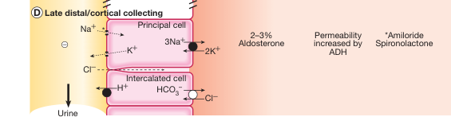
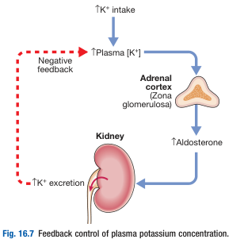

# Functional Anatomy and Physiology of Potassium Homeostasis

- **Physiological function of K** (3.3-4.7 mmol/L) - determines membrane potential of excitable tissues:
    - Pacemaker cells - important etiology of cardiac arrhythmias
    - Skeletal muscles - cause of muscle weaknesses or spasms
- **Distribution of K** - 98% of K is <u>intracellular</u>:
    - <u>Effects of H+</u> - excess H+ drives K intracellularly (think DKA)
    - <u>Effects of adrenergic activity</u> - drives K intracellularly due to increased Na/K pump
    - <u>Effects of insulin</u> - drives K intracellularly
- **Renal K handling** - excrete ~ 90% of dietary K (80-100 mmol/d) at steady state which may increase or decrease:
    - <u>Ultrafiltration</u> - K is freely filtered at the glomerulus
    - <u>PCT</u> - ~ 65% is reabsorbed in the PCT
    - <u>Thick ascending limb of loop of Henle</u> - ~25% is reabsorbed via triple-transporter, with recycling of K maintaining the gradient for reabsorption of NaCl
    - <u>Late DCT and collecting duct</u> - little reabsorbed, but a **significant secretory flux of K** (via ROMK) mediated by **aldosterone** (w/ contribution of other factors) to ensure excretion matches intake

  
  
- **Factors influencing rate of K secretion** - 1) luminal factors, 2) plasma factors, 3) endocrine factors:
    - **Luminal factors:**
        - <u>Rate of Na delivery and fluid flow in late DCT</u> - increased Na delivery and fluid flow results in increased Na reabsorption and thus K secretion (underlies mechanism of hypoK in loop and thiazide diuretics)
        - <u>Factors affecting generation of -ve membrane potential in late DCT</u>:
            - **Amiloride** results in **inhibition of ENaC**, preventing generation of -ve membrane potential to drive K secretion (i.e. causing hyperK)
            - **Liddle syndrome** arises in a **gain-in-function mutation of ENaC**, resulting in excessive -ve membrane potential to drive K secretion (i.e. causing hypoK)
    - **Plasma factors:**
        - <u>Plasma K concentration</u> - **hyperK** results in increased transmembrane gradient, and hence promotes K secretion
        - <u>Acid-base status</u> (plasma H+ concentration) - during **alkalosis** (low H+ in blood), insufficient H+ is secreted to maintain potential gradient, such that <u>more K must be secreted</u>
    - **Endocrine factors:**
        - <u>Aldosterone</u> - by far most important factor in the acute and chronic adjustment of K secretion to match metabolic K demand (details below)
- **Regulation of renal K handling by aldosterone:**
    - <u>Factors that affect Ald secretion</u>:
        - Major factor - released as a direct response to **increased serum K levels**
        - Minor factor - Ang II levels determine Sn of aldosterone release to serum K levels (i.e. presence of Ang II results in increased release of ald in response to serum K), which underlies the **risk of hyperK** under RAAS blockade (i.e. ACEi) in response to an **increased K load**
    - <u>Effector</u> - aldosterone acts on DCT:
        - Increase K secretion
        - Increase H+ secretion
        - Increase Na reabsorption

  
  
