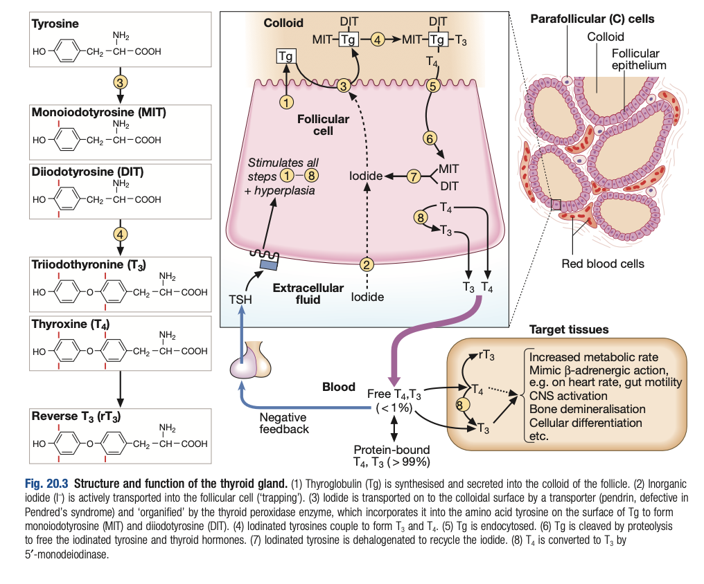

# Functional Anatomy and Physiology of the Thyroid Gland

- **Surgical anatomy of thyroid gland:**
    - <u>Description</u> - butterfly-shaped gland containing a left and right lobe connected at the centre by isthmus at 2nd-4th tracheal cartilage
    - <u>Location</u> - 1) Deep to strap muscles, 2) sits under thyroid cartilage
    - <u>Arterial supply</u>:
        - **Superior thyroid artery** - branch of the <u>external carotid artery</u> that supplies superior pole of the lateral lobes and upper half of isthmus
        - **Inferior thyroid artery** - branch of <u>thyrocervical trunk</u> that supplies inferior pole of the lateral lobes and bottom half of the isthmus
    - <u>Venous drainage</u>:
        - **Superior and middle thyroid veins** - drains into <u>internal jugular vein</u>
        - **Inferior thyroid veins** - drains into <u>brachiocephalic vein</u>
    - <u>Anatomical associations</u> - associated with branches of the CN10:
        - External laryngeal nerve (branch of superior laryngeal nerve) - innervation of cricothyroid
        - Recurrent laryngeal nerve
- **Histological architecture of thyroid gland:**
    - <u>Follicles</u> - containing follicular epithelial cells secretting colloid to the centre
    - <u>Parafollicular C cells</u> - in between thyroid follicles responsible for calcitonin synthesis (limited physiological role)
- **HPT-axis:**
    - <u>Archetypal endocrine axis with negative feedback</u>:
        - **Hypothalamus** - releases **TRH** that stimulates anterior pituitary gland to secrete TSH
        - **Thyrotropes** - release **TSH** that stimulate thyroid follicles to synthesis and secrete T3/T4
        - **Thyroid gland** - releases T3/4 that negatively feedbacks to inhibit secretion of TRH and TSH
    - <u>Mild circadian rhythm of TSH</u> - of no clinical relevance enabling spot testing! (peaks at 0100 and troughs at 1100)
    - <u>TSH extremely sensitive to changes in free T4</u> - exhibits inverse log-linear relationship (i.e. minor changes of T4 precipiates massive changes in T4):
        - **Implications** - most sensitive Ix of thyroid function (assuming stable thyroid status and normal HP axis):
            - Thyrotoxicosis - undetectable TSH
            - Hypothyroidism - abnormally increased TSH
- **Synthesis of thyroid hormone and role of TSH:**
    - <u>Role of TSH</u> - stimulates all of the following process, increasing T3/4 synthesis and secretion
    - 1\. <u>Synthesis and secretion of thyroglobulin</u> - protein containing many tyrosine of surface fo iodination
    - 2\. <u>Uptake of iodide and secretion of iodine into colloid</u>:
        - Uptake of iodide from basolateral membrane by Na/I symport and release of iodide into lumen by pendrin (Cl/I exchanger) on apical membrane
        - Conversion to iodine by presence of peroxidase and H2O2
    - 3\. <u>Organification of TG</u> - gives mono-iodotyrosine (MIT) and di-iodotyrosine (DIT)
    - 4\. <u>Coubling of iodotyrosine</u> - yields T4 (major product) or T3 (minor product)
    - 5\. <u>Endocytosis, lysosomal degradation and secretion</u> - uptake of TG into follicular cells to undergo lysosomal degradation to release free T3/T4

  
  
- **Transport of thyroid hormone:**
    - <u>Protein-bound</u> - \>99% are bound to thyroxine-binding globulin (TBG), but in fact it is the free forms (free T3/4) that are active
        - <u>Implications</u> - total T4 levels dependent on levels of TBG (increaased in pregnancy, but free T4 remains the same)
    - <u>Half life</u> - T4 is prohormone (1/2 life ~ 7d), T3 is active hormone (1/2 life ~ 18h)
