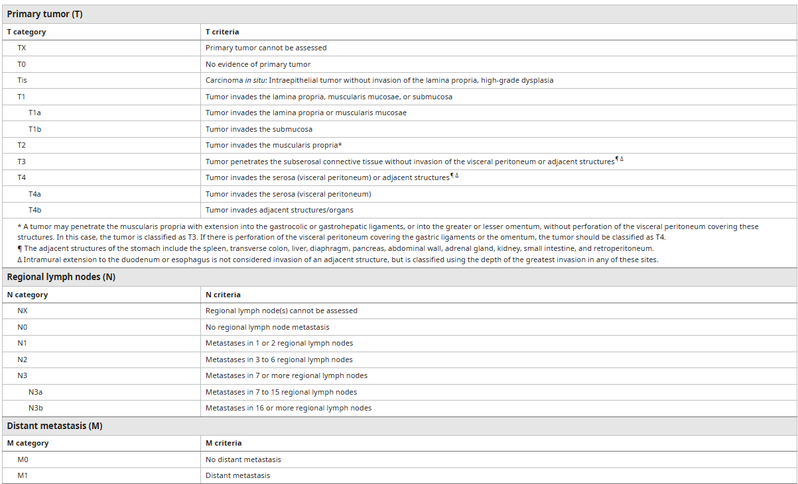
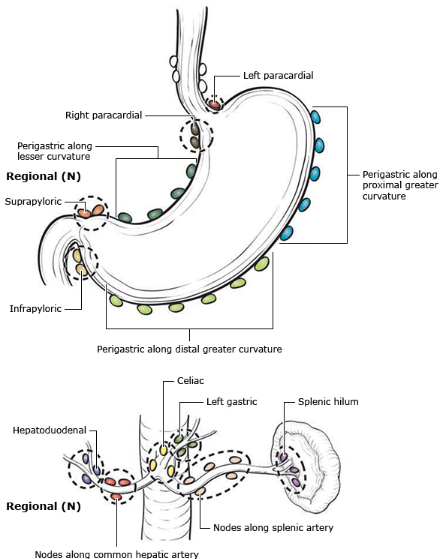
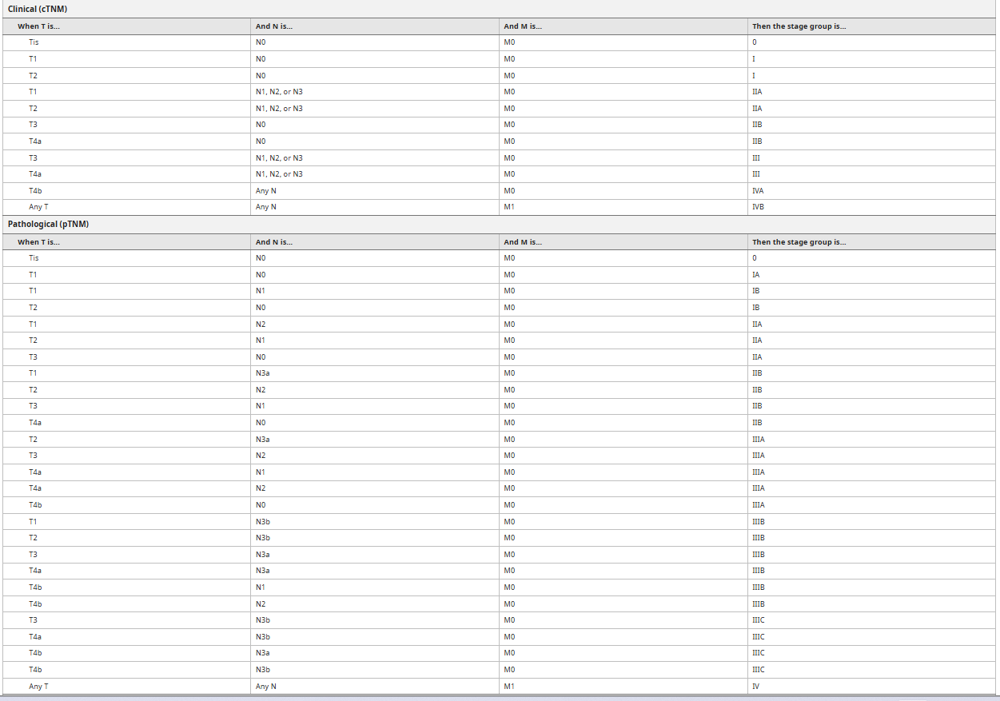
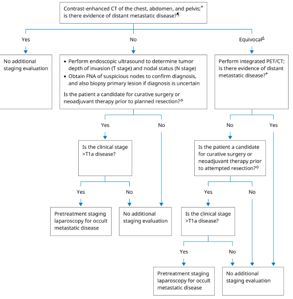
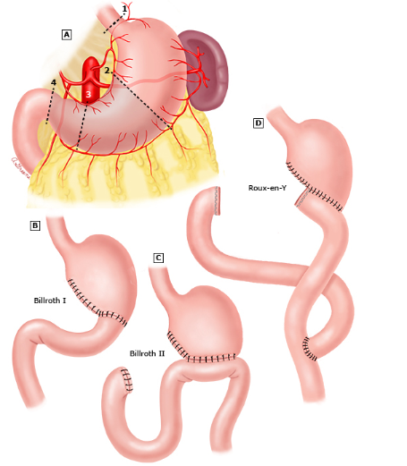

# Gastric carcinoma

- Gastric carcinoma - neoplasm arising from the gastric epithelium
- **Epidemiology:**
    - Incidence (HK Cancer Registry) - 6th in incidence (M \> F) and mortality
    - Demographic - incidence increases w/ age (sharp rise after \> 50y), M \> F in incidence, flatter distribution in F
    - Geographic variation - common in SE asia (China, Japan, Korea)
- **Prognosis** - poor, improved survival lies in earlier detection:
    - 5y survival rates \< 30%
- **Risk factors for gastric carcinoma:**
    - Dietary factors - protective and harmful:
        - Harmful - N-nitroso comound, preserved, smoked, salted food
        - Protective - trace elements, vitamin C, fresh fruits and vegetables (increase uptake of micronutrients)
    - Medical conditions - Type A (atrophic) gastritis (a/w pernicious anaemia), adenomatous polyps, Menetriers disease, prior partial gastrectomy (\>20y), CVID, E-cadherin mutation
    - Exposure - Smoking (11%), EBV, Industrial exposure
    - Helicobacter pylori infection (WHO class 1 carcinogen)
- **Pathophysiology of gastric carcinoma:**
    - **H. pylori infection** - cause of chronic atrophic gastritis (causes intestinal metaplasia) +/- a-/hypo-chlorhydria (nitrosamine-producing bacterial colonisation)
    - **Nitrate-rich diet** - converted into carcinogenic N-nitroso compounds by nitrite reducing bacteria (colonise the stomach in <u>ahydrochloryic states</u>)
- **Pathology:**
    - **Lauren classification** - intestinal type vs diffuse type:
        - Intestinal gastric cancer - arises from regions of intestinal metaplasia:
            - Gross pathology - polyp or ulcers
            - Histopathology - adenocarcinoma, tubulo-glandular architecture resembling CA arising from intestine
        - Diffuse gastric cancer - arises from normal gastric mucosa:
            - Gross pathology - no obvious mass lesion despite marked submucosal spread (linea plastica)
            - Histopathology - ?SCC
    - **Classification by stage** - early gastric cancer and advanced gastric cancer:
        - Early gastric cancer (Japanese classification) - tumour confined to mucosa and submucosa irrespective of LN involvement (T1, any N)
        - Late gastric cancer (Bourmann classification) - tumour invaded into the muscularis propria (T2+)
    - **Linitis plastica** - Leather bottle stomach, where CA stomach spreads within the submucosa, rendering mucosa to be normal on endoscopy. Identified because stomach becomes rigid and non-distensible by air.
- **Mode of spread** - direct invasion, lymphatic spread, transcoelomic spread, haematogenous spread:
    - **Direct invasion** - invasion through the muscularis propria and serosa, and subsequently into adjacent organs:
        - Liver - lateral spread from lesser curvature
        - Spleen - lateral spread from greater curvature
        - Pancrease - retroperitoneal spread from posterior wall of stomach
        - Transverse colon - inferior spread from inferior wall of the stomach
    - **Lymphatic spread** - dependent on the position of tumour
    - **Haematogenous spread** - liver (first via portal vein), lungs, bones
    - **Transcoelomic spread** - common mode of spread once reach the serosa, and is a sign of incurability, typically detected by <u>laparoscopy and cytology</u>:
        - Peritoneal carcinomatosis - 1/3 manifests as malignant ascites
        - Krukenberg's tumour - unilateral or bilateral spread to the ovaries
        - Sister-Joseph Mary Nodule - umbilical nodule seen due to transperitoneal spread
- **Clinical presentation of gastric cancer** - most are symptomatic and present as unresectable cancer:
    - **Clinical features of local tumour** - most commonly presents with <u>epigastric discomfort</u> and <u>weight loss</u> (Wanebo et al. 1993):
        - <u>Weight loss</u> (62%) - as a result of loss of appetite due to adominal pain, early satiety, N/V, or dysphagia
        - <u>Abdominal pain</u> (52%) - mild, poorly-localised epigastric discomfort that is **different to ulcer-type pain** but may become more severe and constant as disease progresses
        - <u>Nausea and vomiting</u> (34%) - post-prandial vomiting containing undigested food suggestive of **gastric outlet obstruction**
        - <u>Early satiety</u> (18%) - due to tumour mass, or non-distendable stomach in linitis plastica (diffuse type gastric cancer)
        - <u>UGIB</u> - chronic occult UGIB resulting in Fe-deficiency anaemia is not uncommon, but overt acute UGIB (e.g. coffee ground vomitus, melaena, and haematemesis) only occurs in \< 20% of patients
        - <u>Dysphagia</u> (26%) - due to tumour mass in the cardia, ocassionally causing pseudoachalaia resulting in involvement of Auerbach plexus
        - <u>Abdominal mass</u> - from primary tumour, Krukenberg tumour, or metastasis
    - **Clinical presentation w/ complications:**
        - <u>GOO</u> - gradual onset of epigastric bulge, post-prandial vomiting, rapid weight loss, and +ve succession splash
        - <u>UGIB</u> - acute severe UGIB with visible melena or haematemesis in 20% cases
        - <u>Perforation</u> - presentation as acute abdomen with diffuse abdominal pain (extremely rare)
    - **Clinical features of metastatic disease:**
        - <u>Obstructive jaundice</u> - malignant biliary obstruction due to LN metastasis over the porta hepatis, and ocassionally with locally advanced distal tumours
        - <u>Abdominal distension</u> - due to malignant ascites as a result of peritoneal carcinomatosis, Krukenberg tumour
        - <u>Dyspnoea</u> - due to pleural effusion as a result of lymphangitis carcinomatosis, or rarely lung metastasis
    - **Paraneoplastic syndrome** - rarely seen on initial presentation:
        - <u>Acanthosis nigricans</u> - velvety and darkly pigmented patches on skin folds, particularly in axilla
        - <u>Microangiopathic haemolytic anaemia</u>
        - <u>Membranous nephropathy</u> (nephrotic syndrome)
        - <u>Hypercoagulable states</u> (Trousseau's syndrome)
- **Signs of gastric cancer:**
    - General examination - pallor, jaundice, cervical LN (Virchow's node and Irish node)
    - Abdominal examination:
        - Inspection - abdominal mass, Sister Mary Joseph Nodule, abdominal distension
        - Palpation - epigastric tenderness and mass, +/- hepatomegaly
        - Succession splash - seen in gastric outlet obstruction
- **Routine Ix:**
    - <u>Routine bloods</u> - CBC, LRFT, clotting and T&S for those presenting w/ UGIB:
        - CBC - Fe Deficiency Anaemia
        - LFT - dLFT in liver metastasis +/- cholestatic pattern in MBO
        - RFT - suggestive of UGIB
    - <u>Tumour markers</u> - no role in Dx but role in assessment of Tx responsiveness:
        - CEA, CA 125, CA 19-9
        - AFP (AFP-producing gastric cancer) - a/w poorer prognosis
- **Dx** - upper endoscopy and biopsy for <u>tissue diagnosis</u>:
    - **Endoscopic appaerance** - difficult to differentiate between malignant and benign ulcers, hence Bx is always necessary:
        - Intestinal type cancer - friable ulcer mass
        - Diffuse type cancer - no specific mucosal findings (poor distensibility of stomach may be only endoscopic findings)
    - **Bx** - Bx all suspicious nodules and ulcers as 5% of malignant ulcers appear benign grossly
- **Staging systems** - 8th edition TNM staging: 

    - **T staging** - based on depth of tumour invasion on histological examination
    - **N staging** - regional LN differ for tumors involving different parts of the stomach
        - <u>Regional LN of stomach</u>:
            - Left and right paracardial
            - Perigastric LN along greater and lesser curvature
            - Supra- and infra-pyloric

      
      
        - <u>Involvement of other intra-abdominal LNs</u> - considered M1:
            - Pancreato-duodenal
            - Peri-pancreatic
            - Retropancreatic
            - SMA
            - middle colic
            - Para-aortic
            - Retroperitoneal
    - **Prognostication groups** - Stage I-III (potentially resectable), stage IV (metastatic): 
    
- **Principles of staging evaluation** - to stratify patients into two groups, implicating Mx:
    - Locoregional, potentially resectable tumoours
    - Locally advanced, unresectable or metastatic tumours
- **Staging Ix:**
    - <u>Contrast CT T+A+P</u> - indicated for all patients with gastric cancer for M staging
    - <u>PET-CT</u> - 18-FDG-PET for assessing \>= T2N0 disease even if CT for distant metastasis -ve
    - <u>Endoscopic ultrasound</u> - assessment of loco-regional staging for patients w/o metastatic disease
    - <u>Staging laparoscopy</u> - patients with EUS stage T3/4 undergo diagnostic staging laparoscopy to detect occult peritoneal dissemination

  
  
- **Evidence of in-operatability:**
    - M1 disease - e.g. distant metastasis, or peritoneal involvement
    - N4 disease or distant LN involvement - e.g. Virchow's node, Irish node or intra-abdominal non-regional LN involvement
    - Locally advanced disease (fixation to structures that cannot be removed) - invasion or encasement of unremovable vascular structures (e.g. aorta, hepatic artery, celiac axis, proximal splenic vessels)

## Mx of gastric cancer

- **Role of surgery in Mx of gastric cancer** - curative treatment of localised disease, pathological staging evaluation, and palliation in advanced disease
- **Sequence of surgical Tx by stage:**
    - <u>Early gastric cancer</u> - T1 disease irrespective of N stage that met set criteria may be treated with endoscopic resection
    - <u>Resectable, non-early gastric cancer</u> - upfront surgery +/- neoadjuvant and adjuvant therapy
    - <u>Unresectable locoregional disease</u> - neoadjuvant therapy followed by ressection if tumour down-staged
    - <u>Metastatic disease</u> - palliative chemotherapy +/- resection if symptoms unable to be controlled by non-surgical means
- **Surgical Tx:**
    - **Radical resection of gastric cancer** - complete surgical removal of the tumour w/ adequate margins and adjacent LN (R0 resection):
        - **Approach to radical resection** - open vs minimally invasive (e.g. laparoscopic, robotic)
        - **Extent of gastrectomy** - dependent on location of the tumor within the stomach:
            - <u>Distal tumours</u> (distal 2/3 of stomach) - **distal gastrectomy** shows equivalent oncological outcomes with fewer perioperative complications and better QOL
            - <u>Proximal tumors</u> (proximal 1/3 of stomach) - **total gastrectomy** preferred over proximal gastrectomy despite similar oncological outcomes as proximal gastrectomy and reconstruction by esophagogastrostomy can lead to high incidences of reflux esophagitis
        - **Extent of LN dissection** - D2 dissection as the standard of care because of better disease-specific survival than D1 with lower peri-operative mortality and morbidity than D3:
            - **Definition of D1, D2 and D3 dissection** - 16 stations of LN for stomach according to Japanese Gastric Cancer Association:
                - <u>D1 dissection</u> (limited LN dissection) - limited dissection of perigastric LN (station 1-7)
                - <u>D2 dissection</u> (extended LN dissection) - dissection of perigastrinal LN and LN along the hepatic, left gastric, coeliac, splenic arteries, and those in splenic hilum (station 1-12a)
                - <u>D3 dissection</u> (super-extended LN dissection) - dissection of nodes within portal hepatis and peri-aortic regions (station 1-16)
            - **Evidence in literature** - current literature favours D2 dissection:
                - <u>D2 \> D1</u> - **better disease-specific survival**, but slightly increased perioperative mortality (explained by liberal splenectomy and distal pancreatectomies in the pasts)
                - <u>D2 \> D3</u> - **no statistically significant survival benefits**, and no statistically significant change in perioperative mortality (although CI very wide including possibility of RR 6.73)
        - **Reconstruction for partial gastrectomy:**
            - Billroth I
            - Billroth II
            - Roux-en-Y

      
      
- **Neoadjuvant chemotherapy** - neoadjuvant chemotherapy shows improved OS and avoids unecessary gastric resection:
    - <u>Indications</u> - indicated for all potentially resectable T2N0 disease or above (good evidence), or initially unresectable locoregional disease (no current evidence)
    - <u>Rationale and evidence</u> (MAGIC trial):
        - 1\. **Improved surgical and oncological outcomes** - higher chance of curative (R0) ressection (79% vs 70%), lower risk disease and better overall survival and progression-free survival
        - 2\. **Avoid unenecessary surgery for those high-risk diseases** (i.e. T3/4 diseases, perigastric node +ve, linitis plastica appearance) - these have high risk of subsequent metastasis after upfront surgery
    - <u>Regimens</u> - no conclusively established regimens, but dependent on performance status:
        - **Excellent performance status** - docetaxel, oxaliplatin, leucovorin, and short-term infusional 5-FU (FLOT trial)
        - **Lesser performance status** - non-epirubicin, non-docetaxel-containing regimens
