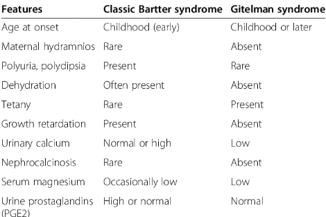

# Gitelman and Bartter Syndrome

- **Overview** - rare tubulopathies both resulting in hypoK and metabolic alkalosis: 

- **Gitelman syndrome:**
    - <u>Definition</u> - genetic disorder caused by LOF mutation of thiazide-dependent sodium-chloride co-transporter in the early DCT
    - <u>Inheritence</u> - AR
    - <u>Pathophysiology</u>:
        - **Impaired Ca reabsorption in early DCT** - results in hypocalcaemia
        - **Increased Na delivery to late DCT** - results in <u>increased K and H+ secretion</u>
    - <u>Clinical manifestations</u>:
        - HypoK
        - HypoMg
        - HypoCa
- **Bartter syndrome:**
    - <u>Definition</u> - genetic disorder caused by LOF mutation in NKCC channels in ascending limb of loop of Henle
    - <u>Pathophysiology</u>:
        - **Impaired generation of hyper-osmolar renal medulla** - results in polyuria and polydipsia
        - **Increased Na delivery to late DCT** - results in <u>increased K and H+ secretion</u>
    - <u>Clinical manifestations</u>:
        - Polyuria, polydipsia and dehydration
        - HypoK
