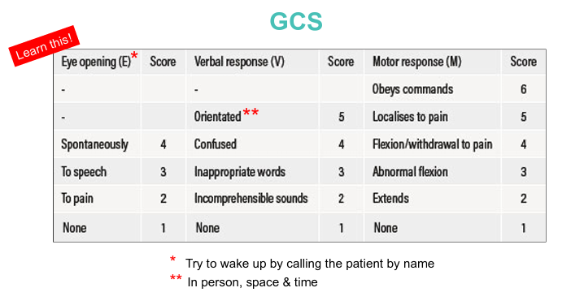
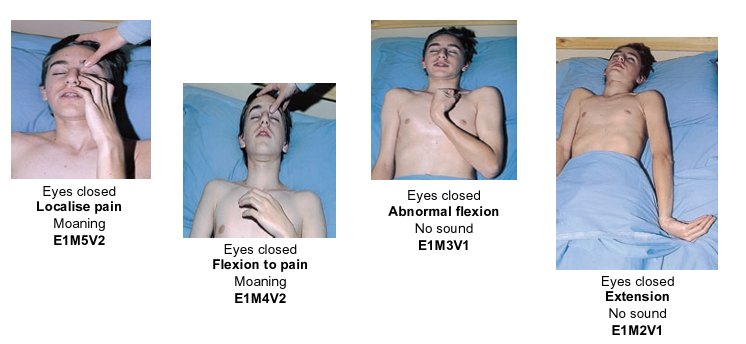
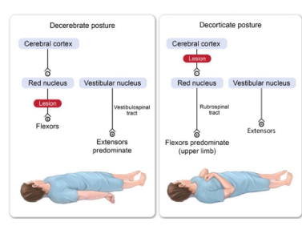

# Glawgow Coma Score and Assessment of Consciousness

- **Glasgow Coma Score** (GCS) - objective and reproducible way to assess consciousness
- **Scale vs Score:**
    - <u>Score</u> - refers to the sum of each component (e.g. GCS15)
    - <u>Scale</u> - report of each individual component (e.g. E4M6V5)
- **Prognistic information regarding GCS** - note that it is a quantitative scale (3-15) but is non-linear:
    - <u>Admission GCS is prognostic</u> - underlies urgency of Tx even if patient is conscious
    - <u>Trends in GCS reflects clinical deterioration or improvement</u> - deteriorating conscious level only occurs in terminal stages of raised ICP
- **Components of GCS** - total GCS is aggregate of each component, but better to report independently (e.g. E1M5V2)
    - <u>Eye opening</u> (E) - max score 4 (opens eyes spontaneously)
    - <u>Motor response</u> (M) - max score 6 (obeys verbal commands)
    - <u>Verbal response</u> (V) - max score 5 (oriented in person, space and time)

  
  
- **Assessment of eye response** - ask patient to open eye:
    - <u>E4</u> - eye opens spontaneously
    - <u>E3</u> - eye opens to speech
    - <u>E2</u> - eye opens to pain
    - <u>E1</u> - eye closed
- **Assessment of motor response** (apply painful stimulation over CN V territory) - prognostic and indicative of extent of injury:
    - <u>M6</u> - obeys commands
    - <u>M5</u> - localises to pain (UL raised above clavicle)
    - <u>M4</u> - flexion/ withdrawal to pain but unable to raise above clavicle
    - <u>M3</u> - slow abnormal flexion response (decorticate posture resulting in uninhibited rubrospinal response)
    - <u>M2</u> - slow abnormal extension response (decerebrate posture resulting in loss of rubrospinal response)
    - <u>M1</u> - no limb response

   
  
- **Assessment of verbal response** (ask patient to orient in person, space, or time):
    - <u>V5</u> - oriented to person, space or time (i.e. alert and oriented x 3)
    - <u>V4</u> - confused, i.e. able to understand question but gives wrong answers (may answer some question correctly and some wrongly)
    - <u>V3</u> - inappropriate words
    - <u>V2</u> - incomprehensible sounds
    - <u>V1</u> - no verbal response
- **Approach to assessment of response to painful stimuli** - context-dependent:
    - <u>Supra-orbital notch pressure</u> - not too applicable for assessing E response as may naturally close eyes
    - <u>Trapezius squeeze</u> - generally gold standard for assessing M response as requires UL to raise above the clavicle (and withdrawal to pain is easily visualised as response is lateralised)
    - <u>Sternal notch rub</u> - previous gold standard; faulty as M5 criteria unable to be met; may also mimick a decorticate response
    - <u>Finger squeeze</u> - limited if loss of sensation (e.g. C-spine injury)
- **Pitfalls of GCS:**
    - **Component specific limitations:**
        - <u>Limitations of eye component</u> - swollen eyes post-trauma
        - <u>Limitations of motor component</u> - effects of sedatives, paralysis, spinal cord injury, limb injury
        - <u>Limitations of verbal component</u> - intubation/ tracheostomy (VT), language barrier
    - **Overall limitations of GCS:**
        - <u>Effects of shock</u> - GCS in shock is not prognostic, as patient will regain consciousness after resuscitation (use post-resuscitation GCS as prognostic marker)
        - <u>Ambuguity of total score</u> - different combinations can lead to same total score (better to report each individual components)
- **Classification of severity of brain injury by GCS:**
    - <u>Mild brain injury</u> - GCS 13-15
    - <u>Moderate brain injury</u> - GCS 9-12
    - <u>Severe brain injury</u> - GCS \<= 8
- **Indications of ICP monitoring:**
    - <u>Comatosed patients</u> - GCS \<= 8 (as require intubation and hence GCS is unreliable)
    - <u>Unreliable GCS with suspected raised ICP</u> - e.g. sedative, muscle paralysis, ventilation
    - <u>Evolving clinical status</u>
