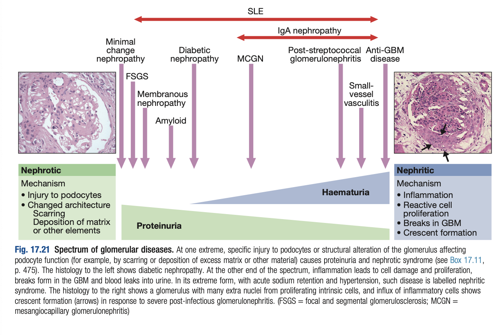
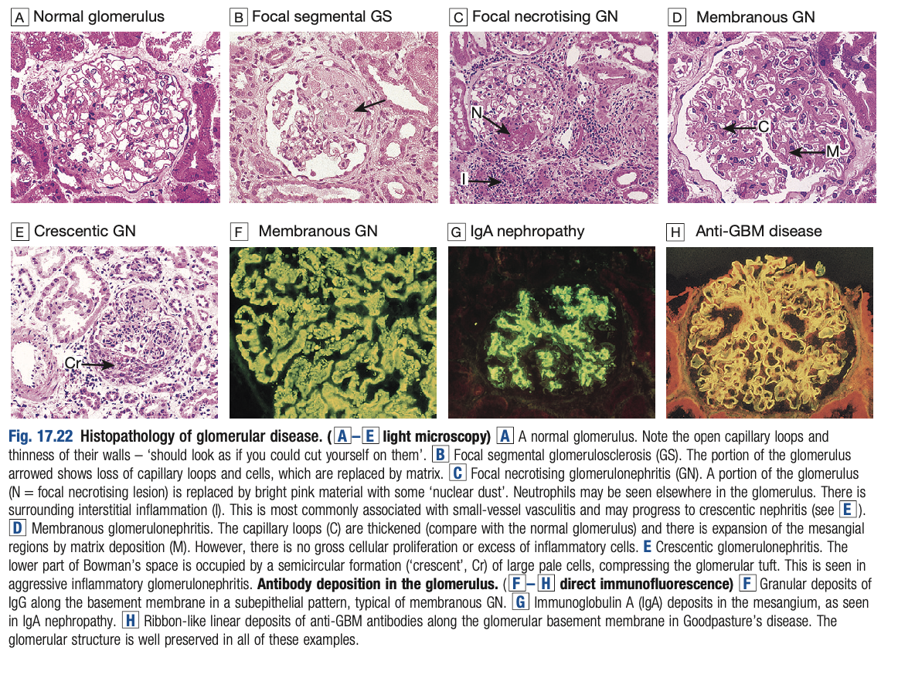
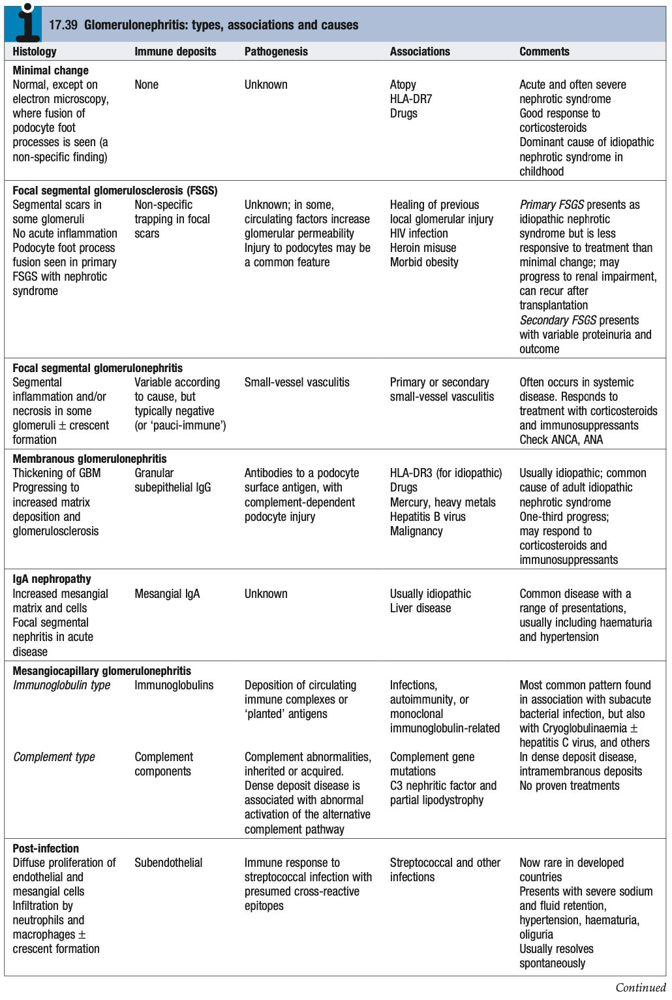
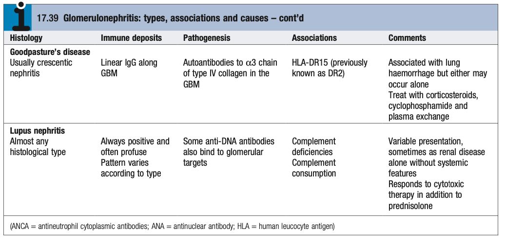

# Glomerular Diseases

- **Definition** - disease accounting for significant portion of acute and chronic kidney disease, resulting from immunological injury, inherited disease, metabolic disease, and deposition of abnormal protein
- **Glomerular anatomy:**
    - **Definition of glomerulus** - basic filtering unit of the kidney responsible for glomerular ultrafiltration, containing a tuft of capillaries branching from <u>afferant arteriole</u> and drains into the <u>efferent arteriole</u>
    - **Physiological anatomy of the glomerulus:**
        - **Glomerular basement membrane** - <u>size- and charge-selective barrier</u> during ultra-filtration:
            - **Size selective barrier** - podocytes with podocytic food processes that inter-calate to form slit processes
            - **Charge-selective barrier** - ECM within the GBM
        - **Mesangium and mesangial cells** - specialised structural matrix secreted by mesangial cells to provide support to glomerulus
- **Spectrum of glomerular disease** - clinical features dependent on target of injury within the glomeruli:
    - <u>Injury to podocytes</u> - causes proteinuria and nephrotic syndrome
    - <u>Inflammation at glomerulus, and breaks in GBM</u> - causes glomerular haematuria, fluid retention HTN (e.g. nephritic syndrome)

  
  
- **Terminology of glomerylar Diseases:**
    - **Extent of glomerular lesions** - diffuse vs focal:
        - <u>Diffuse</u> - pathological process involves <u>all glomeruli</u> within the kidney
        - <u>Focal</u> - pathological process involves only <u>some (\< 50%) glomeruli</u> within the kidney
    - **Extent of involvement within single glomeruli** - global vs segmental:
        - <u>Global</u> - pathological process involving the entire glomerular tuft
        - <u>Segmental</u> - pathological process involving only a segment of the glomerular tuft (\< 50%)
    - **Histological features under light microscopy:**
        - **Proliferative** - increase number of cells within the glomerulus (i.e. hypercellularity):
            - <u>Mesangial hypercelllularity</u> - increased number of mesangial cells per glomeruli, defined as <u>\> 3 nuclei in 1 mesangial area</u> (e.g. MPGN)
            - <u>Endocapillary hypercellularity</u> - increased number of cells within capillary wall
            - <u>Crescent formation</u> - extracapillary proliferations a/w macrophages, fibroblasts and proliferating epithelial cells signifiying significant injury to glomerulus (RPGN) and rupture of GBN
        - **Sclerosing** - presence of scarring within the glomerulus
        - **Necrotising** - presence of cell death within the glomerulus
- **Clinical presentation of glomerular diseases:**
    - **Isolated glomerular haematuria** - isolated loss RBC from the glomerulus, which may be macroscopic or microscopic
    - **Proteinuria and Nephrotic syndrome** - abnormal protein loss in urine +/- systemic manifestations (e.g. peripheral oedema, hyperlipidaemia, hypoproteinaemia)
    - **Nephritic syndrome and rapidly progressive glomerulonephritis** - clinical syndrome characterised by haematuria, proteinuria, fluid retention and declining renal function
    - **Chronic kidney disease** - incidental finding of progressive decline in glomerular filtration rate +/- proteinuria

    
  
