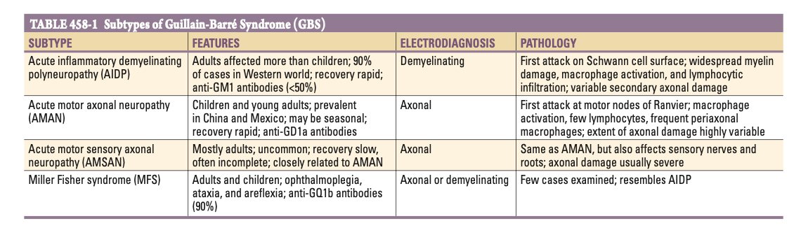
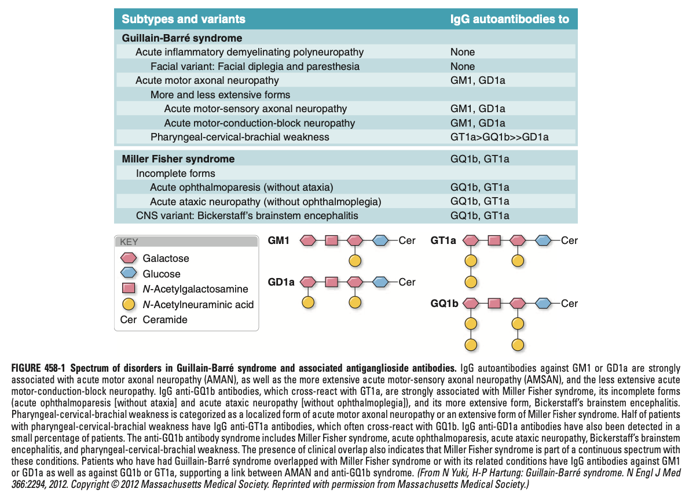
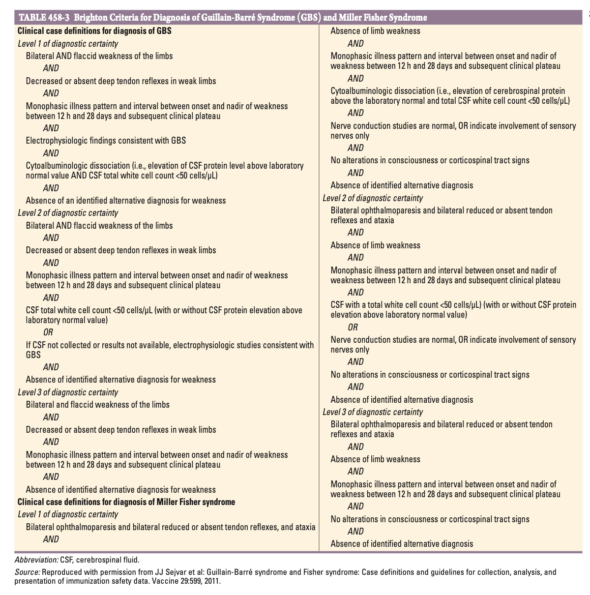

# Guillain-Barre Syndrome

- **Definition** - an acute, frequently severe, and fulminant polyradiculopathy of autoimmune in nature
- **Epidemiology:**
    - <u>Incidence</u> - 10-20/1,000,000/y (5000-6000 cases/y in the US)
    - <u>Demographic</u>:
        - Age - more common in adults than children
        - Sex - slight male preponderance
    - <u>Geographic variation</u> - form of GBS differs in different areas:
        - Acute inflammatory demyelinating polyneuropathy (AIDP) more common in Europe and North America
        - Axonal variants (AMAN or ASMAN) more common in China and Japan
- **Subtypes of GBS** - <u>axonal forms more common in Chinese</u>, while demyelinating forms more common in Western countries: 

- **Regional variants of GBS:**
    - Pure sensory forms of GBS
    - Opthalmoplegia w/ anti-GQ1b Ab as part of severe motor sensory GBS
    - GBS w/ severe bulbar and facial paralysis a/w antecedent infection and anti-GM2 antibodies
    - Acute pandysautonomia
- **Electro-pathophysiology of GBS:**
    - **Conduction block in AIDP** - demyelination results in conduction block serving as the basis of flaccid paralysis and sensory disturbances:
        - <u>Electrophysiological evidence of conduction block</u> - slowing of conduction velocity, prolonged latency and temporal dispersion on nerve conduction studies
        - <u>Recovery by remyelination</u> - recovering from neurological deficits occurs w/ remyelination
        - <u>Secondary axonal degeneration</u> - may occur in demyelinating GBS a/w slower rates of recovery and permanent disability
    - **Axonal degeneration in AMAN and AMSAN** - disconnection from the neuromuscular junction as the basis of flaccid paralysis:
        - <u>Electrophysiological evidence of axonal injury</u> - low-amplitude compound muscle action potentials (CMAPs) +/- sensory nerve action potentials (SNAPs)
        - <u>Mechanism of "axonal degeneration"</u> - not full transection per se but a complete conduction block, likely due to Ab to ion channels in nodes and paranodes (actual axonal degeneration may occur in later disease course)
- **Clinical features of GBS** - rapidly <u>ascending areflexic paralysis</u> +/- sensory disturbances following an <u>antecedent event</u>:
    - **Pain** - often a prominent feature of GBS but are self-limiting and often responds to standard analgesia
        - <u>Myalgia</u> - deep aching pain present in weakened muscles, liken to have over-exercised in the previous days
        - <u>Dysethesia</u> - likely due to small sensory fibre involvement occuring in the extremities (preceeds motor Sx)
    - **Ascending paralysis** - ascending, areflexic paralysis typically evolving over hours to a few days:
        - <u>Sites</u> - ascending in nature:
            - Legs (initially experienced as rubbery legs subsequently becoming completely paralysed)
            - Arms (less frequently affected than the legs)
            - Facial diparesis (present in 50% of affected individuals, w/ involvement of bulbar muscles)
            - Respiratory muscles (up to 30% requiring ventilatory support at some time of illness)
        - <u>Quality</u> - arreflexia:
            - a/w profound tingling dysathesia at the extremities
            - Pain in midline neck, shoulder, back or along the spine occuring inn ~50% of patients and may result in false localisation to the spine
    - **Sensory disturbances:**
        - <u>Small-fibre functions</u> - usually temperature and pain sensation mildly affected; non-specific ascending painful dysathesia occuring at the extremities may <u>preceed the onset of muscle weakness</u>
        - <u>Large-fibre dysfunction</u> - loss of proprioception and hence deep tendon reflexes severely affected
    - **Autonomic disturbances** - common and may occur in pateints whose GBS is otherwise mild:
        - <u>Vasomotor disturbances</u> - presenting w/ fluctuating BP and postural hypotension
        - <u>Cardiac dysarrhythmia</u> - requiers frequent close monitoring and Mx
        - <u>Bladder dysfunction</u> - may be present in severe cases but usually transient, if prominent should raise suspicion of **spinal cord lesion**
- **Natural Hx of GBS** - follows a "monophasic disease course" and is often predictable in terms of progression of weakness:
    - Progressive worsening of weakness dominants the initial phase of disease (lasting 12h to 28d)
    - Nadir of weakness invariably occurs \<= 4y of disease
    - Subsequent clinical plateau phase after nadir of weakness is variable but recovery is the rule (85%)
- **Signs of GBS:**
    - Diffuse weakness
    - Areflexia over all limbs
- **Features speaking against GBS:**
    - Presence of fever and other systemic Sx at onset (points towards an infective etiology)
    - Prominent bladder dysfunction (points towards a spinal cord pathology)
    - Non-monophasic disease courses (e.g. fluctuating/ fatiguability suggestive more of MG)
- **DDx of GBS:**
    - <u>Brainstem ischaemia</u> - resulting in widespread motor dysfunction, esp. w/ **lower cranial nerve palsies**
    - <u>Spinal cord disorders</u> (esp. infective/ inflammatory myelitis) - clinical suspicion raised especially if bladder dysfunction is prominent (although ocassionally absent), or a/w a **sensory level on clinical examination**
    - <u>Porphyria</u> - esp. w/ abdominal pain, seizures, psychosis
    - <u>Vasculitic neuropathy</u> - often w/ associated rash and raised ESR
    - <u>Infectious polyradiculitis</u> - e.g. lyme disease and other tick-bourne polyradiculitis, **HIV**, brucellosis, syphilis, CMV (immunocomprimised host)
    - <u>Poisonings</u> (toxic neuropathies) - e.g. organophosphate, tahllium, arsenic, paralytic shellfish poisoning
    - <u>Disorders of NMJ</u> - myasthenia gravis, botulism
- **Ix:**
    - **LP:**
        - **Classical findings** - "albuminocytologic dissociation":
            - <u>CSF protein</u> - usually elevated (100-1000 mg/dL) by end of first week (may be N if \<= 48h)
            - <u>WCC</u> - no accompanying pleocytosis
        - **DDx for elevated WCC:**
            - Transient elevations may be present in typical GBS
            - However sustained pleocytosis suggests an alternative diagnosis (e.g. lyme disease, poliomyelitis, CMV polyradiculitis, and acute myelitis) or a concurrent Dx (e.g. leukemia/ lymphoma, HIV infection, neuro-sarcoidosis)
        - **Additional Ix in CSF** - r/o other causes:
            - Viral serology and PCR
            - HIV (esp. for patients w/ HIV risk factors and concomittent CSF pleocytosis)
    - **Nerve conduction studies** - EDx features may be mild or absent in early stages and may lag behind clinical evolution:
        - **Findings in demyelinating forms of GBS:**
            - <u>Early features</u> - prolonged F-wave latencies, prolonged distal latencies, and reduced amplitudes of CMAPs
            - <u>Late features</u> - reduced conduction velocities, conduction block and temporal dispersion
        - **Findings in axonal forms of GBS** - reduced amplitudes of CMAPs and SNAPs w/ no conduction slowing or prolongation of distal latencies
    - **Anti-ganglioside Ab** - a/w various subtypes of GBS w/ clinical utility:
        - <u>Anti-GM1</u> (20-50%) - most frequently detected and is associated w/ axonal forms of GBS (AMAN/ AMSAN), and those that are preceeded by C. jejuni infections
        - <u>Anti-GD1a</u> - also a/w AMAN and AMSAN
        - <u>Anti-GQ1b</u> - cross reaction w/ GT1a, strongly associated w/ Miller Fisher syndrome (N.B. anti-GQ1b syndrome acconts for \> 90% cases of MFS) and its incomplete forms

    
    
- **Dx** - primarily a clinical diagnosis based on the pattern of rapidly evolving paralysis w/ arreflexia, absence of fever or other systemic Sx, and characteristic antecedent events (Brighton Criteria 2011):
    - N.B. Brighton Criteria is designed for case definitions to determine vaccine safety, but has been subsequently validated as a diagnostic criteria

  
  
- **Mx:**
    - **Principles of Mx:**
        - <u>Monitoring</u> - close monitoring when in worsening phase of disease for detect autonomic failure, and ventilatory dysfunction
        - <u>Supportive measures</u> - frequent monitoring, w/ supporting skin care and frequent turning
        - <u>Immunosuppression</u> - primarily via IVIG or plasma exchange (combination therapy not proven to be effective)
    - **Monitoring** - critical care monitoring in <u>worsening phase of GBS</u>:
        - Regular PEFT as a measure of vital capacity and early consideration of intubation +/- tracheostomy and chest physiotherapy
        - Monitoring of vital signs such as cardiovascular status and heart rhythm
    - **Other supportive measures:**
        - <u>Frequent turning</u> - daily range-of-motion exercise to avoid joint contractures, pressure sores and pulmonary embolism
        - <u>Skin care</u> - avoiding pressure sores
    - **Timing of medical therapy** - \< 2 weeks:
        - Early initiation of medical therapy; immunotherapy not known to be effective after 2 weeks after Sx onset
        - Immunotherapy may not be considered if plateau stage is already reached, but can still be offered if severe motor weakness and inability to exclude ongoing immunological attack

    
    
    - **IVIG:**
        - <u>Dosage</u> - total dose of 2g/kg administered as daily infusions over 2-5d
        - <u>MOA</u> - Neutrolisation by GBS autoantibodies by anti-idiotypic Ab in IVIG
    - **Plasma exchange** (PLEX):
        - <u>Dosing</u> - 40-50 ml/kg PE 4-6x over 7-12d
        - <u>MOA</u> - removal of pathogenic Ab
        - <u>Clinical efficacy</u> - meta-analysis shows:
            - Reduced nead for MV support by more than half (27% to 14%)
            - Increased likelihood of full neurological recovery at 1mo
- **Prognosis and recovery:**
    - <u>Mortality</u> - \< 5% in optimal setting, usually from secondary pulmonary complications
    - <u>Functional recovery</u> - full functional recovery within several monthes to a year in 85% (although minor finidings on examination may persist)
    - <u>Relapses</u> - 5-10% w/ typical GBS relapse (may be subsequently classified as having CIDP)
    - <u>Poor prognostic factors</u>:
        - Severe proximal motor and senosry axonal damage (regeneration may not occur)
        - Advanced age
        - Fulminant attack irrespective of mechanism
        - Delayed onset of Tx
        - High-titres of anti-GM-1 (due to association w/ axonal variants
