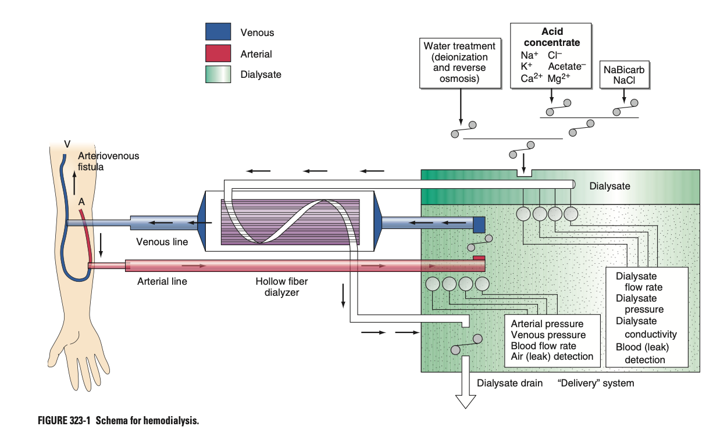

# Haemodialysis

- **Definition** - form of RRT that relies on the process of solute diffusion across a semi-permeable membrane extra-corporeally within a 'dialyzer'
- **Principles of HD** - 3 mechanisms drives 'by-products of metabolism' across a semi-permeable membrane:
    - <u>Law of diffusion</u> - obeys Fick's law, dependent on 1) concentration gradient, 2) surface area, 3) transfer coefficient (porisity and thickness), 4) size of solute, and 5) conditions on either side of the membrane
    - <u>Ultra-filtration</u> - pressure-driven process
    - <u>Convection clearence</u> - solvent drags with solute swept along with water across semi-permeable dialysis membrane
- **Components of HD:**
    - Dialyzer
    - Composition and delivery of dialysate
    - Blood delivery system
    - Dialysis access

  
  
- **Dialyzer** - hollow-fibre system serving as capillaries to allow for blood and dialysate to travel at high-rates:
    - <u>Principle</u> - capillary tubes w/ blood passes inside while dialysate travels outside
    - <u>Material</u>:
        - Bio-incompatible membranes (old) - made of cellulose, activates complement cascade and a/w anaphylactoid reactions
        - Bio-compatible membranes - derived from polysulfone or related material
    - <u>Re-processing and reuse</u>:
        - Most are single-use now as costs decreases
        - Reprocessing is now extremely rare but various reprocessing agents necessary before reusible
- **Dialysate:**
    - <u>Normal composition of dialysate</u>:
        - K - normally 0-4 mmol/L depending on pre-dialysis serum K concentrations (0-1 rarely used as data shows that K shifts predispose to sudden death)
        - Ca - typically 1.25 mmol/L but may be modified (e.g. increased for hypoCa or hungry bone syndrome post-parathyroidectomy)
        - Na - normally 135-140 mmol, but complex "sodium modelling" may be employed to ameliorate intradialytic hypotension
        - Water - up to 120L used per session, processed by filtration, softening, deionization and reverse osmosis
- **Blood delievery system and dialysis solution delivery system:**
    - Blood flow rates typically set between 250-450 mL/min
    - Deliver dialysate at a negative pressure to achieve desirable fluid removal by ultra-filtration
- **Vascular access:**
    - <u>Types of vascular access</u>:
        - Arteriovenous (native; e.g. Brescia-Cimino) fistula - anastomosis of vein end-to-end w/ artery results in arterialisation of the vein to enable use of large needles to access circulation
        - Arteriovenous graft - interposition of prosthetic material between A and V
        - Tunneled central-venous catheterisation - typically placed in the IJV, but EJV, femoral, subclavian are also acceptible (subclavian avoided to maintain viability of future fistulas on the ipsilateral side)
    - <u>Factors determining maturation of AV fistula</u>:
        - Inflow - sufficient arterial inflow
        - Outflow - adequate calibre of recipient vein
    - <u>Complications of AV graft</u>:
        - Graft thrombosis
        - Graft failure (intimal hypertrophy at anastamosis)
        - Much higher infection rates than fistulas
    - <u>Complications of central venous catheterisation</u>:
        - Highest rate of infection
        - Venous thrombosis
        - Venous stenosis (results in SVC syndrome w/ swelling of face and extremity)
- **Goal of haemodialysis:**
    - <u>Dose of dialysis</u> - fractional urea clearance during single Tx:
        - Governed by TBW or urea volume distribution, metabolism, dietary intake, and comorbid conditions
        - However HEMO study showed no difference in mortality associated w/ differences in urea clearance per session
        - Currently tailored to IDWG and aim for equilibration of urea
    - <u>Individualised haemodialysis dose</u> - generally 9-12h over each week divided into 3 sessions:
        - Adequacy of ultrafiltration or fluid removal
        - Control of hyperK, hyperPO4, and metabolic acidosis
    - <u>Measures for improving outcomes of dialysis</u>:
        - Increased dialysis frequency (Frequent Hemodialysis Network Daily trial) - 6 sessions per week compared w/ 3 sessions per week demonstrated better control of HTN and hyperphosphataemia, w/ reduced LV mass, and self-reported physical health and QoL
        - Shorten interdialytic interval (US Renal Data System registry) - showed increased mortality and HF hospitalisations after the longer interdialytic interval that occurs over the dialysis
- **Classification of complications of HD:**
    - <u>Complications during HD</u> - related to fluid removal, electrolyte and acid-base shift, complications related to dialyzer or blood delivery system
    - <u>Complications during interdialytic interval</u> - related to fluid retention, complications-related to vascular access
- **Complications during HD:**
    - **Hypotension** - most common acute complication during HD, esp. in those w/ DM:
        - <u>Etiology</u>:
            - Tx factors - e.g. excessive ultrafiltration w/ inadequate compensatory vascular filling, excessive osmolar shifts, overzealous use of antihypertensives, AV fistula/ graft steal
            - Patient factors - reduced cardiac reserve, impaired vasoactive response (DM)
        - <u>Immediate Mx</u>:
            - Discontinuation of UF
            - IV bolus 100-250 mL isotonic saline
            - Salt-poor albumin
        - <u>Prevention</u>:
            - Careful evaluation of dry weight and IDWG to avoid excessive fluid removal
            - Ultrafiltration modelling where more fluid removed initially than at the end
            - Sequential ultrafiltration followed by dialysis
            - Cooling of dialysate
            - Avoiding heavy meals during HD (?splanchnic vasodilation)
    - **Muscle cramps:**
        - <u>Causes</u> - reamins obscured:
            - Impaired muscle perfusion due to rapid volume removal
            - Targeted removal below patient's estimated dry weight
        - <u>Prevention</u>:
            - Reducing fluid removal
            - Ultrafiltration profiling
            - Sodium modeling
    - **Anaphylactoid reactions** - classified into 2 types:
        - <u>Type A dialyzer reaction</u> (within minutes) - IgE-mediated intermediate hypersensitivity reaction to ethylene oxide used in sterilization of new dialyzers
        - <u>Type B dialyzer reaction</u> - non-specific chest and back pain resulting from complement activation and cytokine release
