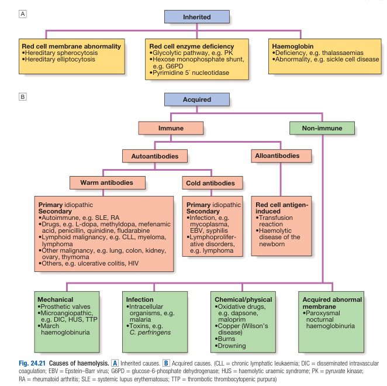
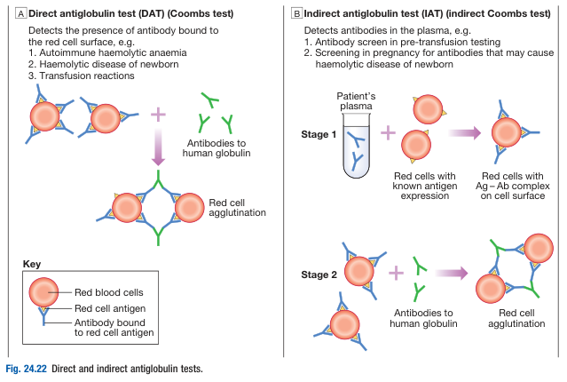
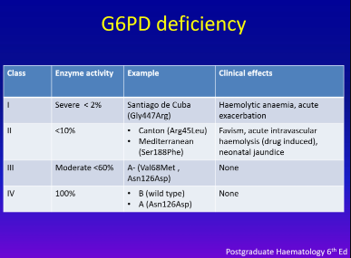

# Haemolytic Anaemia

- **Definition** - anaemia caused by shortening of the lifespan of RBCs which cannot be compensated by increased marrow production
- **Physiological compensation to haemolysis** - anaemia ensues if rate of destruction exceeds increased production:
    - <u>Increased BM production of red cells</u> - up to 8x of normal
    - <u>Premature release of erythoid precursors</u> - releasing of <u>reticulocyte</u>, which results in polychromasia in blood film and elevated reticulocyte count (retic. \> 5%)
- **Etiology of haemolytic anaemia:**
    - **Inherited haemolytic anaemia:**
        - <u>Membranopathies</u> - hereditary spherocytosis, hereditary eliptocytosis
        - <u>Enzymopathies</u> - G6PD deficiency, PK deficiency
        - <u>Disorders of haemoglobin</u>:
            - Quantitative defect - e.g. thalassaemia
            - Qualitative defect - e.g. sickle cell disease, other haemoglobinopathies
    - **Acquired haemolytic anaemia:**
        - **Immune-mediated:**
            - <u>Allo-immune disorders</u> - transfusion reactions (e.g. ABO incompatability, Rh incompatability), haemolytic disease of the newborn
            - <u>Autoimmune disease</u> - Warm AIHA, cold agglutinin disease
        - **Non-immune mediated:**
            - <u>Acquired abnormal membrane</u> - paroxysmal noctural haemoglobinuria
            - <u>Mechanical</u> - prosthetic valves, MAHA, march haemoglobinuria
            - <u>Infective</u> - e.g. malaria
            - <u>Chemical</u> - drug-induced, copper, burns, drowning

  
  
- **Extravascular haemolysis vs intravascular haemolysis:**
    - **Extravascular haemolysis** - haemolysis occuring within the reticuloendothelial system to avoid free Hb in plasma (most haemolytic states other than those stated below)
    - **Intravascular haemolysis** - red cell lysis directly within the blood streams:
        - **Etiology:**
            - <u>Complement activation leading to MAC formation</u> - ABO incompatibility, nocturnal haemoglobuinuria
            - <u>Intracellular infections in RBCs</u> - malaria, Clostridium perfringens
            - <u>Mechanical</u> - heart valves, MAHA in TMA or DIC
            - <u>Oxidative damage</u> - e.g. G6PD deficiency, drug-induced (dapsone, maloprim)
        - **Pathophysiology of intravascular haemolysis:**
            - <u>Binding to haptoglobin</u> - free haemoglobin directly binds to haptoglobin, an alpha-2 globulin produced by the liver
            - <u>Oxidisation to methaemoglobin and formation of methalbumin</u> - occurs once haptoglobin is saturated, where free Hb is oxidised to give methmoglobin and binds to albumin to give methalbumin
            - <u>Degradation of methaemoglobin by haemopexin</u> - free haem released is bound to haemopexin
        - **Effects of failed compensation** - haemoglobinuria (coca-cola urine)
- **Ix:**
    - **Routine bloods** - CBC, retic count, LFT, LDH, haptoglobin:
        - **CBC:**
            - <u>Hb and MCV</u> - mild macrocytic anaemia due to reticulocytosis
            - <u>ANC</u> - may be slightly raised due to increased BM production (usually reflects very strong BM compensation)
            - <u>PLT</u> - **thrombocytopenia** raises suspicion of MAHA/TMA; otherwise mild thrombocytosis
        - **Retic count** - \> 5% indicating reticulocytosis
        - **LFT** - isolated hyperbilirubinaemia (unconjugated)
        - **LDH** - raised reflecting cellular turnover
        - **Haptoglobin** - reduced level reflects <u>intravascular haemolysis</u>
    - **Peripheral blood smear:**
        - <u>General findings in haemolytic anaemia</u> - features suggestive BM compensation:
            - **Reticulocytosis** +/- nucleated RBCs
            - Mild thrombocytosis and neutrophilia may be observed
            - In severe cases **leukoerythroblastic picture** observed due to release of immature granulocytes
            - Megaloblastic features such as hypernucleated PMN and macrocytosis occurs if haemolysis results in concomitent folate deficiency
        - <u>Findings suggestive of of specific etiology</u>:
            - **Spherocytes** - suggestive of hereditary spherocytosis or warm AIHA
            - **Sickle cells** - suggestive of sickle cell disease
            - **Schistocytes** (RBC fragments) - suggestive of MAHA
    - **Coomb's test:**
        - <u>Principles</u> - detection of Ab against RBCs

    
    
- **Mx:**
    - **Principles of Mx:**
        - <u>Transfusion</u> - RBC transfusion if severely anaemic
        - <u>Dx and Tx of underlying cause</u> - e.g. immunosuppression if necessary
        - <u>Folate supplementation</u> - given to all patients irrespective of cause as erythroid hyperplasia may result in folate deficiency

# Autoimmune Haemolytic Anaemia

- **Classification of AIHA:**
    - Two clinical entities - warm AIHA and cold AIHA according to whether the antibody reacts more strongly with red cells at 37 degrees or 4 degrees
        - Warm AIHA - binds better at body temperature
            - Often IgG
            - Etiology:
                - Primary (idiopathic)
                - Secondary (50%):
                    - Drugs - Methyldopa, penicillin, cephalosporines, NSAIDs, quinine, interferon
                    - Autoimmune diseases - e.g. SLE
                    - Lymphoproliferative disorders - e.g. CLL, lymphomas
                    - Other malignancies
        - Cold AIHA - binds better at 4 degrees
            - Often IgM
            - Pathophysiology:
                - Typically clinically silent, manifestation as haemolytic anaemia requires ability to react with red cells at body temperature.
                - Acrocyanosis - causes agglutination of red cells in extremities in response to cold weather, causing stasis and cyanosis (cf Raynaud's phenomenon)
            - Etiology:
                - Primary (idiopathic) - cold haemagglutinin disease
                - Secondary:
                    - Infections - IM, mycoplasma pneumoniae
                    - Lymphoproliferative disorders
- **Diagnosis of AIHA:**
    - Compatible clinical findings of haemolytic anaemia - Macrocytic anaemia + compatible biochemistries + blood film review (spherocytes)
    - Diagnostic test - +ve direct Coomb's test
- **Management of AIHA:**
    - Treatment for haemolytic anaemia
        - Transfusion if necessary
        - Folate supplement - depletion of folate in reactive erythroid hyperplasia
    - Specific treatment for immune component - decrease further haemolysis:
        - Steroid or other immunosuppressants
            - 1st line - Oral prednisolone 1mg/kg/d as starting dose, tapered down once anaemia subsides over 10 weeks.
        - Keep warm in cold haemagglutinin disease
        - Splenectomy (reserved if refractory to treatment)
    - Treat underlying cause - e.g. CTD, lymphoproliferative disorders, avoidance of drugs

# G6PD Deficiency

- **Epidemiology** - 4.5% in M, 0.5% in F
- **Heterogenous** - \> 100 variants with varying enzyme activity
    - Classified by residual G6PD activity - dependent on variant of mutations
        - Class I - Severe (\< 2%), a/w chronic haemolytic anaemia
        - Class II, \< 10%, a/w with intermittent haemolysis precipitated by increased oxidative stress
        - Class III - 10-60% activity
        - Class IV - \> 60% activity, clinically insignificant

    
    
- **Pathophysiology of G6PD deficiency:**
    - Inheritence pattern - X-linked recessive
    - Genetics and insufficient Pentose phosphate shunt - Clinically significant mutations cause unstable G6PD enzymes, resulting in premature breakdown and reduced red cell survival due to insufficient pentose phosphate shunt
    - Haemolysis - associated with a trigger
        - Triggers - increased oxidative stress
            - Acute medical illness/ Infection
            - Drugs - Rasburicase, Sulphonamides, Antimalarials (particularly primaquine)
            - Flava beans (Flavism)
        - Oxidant accumulation in RBC - causing formation of methaemaglobin, Heiz bodies, and bite cells as they are removed by reticuloendothelial system, subsequently increased extravascular haemolysis.
    - Reticulocytosis - Newly formed reticulocytes have normal G6PD activity, hence haemolysis is typically self-limiting
- **Clinical features of G6PD deficiency:**
    - Asymptomatic between attacks
    - Attacks typically manifest as acute non-spherocytic intravascular haemolysis (rapid onset):
        - S/S of anaemia - SOBOE, palpitations, pallor (rapid reduction of Hb by 3-4 g/dL)
        - S*S of intravascular haemolysis - Marked jaundice, dark-coloured urine (haemaglobinuria) +*- AKI
- **Ix in G6PD deficiency:**
    - CBC + Biochemistries - Intravascular haemolysis
        - Macrocytic anaemia w/ reticulocytosis
        - Increased LDH, indirect bilirubin
        - Reduced haptoglobin
        - Increased methaemalbumin
        - +/- Haemaglobinuria
    - PBS - non-spherocytic intravascular heaemolysis
        - Polychromasia
        - Ghost cells, Hemi-ghost cells w/ Heiz bodies
        - Bite cells - bites of membrane missing (removal of Heiz bodies by RES)
    - +/- G6PD assay - often used as screening rather diagnostic test during acute attack, retrospective diagnosis (after 3mo of attack)
        - Note - False positive in acute attacks because newly born reticulocytes have normal G6PD activity
- **Tx of G6PD deficiency:**
    - Supportive Tx
    - Stop and avoid offending agents - drugs
    - Folate replaceement
    - Transfusion +/- aggressive hydration for acute intravacular haemolysis
