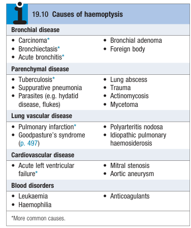

# Haemoptysis

- **Definition** - coughing up blood, irrespective of amount, assumed to have a serious cause until this is excluded
- **DDx of haemoptysis** - many episodes remain unexplained but thorough workup is required: 

    - **Pulmonary disorders:**
        - <u>Bronchial disorders</u> - **bronchiogenic carcinoma**, **bronchiectasis**, acute bronchitis, FB, bronchial adenoma
        - <u>Pulmonary parenchymal diseases</u>:
            - Mycobacterial infections - **tuberculosis**
            - Suppurative lung disorders - lung abscesses
            - Fungal or other chronic bacterial infections - mycetoma, actinomycosis, ABPA
            - Parasitic infections - hydatid disease, flukes
            - Others - e.g. trauma
        - <u>Pulmonary vascular disorders</u> - **pulmonary embolism** (pulmonary infarction), pulmonary arteriovenous malformations (**HHT**), idiopathic pulmonary haemosiderosis
    - **Systemic disorders:**
        - <u>Cardiovascular diseases</u> - **acute pulmonary oedema**, **mitral stenosis**, aortic aneurysms
        - <u>Pulmonary-renal syndrome and other vasculitides</u> - **goodpasture's syndrome**, **ANCA-associated vasculitis**, polyarteritis nodosa
        - <u>Blood disorders or bleeding tendancies</u> - anticoagulation, leukaemia, haemophilia
- **Important differentials to not miss when assessing a patient w/ haemoptysis** - risks for these can be clarified through Hx:
    - <u>Bronchial carcinoma</u> - evidence of smoking Hx +/- constitutional Sx (may not be present in early disease)
    - <u>Bronchiectasis</u> - should only be considered if Hx of chronic cough w/ copious amounts of sputum
    - <u>Tuberculosis</u> - exposure (FHx or occupational exposure to TB), immunocomprimised states (e.g. DM, biologics, ICIs)
    - <u>Pulmonary embolism</u> - risk factor assessment by 1) unilateral leg pain, 2) pleuritic chest pains, 3) active malignancy, 4) Hx of PE or DVT, 5) recent surgery or immobilsation (\> 4 weeks)
    - <u>Cardiovascular diseases</u> - evidence of HF Sx, traditional cardiovascular risk factors, known valvular heart disease
    - <u>Pulmonary renal syndrome</u> - often acute presentation, otherwise well
- **Salient points of Hx:**
    - **HPI** - onset, progression, quality, previous episodes:
        - <u>Onset and progression</u> - chronic, repeated small haemoptysis or blood stained sputum is highly suggestive of bronchial carcinoma
        - <u>Quality</u>:
            - Large amounts w/ blood clots - suggestive of sizable bleeding requiring acute Mx irrespective of cause
            - Bloody mucopurulent sputum - suggestive of bronchiectasis
            - Rusty sputum - suggestive of pneumococcal infection
            - Blood-streak in sputum - may be a/w bronchial carcinoma, TB
            - Pink, frothy sputum - due to acute pulmonary oedema
        - <u>Previous episodes</u> - may reveal underlying cause
    - **Associated Sx:**
        - <u>Dyspnoea</u> - reflects underlying pulmonary parenchymal or vascular etiology
        - <u>Chest pain</u> - pleuritic chest pain reflects pulmonary infarction or parapneumonic effusion
        - <u>Cough and sputum</u> - non-differentiating based on +ve Hx but quality and progression may hint underlying etiology (e.g. bronchiectasis a/w protracted volumes of sputum)
        - <u>Fever</u> - suggestive of pneumonia or pulmonary infarction
        - <u>Weight loss</u> - suggestive of TB or underlying malignancy
        - <u>LL oedema</u> - unilateral LL oedema suggestive of DVT
        - <u>Haematuria</u> - screen for lung-renal syndrome
    - **PMH** - look for risk factors:
        - <u>General medical conditions</u> - e.g. DM (risk factor for TB)
        - <u>Pulmonary disease</u> - e.g. bronchiectasis, COPD, ILD (risk factor for TB and bronchial carcinoma)
        - <u>Cardiovascular disease</u> - esp. mitral stenosis as severe mitral stenosis and AF can present w/ haemopytis
        - <u>Antive malignancy</u> - a/w increased risk of TB or other chest infections from anticancer therapy, and increased risk of DVT and P/E
        - <u>Immunosuppression</u> - e.g. CKD, cirrhosis, RA etc.
    - **Drug Hx:**
        - <u>Drugs causing immunosuppression</u> - corticosteroids, biologics, anti-cancer therapy
        - <u>Drugs causing bleeding tendancy</u> - aspirin, warfarin, DOACs
        - <u>OC pills</u> - r/f for pulmonary embolism
    - **TOCC history** - if fever and cough
    - **SHx:**
        - <u>Smoking</u> - risk factor for bronchial carcinoma
        - <u>Alcohol and illicit drug use</u> - risk factor for TB
        - <u>Occupation</u> - occulational exposure to TB
        - <u>Living environment</u> - e.g. OHA is risk factor for TB
        - <u>Prolonged immobilisation</u> - a/w increased risk of PE
    - **FHx** - TB exposure, malignancy
- **P/E** - primary assessment, general examination, and respiratory examination:
    - **Primary assessment and vital signs** - airway, breathing and circulation assessed in cases of acute haemoptysis or severe respiratory distress
    - **Temperature** - fever (esp. in a/w pleural rub or signs of consolidation) suggestive of either pneumonia or pulmonary infarction
    - **General examination:**
        - <u>General appearance</u> - cachexia may point towards malignancy
        - <u>Cervical LN</u> - cerviacal lymphadenopathy (particular SCN) suggestive of malignancy
        - <u>Irregularly irregular pulse</u> - underlying AF has some diagnostic implications (e.g. severe lung disease resulting in AF, long-term anticoagulation)
        - <u>Clubbing</u> - presence suggestive of bronchial carcinoma, bronchiectasis, and rarer lung infections (e.g. TB, suppurative pneumonia)
        - <u>LL oedema</u> - unilateral LL oedema suggestive of DVT and pulmonary embolism; bilateral LL oedema points towards cardiac causes
    - **Respiratory examination** - assess for localising signs (e.g. unifocal wheeze, crackles, or pleural rub)
    - **Systems review:**
        - Auscultation of the precordium for <u>mitral stenosis</u>
        - Palpation of the liver for <u>malignant hepatomegaly</u>
    - **Additional important signs:**
        - <u>Rash, purpura or digital infarcts</u> - points towards systemic cause (e.g. vasculitis)
- **Ix** - do not delay Mx if acute severe haemoptysis:
    - **Urinalysis +/- microscopy** - screen for lung-renal syndrome
    - **Routine bloods** - CBC, clotting profile, RFT, +/- D-dimer:
        - **CBC** - raise suspicion of blood disease especially if <u>pancytopenia</u>, otherwise:
            - <u>Hb and MCV</u> - identify anaemia (ACD is typically, but drop in Hb raises suspicion of massive haemoptysis caused by diffuse alveolar haemorrhage)
            - <u>WBC and differentials</u> - identify infection
            - <u>PLT</u> - identify thrombocytopenia
        - **RFT** - derranged RFT suspicious of goodpasture syndrome
        - **Clotting profiles** - prolongation depending on underlying coagulopathy
        - **D-dimer** - role to r/o pulmonary embolism in haemodynamically unstable patients based on <u>pre-test probability</u>
    - **Microbiology** - septic workup w/ blood cultures, sputum for gram stain, routine C/ST, and AFB testing
    - **CXR** - provides evidence for localised tumours (e.g. tumour, pneumonia, mycetoma, or TB), or more systemic causes:
        - <u>Evidence of localised lesions</u> - localised opacity on CXR
        - <u>Evidence for systemic causes</u>:
            - CHF - cardiomegaly, upper lobe cephalisation, Kerley-B lines, batwing opacity
            - Goodpasture syndrome - batwing appearance despite normal heart size (+/- decreased Hb)
    - **HRCT thorax** - for further assessment of pulmonary nodule, or assessment of bronchiectasis, or pulmonary vascular lesions
    - **Bronchoscopy** - may reveal central lesion that are not shown on CXR
    - **CTPA** - may reveal:
        - Pulmonary embolism
        - Alternative pulmonary vascular diseases (e.g. pulmonary AVM)
    - **Additional Ix** - based on initial clinical impression:
        - <u>ECG/ Echo</u> - if pulmonary embolism (Mcgine-White pattern) or cardiovascular cause is suspected
        - <u>CTPA</u> - mainly for pulmonary embolism, but may reveal alternative pulmonary vascular diseases (e.g. pulmonary AVM)
        - <u>Autoimmune screen</u> - Anti-GBM, ANA, ANCA, Anti-Pr3, Abti-MPO
- **Mx:**
    - **Principles of Mx:**
        - <u>Mx of acute haemoptysis</u> - severe acute haemoptysis may require immediate airway protection and Mx as it may be life-threatening
        - <u>Dx of underlying cause</u> - compplete work up for haemoptysis to r/o sinister causes (see above)
    - **Acute Mx of severe haemoptysis:**
        - **Patient positioning** - reduce risk of aspiration:
            - Nursed upright
            - Lie on the side of bleeding if known
        - **Patient resuscitation** - high flow O2 and resuscitate as required
        - **Urgent bronchoscopy and haemostasis** - role is limited in the acute phase:
            - Rigid bronchoscopy under GA if radiology reveals a suspicious central region
            - Intubation w/ divided ET tube to protect ventilation of the unaffected lung
        - **Salvage Tx** - consider:
            - Bronchial arteriography and embolisation
            - Emergency surgery
