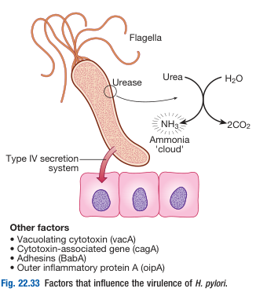
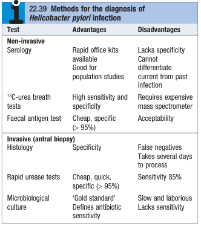
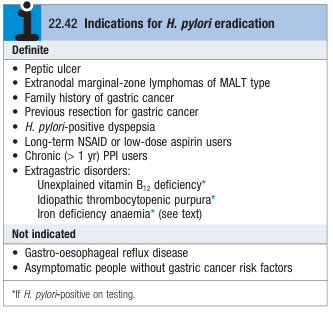
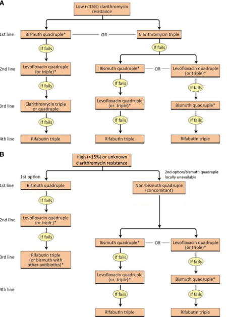

# Helicobacter Pylori Infection

- **Helicobacter pylori** - a G- sprial bacterium that grows in micro-aerophilic environment
- **Microbiology of H. pylori:**
    - <u>Multiple flagella</u> - motile, allowing it to burrow and live beneath mucus layer and adhere to epithelial surfaces
    - <u>Adhesin</u> (BabA) - binds to lewis b antigen on epithelial cells, where pH is closer to neutral
    - <u>Urease</u> - splits urea to give ammonia, which neutralises any acidity
    - <u>Cytotoxin molecules</u> (cagA, vacA) - induce apoptosis and local inflammation
    - Outer inflammatory protein A (oipA) - induces local inflammation

  
  
- **Clinical manifestations of H. pylori infection:**
    - <u>Acute gastritis</u> - most are asymptomatic
    - <u>Chronic gastritis</u> (100% infected) - \>80% asymptomatic with some presenting with dyspepsia or UGIB warranting diagnosis and eradication
    - <u>Peptic ulcer disease</u> - typically associated with antral gastritis (\> 99%) which results in duodenal ulcers, and rarely pangastritis (\< 1%), which may result in gastric ulcers
    - <u>Gastric adenocarcinoma</u> - class 1 carcinogen according to WHO
    - <u>Gastric MALT lymphoma</u>
    - <u>Extra-intestinal manifestations</u> - immune-thrombocytpenic purpura, B12 deficiency anaemia, iron deficiency anaemia
- **Diagnosis of H. pylori infection:** 

    - **Culture** - Bx of antral mucosa and culture in microaerophilic environment:
        - <u>Advantage</u> - gold standard, as it enables <u>Antibiotic sensitivity testing</u>
        - <u>Disadvantage</u> - non-sensitive (sampling error), slow and laborious
    - **Histology** - histological assessment of \>=2 Bx for characteristic morphologi in mucus gel layer and associated inflammation (H&E stain, Warthrin-Starry stain, Giemsa stain, immunostaining):
        - <u>Advantage</u> - high specificity
        - <u>Disadvantage</u> - poor sensitivity (FN), and takes time to process
    - **Rapid urease test** - mixing of Bx sample with broth containing urea and pH indicator, colour change suggests presence of H. pylori:
        - <u>Advantage</u> - quick and cheap, high specificity (\>95%)
        - <u>Disadvantage</u> - moderate sensitivyt (85%)
    - **Faecal antigen test** - immunochromatographic assays or enzyme immunoassays for detection of H. pylori antigen:
        - <u>Advantage</u> - cheap and quick, high specificity (\>95%)
        - <u>Disadvantage</u> - acceptability
    - **Urea braeth test** - drinking urea broth with urea radio-labelled by C-13, signal may be present in breath of infected patients due to splitting of urea to give CO2:
        - <u>Advantage</u> - High sensitivity and specificity
        - <u>Disadvantage</u> - requires expensive mass spetrometer
- **Mx of H. pylori infection** - H. pylori eradication:
    - **Indications of Mx** - all symptomatic H. pylori infections (rarely tested if not asymptomatic): 
    
        - **Extra-GI manifestations** - need to test then treat
    - **Principles of Mx** - dependent on local ABx resistance pattern and global consensuses:
        - <u>Maastricht VI Consensus</u> - classifies regions into low (\< 15%) clarithromycin resistance or high clarithromycin resistance, where treatment algorithm varies
        - <u>Local resistance patterns</u> (HK) - currently \< 15% clarithromycin resistance, hence enables usage of <u>PPI-based clarithromycin triple Tx</u>
    - **1st line regimens** (90% efficacy) - HK Consensus Treatment Algorithms:
        - <u>PPI-based triple therapy</u> - PPI + Amoxicillin + Clarithromycin (BD x7d)
        - <u>Bismuth-containing quadruple therapy</u> (BQT) - PPI + Bismuth + Tetracycline + metronidazole (BD x 10-14d)

    
    
    - **S/E of H. pylori eradicaiton therapy:**
        - Diarrhoea - mild GI side effect, but C-diff colitis may occur
        - N/V (amoxicillin)
        - Flushing and vomiting when taken w/ alcohol (metronidazole)
        - Abdominal cramps
        - Headache
        - Rash
    - **Assessment of treatment responsiveness** - non-invasive tests 4w after stopping all drugs
    - **Reasons for eradication failure:**
        - <u>Patient factor</u> - non-compliance
        - <u>HP factor</u> - true resistance
        - <u>Regimen factor</u> - 1) insufficient acid suppression, 2) inappropriate duration and dosage, 3) inappropriate choice of ABx
