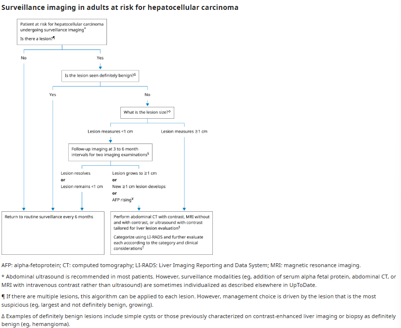
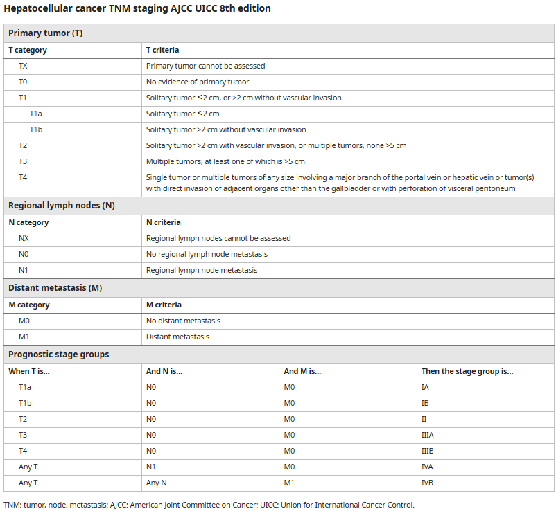
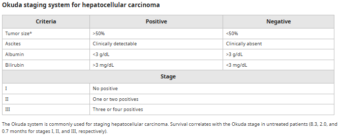
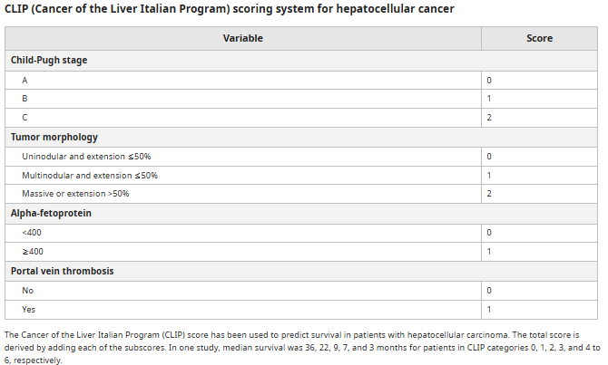
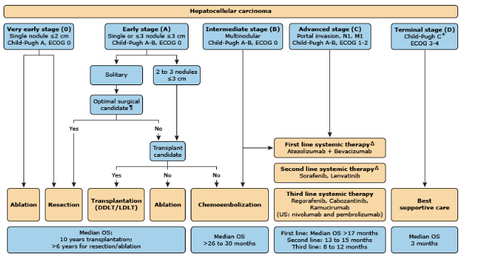
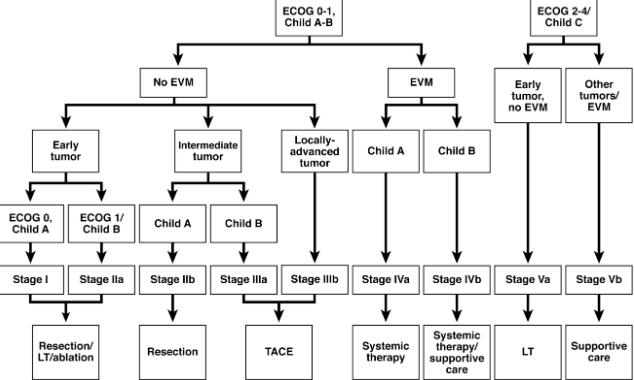
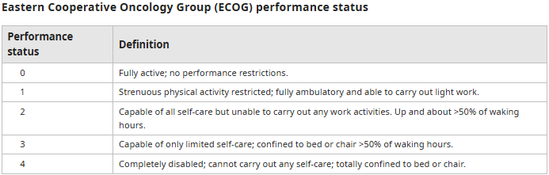
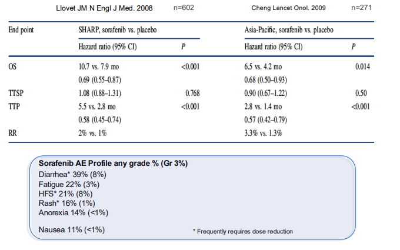
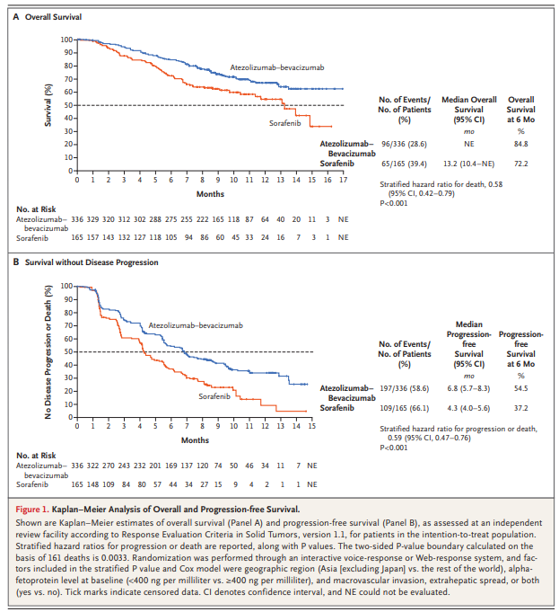
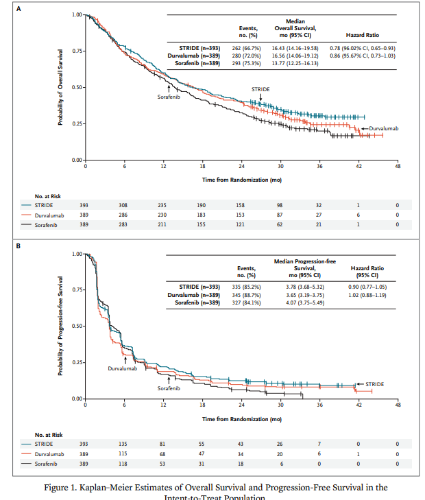

# Hepatocellular Carcinoma

- **Definition** - Most common primary liver tumour arising from hepatocytes
- **Etiology of HCC:**
    - HBV (80%)
    - HCV (5%)
    - Alcholic liver disease
    - Cirrhosis irrespective of cause - NAFLD incidence on the rise
    - Aflotoxin (fungal-derived toxin) - a co-carcinogen through interaction w/ HBV
- **Pathology of HCC:**
    - <u>Three macroscopic types</u> - massive, diffuse, nodular (worst prognosis)
    - <u>Histopathological variant</u> - fibrolamellar HCC
    - <u>Properties:</u>
        - **Rapid tumour growth** - average tumour doubling time 3mo
        - **Venous invasion**
        - **Blood supply** - from hepatic artery (cf normal liver parenchyma, 2/3 bloow flow from portal v.)
- **Clinical features of HCC** - roughly 60% of HCC present late w/ multifocal lesions and PV invasion:
    - **Asymptomatic** - especially among those who have been undergoing regular surveillance for HCC:
        - <u>Rising AFP</u> - especially if \> 20 ng/mL
        - <u>Suspicious lesion of TAUS</u>
        - <u>Incidental finding of hepatomegaly</u>
    - **Effects of local tumour** - quite asymptomatic:
        - <u>Mild, dull RUQ pain</u> - mild distending discomfort due to distending liver capsule by hepatomegaly
        - <u>Palpable mass</u> (hepatomegaly) - in the upper abdomen, RUQ mass if right lobe, epigastric mass if left lobe
        - <u>Early satiety and weight loss</u> - mass effect on the stomach
    - **Presentation as liver decompensation in known cirrhosis** - increased severity of pHTN due to portal-venous extension of HCC:
        - Variceal bleeding
        - Worsening ascites
        - Hepatic encephalopathy
    - **Presentation as complications of HCC:**
        - <u>Ruptured HCC causing intraperitoneal bleeding</u> - sudden onset of 1) severe abdominal pain, 2) abdominal distension, and 3) hypovolaemic shock (often also precipitating hepatic encephalopathy)
        - <u>Malignant biliary obstruction</u> - caused by invasion of the biliary tree, compression of intra-hepatic ducts, LN metastasis to porta hepatis or haemobilia
    - **Paraneoplastic syndromes:**
        - <u>Hypoglycaemia</u> - only seen in advanced HCC thought to result from tumor's high metabolic needs
        - <u>Erythrocytosis</u> - due to tumour secreting EPO (but balancing effects of ACD causes patients to ofeten present with anaemia)
        - <u>Hypercalcaemia</u> - due to osteolytic bone metastasis, or secretion of PTHrP
        - <u>Diarrhoea</u> - infrequently presenting with intractable diarrhoea and associated electrolyte disturbances (may be related to secretion of peptides stimulating intestinal secretion)
        - <u>Fever</u> - in association with central tumor necrosis
        - <u>Cutaneous manifestations</u> - e.g. dermatomyositis, Pemphigus etc.
    - **Effects of extrahepatic metastasis** - lungs, intra-abdominal LN, bones, adrenal glands
- **Signs of HCC:**
    - Hepatomegaly/ right hypocondrial mass
    - Audible liver bruit
- **Clinical approach to suspected HCC** - initial Ix dependent on patient's risk for HCC:
    - **High risk of HCC** (HBV carriers, documented cirrhosis) - routine **surveillance Ix** for early detection of HCC, with <u>diagnostic evaluation when indicated</u>:
        - <u>AFP</u> - non-sensitive, non-speficic markers of HCC (no role as sole Ix, but useful in conjunction with imaging):
            - **Physiology** - normally produced by fetal liver and yolk sacs, but may be elevated in patients w/ rapid hepatocyte proliferation
            - **Test properties of AFP** - tradeoff between Sn and Sp at different cutoff values
                - <u>Threshold for evaluation of HCC</u> - 20 ng/dL (60% Sn, 80% Sp)
                - <u>Increasing AFP levels in more advanced HCC</u> - AFP \> 400 ng/dL is near diagnostic (Sp \> 95%)
            - **DDx of elevated AFP:**
                - HCC
                - Acute and chronic viral hepatitis
                - Liver decompensation or cirrhosis - a/w stage 3-4 fibrosis, increased INR and AST
                - Pregnancy
                - Other malignancies - e.g. gastric cancer, tumours of gonadal origin (e.g. germ cell tumours)
        - <u>Surveillance transabdominal US</u> - routinely performed for patients with high-risk of HCC (q6mo):
            - **Features suggestive of malignancy:**
                - Large lesion (\>= 1cm)
                - Solid, non-cystic lesion
                - Growing lesion
                - Rising AFP
            - **Approach to suspicious liver lesion on US:**
                - <u>Routine surveillance</u> - if benign (liver cysts, or documented hemangioma)
                - <u>Follow-up US q3mo</u> - new, small (\< 1cm) suspicious lesion
                - <u>Diagnostic imaging</u> - new large lesions, growing lesions, rising AFP

        
        
    - **Patients w/ non-viral chronic liver disease w/o cirrhosis** - diagnostic imaging + AFP for any suspicious lesions on US
    - **Patients w/o chronic liver disease** (liver metastasis more likely) - r/o liver metastasis, viral hepatitis serology for undiagnosed HBV/HCV, tumour marker, and diagnostic evaluation:
        - <u>Serology for chronic viral hepatitis</u> - HBsAg, HBV DNA, HBeAg, Anti-HCV
        - <u>Tumour markers</u> - AFP, CEA, CA-19-9 (r/o extrahepatic metastasis)
        - <u>Diagnostic evaluation</u> - contrast CT abdomen
- **Dx evaluation** - Dx of HCC radiographically based on specific imaging characteristic:
    - **Contrast-enhanced CT abdomen** - non-invasive Dx of HCC if lesion matches specific characteristics:
        - <u>Test properties</u> - 65% Sn, 96% Sp (size dependent)
        - <u>Diagnostic findings</u> - hyper-enhancing lesion in arterial phase with rapid portal venous washout (because HCC receives blood supply chiefly from hepatic artery):
            - **Plain phase** - isodense +/- hypodense (central necrosis)
            - **Arterial phase** - arterial hyperenhancement relative to liver parenchyma (receives more hepatic artery supply than liver parenchyma)
            - **Portal venous phase** - portalvenous washout, appears hypo-dense relative to liver parenchyma (receives less portal venous supply than liver parenchyma)
            - **Other findings** - growth of lesion, enhancing capsule appearance in delayed phase
    - **Other imaging modalities** - Contrast-enhanced MRI, Contrast-enhanced US
    - +/- **Liver biopsy** - requires balancing of risk and benefits:
        - <u>Risks/ Complications</u> - tumour seeding, sampling errors
- **Post-diagnostic evaluation** - staging and prognostication:
    - **Principles of post-diagnostic evaluation** - staging and prognostication:
        - <u>Routine bloods</u> - CBC, LRFT, PT, AFP, Serology for HBV, HCV
        - <u>Staging Ix</u> - Contrast CT T+A+P or dual-tracer PET-CT
        - <u>Pre-treatment multidisciplinary evaluation</u>
    - **Staging and prognostic scoring system** - none of which is universiably adpoted (BCLC and HKLC are widely adopted):
        - **Commonly applied staging and prognostic scoring system:**
            - 8th edition TNM staging (AJCC) - only system validated for **hepatic resection/ transplant**
            - Okuda system - purely clinical scoring system applied for patients not suitable for resection
            - Cancer of the Liver Italian Program (CLIP) score - better stratification than TNM and Okuda in non-surgical therapy, but rarely used now
            - Barcelona Clinic Liver Cancer (BCLC) system - most widely used system worldwide
            - Hong Kong Liver Cancer (HKLC) system - newly adopted with resemblance to BCLC, but better stratification for intermediate/ advanced stages allowing more aggressive resection
        - **Tumour, node, metastasis (TNM) staging** - traditional prognostic staging based on on tumour size, nodal involvement, and distant metastasis, but does not incorporate underlying liver function into prognostic score: 
        
        - **Okuda system** - prognostication score based on 1) tumour size, 2) bilirubin levels, 3) serum albumin levels, 4) amount of ascites, applied to patients not candidates for resection 
        
        - **Cancer of the Liver Intalian Program (CLIP) score** - prognostication score based on 1) radiographical tumour morphology, 2) AFP levels, and 3) Presence of portal vein thrombosis, best applied to patients receiving TACE 
        
        - **Barcelona Clinic Liver Cancer (BCLC) System** - prognostication system and treatment algorithm based on 1) <u>tumour extent</u>, 2) <u>performance status</u> (ECOG performance status), 3) <u>liver function</u> (Child-Pugh Score), 4) <u>vascular invasion</u>, 5) <u>extrahepatic spread</u> (N/M stage): 
        
            - <u>Stratification</u>:
                - **Very early stage** (Stage 0) - solitary nodule (\<= 2cm), ECOG 0, Child'S A
                - **Early stage** (Stage A) - \<=3 nodule (all \<= 3cm), ECOG 0, Child's A-B
                - **Intermediate stage** (Stage B) - multinodular disease, ECOG 0, Child's A-B
                - **Advanced stage** (Stage C) - Vascular invasion or extrahepatic spread, ECOG 1-2, Child's A-B
                - **Terminal stage** (Stage D) - ECOG 3-4, Child's C
            - <u>Limitations</u>:
                - **Too many patients fall into Stage B** - precludes hepatectomy
        - **Hong Kong Liver Cancer (HKLC) system** - more aggressive Tx alogorithm based on 1) tumour factors, 2) Child's Pugh score, 3) Performance status (ECOG): 
        
            - **Tumour status:**
                - <u>Early tumour</u> - \<= 5cm solitary tumour or \<= 3 nodules all \<= 3cm (Milan Criteria) <u>without intrahepatic venous invasion</u>
                - <u>Intermediate tumour</u> - Multinodular, or one nodule \>= 5cm (does not satisfy Milan Criteria) or intrahepatic venous invasion
                - <u>Locally-advanced tumour</u> - \>= 2 nodules \>= 5cm + \>3 nodules + intravascular venous invasion
                - <u>EVM</u> - extrahepatic vascular invasion or distant metastasis

      
      
    - **Other factors influencing survival:**
        - <u>Tumour histology</u> - well-defferentiated clear cell tumour and presence of tumour encapsulation a/w better prognosis
        - <u>Serum alpha-fetoprotein level</u> - serum AFP at presentation has some correlation w/ tumour size and extent, which predicts prognosis
        - <u>Variant estrogen receptor</u> - wild-type estrogen receptor maintains constituitive activity a/w poorer prognosis
        - <u>Viral hepatitis status</u> - controversial evidence regarding the higher incidence of tumour recurrence in patients HBeAg +ve or high HBV DNA levels
        - <u>Diabetes mellitus</u> - independent risk factor for HCC

## Management of hepatocellular carcinoma

- **Principles of Mx** - stage-dependent:
    - **Potentially resectable disease** - very early or early disease with demonstrable resectability and functional liver remnant
    - **Unresectable liver-isolated disease:**
        - <u>Liver transplantation</u> (LT) - patients satisfying <u>Milan criteria</u> (see below) are demonstrated to have 75% 4y survival after LT (Mazzaferro, 1996)
        - <u>Locoregional liver-directed therapies</u> - ablation, TACE, HAIC, EBRT SBRT reserved for patients where LT contraindicated
        - <u>Systemic therapy</u> - for unresectable disease w/ macrovascular invasion (Vp3-4 disease)
    - **Metastatic disease** - systemic therapy
- **Hepatic resection** - Tx of curative intent in selected patients:
    - **Principles of eligibility** (only 10-15% diagnosed are eligible):
        - Localised tumour - HCC confined to the liver w/o radiographic evidence of portal invasion
        - Preserved hepatic function - Child's A (although 2022 BCLC guidelines suggests going beyond CP system)
        - No evidence of portal HTN - although minor resection could be considered in patients w/ portal HTN
    - **Factors affecting of resectability:**
        - <u>Tumour factor</u>:
            - Tumour extent - size, location, and multicentricity
            - Presence of portal LN metastasis
            - Presence of major vascular invasion
            - Presence of extra-hepatic metastasis
        - <u>Patient factor</u>:
            - Pre-operative liver function - Child Pugh A/B
            - Post-operative liver function - Functional liver reserve on indocyanine green at 15 min (ICG-15)
    - **Pre-operative assessment of resectability:**
        - **Exclusion of extrahepatic metastasis** - risk extrahepatic metastasis at Dx for localised HCC is low, additional Ix depends on clinical scenario:
            - <u>Contrast CT thorax</u> - for patients w/ respiratory Sx (routinely considered for those w/ LT)
            - <u>Bone scan</u> - for patients presenting w/ skeletal Sx
            - <u>Dual-tracer PET-CT</u> - liberal use not recommended by NCCN
            - <u>Staging laparoscopy</u> - if high-risk features of extra-hepatic metastatic disease is present (e.g. large tumour, subdiaphragmatic location, vascular invasion, or marked elevation of AFP)
        - **Exclusion of portal LN metastasis** - nodal positivity is a contraindication for HCC (w/ exception for fibrolamellar HCC)
        - **Assessment of tumour extent** - based on findings on triphasic CT A+P or MRI:
            - <u>Tumour size</u> - no strict definition based on tumour size alone (\< 5cm quoted), with demonstrable similar survival in varying size given no vascular invasion, although risk of vascular invasion increases w/ tumour size 
            
            - <u>Multicentric disease</u> - a/w lower survival w/ hepatectomy alone but does not exclude good outcome in selected patients that can tolerate liver resection (5y survival 49% vs 23%, \<= 3 nodules vs \> 3 nodules)
            - <u>Presentation of tumour rupture</u> - a/w extra-hepatic disease (esp. peritoneal seeding), although transarterial embolisation and formal staging should be performed for assessment of resectability
            - <u>Major vascular invasion</u> - contraindication of resection
        - **Assessment of functional liver reserve** - operative mortality for HCC is related to extent of underlying liver disease:
            - **Clinical features suggestive of insufficient reserves** - presentation w/ marked portal HTN (splenomegaly, HE), or other cirrhotic complications (e.g. ascites or variceal bleeding) usually indicate inability to tolerate a partial hepatectomy (although should be worked up as exceptions do occur)
            - **Clinical scores** - none are validated for hepatic resection in patients w/ HCC:
                - <u>Child-Pugh score</u> - in general Child's A disease w/ well preserved liver function can tolerate hepatic resection (N.B. Resection for early or intermediate tumour with Child A status suggested by HKLC)
                - <u>MELD score</u> - **not useful** because it indicates synthetic dysfunction rather than degree of portal HTN
                - <u>ALBI score</u> - potentially useful method for assessing liver function in patients w/ HCC, allowing prognostic estimates
            - **Hepatic volumetry** - assessment of volume and function of residual liver remnant before portal-vein embolisation (30% liver-remnant for non-cirrhotic patients, 40% liver remnant for cirrhotic patients)
            - **Indocyanine green clearence at 15 minutes** (ICG-15) - documentation of secretory functions of liver as a defining feature of functional liver reserve:
                - <u>Interpretation</u> - ICG retention \>= 15% at 15 min indicates inadequate liver reserve to tolerate major hepatectomy
    - **Liver augmentation** - pre-operative portal vein embolisation (PVE) or combined TACE/PVE approach to stimulate <u>hypertrophy of the anticipated liver remnant</u>:
        - <u>Indications</u> - if initial volumetry or ICG-15 borderline (esp. for right-sided tumours):
            - FLR \< 40% and ICG retention \< 10%
            - FLR \< 50% and ICG retention 10-20%
        - <u>Outcomes</u>:
            - 1\. Higher excision rate
            - 2\. Better oncolognical outcomes
- **Orthotopic Liver transplantation** (OLT):
    - **Rationale** - OLT is the best Tx for HCC:
        - One treatment for two diseases (HCC and cirrhosis)
        - Reduced risk of recurrence compared to hepatectomy due to "field cancerization" and "micro-metastasis" due to venous invasion
    - **Indications of OLT for HCC:**
        - **UCSF criteria** - rule-out criteria commonly applied in HK:
            - <u>Tumour size and extent</u> - Single lesion \<= 6.5cm; \<= 3 nodules with largest tumour \<= 4.5cm and total tumour diameter \<= 8cm
            - <u>Vascular invasion</u> - no gross vascular invasion
            - <u>Distant metastasis</u> - no extrahepatic invasion
        - **Milan criteria** - selection of patients that demonstrate good survival (4y survival 75%, similar to cirrhotic patients w/o HCC) and lower risk of recurrence post-transplant (N.B. original study proposing Milan Criteria is limited to HCV patients, which typically present later than HBV and a/w poor survival, thus may be considered too-restrictive for HBV patients):
            - 1\. <u>Tumour size and extent</u> - solitary nodule \< 5cm; \<= 3 nodules none larger than 3cm
            - 2\. <u>Vascular invasion</u> - no gross vascular invasion
            - 3\. <u>LN metastasis</u> - no regional nodal metastasis
            - 4\. <u>Distant metastasis</u> - no distant metastasis, i.e. liver-isolated disease
        - **Expanded transplant criteria** (USA) - certain patients w/ HCC tumor burden outside standard Milan Criteria with more leniant criteria undergo a downstaging protocol w/ locoregional therapy for potential interval OLT (limited by wait-list dynamics, and absence of prejudice to other recipients with better prognosis)
    - **Prognostic factors** - risk of post-LT recurrence of HCC:
        - **Tumour factors** - certain prognostic models (e.g. RETREAT score or MoRAL score) applied to OLT that are performed w/ strict adherence to Milan Criteria:
            - Tumour size (most consistent correlation)
            - Tumour number
            - Tumour location (esp. bilobar distribution)
            - Tumour extent by TNM designation
            - Histological grade of differentiation
            - Presence of macrovascular or microvascular invasion
            - Extra-hepatic spread
            - Absolute serum AFP levels
        - **Underlying liver disease** - HCV is an indipendent risk factor of poor survival
        - **Degree and type of immunosuppression** - extent of immunosuppression to reduce risk of graft rejection a/w reduced anti-tumour activity and higher risk of tumour regrowth (implications of immunosuppression maintained at an effective minimum)
- **Locoregional therapy** - palliative Tx including ablation, Trans-arterial chemoembolisation, trans-arterial radioembolisation, External beam radiotherapy (EBRT), Stereotactic body radiation therapy (SBRT):
    - **Local thermal ablation** - thermal ablation by radiofrequency ablation (RFA) and microwave ablation (MWA):
        - <u>Indications for local ablation</u> - selected unresectable tumour or not eligiable for OLT
            - Child-Pugh Score - no less than Child's A/B
            - Small HCC - small lesions (i.e. \<= 3cm) are better treated w/ local ablation rather than other non-surgical local therapies
        - <u>Clinical application</u>:
            - Patient C/I for resection or LT - e.g. insufficient liver remnant, does not satisfy Milan criteria
            - As bridging therapy for patients awaiting LT - reduce likelihood of becoming ineligible
            - Medically unfit patients unable to tolerate resection - mixed evidence in terms of outcomes between resection and ablation
    - **Transarterial embolisation** - TACE or TARE typically reserved for tumours not eligable for ablation
    - **Radiotherapy**
- **Systemic therapy** - reserved for advanced liver cancer (i.e. EVM or poor PS/ liver function) in BCLC paradigm:
    - **NCCN guidelines of systemic therapy for HCC:**
        - **First-line therapy** - preferred immunotherapy-based therapy over other targeted therapy:
            - <u>Preferred regimens</u> - Atezobev (IMBRAVE 150) or Tremelimumab + durvalumab (HIMALAYA trial)
            - <u>Other recommended regimen</u>:
                - Sorafenib
                - Lenvatinib
                - Duravalumab alone
                - Pembrolizumab
        - **Subsequent line therapy:**
            - Regorafenib
            - Cabazantinib
            - Lenvatinib
            - Sorafenib
    - **Sorafenib** - first targeted therapy agent approved for unresected HCC:
        - <u>MOA</u> - multikinase inhibitor w/ effect on:
            - Angiogenesis (VEGF, PDGF)
            - Cellular proliferation (Raf)
        - <u>Evidence for sorafenib</u> - only available for Child A advanced HCC:
            - Llovet et al 2008 (SHARP investigator study group) demonstrated significant benefits in OS (HR 0.69) and increased time for radiological progression in sorafenib group compared w/ placebo group in Child A advanced HCC
            - Cheng et al 2009 (Asia-Pacific context) demonstrates significant benefits in OS and longer TTP in sorafenib group compared w/ placebo group in Child A advanced HCC

      
      
        - <u>S/E</u> - most were G1-2 AE:
            - Diarrhoea
            - Weight loss
            - Hand-foot skinr eaction
            - Hypophosphataemia
    - **Lenvatinib** - no benefit in oncological outcomes compared w/ sorafenib but <u>better safety profile</u>:
        - <u>Utility</u> - used in post-LT patients presenting w/ recurrence where immunotherapy is relatively contraindicated
        - <u>MOA</u> - multikinase inhibitor against:
            - VEGF receptor 1-3
            - FGF receptor 1-4
            - PDGF receptor alpha
            - RET and KIT
        - <u>Evidence for Lenvatinib</u> - also reserved for Childs A:
            - Kudo et al 2018 demonstrates non-inferiority of lenvatinib compared w/ sorafenib
    - **Atezolizumab + bevacizumab** - current first-line for advanced HCC:
        - <u>MOA</u>:
            - Atezolizumab - ICI
            - Bevacizumab - Anti-VEGF
        - <u>Evidence for atezobev</u> - IMBRAVE150:
            - Finn et al 2020 (IMbrave150) demonstrates improved OS (HR 0.58), PFS in atezolizumab-bevacizumab arm compared w/ sorafenib arm

      
      
    - **Durvalumab + Tremelimumab** (STRIDE \[Single Tremelimumab Regular Interval Duravalumab\] regimem) - dual immunotherapy considered first line:
        - <u>MOA</u>:
            - Duravalumab - Anti-PDL1
            - Tremelimumab - Anti-CDLA4
        - <u>Evidence for STRIDE regimen</u> - HIMALAYA:
            - GK Abou-Alpha et al 2022 demonstrates benefits in overal survival and progression free survival of STRIDE regimen compared w/ sorafenib
            - Durvalumab alone is non-inverior to sorafenib alone

      
      
