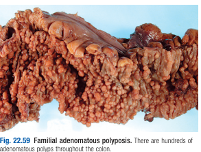
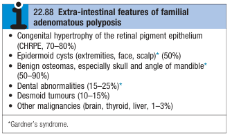

# Hereditary Colorectal Cancer Syndromes

## Familial adenomatous polyposis

- **Definition** - uncommon hereditary cancer syndrome characterised by inheritance of truncating LOF mutation of the APC gene
- **Epidemiology** - rare:
    - Prevalence - 1 in 13000 of population (accounts for 1% of all CRC)
- **Pathophysiology of FAP:**
    - <u>Inheritance of germline mutation of APC genes in AD fashion</u> - tumour suppressor gene that normally expressses protein that **inhibits beta-catenin translocation into nucleus** which up-regulate proliferative genes
    - <u>Second-hit inactivation of remaining allele</u> - second-hit somatic mutations occur along the colonic mucosa, resulting in formation of hundreds to thousnads of adenomatous colonic polyps (80% by age 15), which may manifest as PR bleeding
    - <u>Accumulation of somatic mutations</u> - carcinogenesis via **adenoma-carcinoma sequence** within 10-15y and 90% will develop colorectal cancer by \<50y (?often synchronous tumours)

  
  
- **Clinical features of FAP:**
    - Assymptomatic with +ve family Hx - identified through genetic testing of family members and subsequently worked up
    - PR bleeding (20%) - typically as chief complaint of cases where it arises as new mutations and have -ve FHx
    - Colorectal cancer - invariably will develop colorectal cancer during lifetime (hence prophylactic colectomy is offered)
    - Extra-colonic polyps:
        - Gastric polyps - typically non-neoplastic cystic fundic gland polyps, or uncommonly adenomatous polyps
        - Duodenal adenomas (90%) - most commonly seen around Ampulla of Vater, with 10% risk of malignant transformation (leading cause of death in patients with FAP after undergoing prophylactic colectomy)
    - Extraintestinal manifestations:
        - Desmoid tumours (33%) - benign tumours in the mesentry or abdominal wall that grow to large size capable of causing IO
        - Congenital hypertrophy of retinal pigmented epithelium - extremely predictive (100%) in at-risk individuals (i.e. individuals w/ +ve FHx)

    
    
- **Mx of new cases:**
    - **Early identification of new cases** (PR bleeding) - clinical suspicion on <u>sigmoidoscopy</u> and diagnosis is excluded if sigmoidoscopy returns normal
    - **Diagnostic genetic testing** - confirm diagnosis by identifying causal mutation
    - **Genetic testing of 1st-degree relatives**
- **Mx of family members:**
    - **Genetic testing** - done at age 13-14y to identify +ve individuals
    - **Prophylactic colectomy** - <u>total proctocolectomy with ileal pouch-anal anastamosis</u> affered after school education is complete
    - **Upper endoscopy** (q1-3y) - to detect, monitor or remove (via EMR) duodenal or peri-ampullary adenoma

## Hereditary non-polyposis colorectal cancer syndrome

- **Definition** - Hereditary cancer predisposition syndrome caused by inheritence of DNA mismatch repair genes, with a predisposition to colorectal cancer (80% lifetime risk), as well as cancers of the endometrium, ovaries, urinary trach, stomach, pancreas, SB and CNS
- **Epidemiology** - affects 5-10% of colorectal cancer
- **Clinical presentation** - suspect when there is a young presentation of colorectal cancer
    - Young colorectal cancer development - mean age around 45y
    - Site of colorectal cancer - 2/3 are located proximally (cf much of sporadic CRC arises in recto-sigmoid)
    - +ve family Hx
- **Diagnostic criteria** - <u>Amsterdam criteria for HNPCC</u> precludes presence of malignancy:
    - FHx:
        - \>= 3 relatives w/ colon cancer (at least 1 1st degree relative)
        - Colorectal cancer in 2 or more generations
        - At least 1 affected \< 50y
    - Clinical - FAP excluded
- **Mx** - for individuals with FHx of HNPCC:
    - Pedigree assessment, genetic testing - for family members
    - Routine colonoscopy (q1-2y) - since 25y, or 5-10y before youngest onset for +ve family members
