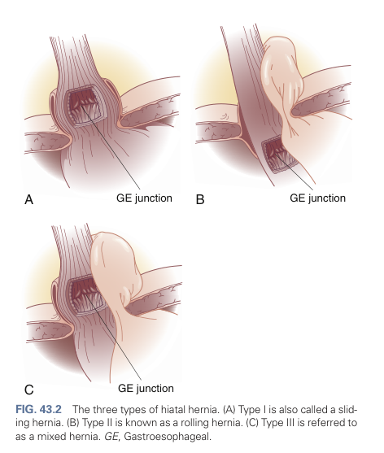

# Hiatal Hernia

- **Definition of hiatal hernia** - abnormal anatomy of the esophageal hiatus in associate with the esophagus that comprimises the efficaty of the LES, resulting in associates w/ GERD
- **Types of hiatal hernia** - Type I referred as Sliding Hiatal Hernia, while Type II-IV are known as paraesophageal hernia (PEH):
    - **Type I hernia** (sliding hernia) - OGJ migrates cephalad into the posterior mediastnium caused by laxity of the phrenoesophageal membrane
    - **Type II hernia** (rolling hernia) - migration of gastric fundus into mediastinum through hiatal defect, but OGJ is maintained intrabdominally
    - **Type III hernia** (mixed hernia) - both OGJ and gastric fundus migrates into the mediastinum
    - **Type IV hernia** - stomach and other visceral structures of the abdomen migrates cephalad to the esophageal hiatus and into the mediastinum

  
  
- **Indications of repair of PEH** - based on the size of hernia (large hernias have large risk of gastric volvulus) and the presence and severity of symptoms
- **Pathophysiology of PEH:**
    - **Two events facilitating the formation of a PEH:**
        - <u>Widening of diaphragmatic crura</u> - increased patency of the esophageal hiatus
        - <u>Stretching of the phrenoesophageal membrane</u> - results in laxity of membrane which balloons into the mediastinum to form a hernia sac
    - **Repeated episodes of viscera entering hernia sac** - adhesions develop between wall of hernia sac and structures of thoracic peritoneum, such that abdominal viscera becomes entrapped permanently within the mediastinum
    - **Onset of gastric volvulus** - caused by laxity of gastric peritoneal attachments and subsequent rotation of the gastric fundus on the organoaxial or mesenteric axis of the stomach (causes gastric strangulation)
- **Clinical presentation of PEH** - PEH is frequently associated with gastroesophageal obstruction symptoms and less frequently with typical symptoms of GERD:
    - <u>Dysphagia, odynophagia, early satiety, and post-prandial chest pain</u> - caused by obstruction at the OGJ caused by PEH
    - <u>Epigastric pain</u> - occurs during intermittent visceral torsion resulting in ischaemia of hernia contents, spontaneously reduction results in relieve of Sx
    - <u>UGIB</u> - arises during mucosal ischaemia or mechanical ulceration of gastric mucosa
    - <u>SOB</u> - respiratory symptoms related to local mass effect of hernia contents in the chest
    - <u>GERD symptoms</u> - heartburn and regurgitation ocassionally reported by patients
- **Ix and Dx evaluation** - workup as GERD, while Dx by typical findings on barium esophogram or OGD
- **Pre-operative evaluation:**
    - **Barium esophogram** - diagnostic and assess altered anatomy of PEH
    - **Upper endoscopy** - r/o other causes of Sx and evaluation of gastric and esophageal mucosa for mechanical gastric eroisions (Cameron ulcers) that can result in Barrett's esophagus and UGIB (require post-operative surveillence)
    - **High-resolution manometry** - documentation of esophageal peristaltic functions to guide the type of anti-reflux surgery performed
    - **Ambulatory pH monitoring** - documentation of any excessive esophageal acid exposure as a baseline for comparison in patients who have recurrent symptoms post-operatively
- **Mx** - not all hiatal repairs are treated operatively:
    - **Indications of operative repair** - large PEH, or symptomatic PEH
    - **Surgical Tx of PEH repair:**
        - **Principles of PEH repair:**
            - 1\. Reduction of hernia contents to the abdominal cavity
            - 2\. Complete excision of herenia sac from posterior mediastinum
            - 3\. Mobilisation of distal esophagus to achieve a minimum of 3cm of intrabdominal esophageal length
            - 4\. Antireflux procedure
        - **Approach to PEH reapair** - laparoscopic approach preferred:
            - Open vs laparoscopic
            - Left thoracotomy or abdominal
        - **Procedures:**
            - <u>Reduction of hernia contents into abdominal cavity</u> - performed with gentle traction, but often cannot be fully reduced due to presence of adhesions (in such cases, divide short gastric vessels to mobilise stomach)
            - <u>Excision of hernia sac</u>:
                - Plane of excision of hernia sac lies between phrenoesophageal membrane and esophagus
                - Dissection of the hernia sac anteriorly to free the stomach from mediastinal attachments
                - Dissection of the hernia sac posteriorly while avoiding injury to the esophagus and posterior vagus nerve
            - <u>Mobilisation of the esophagus to obtain a minimum of 3cm of intra-abdominal length</u> - followed by re-approximation of crura by tension-free repair:
                - Closure of esophageal hiatus by reapproximation of crura by interrupted non-reabsorbable suture
                - Closure of esophageal hiatus by some tension reinforced with biologic mesh
                - Closure of esophageal hiatus by relaxing incisions and closure by biologic mesh
            - <u>Antireflux surgery</u> - Nissen fundoplication preferred in all patients, except for those with severely ineffective motility or aperistaltic esophagus
