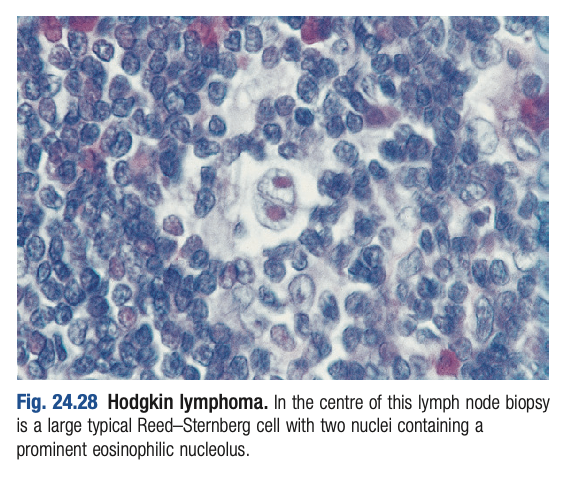
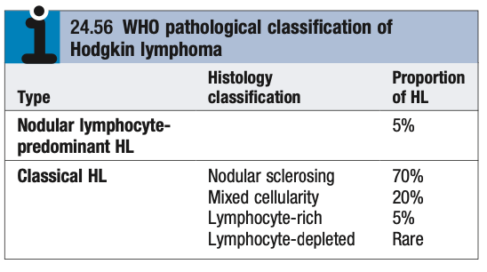
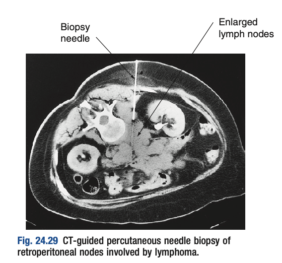
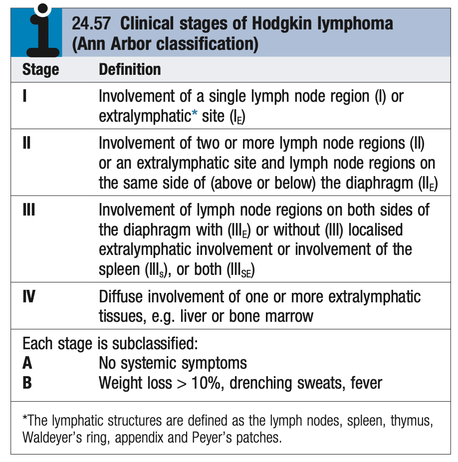
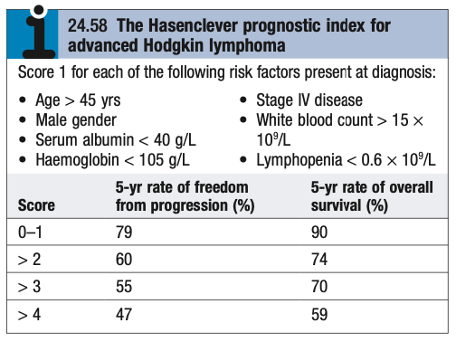

# Hodgkin Lymphoma

- **Definition** - clinical entity defined by the presence of Reed-Sternberg cells, which are large malignant lymphoid cells of B cell origins
- **Epidemiology of HL:**
    - <u>Incidence</u> - 4/100000/y
    - <u>Demographic</u>:
        - Age - median age 31y; bimodal distribution w/ first peak at 20-35y and second peak at 50-70y
        - Sex - slight male preponderance (M:F = 1.5:1)
- **Etiology of HL** - unknown, but from observation:
    - More common in patients from well-educated backgrounds and small families
    - 3x more likely w/ a past Hx of infectious mononucleosis but no definitive causal link to EBV proven
- **Histological hallmark of HL:**
    - <u>Reed-Sternerg cells</u> - large, multinucleated malignant lymphoid cells of B cell origin, with increased expression of IL-5
    - <u>Large number of reactive lymphocytes</u> - including non-malignant T cells, plasma cells and eosinophils

  
  
- **WHO classification of HL:**
    - **Classical HL** (95%):
        - Nodular sclerosing (most common in young patient and women)
        - Mixed cellularity (most common in elderly)
        - Lymphocyte-rich (most common in men)
        - Lymphocyte-depleted (likely represents large-cell or anaplastic NHL)
    - **Nodular lymphocyte-predominant HL** (5%) - indolent, slow-growing and better prognosis

  
  
- **Clinical features of HL:**
    - **Lymphadenopathy** - usually painless, fluctuates in size, and rubbery:
        - <u>Site</u>:
            - Cervical or suprclavicular LN
            - Bulky mediastinal disease in nodular sclerosing type, but surprisingly asymptomatic
            - Subdiaphragmatic node (10% isolated at presentation)
        - <u>Onset and progression</u> - fluctuates in size
        - <u>Quality</u> - painless and rubbery
        - <u>Pattern of spread</u> - contiguous spread; from one node to the next, and extranodal involvement is rare
    - **Abdominal mass** - hepatosplenomegaly occassionally present but does not alway indicate disease in those organs
    - **Constitutional B symptoms** - presence of unintentional weight loss, drenching night sweats and fever
- **Ix:**
    - **Routine bloods** - CBC, LRFT, ESR, LDH:
        - **CBC** - may be normal:
            - <u>NcNc anaemia</u> - poor prognostic factor
            - <u>Lymphopenia</u> - poor prognostic factor
            - <u>Neutrophila or eosinophilia</u> - principally reactive
        - **LFT:**
            - Derranged LFT may reflect underlying hepatic infiltration but also unrelated liver disease
            - Cholestatic pattern may reflect porta hepatis involvement
        - **RFT** - ensure normal function prior to Tx
        - **LDH** (reflects cellular turnover) - raised levels are a <u>poor prognostic factor</u>
        - **ESR** - non-specifically elevated
    - **Imaging** - CXR, CT T+A+P:
        - **CXR** - may show mediastinal widening and mass
        - **CT C+A+P** - for clinical staging (see below) and guidance of LN Bx
    - **LN Bx** - undergone surgically or under radiological guidance for <u>histological Dx</u>: 
    
- **Clinical staging of HL** - Ann Arbor classification: 

- **Mx:**
    - **Principles of Mx:**
        - **Stage-dependent Mx:**
            - <u>Early stage disease</u> (e.g. IA-IB disease) - treated w/ chemotherapy and adjuvant radiotherapy
            - <u>Advanced stage disease</u> - treated w/ chemotherapy alone
        - **Assessment of Tx response and recurrence** - consider autologous HSCT
    - **Standard chemotherapy for HL:**
        - <u>ABVD Regimen</u>:
            - Doxarubicin (Adriamycin)
            - Bleomycin
            - Vinblastine
            - Dacarbazine
        - <u>Cycles</u> - dependent on stage of disease:
            - Early stage disease - 4 courses (followed by adjuvant RT before reassessment)
            - Advance stage disease - 6-8 courses (followed by reasesessment of Tx response)
        - <u>Regimen specific S/E</u>:
            - Cardiotoxicity (Doxarubicin)
            - Pulmonary toxicity (Belomycin)
            - Infertility
            - Secondary neoplasia including MDS and AML
    - **Adjuvant radiotherapy** - indicated for early, localised disease (e.g. IA or IIA disease):
        - <u>Principles</u> - consolidation of Tx by irradiation of affected LN
        - <u>Long-term complications related to adjuvant radiotherapy</u>:
            - Increased risk of breast cancer if irradiation to chest (requires follow up screening)
            - Increased risk of lung cancer if irradiation to chest in smokers
    - **Assessment of Tx response** - CT T+A+P or PET-CT:
        - PET-negative remission predicts better long-term remission rates
        - Relapse may require additional chemotherapy
    - **Prognosis:**
        - <u>Rate of complete remission</u> - dependent on clinical stage:
            - 90% w/ early-stage HL achieve CR
            - 50-70% w/ advanced stage HL achieve cure
        - <u>Poor prognostic factors of HL</u>:
            - Aggressive clinical presentation (see Hasenclever index below)
            - Failed response to initial chemotherapy
            - Relapse within 1y
        - <u>Hasenclever index</u>: 
        
