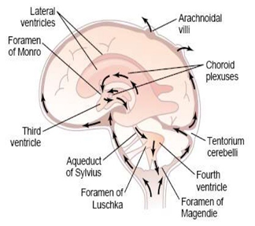

# Hydrocephalus

- **Definition** - Excessive accumulation of CSF in the brain due to increased production, flow obstruction, or reduced absorption
- **Normal CSF dynamics** - production, circulation, absorption:
    - <u>Production</u> (~450 ml/d) - produced by choroid plexus in the ventricles
    - <u>Circulation</u> - from lateral and 3rd ventricles, through cerebral aqueduct to 4th ventricles, exiting via foramina of Luschka and Magendie into subarachnoid space
    - <u>Absorption</u> - by arachnoid villi in the dural venous sinuses

  
  
- **Etiology of hydrocephalus** - congenital vs acquired:
    - **Congenital causes:**
        - Aqueductal stenosis
        - Atresia of various foramina
        - Chiari malformations
        - Dandy-Walker syndrome
        - Congenital mass lesions - e.g. benign intracranial cysts, vein of galen aneurysms
        - Congenital CNS infections
        - Neural tube defects
        - Craniofacial abnormalities
    - **Acquired causes:**
        - <u>Increased CSF production</u> - e.g. choroidal plexus papilloma
        - <u>Decreased CSF absorption</u> - inflammation (e.g. meningitis), SAH
        - <u>CSF flow obstruction</u> - mass lesion in posterior fossa (e.g. tumours, colloid cyst of 3rd ventricles, abscess, haematoma)
- **Clinical presentation of hydrocephalus** - variable (from insiduous onset to sudden death), and depends on age, and speed at which and degree to which hydrocephalus develops:
    - **Presentation in infants** - large head, tense fontanelle. sunset eyes, dilated scalp veins
    - **Presentation in adults:**
        - <u>Sx of raised ICP</u> - headache, N/V, visual disturbances, deterioration of consciousness
        - <u>Focal neurological deficits</u> - suggestive of cause
- **Ix and diagnostic evaluation** - neuroimaging on clinical suspicion:
    - **Neuroimaging** - for diagnosis of hydrocephalus, assessment of etiology, and differentiation between communicating vs non-communicating hydrocephalus:
        - **CT brain:**
            - <u>Findings suggestive of hydrocephalus</u> - 1) ventricular dilatation, 2) periventricular oedema, 3) altered morphology
            - <u>Differentiation between communicating and non-communicating hydrocephalus</u>:
                - **Communicating hydrocephalus** - hydrocephalus not caused by flow obstruction in the ventricular system (LP diagnostic and therapeutic)
                - **Non-communicating hydrocephalus** - hydrocephalus caused by flow obstruction in ventricular system especially by mass lesion (LP contra-indicated)
        - **MRI CSF studies** - can be obtained
    - **Lumbar puncture** - performed if communicating hydrocephalus, which is diagnostic and therapeutic:
        - <u>Diagnostic</u> - measurement of opening pressure
        - <u>Therapeutic</u> - trial drainage to offer symptomatic relief
- **Mx of hydrocephalus:**
    - **Principles of Mx:**
        - <u>Resuscitation first</u> - secure ABC as per ATLS
        - <u>Temporising measures</u> - LP (for communicating) or EVD (if doubtful or deteriorating)
        - <u>Definitive meausures</u>:
            - Treat underlying cause - e.g. tumour removal/ haematoma removal
            - CSF shunting - e.g. ventriculoperitoneal, ventriculoatrial
            - Endoscopic 3rd ventriculostomy
- **Complications of CSF shunting:**
    - Infections - primary or secondary
    - Recurrent hydrocephalus - due to blockade, dislodgement/ fracture
    - Chronic subdural haematoma - due to over-shunting (esp. bleeding tendancy)
    - Postural headache (worse when erect) 0 dye
    - Slit ventricle syndrome
    - Nephritis (VA shunting)
    - Bowel perforation (VP shunting)

## Normal Pressure Hydrocephalus

- **Definition** - controversial entity of dilated ventricles despite normal pressure
- **Epdeimiology** - disease of the elderly (mimicks neurodegenerative diseaess particularly AD)
- **Pathophysiology** - complex, related to intermittent rises in CSF pressure at night and abnormal brain compliance
- **Clinical features of NPH** - classical triad in elderly patients:
    - <u>Gait paraxia</u>
    - <u>Dementia</u>
    - <u>Urinary incontience</u>
- **Ix:**
    - **CT brain** - dilated ventricles
- **Mx** - good response to CSF diversion (consider other DDx if not respond to shunting)
