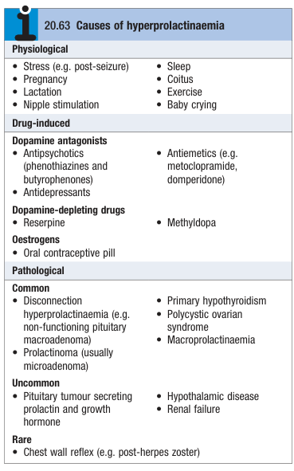

# Hyperprolactinaemia

- **Definition** - raised serum prolactin (PRL) level that usually presents w/ hypogonadism and/or galactorrhoea
- **Clinical features of hyperprolactinaemia:**
    - **Galactorrhoea** - lactation as prolactin stimulates milk secretion, but not breast development; only occurs in pre-menopausal women, and rarely occurs in men unless gynaecomastia induced by hypogonadism
    - **Hypogonadotrophic hypogonadism** - see detailed notes on amenorrhoea and male hypogonadism:
        - <u>Oligo- or amenorrhoea</u> - most common presenting Sx in women
        - <u>Decreased shaving frequency</u> - most common complaint in men
        - <u>Gynaecomastia</u> - usually a late feature of hypogonadism
        - <u>Loss of libido</u> - may be seen in both sex
- **DDx of hyperprolactinaemia** - classified into 1) physiological, 2) drug-induced, or 3) pathological:
    - **Physiological hyperprolactinaemia:**
        - Stress
        - Pregnancy
        - Breastfeeding
    - **Drug-induced hyperprolactinaemia:**
        - <u>Dopamine antagonists</u>:
            - Typical antipsychotics (e.g. phenothiazine, butyrophenones)
            - Antiemetics (e.g. metoclopramide, doperidone)
            - Antidepressants
        - <u>Dopamine-deleting drugs</u> - e.g. reserpine, methyldopa
        - <u>Estrogen</u> - COC pills
    - **Pathological hyperprolactinaemia:**
        - <u>Hypothalamic pituitary disease</u>:
            - Disconnection hyperprolactinaemia (e.g. non-functioning pituitary macroadenoma)
            - Prolactinoma
            - Co-secretory pituitary tumour
            - Hypothalamic disorders
        - <u>Other endocrinopathies</u>:
            - Primary hypothyroidism (TRF stimulates PRL secretion)
            - Polycystic ovarian syndrome
        - <u>Abnormal laboratory results</u> - macroprolactinaemia (common, but asymptomatic)
        - <u>Reduced excretion</u> - renal failure
        - <u>Increased stimulation</u> - chest wall reflex (post-herpes zoster)

  
  
- **Salient points of Hx:**
    - **HPI** - onset, duration, laterality, severity, recent pregnancy, or new pregnancy:
        - <u>Onset and duration</u> - characterise duration of Sx
        - <u>Laterality</u> - by definition bilateral, where unilateral galactorrhoea may be confused w/ nipple discharge and may raise suspicion of **breast pathologies**
        - <u>Severity</u> - extremely variable and is not a clinical indicator (may only be observed by manual expression)
        - <u>Recent pregnancy</u> - suggestive of lactation
        - <u>Possibility of new pregnancy</u> - can present as amenorrhoea +/- galactorrhoea
    - **Menstrual Hx:**
        - <u>LMP</u> - characterise **amenorrhoea** +/- likelihood of pregnancy
        - <u>Menstrual cycle and regularity</u> - heavy irregular periods suggestive of PCOS
        - <u>Menstrual flow</u> - previous heavy menstrual flow suggestive of PCOS
    - **Associated Sx:**
        - <u>Hypothyroid Sx</u> - primary hypothyroidism is an important cause of amenorrhoea and hyperprolactinaemia
        - <u>Sx of pitutiary tumour</u> - ask about local mass effect (e.g. headache, visual field defect), which may point towards a disconnect hyperproactinaemia (most prolactinomas are microprolactinomas)
        - <u>Sx of acromegaly</u> - aska bout sweating, change in shoe and ring size etc.
    - **Drug Hx** - detailed, noting COC pills, antiemetics, and psychiatric medications
    - **Relavent SHx and FHx**
- **P/E** - confrontation test +/- examination of the breast if unilateral nipple discharge
- **Ix:**
    - **Urine pregnancy test** - r/o pregnancy in women of child-bearing age especially if presenting w/ <u>amenorrhoea</u>
    - **Serum PRL level** - ULN typically 500 mU/L (14 ng/dL):
        - <u>Levels between 500-1000 mU/L</u> - likely physiological, induced by stress or drugs (repeat measurement indicated)
        - <u>Levels between 1000-5000 mU/L</u> - may be a microadenoma, or a pituitary tumour resulting in disconnect hyperprolactinaemia
        - <u>Levels \> 5000 mU/L</u> - extremely suggestive of macroprolactinaemia
    - **TFT** - screen for primary hypothyroidism
    - **Assessment of gonadal function** - FSH, LH, E2 shows <u>hypogonadotrophic hypognonadism</u>
    - **Pituitary hormone assessment** - FSH, LH, spot cortisol, ACTH, IGF-1 for screening of hypopituitarism
    - **MRI pituitary** - to detect pituitary adenoma
- **Macroprolactinaemia** - not to be confused w/ macroprolactinoma:
    - <u>Pathophysiology</u> - PRL usually circulates in free monomeric hormones in pasma:
        - **Expression of IgG Ab** - expressed in some individuals which complexes as macroprolactin
        - **Absence of physiological effects of macroprolactin** - too small to cross blood vessels to reach prolactin receptors, and hence has <u>non-pathological significance</u>
        - **Spurious detection by assays** - commercial prolactin assays do not distinguish prolactin from macroprolactin resulting in <u>spurious hyperprolactinaemia</u> (chromatography may be required to distinguish the two)
    - <u>Clinical significance</u> - clinical suspicion if absence of Sx
