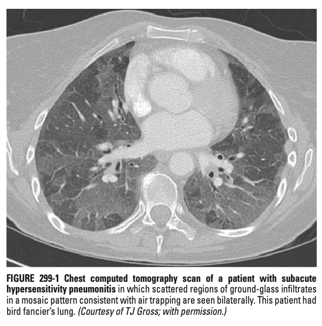
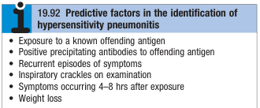

# Hypersensitivity Pneumonitis

- **Definition** - also known as extrinsic allergic alveolitis, a pulmonary disease caused by inhalational exposure to a variety of Ag leading to an inflammatory response in the alveoli and small airways
- **Epidemiology** - variable, and dependent on:
    - Geography
    - Occupation
    - Avocation
    - Environmental exposure
    - Smoking status (unexplained decreased risk of developing HP in smokers)
- **Offending inhaled Ag in HP:** 

- **High-risk exposures a/w HP:**
    - <u>Farmers</u> (Farmer's lung) - as a result of exposure to one of several possible sources of bacterial or fungal Ag such as grain, moldy hay, or silage (e.g. thermophilic actinomycetes or Aspergillus spp.)
    - <u>Birds</u> (Bird fancier's lung) - considered in patient who gives a Hx of keeping birds in home, or occupational exposure to poultry (poultry worker's lung), or is precipitated by exposure to Ag derived from feathers, droppings, and serum proteins
    - <u>Occupational chemical exposures</u> (Chemical worker's lung) - provoked by occupational chemical Ag such as diphenylmethane dissocyanate, toluene diisocyanate (e.g. spray-on paint)
- **Pathophysiology of HP:**
    - **Immune sensitisation** - repeated inhalation of Ag small enough to deposit in distal airways and alveoli:
        - <u>Sensitisation as a pre-requisite</u> - necessary for the presence of specific circulating IgG Ab for the development of HP
        - <u>Sensitisation is insufficient to precipitate HP</u> - as evident by the fact that not all sensitised individuals develop HP; hence detectiion of specific IgG is not sufficient as a defining characteristic of disease
    - **Immune dysregulation** - likely reflects a type III (IC formation) or type IV (cell-mediated) hypersensitivity reaction:
        - <u>Dysregulated T cell response</u> - increased Th1 and Th17 immune responses
        - <u>Ab driven response</u> - IgG Ab against specific Ag in HP
        - <u>Innate immune mecanisms</u> - prominent neutrophil recruitment as in observation that TLR and downstream signalling proteins are activated during course of HP
- **Approach to classification of clinical presentation of HP** - highly variable among 1) patients, 2) offending antigens, and 3) differences in intensity and duration of exposure:
    - <u>Classification by chronicity</u> - acute, subacute, and chronic
    - <u>Bipartite classification by fibrosis</u> (HP study group) - fibrotic vs non-fibrotic
- **Clinical features of HP** - usually variable composition of the following features:
    - <u>Systemic manifestations</u> - fever, chills, malaise
    - <u>Respiratory manifesations</u> - dyspnoea, dry cough
- **Classical presentation of acute HP:**
    - Prominent systemic Sx accompanied by respiratory Sx within hours (4-8h) after exposure to the offending Ag
    - Rapid resolution of Sx <u>within hours or days</u> if no further exposure to offending Ag occurs
    - Generally characterised by a recurrent and episodic S/S w/ exposure pattern
- **Classical presentation of subacute HP** - accumulation of intermittent episodes of HP:
    - May be preceeded by repeated episodes of acute HP
    - Respriatory Sx generally more marked in those w/ subacute HP
    - Resolution of Sx eentually occurs but at a slower time course (<u>within weeks to months</u>)
- **Classical presentation fo chronic HP:**
    - Usually in the absence of an anteceding episode of acute HP
    - Insiduous onset of respiratory Sx, such as cough, and progressive dyspneoa
    - Systemic manifestations include fatigue and weight loss
    - <u>Clinical cough similar to IPF</u> if undiagnosed and responsible Ag is not avoided
- **Ix** - when HP is suspected by Hx, additional workup aimed at establishing immunological and physiological response to inhaled antigen exposure:
    - **CXR** - often non-specific and can even lack any discernible abnormalities:
        - <u>Non-fibrotic HPs</u> - transient findings, that will resolve w/ removal of offending antigen (time course varies) include:
            - Ill-defined micronodualr opacities
            - Hazy ground-glass airspace opacities
        - <u>Fibrotic HPs</u> - reticulonodular shadowing (indistinguishable from IPF)
    - **High-resolution computed tomography** (HRCT):
        - <u>Non-fibrotic HPs</u> - fleeting changes may occur:
            - Completely normal HRCT may occur due to lack of temporal correlation between imaging and exposure to offending Ag
            - Ground glass opacities (UL and ML preponderance) and centrilobular nodules in patchy mosaic pattern are characteristic
            - Air trapping on expiratory films

      
      
        - <u>Fibrotic HPs</u> - persistent changes:
            - Reticular changes (i.e. ?interlobular and intralobular septal thickening)
            - Tractional bronchiectasis
            - Subpleural honeycombing (lung bases usually spared unlike in IPF)
    - **Pulmonary function testing:**
        - Either restrictive or obstructive lung functions can be present hence not useful for establishing the Dx of HP
        - Impaired DLCO is the prominent change in cases of fibrotic HP w/ pulmonary parenchymal changes
        - Typically used as establishing a baseline physiological impairment, and gauging response of Ag avoidance +/- corticosteroid therapy
    - **Serum precipitins panels** - detection of specific IgG against known offending Ag as an <u>adjunct to Dx</u>:
        - Requires clinical correlation in +ve results, as many asymptomatic individuals w/ high level of exposure may display specific IgG
        - Risk of FN results as panels represent an extremely limited proportion of the potential offending environmental Ag
    - **Bronchoscopy and BAL:**
        - <u>BAL lymphocytosis</u> - presence of lymphocytosis is characteristic of HP (although lower threshold necessary for smokers as typically lower lymphocyte levels)
        - <u>BAL CD4+/CD8+ ratio</u> - typically \< 1 in HP (non-specific findings, only serving as an adjunct to Dx)
    - **Lung Bx** - may be taken using transbronchial or open approach:
        - <u>Well-defined, noncaseating granulomas</u> adjacent to airways
        - <u>Lymphocyte-predominant infiltrates</u> in the alveolar space and interstitium w/ a <u>patchy distribution</u>
        - <u>Bronchiolitis</u> w/ organising exudates often observed
        - <u>Fibrosis</u> ay be focal or diffuse depending on extent of disease
    - **Re-exposure to offending environment** - may be pursued to confirm Dx
- **Predictors of HP** - clinical prediction rule by HP study group suggests 6 statistically significant exposures:
    - Exposure to Ag known to cause HP (strongest associations)
    - Presence of serum precipitins
    - Recurrent Sx
    - Sx occuring 4-8h after Ag exposures
    - Crackles on inspiration
    - Weight loss

  
  
- **DDx of HP:**
    - <u>Lower respiratory tract infections</u> - usually single episode and a shorter Hx, w/ absence of possible exposure of offending Ag (TOCC may be +ve or -ve)
    - <u>Interstitial lung disease</u> - esp for idiopathic interstitial pneumonias such as IPFs and NSIPs w/ no known cause of ILDs, in fact, difficult to distinguish even on lung Bx
    - <u>Sarcoidosis</u> - esp both causing non-caseating granulomas, but sarcoidosis is a/w marked hilar adenopathy seen on CXR +/- systemic involvements (e.g. hyperCa)
    - <u>Other inhalation syndromes</u> - e.g. organic toxic dust syndrome (OTDS)
- **Mx:**
    - **Principles of Mx:**
        - <u>Allergen avoidance</u> - requires detailed exposure Hx to identify offending agent and location where exposed, w/ various approaches to minimise exposure
        - <u>Corticosteroid therapy</u> - typically reserved for patients w/ severe Sx for earlier resolution of Sx
        - <u>Antifibrotic agents</u> - trial of nintedanib or pirfenidone may be considered
    - **Allergen avoidance:**
        - <u>Removal of offending agents</u> - removal of birds, removal of molds, improve ventilation
        - <u>Personal protective equipments</u> - respirators and ventilated helmets may be used but may not provide adequate protection in sensitized individuals
        - <u>Complete avoidance of specific environments</u> - as last-resort measures taking into account of lifestyle and occupation
    - **Corticosteroid therapy:**
        - <u>Indications</u>:
            - Non-fibrotic HPs - for those w/ severe Sx or failed allergen exposure for acceleration of resolution of Sx
            - Fibrotic HPs - trial of corticosteroids aimed at Tx variable components of non-fibrotic HP which may be reversible
        - <u>Dosing</u> - 0.5-1mg/kg/d PO prednisolone (maxium of P60) over 1-2 weeks, w/ taper over the next 2-6 weeks
- **Prognosis:**
    - <u>Non-fibrotic HPs</u> - good prognosis w/ allergen avoidance
    - <u>Fibrotic HPs</u> - poor prognosis paralleling mortality rates of IPF
