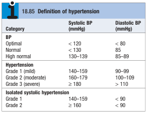
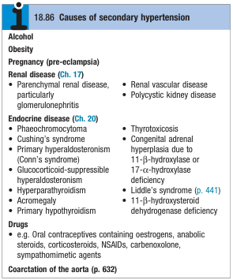
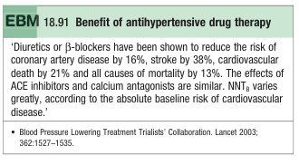
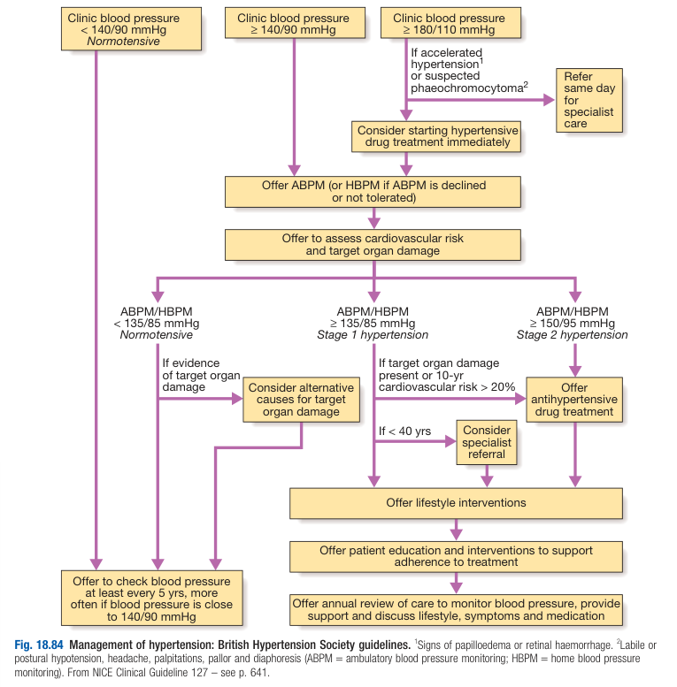
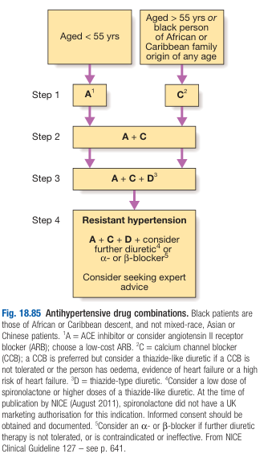
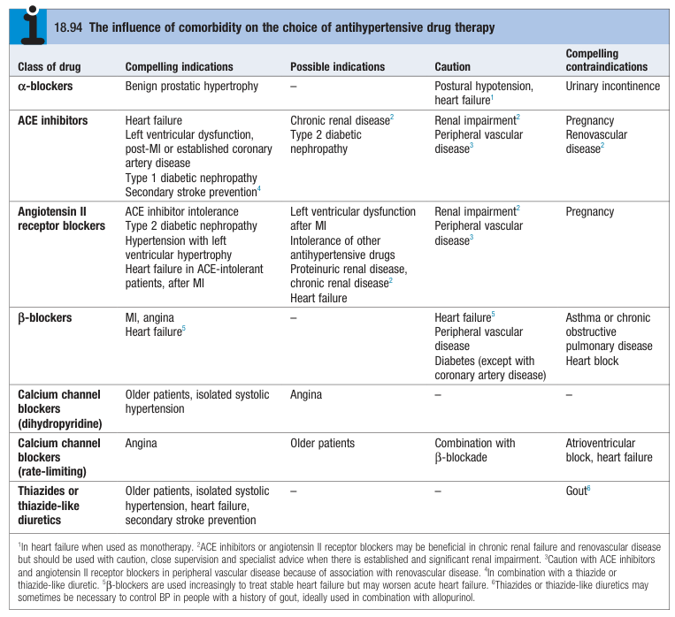

# Hypertension

- **Definition and terminology** - HTN is arbitrarily defined as BP within a population varies within a continuum, and are determined by mechanical, hormonal and environmental factors:
    - <u>Theoretical definition of HTN</u> - a cardiovascular syndrome where elevated systemic BP is a/w target organ damage, including an elevation of atherosclerotic cardiovascular risk
    - <u>Practical definition of HTN</u> - the level of BP at which the benefits of Tx in terms of risk reduction outweighs the cost and hazards
    - <u>Objective definitions of HTN as proposed by ECS</u> - abnormally high BP \>= 140/90 mmHg on 2-3 ocassions: 
        
        
- **Etiology of HTN** - 95% are essential HTN:
    - <u>Essential HTN</u> (95%) - HTN in which a **specific underlying cause is not found**, and is likely attributed to multifactorial cause including biological and environmental cause
    - <u>Secondary HTN</u> (5%) - HTN that is caused by a specific disease or abnormality leading to Na retention and/or peripheral vasoconstriction: 
        
        
- **Clinical manifestations of HTN** - most are asymptomatic and Dx is usually made at routine workup or after TOD
- **Target organ damage** (TOD):
    - **Vascular** - perpectuate and aggravate HTN, and is a major risk factor of vascular pathologies
        - <u>Increased peripheral vascular resistance</u> - reduced compliance in larger vessels due to thickening of internal elastic lamina, hypertrophied VSMC, and fibrous tissue deposition, where reduced renal blood flow further exacerbates such structual change due to RAAS activation
        - <u>Hyaline arteriosclerosis and anuerysm formation</u> - reduced lumen size and thinned walls resulting in microaneurysm formation in small vessels
        - <u>Widespread atheromatous changes</u> - especially if other risk factors are present (e.g. smoking)
        - <u>Aortic pathologies</u> - HTN plays major role in pathogenesis of aortic aneurysms, and aortic dissection
    - **Neurological:**
        - <u>Stroke</u> - may be due to haemorrhagic or ischaemic stroke (carotid stenosis and TIAs are more common in hypertensive pateint)
        - <u>Hypertensive encephalopathy</u> - rare condition a/w high BP and transient neurological Sx
    - **Retinal** - non-invasive assessment of TOD:
        - <u>Hypertensive retinopathy</u> - grading system as an indication of arteriolar damage elsewhere
        - <u>Central retinal vein thrombosis</u> - blurred vision due to CRVO
    - **Cardiac** - morbidity and mortality a/w HTN is largely due to cardiovascular complications (largely due to higher incidence of CAD):
        - <u>Coronary artery disease</u> - higher incidence among hypertensive patients as it is a modfiable risk factor of atherosclerosis
        - <u>Atrial fibrillation</u> - common due to diastolic dysfunction or effects of CAD
        - <u>Heart failure</u> - severe HTN can cause HF in absence of coronarya rtery disease especially in poor renal function
    - **Renal** - causes hypertensive nephropathy resulting in proteinuria and progressive renal failure
- **Measurements of BP:**
    - **Types of BP measurements:**
        - <u>Office BP</u> - taken by sphygmomanometer by clinicial, but may be unrepresentative ('White coat HTN')
        - <u>Home BP</u> - taken by automated devices at home
        - <u>Ambulatory BP</u> - series of automated BP measurements taken over 24h providing better profile and has better correlations to TOD
- **Approach to suspected newly diagnosed HTN** - initial evaluation of patient w/ high BP:
    - <u>Acurrate, representative measure of BP measurements</u> - BP measurements can be taken in ambulatory or home setting
    - <u>Targeted Hx, P/E and Ix</u> - aims to:
        - Identify contributary factors to HTN
        - Identify potential secondary HTN
        - Identify other risks factors of atherosclerosis and assessment of 10y cardiovascular risk
        - Identify complications (target organ damage) that is already present
    - <u>Mx</u> - balance benefits and risks of antihypertensive therapy and look for comorbidities that influence choice of antihypertensives
- **Salient point of Hx in suspected HTN:**
    - <u>Secondary HTN</u> - elicit Hx of other causes of secondary HTN:
        - Phaeochromocytoma - paroxysmal headaches, swewating, palpitations
        - Drug-induced HTN - oestrogen, steroids, NSAIDs, sympathomimetic agents, carbenexolone
        - Alcohol-induced HTN - assess alcohol intake
    - <u>Lifestyle factors</u> - e.g. smoking, alcohol, exercise, diet (esp. salt intake)
    - <u>Complications of target organ damage</u> (TOD):
        - Coronary artery disease - angina and breathlessness
        - Hypertensive retinopathy and retinal vein occlusion - blurred vision
        - Peripheral arterial disease - intermittent claudication
        - Stroke - one-sided weakness/ numbness
    - <u>Comorbidities</u> - e.g. Hyperlipidaemia, DM, renal dysfunction etc.
- **P/E** - general and cardiovascular examination to look for signs of secondary HTN, complications and comorbidities:
    - **General examination:**
        - <u>General appearance and habitus</u> - e.g. thyrotoxicosis, Cushing's syndrome, central obesity (independent risk factor for ASCVD)
        - <u>Signs of hyperlipidaemia</u> - e.g. xanthalesma, tendon xanthoma
    - **Cardiovascular examination** - non-specific findings related to TOD to heart:
        - <u>Palpation</u> - displaced apex, apical heave
        - <u>Auscultation</u> - accentuation of S2, 4th heart sound, basal creps
    - **Fundoscopic examination** - grading of hypertensive retinopathy, detection of CRVO:
        - Silver wiring
        - Arteriovenous nipping
        - Dot blot haemorrhage
        - Cotton wool exudates
        - Papilloedema
    - **Examination of arterial system** - assess rate, rhythm (e.g. AF), and peripheral LL limb pulses (see notes on PAD)
- **Ix** - all hypertensive patients should undergo limited number of Ix, with additional Ix for selected patients:
    - **Urinalysis** - for blood, protein and glucose
    - **Routine bloods** - RFT, FBG, lipid profile, thyroid function tests:
        - **RFT:**
            - <u>Urea and Cr</u> - detect renal impairments
            - <u>K, HCO3-</u> - hypokalaemic alkalosis may indicate secondary HTN (e.g. primary hyperaldosteronism), but is usually due to diuretic therapy
        - **FBG** - detection of undiagnosed DM to determine whether secondary prevention is necessary
        - **Lipid profile** - TC:HDL-C ratio to assess 10y cardiovascular risk
        - **TFT** - thyroid heart disease as a cause of secondary HTN
    - **12-lead ECG** - assessment of established CAD (e.g. Pathological Q waves and BBB reflecting old MI), and chamber enlargements (esp. LVH)
    - **Additional Ix** - for suspected secondary HTN or target organ damage:
        - <u>CXR</u> - detect cardiomegaly, heart failure, and coarctation of aorta
        - <u>Echocardiogram</u> - to detect or quantify LVH
        - <u>Ambulatory BP recording</u> - to assess borderline or 'white coat' HTN
        - <u>Renal USG</u> - to detect possible renal disease
        - <u>Renal angiography</u> - to detect and confirm presence of RAS
        - <u>Urinary catecholamines</u> - to detect possible phaeochromocytoma
        - <u>Urine cortisol and dexamehtasone suppression test</u> - to detect possible Cushing's syndrome
        - <u>PRA and aldosterone</u> - to detect possible primary aldosteronism
- **Dx of HTN** - based on abnormal BP as defined by \> 140/90 mmHg on several occassions
- **Mx:**
    - **Principles of Mx:**
        - <u>Improved prognostication as primary goal of Mx</u> - reduce the incidence of adverse cardiovascular events, particularly CAD, stroke, HF, cardiovascular mortality and all-cause mortality
        - <u>Benefits of antihypertensive Tx greatest in those of highest risk</u> - relative risk (RR) reduction for major complications, namely stroke (RR 0.7) and CAD (RR 0.8) is seen in all patient groups, such that the **greatest absolute risk reduction** is seen in those w/ **highest risk of ASCVD** (MRC Mild HTN Trial 1985): 
        
        - <u>Formal estimation of total cardiovascular risk</u> - risk of total cardiovascular risks (including ASCVD, stroke, HF etc.) is estimated by multiplying 10y CVD risk by 4/3 (see notes on atherosclerosis)
        - <u>Thresholds for pharmacological intervention</u>:
            - **Stage 2 HTN** - ABPM/ HBPM \>= 150/95 mmHg
            - **High risk for CVD** - 10y CVD risk \> 20% based on risk charts in non-diabetic, and in patients w/ DM or pre-existing CVD
            - **Presence of TOD** - renal or retinal as most evident causes
			  
			  
        - <u>Treatment targets</u> - optimal BP control for reduction of MACE while balancing S/E:
            - **Non-diabetic patients** - BP \< 139/83 mmHg
            - **Diabetic patients** - BP \< 130/80 mmHg
        - <u>Routine follow-up</u> - 3mo intervals for patients on antihpertensives for BP monitoring, minimisation of S/E and reinforcement of lifestyle advices
    - **Non-pharmacological therapy** - lifestyle modification:
        - **Role of lifestyle modifications:**
            - Obviate the need for drug therapy in patients w/ borderline HTN
            - Reduce number of doses/ drugs required in patients requiring antihypertensive therapy
            - Overall reduction of cardiovascular risks
        - **Approach to lifestyle modifications** - lifestyle modifications aimed at BP lowering and overall reduction of CVD risk:
            - <u>Lifestyle modifications for BP lowering</u>:
                - Diet - restricting salt intake, increasing consumption of fruits and vegetables
                - Alcohol - reducing alcohol intake
                - Body weight - correcting obesity
                - Physical activity - regular physical exercise
            - <u>Additional lifestyle modification for reduction of CVD risk</u>:
                - Smoking cessation
                - Mediterranian diet
                - Diet low in saturated fats
    - **Antihypertensive therapy:**
        - **Choice of antihypertensive therapy** - selection of initial agent dependent on <u>evidence-based guidelines</u> (age and ethnicity, cost and effectiveness), and <u>comorbid conditions</u>:
            - **Prevailing evidence:**
                - <u>Efficacy of different classes</u> - trials demonstrated ACEi/ ARB (A), CCBs (C) and thiazides (D) have no significant differences in outcomes, but BBs (B) has weaker evidence basis and is thus **not considered first-line Tx**
                - <u>ACEi preferred in younger agents</u> - NICE guidelines suggests use in \< 55y patients
                - <u>CCBs preferred in older patients or black individuals</u> - NICE guidelines suggests CCBs as initial agent
                
                
            - **Comorbid conditions** - selection of agents is dependent on presence of compelling indications (note that BPH is no longer a compelling indication for alpha-blockers alone): 
	            
	            
        - **Combination therapy vs monotherapy** - reduction of S/E while drug combinations may have complementary and synergistic effects
        - **ACE inhibitors and angiotensin receptor blockers:**
            - <u>Selection</u>:
                - ACEi - enalapril 20mg, ramipril 5-10mg, lisinopril 10-40 mg
                - ARB - irbesartan 150-300 mg, valsartan 40-160 mg, losartan
            - <u>MOA</u> - inhibition of AngII-mediated vasoconstriction and fluid retention via aldosterone release
            - <u>S/E</u>:
                - Cough - intractable cough in use of ACEi, but not in ARB
                - Angioedema - ACEi can precipitate worsening angioedema in especially in those with chronic spontaneous urticaria
                - First-dose Hypotension - especially in patients w/ hypovolaemia, hyponatraemia, and hypotension (generally safe to prescribe if SBP \> 100 mmHg)
                - Hyperkalaemia - reduced aldosterone mediated K tubular excretion
                - Renal dysfunction - precipitate pre-renal AKI in those w/ impaired renal function or renal artery stenosis by reduction of renal blood flow and filtration pressure
        - **Calcium channel blockers:**
            - <u>Selection</u> - DHP safer than non-DHP:
                - DHP-CCBs (vascular selective) - amlodipine 5-10 mg, nifedipine 30-90 mg
                - Non-DHP-CCPs (cardio selective) - diltiazem 200-300 mg, verapamil 240 mg
            - <u>MOA</u>:
                - Peripheral vasodilation for vascular selective CCBs
                - Rate-limiting for cardioselective CCBs
            - <u>Considerations</u>:
                - DHP-CCBs are generally safer and well-tolerated, especially in older patients
                - Non-DHP-CCBs are a/w more severe S/E (bradycardia, HF) but can be considered if HTN is a/w angina
            - <u>S/E</u>:
                - Postural hypotension - due to vasodilation
                - Oedema and fluid retention - increased vascular permeability (consider diuretics if not tolerated)
                - Palpitations - due to reflex tachycardia from potent reduction in PVR through baroreceptor reflex
                - Flushing - due to increased cutaneous blood flow
                - Constipation - specific S/E of <u>verapamil</u>
        - **Thiazide diuretics** - little benefit of loop diuretics unless substantial renal dysfunction:
            - <u>Selection</u> - e.g. bendroflumethiazide 2.5mg, cyclothiazide 0.5mg
            - <u>MOA</u> - not well understood, but maximal effect takes up to 1mo to be observed
            - <u>S/E</u> - gout
        - **Beta-blockers** - no longer 1st-line due to weaker evidence unless in presence of compelling indications such as angina and HF:
            - <u>Selection</u>:
                - Selective beta-1 blockers - Metoprolol 100-200 mg, atenolol 50-100 mg, bisprolol 5-10 mg
                - Beta-and alpha-1 blockers - labetalol 200-2400 mg in divided doses, carvedilol 6.25-25 mg bid
            - <u>S/E</u>:
                - Bronchospasm - contraindicated in asthma or COPD
                - Bradyarrhythmias - especially if AV block
        - **Other drugs:**
            - <u>Alpha blockeres</u> - prazosin, indoramin, doxazosin
            - <u>Venodilators</u> - hydralazine, minoxidil
    - **Adjuvant drug therapy:**
        - <u>Aspirin</u> - requires balancing risk of reducing CVD risk but increases risk of bleeding, generally thought that <u>benefits outweigh the risks</u> in 1) older patients (\> 50y) who at baseline have higher CVD risk, 2) DM, 3) Evidence of TOD, 3) 10y CVD risk \> 20%
        - <u>Statins</u> - strongly indicated if established vascular disease (secondary prevention) and HTN with \> 20% 10y CVD risk (primary prevention)
    - **Approach to refractory HTN:**
        - Drug compliance
        - Inadequate therapy
        - Secondary HTN
