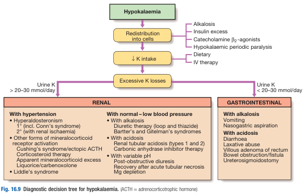
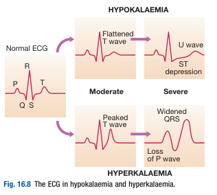
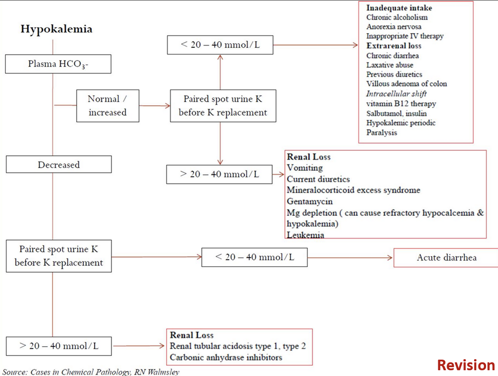
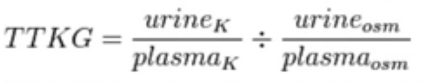

# Hypokalaemia

- **Definition** - plasma K levels \< 3.5 mmol/L
- **Etiology of hypoK:** 

    - **Insufficient intake** - diet (esp. elderly), inappropriate IV therapy
    - **Redistribution into cells** - normal total body K:
        - Alkalosis
        - Beta-2 adrenergic agonist - e.g. salbutamol
        - Insulin excess
        - Hypokalaemic periodic paralysis
    - **Excessive renal K loss** (Urine K \> 30 mmol/d):
        - <u>Excessive minerocorticoid stimulation</u> - increased ROMK insertion:
            - Primary hyperaldosteronism (Conn syndrome)
            - Secondary hyperaldosteronism
            - Cushing's syndrome/ Ectopic ACTH syndrome (including corticosteroid therapy)
            - Apparent minerocorticoid excess
            - Liquorice/ carbenoxolone - inhibition of renal 11-beta-HSD2 enzyme, resulting in increased half-life of cortisol
        - <u>Excessive Na delivery to late DCT and collecting ducts</u> - increased K secretion due to increased Na reabsorption in DCT:
            - Diuretic therapy (loop and diuretics)
            - Carbonic anhydrase inhibitor (Acetazolamide)
            - Bartter's syndrome (loop of Henle dysfunction)
            - Gitelman's syndrome (early DCT dysfunction with Na/Cl exchanger)
            - Distal (Type 2) RTA - impaired HCO3- reabsorption in PCT prevents Na reabsorption and increase Na delivery to DCT
        - <u>Excessive -ve potential gradient</u> - -ve potential gradient draws K into lumen:
            - Liddle's syndrome (ENaC mutation) - overactive ENaC activity in DCT results in excessive secretion of K for balancing
            - Distal (Type 1) RTA - impaired H+ secretion in DCT, such that K is predominantly secreted to balance -ve potential intraluminally
        - <u>Miscellaneous dysfunction of renal tubules</u>:
            - Post-obstructive diuresis
            - Recovery phase of ATN
            - Mg depletion
    - **Excessive gastrointestinal loss** (Urine K \< 20 mmol/d):
        - <u>Upper GI loss</u> (a/w alkalosis) - vomiting, NG aspiration
        - <u>Lower GI loss</u> (a/w acidosis) - diarrhoea, laxative abuse, villous adenoma, bowel obstruction/ fistulation, ureterosigmoidostomy for neobladder post-cystectomy
- **Clinical features of hypoK:**
    - <u>Asymptomatic</u> - patients w/ mild hypoK (3.0-3.3 mmol/L) are generally asymptomatic, with Sx a/w more profound hypoK (often \< 3 mmol/L)
    - <u>Muscle weakness and fatigue</u> - due to the reduced excitability of skeletal muscle tissues (hyperpolarisation of membrane potential)
    - <u>Arrhythmias</u> - <u>ventricular ectopic beats</u> become more common due to prolonged AP and increased susceptibility of **afterdepolarisations**, and <u>tachyarrhythmias</u> (AF, AFlu, SVT, VT, VF, TdP) due to **increased risk of ectopic firing and re-entry** (digoxin toxicity potentiated)
    - <u>Functional bowel obstruction</u> - occurs due to paralytic ileus presenting with abdominal pain, constipation and obstipation, abdominal distension +/- N/V
    - <u>Nephrogenic diabetes insipidus</u> - long-standing hypoK results in renal tubular damage (hypokalaemia nephropathy) interferring w/ tubular response to ADH
- **ECG changes in hypoK:**
    - Flatten T wave
    - ST segment depression and U wave

  
  
- **Approach to hypoK:** 

    - **Hx** - Sx of hypoK, detailed Hx for GI fluid loss, detailed drug Hx, detailed PMH
    - **P/E** - principally detect hydration status, BP and access risk of arrhythmia
    - **Ix:**
        - <u>ECG</u> - risk of arrhythmia
        - <u>RFT</u> - plasma electrolytes (Na), HCO3 +/- Ca, Mg, Cl
        - <u>Urinalyis</u> - urine K +/- Cl
        - <u>Plasma renin activity</u> - only during work up for Conn's syndrome
- **Transtubular K gradient** - differentiates renal K loss, and is more accurately defined as a proxy for <u>minerocorticoid activity</u>: 

    - <u>Assumptions</u> - transtubular K gradient cannot be interpreted unless:
        - Urine Osm \> Serum Osm
        - Urine Na \> 40
        - No added K
    - <u>Interpretations</u> - must be interpreted in a hypoK context:
        - TTKG \> 7 - indicated excess minerocorticoid excess and as a result renal K loss
        - TTKG \< 3 - suggestive that kidney is appropriately conserving K in face on of hypoK
- **Mx:**
    - **Principles of Mx:**
        - <u>Dx and correction of reversible causes</u> - e.g. treat reversible causes (e.g. redistribution, alkalosis, drug-related causes)
        - <u>K replacement</u> - in forms of slow-release KCl tablets, but may require IV KCl in acute settings
        - <u>Mg depletion</u> - required if Mg found to be depleted
        - <u>K sparing diuretics</u> - able to S/E of diuretics while providing necessary diuresis
    - **K replacement:**
        - <u>Slow-releasing K tablets</u> - typically suffices
        - <u>IV KCl infusion</u> - only in acute circumstances w/ rate of administration dependent on severity (\< 10 mmol/h) +/- continuous cardiac monitoring
