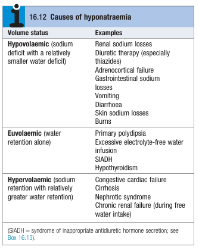
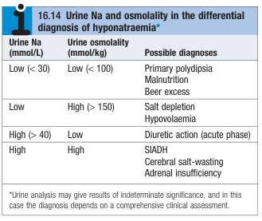

# Hyponatraemia

- **Definition** - plasma Na level below LLN (\< 135 mmol/L) that reflects <u>relative excess of water in plasma relative to total body Na</u> (more precisely Na in ECF), not Na depletion
- **Clinical features of hypoNa** - depends on the speed at which hypoNa develops rather than severity:
    - **Asymptomatic** - especially in those with chronic hypoNa, which is mild in severity
    - **Profound disturbances of cerebral function** - reflecting underlying cerebral oedema:
        - <u>Features of raised ICP</u> - N/V, headache
        - <u>Progressive deteriorating GC</u> - agitation, lethargy, anorexia, coma
        - <u>Seizures</u>
- **Etiology of hypoNa** - classified by volume status: 

    - **Hypovolaemic hyponatraemia** (depletional hypoNa) - loss of Na containing fluid resulting in severe volume contraction, and a subsequent ADH response:
        - <u>Renal sodium loss</u> - diuretic therapy (esp. thiazides), minerocorticoid deficiency (Addisonian crisis), salt-losing nephropathy, cerebral salt-wasting syndrome
        - <u>Gastrointestinal Na loss</u> - vomiting, diarrhoea, NG sunction, external fistulaes
        - <u>Skin sodium loss</u> - excessive sweating, burns
    - **Euvolaemic hyponatraemia** - free water retention alone due to excessive water intake or inappropriate ADH secretion in face of normo-volaemia and normo-osmolality:
        - <u>Excessive water intake</u> - primary polydipsia, beer excess, excessive electrolyte-free water infusion, TURP syndrome
        - <u>Inappropriate water retention</u> - hypothyroidism, Cortisol deficiency (extreme physiological stress), SIADH
    - **Hypervolaemic hyponatraemia** - sodium retention, with additional free water retention due to stimulation of ADH axis:
        - Congestive heart failure
        - Cirrhosis and portal HTN
        - Nephrotic syndrome
        - Chronic kidney disease
- **Approach to diagnostic evaluation of hypoNa:**
    - <u>Assessment of volume status</u> - stratify into hypovolaemic, euvolaemic and hypervolaemic hyponatraemia, where hypovolaemia and hypervolaemia are treated as Na depletion and retention respectively, while euvolaemic hyponatraemia requires further workup
    - <u>Further plasma and urine electrolytes and osmolalities</u> - used to differentiate different types of euvolaemic hyponatraemia
    - <u>Additional confirmatory Ix</u> - e.g. early morning cortisol, TFT, CT brain
- **Approach to Ix:**
    - **Serum osmolality** - confirm true hypoNa where serum osmolality \< 285 mOsm:
        - <u>Hypo-osmolar</u> - true hypoNa
        - <u>Normo-osmolar</u> - factitious hypoNa due to increased TG or protein levels (e.g. paraproteinaemia)
        - <u>Hyper-osmolar</u> - hyper-osmolar states such as hyperglycaemia (e.g. DKA/ HHS) and mannitol infusion
    - **Urine Na and Osm** - differentiate between renal or extrarenal water gain:
        - <u>Low urine Na (\< 30), Low urine Osm (\< 100)</u> - extra-renal water gain
        - <u>High urine Na (\< 30), High urine Osm (\> 150)</u> - renal water gain, which may be SIADH, cortisol insufficiency, hypothyroidism

    
    
    - **TFT, early morning cortisol** - r/o other causes of hypoNa
