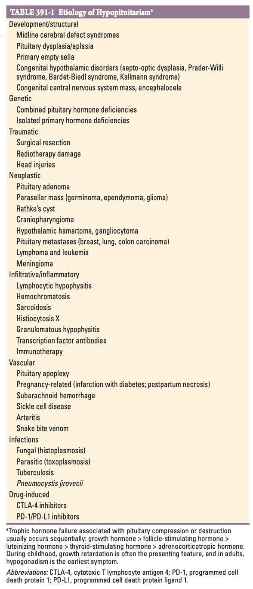
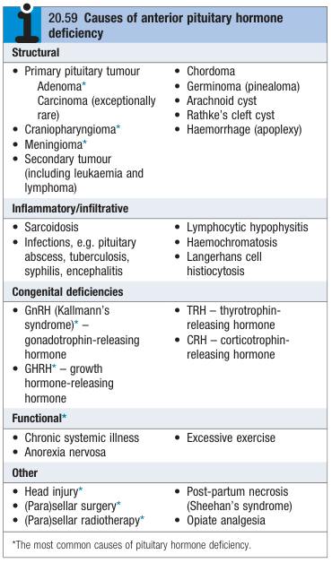
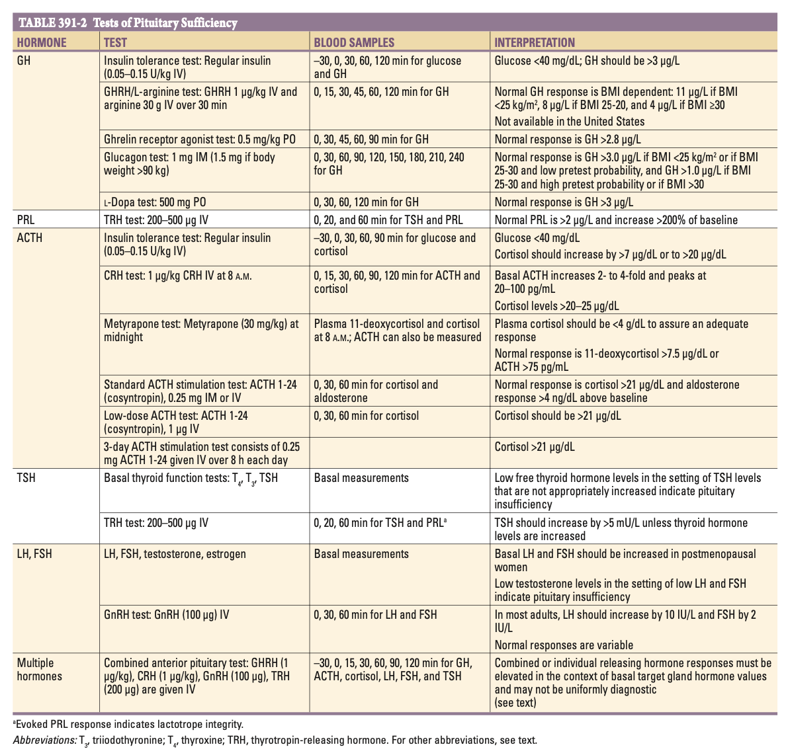
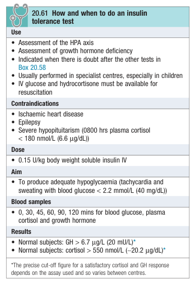
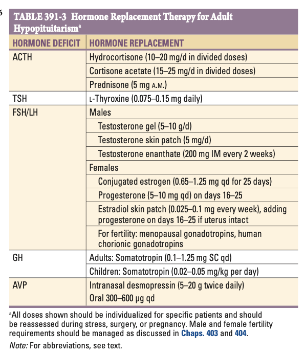

# Hypopituitarism

- **Definition** - combined deficiency of any of the anterior pituitary hormones, most commonly caused by a pituitary macroadenocarcinoma
- **DDx of hypopituitarism:**
    - <u>Congenital/ developmental hypopituitarism</u> - various causes of aplastic, hypoplastic or ectopic pituitary gland development, esp. occuring in association w/ midline-craniofacial disorders
    - <u>Hypothalamic endocrine dysfunction</u> - Kallmann syndrome, Bardet-Biedl syndrome, Prader-Willi syndrome, Leptin and leptin receptor mutations
    - <u>Acquired hypopituitarism</u> - caused by 1) sellar and parasellar masses, 2) trauma, 3) infiltrative lesions, 4) infective/ inflammatory lesions, 5) autoimmune, and 6) vascular

   
  
- **DDx of acquired hypopituitarism:**
    - **Neoplastic disorders:**
        - **Pituitary tumours:**
            - <u>Primary pituitary tumours</u> - pituitary adenomas, pituitary carcinoma
            - <u>Pituitary metastasis</u> - breast, lung, colon carcinoma, haematological malignancies (e.g. lymphoma, leukaemia)
        - **Developmental/ congenital lesions:**
            - <u>Rathke's cyst</u> - fluid-filled cyst arising from the embryonic remnant of the Rathke's pouch
            - <u>Hypothalamic harmatoma or gangliocytoma</u> - non-neoplastic overgrowth of normal neuronal tissues
        - **Non-pituitary, parasellar tumours:**
            - <u>Craniopharyngioma</u> - benign, but aggressive tumour arising from the Rathke's pouch remnant
            - <u>Meningioma</u> - arises from the meninges near the sellar area
            - <u>Parasellar masses</u>:
                - Germinoma
                - Ependymoma
                - Glioma
    - **Traumatic:**
        - <u>Iatrogenic</u> - parasellar surgery (neurosurgical trauma), **cranial irradiation** (see details below)
        - <u>Head injuries</u> (5% of hypopituitarism) - includes contact spport trauma, RTAs, explosive causes, traumatic SAHs, can experience transient or long-term hypopituitarism, and long-term periodic endocrine follow-up as hypothalamic-pituitary dysfunction will develop in 25-40% of these patients
    - **Hypothalamic infiltration disorders** - often affects the <u>hypothalamic-pituitary axis</u>, hence commonly presents w/ hypopituitarism along w/ 1) AVP-D, 2) hyperprolactinaemia and subsequent hypogonadotrophic hypogonadism:
        - Sarcoidosis
        - Histiocytosis X
        - Amyloidosis
        - Haemochromatosis
    - **Hypothalamic inflammatory lesions** - often mimics a pituitary adenoma on imaging and should be considered a DDx of a sellar mass, but generally causes more pituitary damage and subsequent secretory dysfunction:
        - <u>Infections</u>:
            - Bacterial/ Mycobacterial - tuberculosis, tertiary syphilis
            - Opportunistic fungal - histioplasmosis, pneumocystis jirovecii
            - Parasitic - toxoplasmosis
        - <u>Non-infective inflammatory infiltrates</u>:
            - Lymphocytic hypophysitis (see below)
            - Granulomatous hypophysitis (including sarcoid)
            - Immune-related adverse effects (Anti-CTLA4, Anti-PD1)
            - Transcription factor antibodies
    - **Drug-induced hypophysitis** (IRAE-related hypophysitis) - Anti-CTLA4, Anti-PD-1/PD-L1
    - **Pituitary apoplexy** - acute intrapituitar haemorrhagic vascular events resulting in substantial damage to pituitary and surrounding sellar structures:
        - <u>Etiology of pituitary apoplexy</u>:
            - Local event - spotaneous apoplexy of pituitary adenoma
            - Global hypoperfusion - Sheehan syndrome (partly due to hyperplastic enlargement of pituitary during pregnancy), acute shock
        - <u>Clinical manifestations</u> - endocrine emergency:
            - Severe headache and meningism a/w bilateral visual changes or opthalmoplegia
            - CNS haemorrhage and raised intracranial pressure
            - Manifestation of ACTH deficiency such as severe hypoglycaemia, hypotension, and shock
            - Ultimately loss of consciousness, cardiovascular collapse and death
        - <u>Mx</u>:
            - Low risk patients (no visual disturbances or impaired consciousness) - conservative Mx w/ glucocorticoids
            - High risk patients - urgent surgical decompression w/ sellar surgery
- **Cranial irradiation** - esp. in children and adolescents where pituitary is more susceptible to damage:
    - Typically follows whole-brain irradiation (WBI) or head-and-neck irradiation
    - In our locality, notorious for following radiotherapy for NPC
    - 67% patients will eventually develop hypopituitarism after a median dose of 50 Gy directed at the skull base
    - Hypopituitarism typically occurs over 5-15y which is suggestive of hypothalamic damage rather than primary destruction of pituitary cells
    - Patterns of hormone loss is variable, w/ GH deficiency and gonadotrophin deficiency as most common, followed by TSH, and ACTH deficiency
- **Lymphocytic hypophysitis:**
    - <u>Epidemiology</u> - occurs most often in post-partum women
    - <u>Pathophysiology</u> - generally transient pathological process:
        - Diffuse lymphocytic infiltration exerting mass effect and potentially hypopituitarism
        - Autoimmunity against specific cell types may manifest w/ specific hormone deficiencies
    - <u>Clinical manifestations</u> - mimics a pituitary adenoma
        - Mass Sx - headache and visual disturbances
        - Hyperprolactinaemia - usually mildly elevated PRL levels suggesting a disconnect hyperprolactinaemia (difficult to distinguish from post-partum state)
        - Hypopituitarism - often transient w/ restoration of pituitary function after Tx, but may be permanent in rare cases depending on extent of damage
    - <u>Clinical suspicion</u> - considered in all **post-partum women w/ newly diagnosed pituitary mass** to avoid uncessary surgical intervention
    - <u>Ix</u>:
        - ESR raised
        - Anterior pituitary hormone profile shows hyperPRL +/- features of hypopituitarism
        - MRI shows pituitary mass
    - <u>Mx</u> - glucocorticoid therapy (typically resolves within several months)
- **IRAE hypophysitis** - most commonly a/w CTLA-4 inhibitors (20%) and PD-1/PD-L1 inhibitors (up to 39%):
    - <u>Pathophysiology and clinical manifestations</u>:
        - CTLA-4 inhibitors (ipilimumab) - as pituitary cells also express CTLA-4, resulting in hypophysitis typically **in temporal association w/ immunotherapy** and heterogenously associated anterior pituitary failure
        - PD-1/PD-L1 inhibitors (pembrolizumab, nivolumab) - a/w HLA DQ0602 allele and may show **delayed presentation**
    - <u>Mx</u> - high-dose glucocorticoids and pituitary hormone replacement
- **Empty sellar** - incedental MRI finding of a partial or total empty sellar space, but generally have normal pituitary function:
    - <u>Etiology</u>:
        - Intracranial hypertension
        - Infarction and silent involution of pituitary adenoma
    - <u>Clinical manifestation</u> - generally well:
        - Hypopituitarism may develop insiduously
        - Rarely, small but functional pituitary adenomas may arise from rim of normal tissue which may not be visible on MRI
- **Clinical features of hypopituitarism** - often a characteristic sequence of loss of anterior pituitary hormone function (GH, GnH, ACTH, TSH):
    - **Features of GH deficiency** - metabolic effects are mild, while effects on growth are only seen in children:
        - <u>Short stature</u> - observable in children as a proportional short stature
        - <u>Non-specific metabolic manifestations</u> - weakness, lethargy, increased fat mass
    - **Features of gonadotrophin deficiency** - effects on males and females may be different:
        - <u>Oligomenorrhoea or amenorrhoea</u> - secondary amenorrhoea may occur in F
        - <u>Loss of libido</u> - more marked in male
        - <u>Gynaecomastia</u> - only observed in male
        - <u>Sparse facial, axillary and pubic hair</u> - a decrease in **frequency of shaving** is often elicited in male w/ gonadotrophin deficiency
    - **Features of ACTH insufficiency** - manifests as Sx of cortisol deficiency, but not aldosterone deficiency:
        - <u>Abdominal Sx</u> - N/V, abdominal pain as an important mimic of the **acute abdomen**
        - <u>Postural hypotension</u> - due to loss of permissive effects of cortisol on catacholamines, resulting in vasodilation
        - <u>Hyponatraemia</u> - euvolemic dilutional hyponatraemia possibly due to underfilling
        - <u>Hypoglycaemia</u> - due to reduced insulin resistance
        - <u>Other non-specific Sx</u> - e.g. fatigue, weight loss, anorexia
    - **Features of secondary hypothyroidism** - cold intolerance and apathy may be marked but frank myxoedema is rare presumably due to retained autonomous functioning of the thyroid
- **Ix** - do not delay Dx of adrenal insufficiency if presents as acutely well patient:
    - **Hormone panel** - TFT, spot cortisol, testosterone, FH, LH, ACTH stimulation test, ACTH, PRL:
        - <u>TFT</u> - low TSH (but often detectable), low T4
        - <u>Cortisol</u> (morning cortisol preferred) - reduced
        - <u>Testosterone, FSH, LH</u> (only performed in M or post-menopausal F) - reduced testosterone w/ low-normal gonadotrophins suggestive of hypogonadotrophic hypognoadism
        - <u>ACTH stimulation test</u> - failed stimulation of cortisol secretion
        - <u>ACTH</u> - low in secondary adrenal insuficiency
        - <u>PRL</u> - raised in the presence of mass effect, may be reduced w/ PRL deficiency
    - **Additional dynamic testing** - provocation test should be performed when there is clinical suspicion
    - **Neuroimaging** - MRI or CT brain to identify pituitary or hypothalamic tumours
    - **Additional Ix** - if lesion found on neuroimaging to r/o infiltrative or infective causes
- **Principles of biochemical diagnosis of pituitary insufficiency** - demonstration of:
    - 1\) Low (or inappropriately normal) levels of pituitary trophic hormones in the setting of low levels of target organ hormones (e.g. low-normal TSH in setting of low T3/4)
    - 2\) Failed stimulation of anterior pituitary hormone release during provocative tests
- **Anterior pituitary hormone profiles:** 

- **Insulin tolerance test** - can be used as a provacative test for GH deficiency and ACTH deficiency:
    - <u>Principles</u> - insulin-induced hypoglycaemia:
        - GH axis - hypoglycaemia imposes a physiological stress that induces GH secretion
        - CRH-ACTH axis - often performed w/ short-synathen test to demonstrate failed rise of cortisol
    - <u>Caution and complications</u> - avoided in suspected ACTH deficiency due to icnreased susceptibility to:
        - Hypoglycaemia
        - Hypotension
    - <u>Contraindications</u>:
        - Active coronary artery disease
        - Known seizure disorders
        - Suspected ACTH deficiency

    
    
- **Mx:**
    - **Principles of Mx:**
        - <u>Resuscitation and Tx of acute adrenal insufficiency</u> - see notes on adrenal insufficiency
        - <u>Dx and Tx of underlying cause</u> - e.g. neurosurgery for pituitary macroadenoma, dopamine antagonist for prolactinoma
        - <u>Chronic hormone replacement</u> - usually required if hypopituitarism not reversible
    - **Principles of hormone replacement therapy:**
        - Replacement of what the body fails to produce
        - Regimen designed to mimick physiological hormone production accounting for diurnal variation
        - Additional considerations requiring stress-dosing for cortisol during acute illness

    
    
    - **Cortisol replacement:**
        - <u>Dosing</u> - oral hydrocortisone 15-20mg (equivalent to P5; but hydrocortisone preferred as less potentn and more physiological) in divided dose (10 mg on waking and 5 mg) at around 1500
        - <u>S/E</u> - usually minimal unless over-replacement (e.g. excessive weight gain)
        - <u>Titration of doses</u> - mainly symptomatically and by body weight (measuring cortisol not helpful)
        - <u>Advice to patients on cortisol replacement therapy</u> - stress dosing: 
        
    - **Thyroid hormone replacement:**
        - <u>Dosing</u> - levothyroxine 50-150 mcg od (weight-based: 1.6 mcg/kg/d)
        - <u>Dose titration</u>:
            - TSH cannot be used to titrate dose due to suppression
            - Titrate dosage against T4 to upper parts of reference ranges
        - <u>Caution</u> - replace after giving glucocorticoids as this may precipitate adrenal crisis:
            - **T3 can alter metabolism of cortisol** - transactivation of 11-beta-hydroxysteroid dehydrogenase 2 (11-beta-HSD2) resulting in **increased conversion of active cortisol into cortisone** (+/- minor activations of 5-alpha hydroxylase)
            - **Amplification of physiological stress response** - increased metabolic rate w/ thyroxine replacement requires adequate cortisol for stabilisation; absence of cortisol predisposes to hypoglycaemia and shock
    - **Sex hormone replacement** - indicated in F \< 50y or M to restore sexual functions and prevent osteoporosis
    - **Growth hormone replacement** - no longer indicated only for childrens:
        - <u>Indications</u> - if symptom relieve not satistfactory after full replacement of other hormones
        - <u>Clinical efficacies</u> - improve anorexia and fatigue; improvement of objective measures such as fat: muscle mass ratio and other metabolic parameters
        - <u>Titration of dose</u> - monitor IGF-1 level
        - <u>S/E</u>:
            - Sodium retention (peripheral odema and carpel tunnel syndrome)
- **Prognosis:**
    - <u>Mortality</u> - long standing pituitary damage a/w increased mortality rates primarily driven from cardiovascular and cerebrovascular disease
    - <u>Prognostic factors</u>:
        - Hypopituitarism due to previous H&N irradiation is a determinant of mortality driven by cerebrovascular disease
        - AVP-D and hypogonadism profiles also increase risk of mortality
