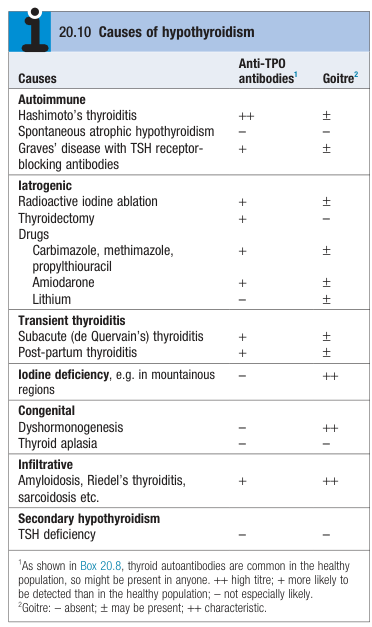
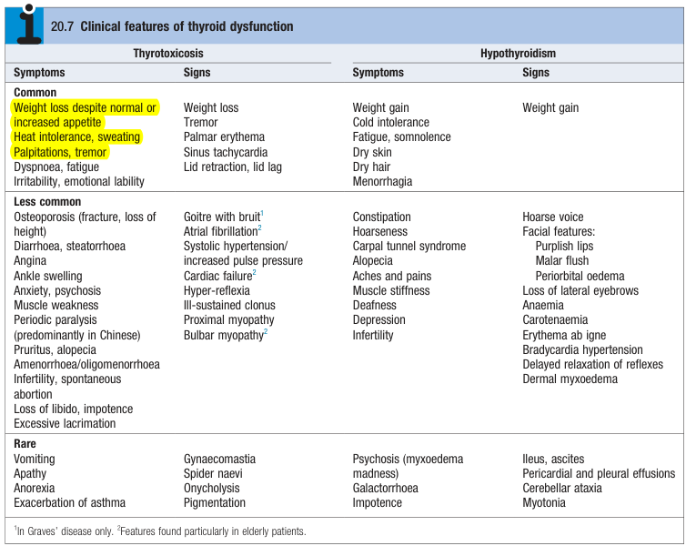
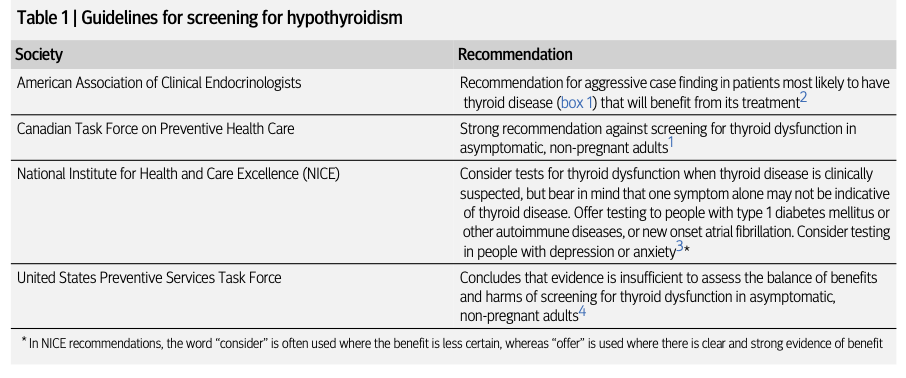
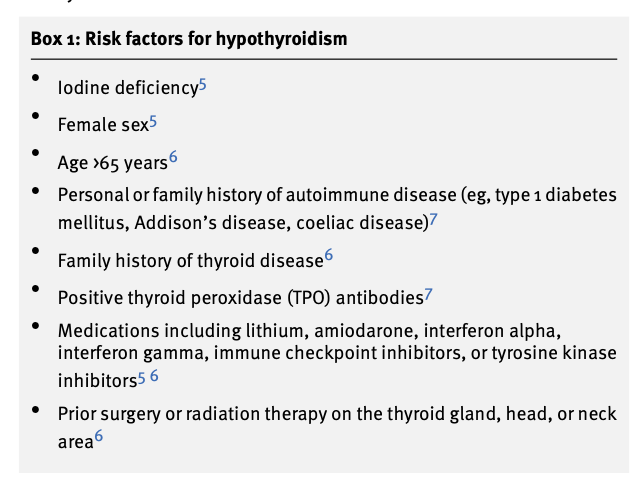
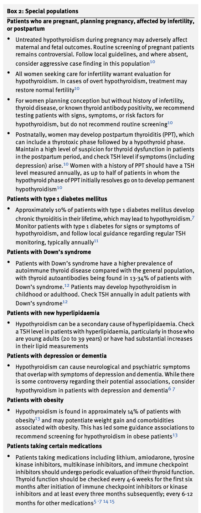
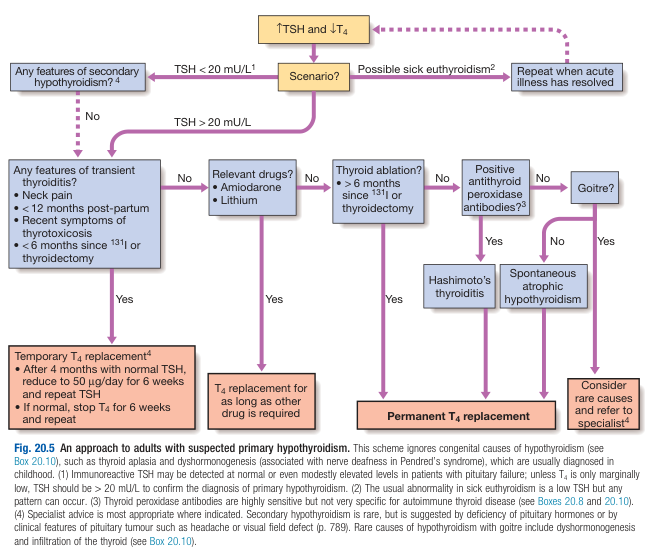
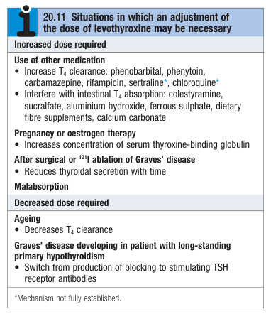

# Hypothyroidism

- **Definition** - common condition w/ constellation of S/S reflecting reduced circulating thyroid hormone levels
- **Epidemiology** - female preponderance (F:M = 6:1)
- **Complications of hypothyroidism** - beyond uncomfortable Sx:
    - <u>Effects on cardiovascular system</u> - cardiac dysfunction, (diastolic) hypertension, dyslipidaemia
    - <u>Effects on pregnancy</u> - negatively impacts neurodevelopment of the child
    - <u>Others</u> - cognitive impairment, myxoedematous coma
- **Etiology of hypothyroidism** - iatrogenic and autoimmune are most common causes in developed world, while iodine deficiency is in areas w/o iodine-reinforcement:
    - **Primary hypothyroidism:**
        - <u>Congenital</u> - dyshormonogenesis, thyroid aplasia
        - <u>Autoimmune thyroid disorder</u> - Hashimoto's thyroiditis, Graves' disease w/ inhibitory TRAb, spontaneous atrophic hypothyroidism
        - <u>Iatrogenic</u>:
            - Radioactive iodine ablatin
            - Thyroidectomy
            - Drug-induced - anti-thyroid medications, lithium, amiodarone
        - <u>Iodine deficiency</u> - e.g. in mountainous regions
        - <u>Infiltrative</u> - e.g. amyloidosis, riedel's thyroiditis, sarcoidosis
    - **Secondary hypothyrodism** - TSH deficiency:
        - <u>Structural hypothalamic and pituitary disorder</u> - e.g. pituitary adenoma, craniopharyngioma, meningioma
        - <u>Other causes of hypopituitarism</u> - see notes on hypopituitarism

  
  
- **Physiological changes in hypothyroidism:**
    - <u>Increased deposition of mucopolysaccharides and hyaluronic acid</u>:
        - **Effects on phonation** - hoarseness (laryngeal deposition), slurred speech (large tonue)
        - **Effects on skin** - dry, non-pitting oedema (myxoedema), most evident on hands, feet, and eyelids
        - **Effects on carpel tunnel** - median nerve compression
        - **Effects on eyelids** - peri-orbital pufiness
    - <u>Reduced sympathetic drive</u> - host of CVS, neuropsychiatric manifestation
- **Clinical features of hypothyroidism** - dependent on duration and onset of hypothyroidism:
    - <u>Fatigue</u> - non-specific Sx of hypothyroidism, which requires high index of clinical suspicion
    - <u>Cold intolerance</u> - more specific Sx of hypothyroidism
    - <u>Weight gain</u> - weight gain despite normal or reduced appetite is a result of reduced metabolic activity and is a common presentation of hypothyroidism
    - <u>Skin changes</u> - dry skin and hair may be related to reduced sweat gland functions
    - <u>Carpel tunnel syndrome</u> - raised index of suspicion when patient presents w/ caprpel tunnel syndrome as it may be caused by **median nerve compression due to myxoedema**
- **Signs of hypothyroidism:**
    - **General examination:**
        - Hoarse voice
        - Facial features - periorbital puffiness, malar flush, carotenaemia, malor flush, pallor
    - **Neck examination** - goitre may be palpated
    - **Assessment of thyroid status:**
        - Bradycardia hypertension
        - Delayed relation of myxoedema

  
  
- **Indications for screening of hypothyroidism:**
    - <u>Presence of risk factors for hypothyroidism</u> - see table below
    - <u>Compatible clinical findings</u> - see clinical features and signs above
    - <u>Presence of laboratory abnormalities</u> - screen for hypothyroidism usually indicated:
        - Macrocytic anaemia
        - (Secondary) hypercholesterolaemia
        - Hyponatraemia
        - Elevated creatinine kinase
    - <u>Special populations</u> - populations known to develop hypothyroidism, or where the effects of hypothyroidism are significant (see below)

  
  
- **Presence of risk factors for hypothyroidism:**
    - <u>Demographic</u> - Age \> 65y, female sex, personal or FHx of autoimmune disease, FHx of autoimmune thyroid disease, iodine deficiency
    - <u>Past medical Hx</u>:
        - Drug Hx - lithium, amiodarone, interferon alpha, interferon gamma, immune checkpoint inhibitors, tyrosine kinase inhibitors
        - Surgery/ irradiation - to the thyroid or H&N region

  
  
- **Special populations:** 

- **Ix:**
    - **Routine bloods** - non-specific abnormalities:
        - <u>CBC</u> - anaemia (NcNc or macrocytic anaemia)
        - <u>RFT</u> - hyponatraemia (r/o hypothyroidism before Dx of SIADH)
        - <u>CK, AST, LDH</u> - non-specifically raised
        - <u>Lipid profile</u> - hypothyrodism is the most common secondary cause of **hypercholesterolaemia**
    - **TFT** - most commonly resulting from primary hypothyroidism:
        - <u>Primary hypothyroidism</u> - low T3/4, excess TSH (usually \> 20 mU/L)
        - <u>Secondary hypothyroidism</u> - low T3/4, low TSH
    - **ECG** - shows sinus bradycardia w/ low-voltage complexes, ST/T changes
    - **Anti-TPO** - helpful when raised

  
  
- **Possible patterns of thyroid function in the context of hypothyroidism:**
    - <u>In-appropriately normal TSH, low fT4</u> - central hypothyroidism possible but rare
    - <u>Overt primary hypothyroidism</u> - low fT4, elevated TSH
    - <u>Subclinical hypothyroidism</u> - normal fT4, elevated TSH
- **DDx of elevated TSH except primary or subclinical hypothyroidism** (false positive):
    - <u>Non-thyroidal illness</u> - e.g. sick euthyroid syndrome
    - <u>Disorders of the HPT axis</u>:
        - Primary - Recovery phase of subacute or silent thyroiditis (N.B. TSH dynamics typically lags behind that of fT4)
        - Secondary - TSHoma (i.e. subclinical thyrotoxicosis)
        - Peripheral - Resistance to Thyroid Hormone (RTH)
    - <u>Other endocrinopathies</u> - Adrenal insufficiency
    - <u>Laboratory interferences</u>:
        - Rheumatoid factor
        - Heterophilic Ab
- **DDx of false negative TSH results in the context of hypothyroidism:**
    - Central hypothyroidism (abnormally normal TSH)
    - Biotin supplementation
- **Additional Ix for subclinical hypothyroidism** - anti-TPO Ab level:
    - Predicts likelihood of developing overt hypothyroidism: in people with subclinical hypothyroidism who have positive TPO antibody titres, 4.3% go on to develop overt hypothyroidism each year, compared with 2.6% of people with subclinical hypothyroidism but negative TPO antibody titres
    - Those w/ +ve anti-TPO titres require closer monitoring w/ TSH rechecked every 6-12 mo
    - Possible to re-check TSH and fT4 in 3mo to r/o sick euthyroid syndrome (repeat at 3mo if recently ill or no longer experiences Sx of hypothyroidism)
- **Mx:**
    - **Principles of Mx:**
        - <u>Identify cause of hypothyroidism</u> - cause of hypothyroidism may determine the duration of Tx:
            - Transient thyroiditis - temporary T4 replacement
            - Drug-induced hypothyroidism - T4 replacement for as long as the inciting drug is required
            - Autoimmune thyroid disorder and \> 6mo after I-131 or thyroidectomy - permannent T4 replacement
        - <u>Levothyroxine replacement</u> - dosing dependent on cause, and important co-morbidities (e.g. ischaemic heart disease, and pregnancy)
    - **Levothyroxine replacement:**
        - <u>Clinical efficacy</u>:
            - Rapid biochemical normalisation of T3/4 (as levothyroxine has a long half life)
            - Symptomatic improvement - reduced fatigue, weight and periorbital puffiness within 2-3 weeks, while skin, hair changes and effusions may take months to resolve
        - <u>Dosing and regimen</u> - start low and go slow, titrated against TSH levels:
            - Initial dose of 50 microgram/d (may be higher for younger patients, or lower for patients w/ IHD etc.)
            - Uptitration to 100 microgram/d after 3 weeks
            - Maintenace dose of 100-150 microgram/d by normalisation of TSH (typically require T4 at upper limits of normal or even slightly hyperthyroid biochemically)
        - <u>Consideration for dosing of levothyroxine replacement</u>: 
        
            - Hypothyroidism w/ ischaemic heart disease - cautious dosing (see below)
            - Hypothyroidism w/ pregnancy - increased maintenance dosing may be necessary for normalisation of TSH levels
            - Drug-drug interaction - e.g. T4 clearance, intestinal T4 absorption
        - <u>Persistance Sx desite ostensibly adequate levothyroxine replacement</u> - repeat TSH:
            - **TSH elevated** - could be 1) suboptimal compliance, 2) reduced bioavailability (optimise dosing as absorption greatest if taken before bed and w/ vitamin C \[consider branded T4 replacement\])
            - **TSH normalised** - Sx may persist and require re-assurance; **no role of extra dose** as increased risk of osteoporosis and atrial fibrillation (subclinical hyperthyroidism)
    - **Hypothyroidism in ischaemic heart disease** - increased risk of exacerbation of myocardial ischaemia, infarction and SCD in known IHD, combatted by:
        - Introduction at low doses and increased very slowly under specialist supervision
        - Revascularisation indicated if angina is exacerbated by levothyroxine surgery
    - **Hypothyroidism in pregnancy** - increased metabolism of thyroxine and increased serum TBG:
        - Hypothyroidism during pregnancy a/w impaired cognitive development in unborn child
        - Increased maintenance doses of 25-50 microgram/d usually required to maintain TSH (refer to <u>trimester-specific reference ranges</u>)
        - Inform all women to self-increaese daily levothyroxine doses by 25 microgram when pregnancy is confirmed
- **Myxoedema coma** - rare presentation of hypothyroidism which is a medical emergency:
    - **Clinical features:**
        - <u>Neurological manifestation</u> - reduced GC, convulsions
        - <u>Hypothermia</u> - as low as 25 degree celcius
    - **Ix:**
        - <u>LP</u> - increased opening pressure w/ increased protein
        - <u>TFT</u> - severe hypothyroidism
    - **Mx** - medical emergency before biochemical confirmation:
        - Hydrocortisone 100 mg IM tid (as may be due to hypothalmic and pituitary therapy)
        - Injection of T3 - 20 microgram initially, followed by 20 microgram tid
        - Oral levothyroxine 50 microgram/d when rise in body temperature and can tolerate oral intake
