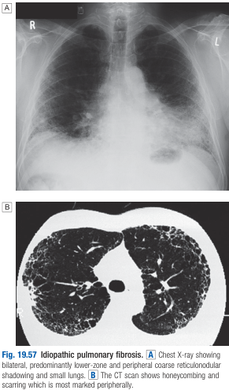
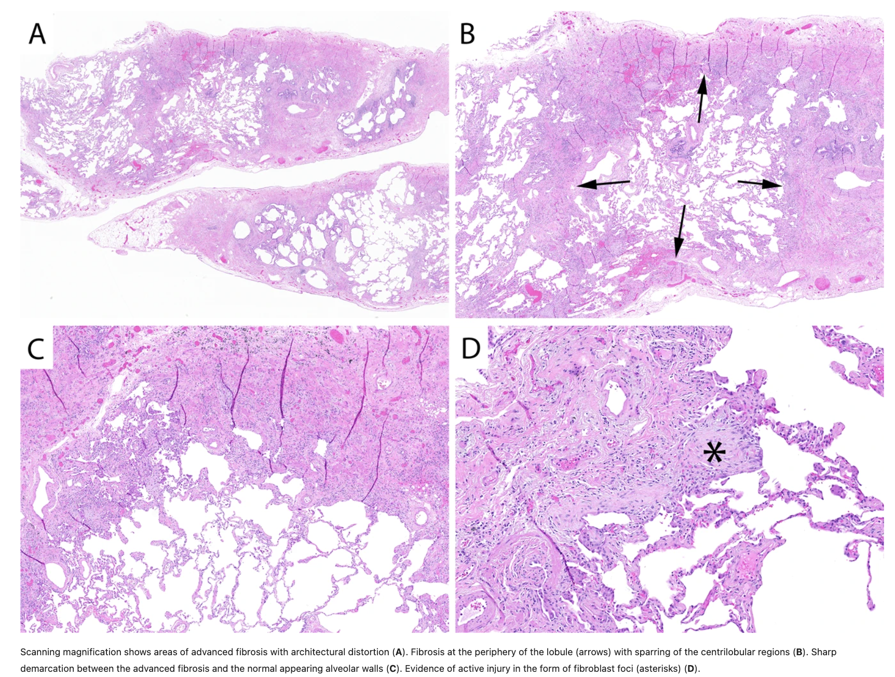

# Idiopathic Pulmonary Fibrosis

- **Definition** - most common ILD of "unknown" cause, characterised by otherwise unexplained radiological and histopathological hallmark of "usual interstitial pneumonia" in a patient of appropriate demographic
- **Epidemiology:**
    - <u>Incidence</u> - most common ILD of unkown cause (50-200/100000)
    - <u>Demographic</u>:
        - **Age** - lrevalence increases w/ age, most commonly diagnosed in 5th-6th decade of life:
            - Most common cause of ILD in a patient \> 60-65y
            - Exceptionally rare in a patient \< 50y
        - **Sex** - male preponderance
        - **Exposure** - +ve smoking Hx in 75% cases; possible role of other environmental exposures
- **Pathophysiology of IPF:**
    - <u>Etiology remains elusive</u> - speculations include viral (e.g. EBV), occupational dusts (metal or wood), drugs (anti-depressants), and chronic GERD
    - <u>Repeated focal damage to alveolar epithelium</u> manifests as biphasic disease, with 1) alveolitis, and subsequently 2) fibrosis
    - <u>Physiological effects:</u>
        - Increased thickness - impaired gas exchange
        - Reduced lung compliance - decreased lung volume and restrictive pattern
- **HRCT findings in IPF** - usual interstitial pneumonia (UIP) pattern:
    - <u>Characteristic fibrotic findings</u>:
        - Subplerual reticulation w/ posterior basal preponderance
        - Advanced fibrotic features include 1) honeycombing, and 2) tractional bronchiectasis

    
    
    - <u>Findings incompatible w/ IPF</u> - should raise suspicion for an alternative diagnosis:
        - Extensive GGOs (minimal inflammatory changes in IPF usually)
        - Distribution in upper lobe preponderance
        - Presence of bronchovascular changes
        - Micronodules
        - Mosaic attenuation
- **Histopathology in IPF** - usual interstitial pneumonia (UIP):
    - Fibroblast foci (subepithelial collections of myofibroblasts and collagen) representing active injury
    - Subpleural reticulation associated w/ honeycomb changes
    - Fibrotic changes alternating w/ areas of preserved normal alveolar architecture <u>consistent w/ temporal and spatial heterogeneity</u>

  
  
- **Other Ix:**
    - <u>Anti-CCP</u> - may be mildly +ve (repeated testing to r/o RA)
- **Dx** - considered a Dx by exclusion:
    - <u>Compatible demographic</u> - \> 60y, man, smoker (75%)
    - <u>r/o common known causes</u> - CTD, medications, radiation, occupational exposure, and common mimics (e.g. HF, malignancy, infection)
    - <u>Compatible HRCT findings</u> - presence of all the following features is diagnostic and precludes need for histological Dx; absence of any one will be deemed inconsistent and histology is pursued:
        - 1\) Patchy reticular pattern w/ subpleural and basal predominance
        - 2\) Significant honey-combing and tractional bronchiectasis w/ minimal GOO
    - <u>Histological Dx</u> - demonstration of UIP pattern is considered definitive
- **Mx:**
    - **Principles of Mx:**
        - **Non-pharmacological therapy:**
            - <u>Physical therapy</u> - may improve exercise tolerance
            - <u>Supplemental O2</u> - improve ET and reduce likelihood of developing pulmonary HTN
            - <u>Lung transplantation</u> - extend survival and improve QOL for subset of patients who meet criteria for transplantaiton
        - **Pharmacological therapy** - classically non-responsive to cocktail immunotherapy, now responsive to antifibrotic therapy
        - <u>Historical immunosuppressive therapy</u> (prednisolone, azathioprine, NAC) - no benefits to lung pathology, associated w/ increased morbidity and mortality (PANTHER-IPF study)
        - <u>Antifibrotic therapy</u> - pirfenidone and nintedanib slow lung function decline w/ survival benifits concluded in meta-analysis
- **Prognosis** - poor (3y median survival)
