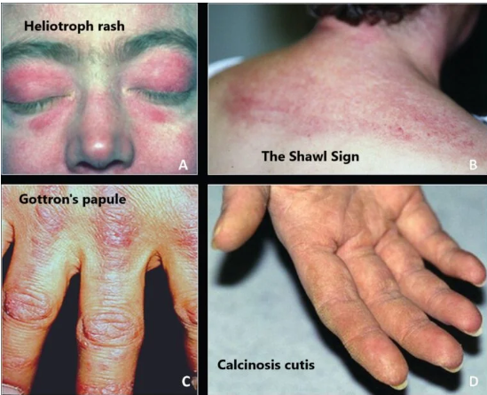

# Immune-mediated Myositis

- **Definition** - two related disorders that are characterised by an inflammator process affecting skeletal muscles:
    - <u>Dermatomyositis</u> - inflammatory process of the skeletal muscles and exposed areas of the skin
    - <u>Polymyositis</u> - inflammatory process isolated to the skeletal muscles
- **Epidemiology:**
    - <u>Incidence</u> - 2-10/1,000,000/y (both conditions are rare)
    - <u>Demographic</u> - presentation in 4-6th decade of life
- **Associated conditions:**
    - May present in association w/ other autoimmune diseases, such as SLE, SSc and Sjogren's syndrome
    - Associated w/ 3x increased risk of malignancy that persists for at least 5y after Dx
- **Clinical features of dermatomyositis and polymyositis:**
    - **Muscle weakness** - due to inflammatory destruction of muscles, usually resulting in widespread <u>symmetrical proximal muscle weakness</u>:
        - <u>Site</u>:
            - Symmetrical, proximal muscle weakness, lower limbs classically affected more than upper limbs (focal disease may occur)
            - Respiratory and pharyngeal muscles (see below)
        - <u>Onset and progression</u> - subacute, gradually over few weeks
        - <u>Function limitations</u>:
            - **LL weakness** - difficulty rising from a chair, climbing stairs
            - **UL weakness** - lifting, and combing hair
        - <u>Association</u> - a/w muscle pain
        - <u>Timing</u> - progressive, no diurnal variation
    - **Respiratory muscle and pharyngeal muscle weakness:**
        - <u>Type 2 respiratory failure</u> - due to insufficient power for ventilation, may require intubation and ventilatory support
        - <u>Aspiration</u> - risk of aspiration pneumonia increased due to pharynegal muscle weakness
        - <u>Dysphagia</u> - oropharyngeal dysphagia reflecting pharyngeal muscle weakness
        - <u>Dysarthria</u> - indistict, poor articulation due to weakness of pharyngeal muscles, or facial muscles affecting phonation
    - **Characteristic skin lesions** - characteristic rash in sun-exposed areas only in dermatomyositis:
        - <u>Gottron's papules</u> - scaly, erythematous or violaceous, psoriaform plaques over **extensor surface of PIP and DIP joints**
        - <u>Heliotrope rash</u> - violaceous discolouration of the **eyelid** in combination with **periorbital oedema**
        - <u>Shawl sign</u> - characteristic rash over neck, upper back, chest and shoulders in the distribtuion of shawl caped over
        - <u>Periungal nail-fold capillaries</u> - often visibly enlarged, and tortuous

    
    
    - **Systemic manifestations:**
        - <u>Fatigue</u> - may or may not be attributed to muscle weakness
        - <u>Fever</u> - usually low-grade fever present
        - <u>Weight loss</u> - due to an active inflammatory process
    - **Chronic exertional dyspnoea** - relentless progressive shortness of breath caused by interstitial lung disease (30% of patients), with strong associations w/ Anti-Jo1 Ab (antisynthetase)
- **Ix:**
    - **Bloods** - CK:
        - <u>CK</u> - elevated (but normal levels do not exclude Dx), and correlates to disease activity
    - **EMG** - confirms presence of myopathy and effectively r/o neuropathy
    - **Myositis immune panel**
    - **Muscle Bx** - pivotal for Dx:
        - <u>Approach</u>:
            - Blind (common)
            - MRI-guided (considered if initial Bx is normal due to patchy myositis)
        - <u>Findings</u> - fibres necrosis, regeneration and inflammatory cell inflammation
    - **Malignancy screen** - undertaken routinely:
        - CT T+A+P (assessment of ILD as well)
        - OGD + colonoscopy
        - Mammography
- **Mx:**
    - **Principles of Mx:**
        - <u>Remission induction</u> - high dose oral steroids or IV steroids (+/- IVIG)
        - <u>Maintenance therapy</u> - taper steroid to maintenance dose +/- steroid-sparing therapy (Azathioprine, methotrexate)
        - <u>Malignancy screen</u> - see above
        - <u>Monitoring</u> - for complications (e.g. malignancy, interstitial lung disease) and relapse
