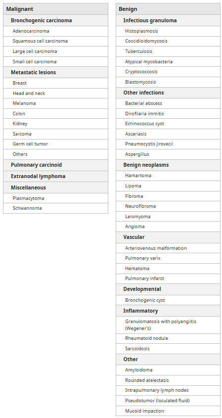
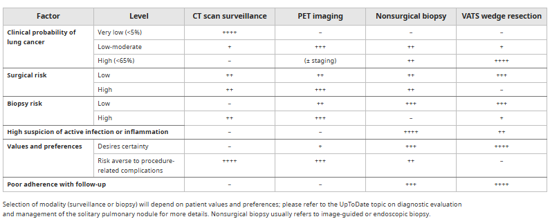
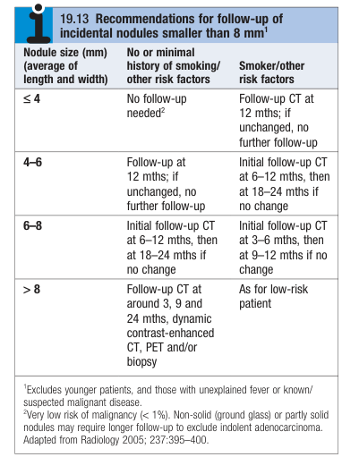

# Incidental Pulmonary Nodule

- **Definition** - a small (\<= 30 mm), well-defined lesion surrounded by pulmonary parenchyma detected on cross-sectional imaging performed for an unrelated reason
- **Terminology:**
    - <u>Pulmonary nodule</u> - well-defined lesion \<= 30 mm surrounded by pulmonary parenchyma, which may be solid or subsolid
    - <u>Pulmonary mass</u> - well-defined lesions \>= 30 mm surrounded by pulmonary parenchyma, harbor a much higher lielihood of being malignant
- **DDx of incidental pulmonary nodule:** 

    - **Malignant etiologies:**
        - <u>Bronchial carcinoma</u> - adenocarcinoma (peripheral lesion) is the most common subtype of primary lung cancer that presents as a pulmonary nodule, followed by squamous cell carcinoma (central lesion), and large cell carcinoma
        - <u>Metastatic cancer</u> (25% in those with known extra-thoracic malignancy) - most commonly CA of colon, breasts, kidneys, tisticles, melaenoma etc.
        - <u>Neuroendocrine tumours</u> - most are endobronchial, but some present as a peripheral pulmonary nodule
    - **Benign etiologies:**
        - <u>Infectious granulomas</u> - Mycobacteria (TB, NTB), endemic fungal infections (histoplasmosis, coccidioidomycosis)
        - <u>Benign neoplasms</u> - Pulmonary harmatomas (10% of benign nodules), and less commonly fibromas, leiomyomas, hemangiomas, amyloidoma, pneumocytoma
        - <u>Vascular lesions</u> - Pulmonary AVM (hereditary haemorrhagic telangietasia), pulmonary infarcts, pulmonary varices, pulmonary contusion, haematoma
        - <u>Inflammatory lesions</u> - e.g. Wegner's granuloma, rheumatoid nodule, sarcoidosis
        - <u>Others</u> - Bronchogenic csst, hydatic cyst etc.
- **Features for distinguishing between benign from malignan nodules:**
    - **Patient characteristics:**
        - <u>Age</u> - increasing incidence of malignancy with age and is uncommon \< 40y
        - <u>Smoking Hx</u> - increased risk of malignancy in proportion to pack-years and duration
        - <u>FHx</u> - increased risk of malignancy if +ve FHx for lung cancer in 1st degree relatives
        - <u>Occupational exposure</u> - reported exposure to asbestos, silica etc.
    - **Radiological features:**
        - <u>Size</u> - increasing risk with size, nearly all malignancies are \> 3mm and \< 1% of lesions \< 4mm are malignant
        - <u>Growth</u> - lesion remains unchanged in 2y is extremely suggestive of benign lesions
        - <u>Margins</u> - spiculated lesions suggests malignancy, whereas smooth lesions are likely benign
        - <u>Calcification</u> - different calcification patterns reflect different pathologies:
            - **Granuloma** - laminated or central deposition of calcifications
            - **Harmatoma** - popcorn pattern of calcifications
        - <u>Fat</u> - presence of fat suggestive of harmatoma or lipoid granuloma
        - <u>Location</u>:
            - **Bronchial carcinoma** - 70% are found in upper lobe
            - **Benign lesions** - equal distribution throughout upper and lower lobe
- **Salient points of Hx:**
    - **HPI:**
        - <u>Reason for imaging</u> - ascertain reason for cross-sectional imaging (e.g. presenting Sx, occupation)
        - <u>Any previous imaging</u> - to determine whether the nodule is new and/or changing (by definition, no growth in 2y has extremely low risk of malignancy)
    - **Associated Sx** - respiratory and systemic Sx suggestive of CA lung:
        - <u>Cough</u> - characterise any new chronic cough
        - <u>Dyspnoea</u> - any new progressive exertional dyspnoea with reduction of exercise tolerance
        - <u>Haemoptysis</u> - malignant until proven otherwise even with mere blood-streaks in sputum
        - <u>Fever</u> (including low-grade fever) - reflects infective cause (esp. TB), but does not r/o malignancy (primary lung cancer can present with superimposed infection due to bronchial obstruction)
        - <u>Weight loss</u> - any unintentional significant weight loss
    - **Risk factor assessment:**
        - <u>Age</u> - malignancy extremely uncommon in \< 40y, but increasing risk with age
        - <u>Smoker</u> - increased risk proportionally to the duration and number of pack-years smoked
        - <u>+FHx</u> - increased risk by Hx of lung cancer in first-degree relatives
        - <u>Occupational exposure</u> - increased risk by occupational exposure to asbestos and silica
- **P/E** - respiratory examination (look for signs of CA lung)
- **Principles of initial evaluation and Mx:**
    - <u>Review of old radiographs</u> - nodules that remain unchanged when comparing with CXR \> 2y ago is considered benign and requires no further workup traditionally (new evidence suggests this approach has poor PPV \[0.65\] for benign lesions)
    - <u>Assess risk of malignancy</u> - probability of maliginancy assessed clinically with modest to excellent performance, with prediction models (e.g. one model, Brock model) serving complementary roles
    - <u>Mx options</u> - active surveillance, with option of surgical or non-surgical Bx/ ressection based on risk of malignancy
- **Ix** - CT is gold standard:
    - **CXR** - PA +/- lateral views:
        - <u>Test properties</u> - Sn increases w/ size (most \< 1cm will not be seen)
        - <u>Other causes of pulmonary nodules</u>:
            - **Infective cause** (Pneumonia, TB, lung abscess etc.) - work up and Mx as likely infection and repeat CXR to ensure resolution after Tx
            - **Nipple shadow** - 11% on frontal CXR, repeat CXR with nipple markers if uncertain
        - <u>Radiation</u> - 0.1 mSv (cf 1.5 mSV on CT), but radiation dose should not preclude from obtaining further CT
    - **CT thorax w/o contrast** - preferred modality for initial evaluation of <u>malignancy risk</u>:
        - **CT imaging technique** - helical, thin cut CT (1mm sections) to optimise accuracy and minimise variability of nodule size measurement and to evaluate for presence of calcifications and fat
        - **Nodule features:**
            - <u>Size</u> - independent predictor for malignancy:
                - Nodules \< 5mm - \< 1%
                - Nodules 5-9mm - 2-6%
                - Nodules 8-20mm - 18%
                - Nodules \> 20% - \>50%
            - <u>Growth or stable size</u> - growth defined as increase of size by \>= 2cm for solid nodules, or an increase in attenuation, size or development of solid component in subsolid nodules
            - <u>Location</u> - Malignant nodules can be found in any lobe:
                - **Malignant lesions** - 70% of bronchial carcinoma are found in upper lobe (i.e. upper lobe lesions have an <u>increased probability of being malignant</u>)
                - **Benign lesions** - equally distributed among upper and lower lobes
            - <u>Boarder</u> - can Suggest a diagnosis but unable to reliably distinguish between benign or malignant lesions:
                - **Benign lesions** - typically well-defined, smooth border
                - **Malignant lesions** - typically spiculated or lobular border (attributable to infiltrative growth along pulmonary interstitium and differential growth rates)
            - <u>Attenuation</u> - nodule density allows classification of lesions as solid or subsolid (pure ground-glass or part solid):
                - **Solid nodules** - dense and homogenous nodules on CT are less likely to be malignant, especially if small (subcentimeter, or \<= 8mm)
                - **Subsolid nodules** - less soft tissue attenuation such that normal parenchymal structures (airway and vessels) can be visualised through them, where increased risk of malignancy with part solid compared to pure ground-glass nodules
            - <u>Enhancement</u>:
                - **Malignant lesions** - typically have enhancement of \> 20HU
                - **Benign lesions** - typically have enhancement of \< 15 HU
            - <u>Calcification pattern</u> - can be sometimes used to reliably diagnosise incidental pulmonary nodule as benign:
                - **Central calcification** - represents prior infection (e.g. TB or histoplasmosis)
                - **Diffuse calcification** - represents prior infection
                - **Lamellated calcification** - represents prior infection
                - **Popcorn calcification** - represents chondroid calcification in harmatoma
                - **Non-specific calcification patterns** (e.g. punctate, eccentric, amorphous) - non-specific and have malignant potential
            - <u>Fat</u> (attenuation -40 to -120 HU) - is a reliable indicator of harmatoma
    - **PET-CT** - pulmonary nodules can be identified on PET-CT:
        - **Benign vs malignant nodules:**
            - <u>Benign nodules</u> - solid nodules \> 8mm that are not FDG-avid are likelyto be benign
            - <u>Malignant nodules</u> - FDG-avid nodules are more likely to be malignant
        - **Limitations:**
            - <u>False +ve results</u> - infectious and inflammatory nodules
            - <u>False -ve results</u> - NETs and bronchiolo-alveolar cell carcinoma
    - **Chest tomosynthesis** (rarely applied) - lower radiation than CT (10x lower) but not widely available (Sn higher than CXR but lower than CT)
- **Mx:**
    - **Principles of Mx** - individualised approach strikes a balance between potentially life-saving benefits of detecting resectable lung cancer with morbidity a/w testing and intervention:
        - **Mx options:**
            - CT surveillance
            - Non-surgical Bx - bronchoscopic vs percutaneous
            - Surgical Bx
            - Surgical resection
        - **Nodule risk of malignancy:**
            - <u>Size and attenuation</u> - size is the strongest independent predictor of malignancy and is applied to determine Mx options:
                - **Solid nodule \<= 8mm** - CT surveillance is typically sufficient (+/- additional imaging or tissue Bx) where interval depends on risk for malignancy
                - **Solid nodule \> 8mm** - workup as suspected lung cancer even in the absence of risk factors (regular CT surveillance is another appropriate option)
                - **Subsolid nodule \<= 6mm** - follow-up may not be necessary
                - **Subsolid nodule \> 6mm** - CT surveillance indicated (6-12 mo for ground-glass, 3-6 mo for part solid) further larger nodules (\> 8mm for part solid nodules) may be worked up as suspected lung cancer
            - <u>Stable nodule</u> - solid nodule that has been stable for \>2y or subsolid nodule that has been stable for \>5y are likely to be benign and further follow-up can be avoided
            - <u>Characteristic radiographic features</u> - certain calcification patterns and fat are diagnostic of benign conditions and obviate further workup
        - **Other factors influencing Mx of nodules** - particularly applicable for nodules \> 8mm: 
        
    - **CT surveillance** - CT thorax w/o contrast:
        - <u>Indications</u> - low risk of malignancy:
            - **Size** - applicable to smaller nodules (\< 8mm)
            - **Clinical risk** - different intervals based on Hx of smoking and other risk factors
        - <u>Interval</u>: 
        
        - <u>Median number of imaging</u> - 3.5 (mean cumulative effective dose 24 mSv)
        - <u>Implications of new pulmonary nodules</u> - new nodules detected on surveillance requires individual assessment
    - **Bronchscopy with Bx:**
        - <u>Indications</u> - preferred workup for intermediate risk or non-surgical candidates with central lesions
        - <u>Bronchoscopic techniques</u>:
            - Convential bronchoscopy with fluoroscopy-gided transbronchial biopsy (TBB)
            - Bronchoscopic-transbronchial needle aspiration (bronchoscopic-TBNA)
            - Radial endobronchial ultrasound-guided transbronchial biopsy (R-EBUS-guided TBB)
            - Navigation guided transbronchial biopsy
        - <u>Test properties</u> - adequate Sn (EBUS-guided TBB 73-85%), with higher diagnostic Sn for larger, centrally-located lesions
    - **Percutaneous needle Bx** - passsage of needle percutaneously through chest wall to target nodule under USG or CT guidance:
        - <u>Indications</u> - intermediate risk tumours or non-surgical candidates with peripherally located tumours
        - <u>Test properties</u> - excellent diagnostic tool (90% Sn, 99% Sp) even for small nodules (\< 10mm)
        - <u>Complications</u> - higher risk in those with emphysema and potentially ground-glass nodules:
            - **Pneumothorax** (20% cases) - only 3% require intercostal drainage, but technique complicated in individuals with a FEV1 of \> 35% predicted
            - **Haemorrhage** - into lungs (haemoptysis) or pleural space (haemothorax)
            - **Air embolism**
            - **Tumour seeding** - esp. into pleural space is rare but recognised
    - **Surgical excisional Bx** (diagnostic wedge resection during VATS) - gold standard for Dx of pulmonary nodule and can be curative for some malignancies
