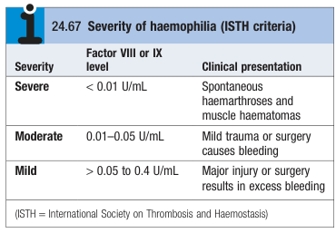
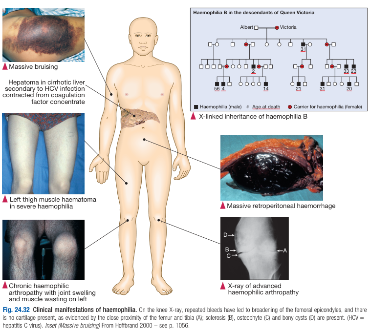

# Inherited Haemophilia A

- **Definition** - the most common coagulation factor deficiency caujsed by a deficiency of factor VIII (intrinsic pathway)
- **Epidemiology** - prevalence of 1/10000
- **Physiology of factor VIII:**
    - <u>Synthesis</u> - synthesised by the liver and endothelial cells
    - <u>Half-life</u> - short (12h)
    - <u>Protection by vWF</u> - protected from proteolysis in circulation by binding to von Willebrand factor
- **Genetics of inherited haemophilia A** - factor VIII gene found on X chromosome:
    - <u>Mode of inheritance</u> - X-linked recessive (only M affected):
        - All daughters of haemophiliacs are obligate carriers and have 25% chance of pregnancy resulting in birth of 1) affected male, 2) normal male, 3) carrier male, 4) normal female
        - Female carriers may have mild bleeding disorders due to random inactivation of normal X chromosome in developing fetus (factor VIII level assessed to determine carrier status)
    - <u>Varying genotypes determining phenotype</u> - larger deletions a/w more severe haemophilia than single-base changes ('breeds true', i.e. all affected family members will have similar severity)
- **Classification of severity of haemophilia** - ISTH criteria: 

- **Clinical features of inherited haemophilia A** - extent and pattern of bleeding related to residual factor VIII levels:
    - **Severe haemophilia** (\< 1% of normal factor VIII levels) - presents w/ <u>spontaneous</u> cutaneous bleeding, haemarthrosis, muscle haematomas, or life-threatening bleeding (e.g. ICH, retroperitoneal bleeding)
    - **Mild-to-moderate haemophilia** (1-40% of normal factor VIII levels) - similar pattern of bleeding but usually <u>after trauma or surgery</u>
    - **Musculoskeltal complications related to haemarthrosis or muscle haematoma:**
        - <u>Haemophilic arthropathy</u> - destruction of cartilage, synovial hypertrophy and **secondary osteoarthrosis** may complicate delayed Tx of haemarthrosis resulting in a very painful joint, and joint swelling
        - <u>Femoral nerve palsy</u> - complicated from a large **psoas haematoma** causing compression of the femoral nerve
        - <u>Compartment syndrome of the calf</u> - calf haematoma results in increased pressure within inflexible fascial sheath, resulting in ischaemia, necrosis and subsequent contraction and shortening of achilles tendon

  
  
- **Mx:**
    - **Principles of Mx:**
        - **Prevention of continued haemorrhage** - immbolisation by rest or splints to avoid continue haemorrhage
        - **Raising factor VIII levels:**
            - <u>Coagulation factor therapy</u> - IV infusion of factor VIII concentrates 'on demand' at earliest indication of bleeding or prophylactically
            - <u>DDAVP</u> - raises vWF and factor VIII levels and is typically more useful in those w/ mild or moderate haemophilia
        - **Rehabilitation** - mobilisation and PT to restore strength to surounding muscles
    - **Coagulation factor therapy:**
        - <u>Forms</u>:
            - Pooled plasma donor factor VIII concentrate (good safety record for viral screening and separate viral inactivation)
            - Recombinant factor VIII concentrates (more expensive but perceived to be safer)
        - <u>Timing</u>:
            - On demand for bleeding
            - Prophylaxis (e.g. 2-3x per week in children, but limited by cost)
        - <u>MOA</u> - replacement of deficient factor VIII concentrate
        - <u>Storage</u> - freeze-dried and stable at 4 degrees and can be stored in domestic refrigerators (enables self-treat on first sign of bleeding)
        - <u>Precaution</u> - recipients of pooled blood products should be offered hepatitis A and B immunisation
        - <u>Complications</u>:
            - **Risk of viral infections** - HCV infection used to be universal, while 80-90% of HBV exposure and 60% of patients becoming HIV positive, but risk is **eradicated due to introduction of viral inactivation processes**
            - **Risk of bovine spongiform encephalopathy** - theoretical risk of acquiring vCJD w/ one documented case but risk is minimised by collecting pooled plasma from countries w/ low incidence of prion diseases
            - **Acquired resistance to coagulation factor therapy** (20% of severe haemophilias) - autoAb production against VII resulting in non-therapeutic options (Tx by VIIa or FEIBA to bypass the inhibition)
    - **Vasopressin receptor agonist** (DDAVP):
        - <u>Indications</u> - role in arresting bleeding in patients w/ mild or moderate haemophilia A
        - <u>MOA</u> - raised vWF and factor VIII lvels
        - <u>Dosing</u> - 0.3 microgram/kg (IV or SC) or intranasal administration of 300 microgram
        - <u>Complications</u>:
            - Hyponatraemia
            - Thrombotic event
        - <u>C/I</u> - patients w/ history of severe arterial disease
