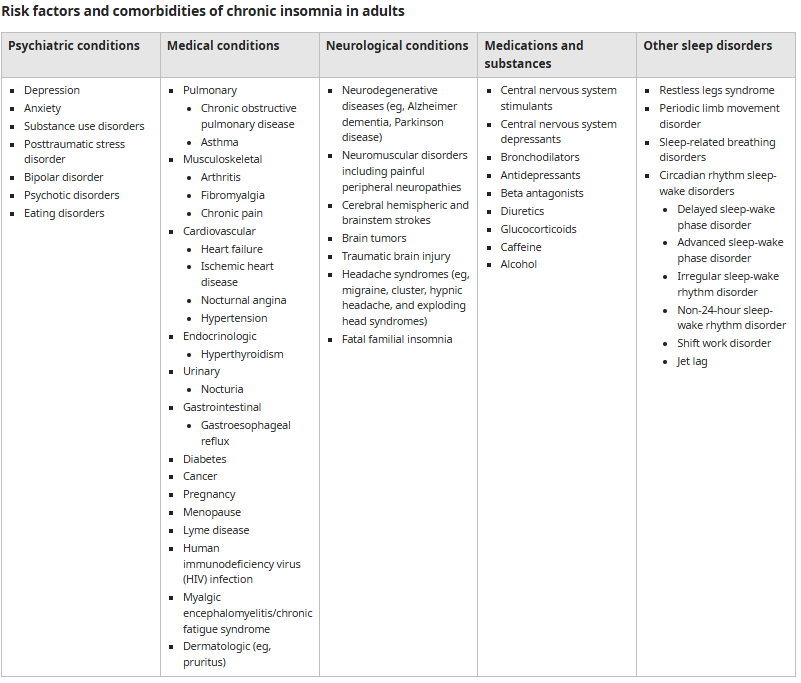

# Insomnia

- **Definition** - difficulty in falling asleep and/or staying asleep, often coexist with medical, psychiatric, sleep or neurological disorders
- **Types of insomnia** - depends on duration:
    - <u>Short-term insomnia</u> (adjustment insomnia) - insomnia that last for a few days or weeks (by definition \< 3mo) and occurs in response to an identifiable stressory
    - <u>Chronic insomnia</u> (insomnia disorder) - insomnia symptoms that occur at least 3x/ week and persists for at least 3mo
- **Clinical features of insomnia** - persistent or recurrent conditions w/ exacerbation to medical, psychiatric and psychosocial stressors:
    - **Sleep disturbances** - a general subjective, often overestimated dissatisfaction with sleep quality or duration **despite adequate opportunities and circumstances for sleep** (cf sleep deprivation):
        - <u>Difficulty in initiating sleep</u> - patients w/ insomnia tend to take \> 30 min to fall asleep
        - <u>Difficulty in maintaining sleep</u> - spending 30 min or awake during the night (or \> 5min during a night)
        - <u>Early morning awakening</u> - termination of sleep at least 30min (?or 3 hours) prior to desired wake-up time
    - **Comprimised daytime function:**
        - Generalised fatigue or malaise
        - Daytime sleepiness
        - Reduced motivation and energy
        - Ongoing worry about sleep
        - Increased errors or accidents
        - Cognitive impairments - poor attention or concentration
        - Functional limitations - occupational/ educational dysfunction
        - Mood disturbance - low mood or irritability
        - Behavioral problems - e.g. hyperactivity, impulsivity or aggression
    - **Presence of common comorbidities** - differentiation between primary insomnia (idependent of other disorders) or secondary insomnia (attributable to a comorbid psychiatric or medical condition), but in reality is difficult to make:
        - <u>Psychiatric conditions</u> - mood disorders (depressive and bipolar disorders), anxiety disorders (GAD to PTSD), schizophrenia and related diseases of psychosis, substance abuse disorders
        - <u>Medical conditions</u> - various medical conditions that result in nocturnal symptoms that affect patients sleep maintenance (see examples below)
        - <u>Neurological conditions</u> - neurodegenerative diseases (PD, AD) etc.
        - <u>Medications and substances</u> - CNS stimulants and depressants, Antidepressants, Bronchodilators and Beta-antagonists, Diuretics, Caffeine, Alcohol
        - <u>Other sleep disorders</u> - restless leg syndrome, periodic limb movement disorder, sleep-related breathing disorders, circadian rhythm sleep-wake disorders

    
    
- **Salient points of Hx:**
    - **HPI** - onset, detailed description of sleep problems, comprimised daytime function, sleep hygiene and environment:
        - <u>Onset</u> - acute vs chronic insomnia (ask about frequency of insomnia in a week)
        - <u>Detailed description of sleep problems</u> - may require sleep diary for objective assessment if significant variability:
            - **Difficulty to initiate sleep** - patients often overestimate amount a time it takes to fall asleep but reported time of \> 30 min raises suspicion of insomnia
            - **Difficulty maintaining sleep** - characterise **number** and **duration** of awakenings and ask if attributable to somatic Sx (e.g. nocturia, orthopnea, PND, cough, pain etc.)
            - **Early morning awakening** - ask if patient wakes up before desired wake up time
        - <u>Comprimised daytime function</u> - ask about excessive daytime tiredness, fatigue, malaise, difficulty in concentration, functional impairments etc.
        - <u>Sleep hygiene</u> - any recent changes or variability in bedtime, wakeup time, and naps
        - <u>Sleep environment</u> - is it atiributable to sleep deprivation where environment is not conducive asleep?
    - **Ideas, concerns and expectations:**
        - **Ideas:**
            - <u>Somatic Sx</u> - nocturia (DM or LUTS), orthopnoea/ PND, pain can result in difficulty in sleep maintenance
            - <u>Psychiatric conditions</u> - psychological stress, depression, anxiety
            - <u>Lifestyle</u> - exercise, caffeine, alcohol shortly before bedtime
            - <u>Poor sleep hygiene</u> - irregular bedtimes result in difficulty in sleep initiation
        - **Concerns** - note that insomnia is a potential masquerade for DM and depression, but concerns may be work or lifestyle related (e.g. a taxi driver with insomnia)
        - **Expectation** - sleep medications? diagnosis of root cause? functional capacity?
- **Associated Sx** - if applicable by probing at comorbid sleep disorders:
    - <u>Periodic limb movements</u> - nocturnal myoclonus or restless leg syndrome
    - <u>Snoring or apnoea</u> - apnoea-hypoapnoea disorders
    - <u>Orthopnoea, PND, LL swelling</u> - congestive heart failure
- **SHx:**
    - <u>Occupation</u> - shift worker (circadian rhythm sleep disorders or or sleep deprivation), driver (high risk for RTA)
    - <u>Recent travel</u> - jet lag
    - <u>Alcohol</u> - contributing factor to insomnia
    - <u>Caffeine</u> - contributing factor to insomnia
    - <u>Smoking</u> - contributing factor to insomnia
- **P/E:**
    - <u>BP measurement</u> - worsening HTN suggestive of sleep abnoea
    - <u>Examination of oral cavity</u> - excessive oropharyngeal tissue in OSA
    - <u>Other signs</u> - e.g. LL pitting oedema in congestive heart failure
- **Ix** - as clinically indicated:
    - <u>Echocardiography and ECG</u> - if suspected HF
    - <u>Fasting blood glucose and HbA1c</u> - if suspected DM
    - <u>TFT</u> - if suspected thyrotoxicosis
    - <u>Iron studies</u> - if suspected restless legs syndrome
    - <u>Polysonography</u> - if suspected OSA
- **Screening tools:**
    - PHQ2/9 - screen for depression
    - GAD7 - screen for GAD or other anxiety disorders
- **Dx criteria of insomnia** - International Classification of Slee Disorders 3e requires 4 of the following:
    - <u>Sleep disturbances</u> - difficulty in initiating sleep, maintaining sleep, or early morning wakening
    - <u>Adequate sleep hygiene and environment</u> - context conducive to sleep
    - <u>Comprimised daytime functions</u> - fatigue, impaired cognition (attention, concentration, memory), functional limitation (familial, vocational, educational), mood disturbances, daytime sleepiness etc.
    - <u>Not attributed to comorbid condition</u> - not fully explained by medical, psychiatric, substance/ medication use or neurological disorders
- **Psychoeducation on sleep hygiene** - practices and habits that are necessary to have good night-time sleep quality and full daytime alertness (US National Sleep Foundation):
	
	![[Pasted image 20260418170425.png]]
	- 1. _Limiting daytime maps to 30 minutes_:
		- A short nap of 20-30 minutes can help to improve mood, alertness and performance.
		- Napping does not make up for inadequate nighttime sleep.
	- 2. _Avoiding stimulants or alcohol close to bedtime_:
		- Stimulants such as caffeine and nicotine may result in insomnia.
		- While alcohol is well-known to help you fall asleep faster, too much close to bedtime can disrupt sleep in the second half of the night as the body begins to process the alcohol.
	- 3. _Exercise to promote good quality sleep_:
		- As little as 10 minutes of aerobic exercise, such as walking or cycling, can drastically improve night-time sleep quality.
		- For the best night’s sleep, most people should avoid strenuous workouts close to bedtime (< 3h). However, the effect of intense nighttime exercise on sleep differs from person to person, so find out what works best for you. 
	- 4. _Steering clear of food that can be disruptive right before sleep_:
		- Avoid foods that cause heartburn or dyspepsia, such as spicy food, carbonated drinks, or fatty/ fried food before bedtime.
		- Discomfort caused may disrupt with sleep.
	- 5. _Ensuring adequate exposure to natural light_:
		- Exposure to sunlight during the day, as well as darkness at night, helps to maintain a healthy sleep-wake cycle.
		- This is particularly important for individuals who may not venture outside frequently.
	- 6. _Establishing a regular relaxing bedtime routine_:
		- A regular nightly routine helps the body to recognize that it is bedtime. 
		- This could include taking a warm shower or a bath, reading a book, or doing light stretches exercise.
		- Try to avoid emotionally upsetting conversations and activities before attempting to sleep. 
	- 7. _Making sure the sleep environment is pleasant_:
		- Mattress and pillows should be comfortable. 
		- The bedroom should be of an appropriate temperature. 
		- Bright light from lamps, cell phones and TV screens can make it difficult to fall asleep. So turn those lights off or adjust them when possible. 
		- Consider using blackout curtains, eye shades, ear plugs, "white noise" machines, humidifiers, fans and other devices that can make the bedroom more relaxing.
	- 8. _Cognitive behavioural approaches to treat insomnia_:
		- Avoid ruminations when lying in bed, which perpetuates the insomnia; set up a journal to write down thoughts or to set strict rules regarding the areas where ruminations are allowed.
		- Reduced meta-cognition of the sleep disturbances, e.g. removing unrealistic expectations about sleep.
		- Employing distracting techniques such as mindfulness-based exercises and progressive relaxation techniques.
