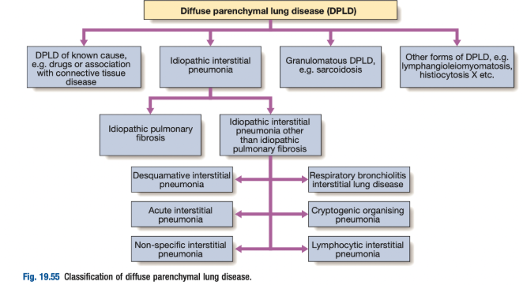
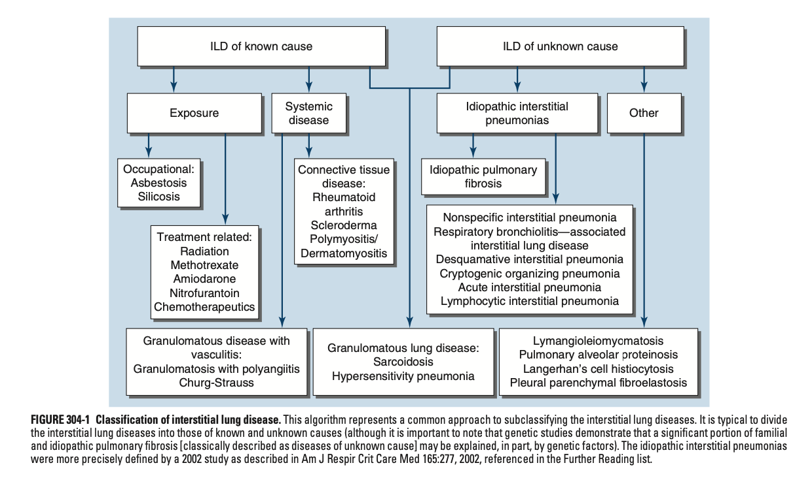
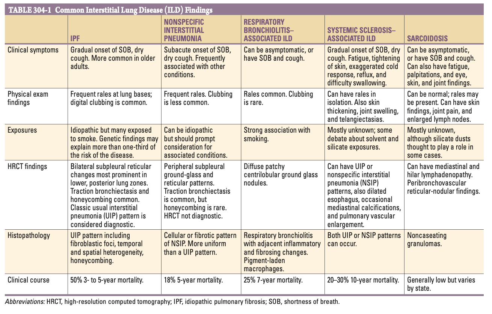
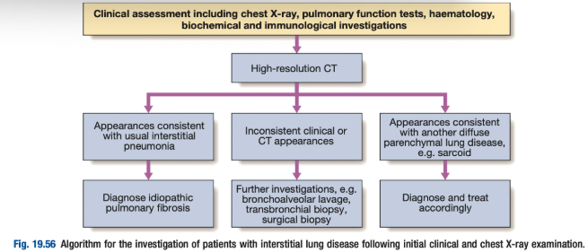

# Interstitial Lung Disease

- **Definition and terminology:**
    - <u>Diffuse parenchymal lung disease</u> - a large number (\> 200) of heterogenous conditions that affect the lung parenchyma with varying degrees of inflammation and fibrosis
    - <u>Interstitial lung disease</u> - old terminology as pathology thought to reside mainly in the interstitium
- **Grouping of ILDs** - disease group due to similar 1) pathophysiology, 2) clinical features, and 3) radiographical features:
    - <u>Similar pathophysiology</u> - inflammation followed by fibrosis, resulting in 1) restrictive lung functions, 2) increased thickness of the alveolo-capillary membrane (impaired gas exchange)
    - <u>Similar clinical course and features</u> - relentlessly progressive (most), with compatible systemic and respiratory S/S
    - <u>Similar lung function patterns</u> - Restrictive pattern, Reduced lung volume, reduced DLCO
    - <u>Similar radiological findings</u> - ground glass and reticulonodular shadowing, progressing into honeycomb cysts and tractio bronchiectasis
- **Classification of ILDs** - division into those of 1) known, and 2) unknown causes:  

    - **Known causes of IBD:**
        - <u>Occupational lung disease</u> - e.g. asbestosis, silicosis
        - <u>Treatment-associated ILDs</u> - e.g prior radiation, nitrofurantoin, bleomycin, amiodarone, methotrexate, other chemotherapeutics
        - <u>ILDs related to an underlying systemic disease</u>:
            - Connective tissue disease - SSc, RA, immune-mediated myositis (associated w/ COP)
            - Granulomatous disease w/ vasculitis - GpA, EGpA
        - <u>Other known exposures</u> - hypersensitivity pneumonitis (e.g. chronic bird exposure)
    - **Unknown causes of ILD** - evaluation based on 1) epidemiology (disease prevalence), 2) pattern recognition of presentation, imaging findings etc.:
        - <u>Idiopathic interstitial pneumonia</u> (most common) - further classified into different causes
        - <u>Sarcoidosis ssociated ILDs</u> - systemic granulomatous disease
        - <u>Other ILDs of unknown causes</u> - non-specific disease entity classified based on unique presentation, imaging findings, and diagnostic evaluation:
            - Lymphagnioleimyomatosis - classically spontaeus pneumothorax in a young female with diffuse cystic changes on CT thorax
            - Pulmonary alveolar proteinosis
            - Langerhan's cell histocytosis
            - Pleural parenchymal fibroelastosis
- **Rationale for timely Dx of ILDs** - associated w/ high morbidity and mortality
- **Clinical presentation of ILDs** - although some asymptomatic, most will present w/ respiratory Sx:
    - **Asymptomatic** - may be identified incidentally based on the results of abnormal PFTs, CXRs, CT T+A+P/ HRCT, or PET
    - **Respiratory symptoms** - most will come to medical attention w reports of:
        - <u>Dyspnoea</u> - a relentlessly progressive exertional dyspnoea, in the absence of orthopnea or PND
        - <u>Cough</u> - chronic dry cough
    - **Evidence of multisystem involvement** - additional non-respiratory symptomatology may be yielded from Hx and P/E which prompts search for an underlying cause:
        - <u>SSc</u> - associated w/ skin thickening and Raynaud's phenomenon
        - <u>RA</u> - hand deformity such as ulnar's deviation and other RA hand signs; rheumatoid nodules etc.
- **Findings of common ILDs:** 

- **Dx** - accepted central tenet of ILD Dx based on evaluation of various information often in a multidisciplinary approach; no single piece of data alone confers Dx:
    - Clinical data (HPI, PMH, Drug Hx, Occupation)
    - Laboratory studies
    - Radiological findings
    - Pulmonary function testing
    - Histopathology (if obtained)
- **DDx of ILDs:**
    - Cardiovascular disease (e.g. heart failure)
    - Diffuse chest infections (e.g. PJP)
    - Malignancy (e.g. bronchoalveolar cell carcinoma)
- **Initial diagnostic approach to DPLD:**
    - <u>Evaluation for alternative causes</u> - r/o other DDx through Ix
    - <u>Distinguish among various forms of ILD</u> - Hx, P/E, Ix
- **Subsequent diagnostic evaluation of DPLD** - pinpointing a specific Dx based on concordance of clinical, laboratory, radiological data to determine whether additional Ix required: 

- **Salient points of Hx:**
    - **Demographic:**
        - <u>Age</u> - strong influence on pre-test probability that IPF is present:
            - \> 60-65y - most common in older patients (esp. if no other evidence for alternative Dx, atypical HRCT are still more likely to show UIP on histopathology
            - \<50y - IPF quite rare among younger patients, consider other common causes such as sarcoidosis, CTD-associated ILD, or even rarer causes such as LAM, or PLCH (typically presents at 20-40y)
        - <u>Sex</u> - some influence on the likelihood of various ILDs:
            - LAM (and related disorder of tuberous sclerosis) is frequently Dx in young women
            - CTD-associated ILDs are more common among women except for RA-associated ILD which is paradoxically more common in men
            - Occupational/ exposure-related ILD are more common in men probably due to differences in work-related exposures
    - **HPI:**
        - **Onset and duration:**
            - <u>Acute presentations</u> (days to weeks) - unusual but may be misdiagnosed as other diseases; common ILDs presenting acutely include 1) eosinophilic pneumonia, 2) acute interstitial pneumonia (AIP), 3) hypersensitivity pneumonitis (HP), 4) granulomatous with polyangitis (GpA), 5) acute exacerbation of IPF (considered due to prevalence)
            - <u>Subacute presentation</u> (weeks to months) - theoretically any IPF can present subacutely, but consider the following if in the right context:
                - CTD-associated ILD
                - Drug-induced ILD (incl. radiation)
                - Cryptogenic organising pneumonia (COP)
                - Sarcoidosis
            - <u>Chronic presentations</u> (months to years) - most ILDs, typified by **IPF**
        - **Respiratory and non-respiratory Sx** - progressive exertional dyspnoea is the most common complaint but may be minimal or absent even with extensive disease:
            - <u>Fatigue</u> - common feature to most respiratory diseases
            - <u>Cough</u> - particular a dry cough, can be a prominent feature in IPF, and other ILDs w/ substantial airway involvement (HP, sarcoidosis)
            - <u>Haemoptysis</u> - ILD associated w/ diffuse alveolar damage, such as Goodpasture syndrome, LAM, or GpA; consider secondary infections for those w/ established ILDs on immunosuppressants or developed tractional bronchiectasis
            - <u>Chest pain</u> - rare in ILD, w/ the exception of sarcoidosis
    - **Associated Sx:**
        - **Systemic Sx:**
            - <u>Fatigue</u> - common feature to most ILDs and is non-specific
            - <u>Fever</u> - conditions that mimics pneumonia such as COP, HP, AIP
            - <u>Weight loss</u> - consider malignancy
        - **Features of connective tissue disease:**
            - <u>Rash and photosensitivity</u> - consider dermatomyositis
            - <u>Polyarthritis</u> - consider RA
            - <u>Symmetrical proximal myalgia</u> - consider dermatomyositis and myalgia
            - <u>Skin thickening</u> - e.g. puffy fingers, consider SSc
            - <u>Raynaud's phenomenon</u> - characteristic colour changes, consider SSc although seen in many CTDs
    - **PMH**:
        - <u>Prior irradiation</u> - e.g. Hx of CA breast, CA lung, lymphoma
        - <u>Connective tissue disease</u> - note that ILD may be the initial presentation of CTD:
            - Personal Hx of CTD (SSc, RA, myositis)
            - Screen for Sx commonly ssociated w/ STD (Raynaud's phenomenon, skin thickening, arthritis, myositis, rash/ photosensitivity)
        - <u>Active malignancy</u> - dermatomyositis-associated COP and sarcoid-like reactions
        - <u>Asthma and allergic rhinitis</u> - suggestive of diagnosis of EGpA
        - <u>Chronic sinusitis</u> - suggest a Dx of GpA (although rare in Asians)
    - **Drug Hx:**
        - <u>Agents known to cause ILD</u> - ABx (nitrofurantoin), antiarrhythmics (amiodarone), antineoplastics (bleomycin)
        - <u>Other drugs</u> - methotrexate, azathioprine, rituximab, anti-TNF agents
    - **FHx:**
        - <u>ILD</u> - irrespective of type (familial clustering of various IIPs not just IPF); familial IPF as opposed to idiopathic may be as high as 20%
        - <u>CTD</u> - note that ILD may be the initial presentaiton of CTD
    - **SHx:**
        - <u>Smoking</u> - +ve smoking Hx always present in smoking-related ILD (respiratory bronchiolitis and DIP); also present in 75% of IPF patients (not sure if causative)
        - <u>Occupational and environmental exposures</u>:
            - Asbestos (e.g. ship building, construction)
            - Chronic bird exposures (e.g. pigeon breeder's lung)
        - <u>Hobbies</u> - to tease out any other potential exposure
- **P/E:**
    - **Features of CTD:**
        - <u>SSc</u> - skin thickening, telangiectasia, Maskpouf facies (e.g. microstomia)
        - <u>RA</u> - RA hand deformity (wrist and fingers), rheumatoid nodules
        - <u>Dermatomyositis/ Polymyositis</u> - cutaneous manifestations (e.g. Gottron's papules)
    - **Auscultations:**
        - <u>Fine crackles</u> - usually in lung bases for IPF but is non-specific and presen in many ILD
        - <u>Wheeze</u> - present in disorders w/ significant airway involvement, such as sarcoidosis, HP, EGpA
    - **Signs of advanced disease:**
        - <u>Digital clubbing</u> - usually only in advanced IPF (and asbestosis), but not in all forms of ILD
        - <u>Central cyanosis</u> - ventilatory failure resulting in hypoxia
        - <u>Cor pulmonale</u> - evidence of RHF and systemic venous congestion
- **Ix:**
    - **Laboratory Ix:**
        - **Baseline bloods** - CBC, RFT, inflammatory markers:
            - <u>CBC</u> - WCC count provides additional information:
                - Eosinophilia - suggestive of eosinophilic pneumonitis, EGpA etc.
                - Neutrophilia - suggestive of hypersensitivity pneumonitis
                - Lymphopenia - suggestive of sarcoid
            - <u>RFT</u> - demonstration of multisystemic disease affecting the kidneys, e.g. EGpA, Goodpasture's syndrome (consider <u>urine dipstick and urinalysis</u>)
            - <u>ESR/CRP</u> - non-specifically elevated
        - **Additional biochemistries** - Ca, LDH, serum ACE:
            - <u>CK</u> - for associated myositis
            - <u>Ca2+</u> - suggestive of sarcoid
            - <u>LDH</u> - marker of active alveolitis
            - <u>Serum ACE</u> - non-specific indicator of disease activity of sarcoidosis
            - <u>ESR/CRP</u> - non-specifically elevated
        - **Autoimmune markers** - ANA, Anti-centromere, Anti-Sc70, Anti-RNP, RF, Anti-CCP
    - **Pulmonary function tests** - most shows restrictive deficits, w/ role in evaluation of disease extent and prognosis:
        - <u>Spirometry</u> - reduced FVC \< 70% predicted, w/ symmetrically-reduced FEV1:
            - Often accompanied by FVC1/FEV ratio \> 80%
            - Obstructive pattern (i.e. FVC1/FEV ratio \< 70%) unusual but maybe caused by ILD w/ airway obstruction (HP, LAM, sarcoidosis)
            - Decreasing FVC associated w/ increased mortality rates
        - <u>Lung volume studies</u> - reduced TLC symmetrical to reduced FEV1 and FVC
        - <u>DLCO</u> - reduction is common and may precede reduction in lung volumes (although less-specific)
    - **Imaging:**
        - **CXR** - rarely leads to specific Dx; usually first clinical indication that ILD is present:
            - <u>Bibasilar reticulonodular shadowing</u> - may suggest IPF
            - <u>Hilar LN and central nodular opacities in mid-to-upper lung</u> - may suggest sarcoidosis
        - **HRCT** - may be diagnostic for some ILDs in the right context and precludes the need for Bx:
            - <u>Role</u>:
                - Diagnosis and preclude need for lung Bx
                - Guide site for obtaining Bx
                - Evaluation of disease extent (e.g. presence of honeycombing)
                - Evaluation of co-existing disease (e.g. emphysema, lung cancer)
    - **Lung biopsy:**
        - **Fibreoptic bronchoscopy** - role in establishing specific ILD Dx:
            - <u>Serial BAL fluid</u>:
                - Establish diffuse alveolar haemorrhage (DAH) - e.g. GpA, Goodpasture syndrome
                - Cellular examination (e.g. eosinophilia \> 25% for chronic eosinophilic pneumonia or fat globules in macrophages for lipoid pneumonia)
            - <u>Bx</u> - transbroncial lung Bx and LN Bx:
                - Usually felt to be insufficient to Dx most of the IIPs
                - LN Bx has role in establishing granulomatous lung disease (sarcoid, HP)
        - **Surgical lung Bx** (VATS approach) - much higher diagnostic yield but up to 5% short-termmortality rate
