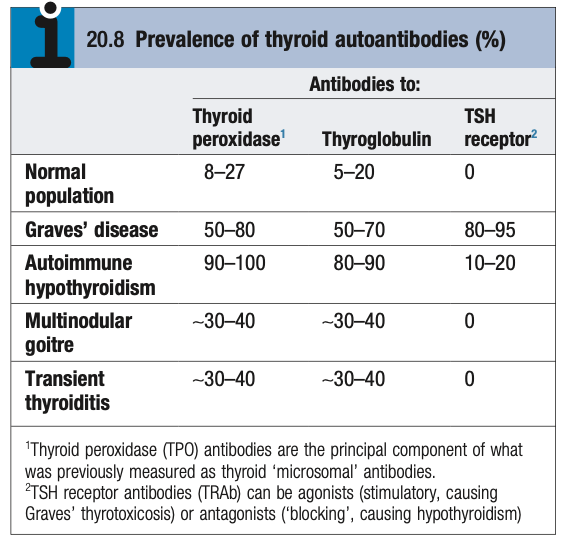

# Investigations of Thyroid Disease

- **Thyroid function tests** - contains total T4, free T4, and TSH:
    - Total T4 - measures all T4 including free and protein-bound forms (rarely interpreted on its own)
    - Free T4
    - TSH - most sensitive test due to inverse log-linear relationship with T4, but may lag behind by several weeks
- **Autoantibodies:**
    - Anti-TSHR - may be stimulatory, or blocking, diagnostic of Graves'
    - Anti-TG - Autoantibodies against TG
    - Anti-TPO - Autoantibodies against thyroid peroxidase

  
  
- **Thyroid US** +/- FNAC
- **Radio-isotope scan**
