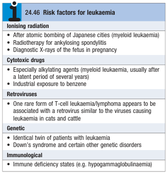
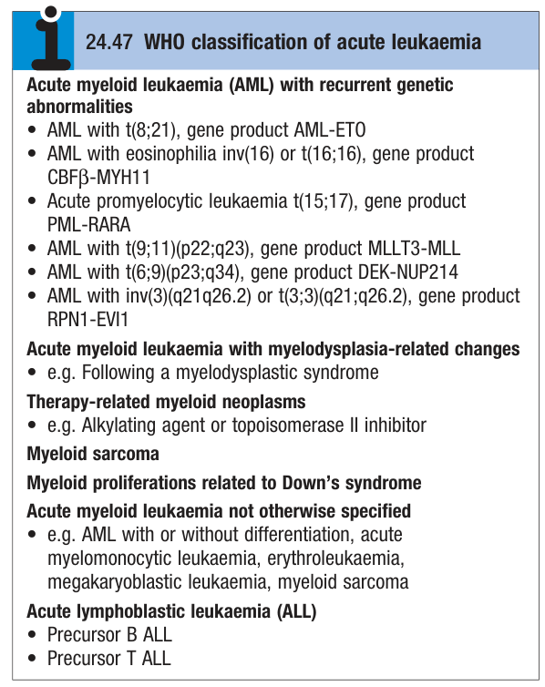

# Leukaemia

- **Definition** - malignant disorder of haematopoietic stem cell compartment, characteristically a/w increased number of white cells in the bone marrow and/or peripheral blood
- **Epidemiology** - relatively rare disease:
    - **Incidence** - 10/100,000/y (\< 50% are acute leukaemia)
    - **Demographic:**
        - <u>Age</u>:
            - Acute lymphoblastic leukaemia - peak incidence in 1-5y, but can occur at all ages
            - Acute myeloid leukaemia - lowest incidence in young adult life, but striking rise in incidence \>50y
            - Chronic leukaemias - disease of the middle age and elderly
        - <u>Sex</u> - male preponderance:
            - Acute leukaemia - M:F = 3:2
            - Chronic lymphocytic leukaemia - M:F = 2:1
            - Chronic myeloid leukaemia - M:F = 1.3:1
        - <u>Geographic variation</u> - strikingly low incidence of CLL in Chinese and related races
- **Risk factors for leukaemia** - not fully understood: 

- **Terminology and classification of leukaemia:**
    - **Classification into 4 main groups of leukaemia:**
        - Acute lymphoblastic leukaemia (ALL)
        - Acute myeloid leukaemia (AML)
        - Chronic lymphocytic leukaemia (CLL)
        - Chronic myeloid leukaemia (CML)
    - **Classification by chronicity:**
        - <u>Acute leukaemia</u> - increased proliferation and arrested maturation, leading to accumulation of blasts, predominantly in the bone marrow, causing bone marrow failure
        - <u>Chronic leukaemia</u> - increased proliferation with preserved differentiation, leading to accumulation of more mature cells
    - **Classification by lineage of origin:**
        - <u>Lymphoid lineage</u> - ALL or CLL
        - <u>Myeloid lineage</u> - AML or CML
    - **WHO classification of tumours of haematopoietic and lymphoid tissues** - based on morphology, immunophenotyping, karyotyping, and molecular genetics: 
    
