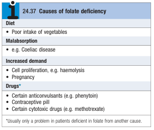
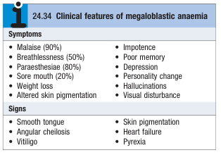
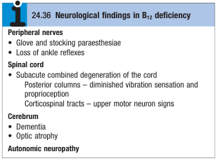
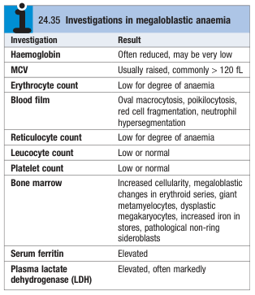

# Megaloblastic Anaemia

- **Definition** - anaemia a/w megaloblastosis caused as due to nucleocytoplastmic asynchrony from impaired DNA synthesis, usually caused by B12 or folate deficiency

- **Role of folate and B12 in DNA synthesis** - methionine necessary for synthesis of tetrahydrofolate which is converted into TMP for incorporation into DNA:

    - <u>Folate</u> - severes as an important substrate for generation of methionine from homocysteine
    - <u>B12</u> - serves as an important co-factor for methionine synthesis from homocysteine (N.B. raised homocysteine levels reflect either B12 or folate deficiency)

- **Effects of impaired DNA synthesis in proliferating cells** - this manifests as megaloblastic anaemia in the highly proliferative haematopoietic system, but also seen in the 1) buccal mucosa, 2) tongue, 3) small intestine, 4) cervix, 5) vagina, and 6) uterus:

    - <u>Nucleocytoplasmic asynchrony</u> - arrested nuclear maturation due to impaired DNA synthesis, but normal cytoplasmic development occurs
    - <u>Megaloblastosis</u> - persistent increase in cytoplasmic volume with arrested cell cycle due to impaired DNA synthesis results in increased cell size in highly proliferative cells
    - <u>Short live cycle</u> - cells become arrested in development and undergoes apoptosis, which underlies intra-medullary haemolysis and high LDH in megaloblastic anaemia

- **Physiology of B12 metabolism:**

    - <u>Dietary B12</u> - average daily diet containing <u>animal products</u> (meat, fish, milk, eggs) cotain 5-30 mcg of B12 (well in excess of dietary requirement of 1 mcg/d)
    - <u>Absorption of B12</u>:
        - Gastric acid and enzymes required to liberate B12 from food sources which temporarily binds to R protein at gastric pH
        - Parietal cells release intrinsic factor, which optimally binds to vitamin B12 at pH8 (i.e. after gastric emptying, transfer of B12 from R protein to IF)
        - Absorption of B12-IF complex in internal leum
    - <u>Transport of B12</u> - transfer of B12 to transcobalamin II, where it is delivered to the liver for storage
    - <u>Stores of B12</u> - up to 3y of B12 storage in the liver, such that clinically significant B12 deficiency takes years to develop even if all dietary intake stops
    - <u>Utilisation of B12</u> - as co-factor of DNA synthesis
    - <u>Measurement of B12</u>:
        - Total B12 level is reasonably indicative of tissue stores, but MMA, homocysteine and holotranscobalamin are more Sn markers
        - Cobalamin markers are fall during pregnancy w/ trimesteric references ranges are adopted
        - B12 assays may be interfered by women on COC pills or paraproteinaemia

- **Etiology of B12 deficiency:**

    - <u>Dietary deficiency</u> - only occurs in strict vegans (less strict vegetarians often have biochemical B12 deficiency but tissue B12 is sufficient)
    - <u>Gastric pathology</u>:
        - Ahydrochloria (of the elderly, or chronic atrophic gastritis)
        - Partial or total gastrectomy
        - Pernicious anaemia
    - <u>Small bowel pathology</u>:
        - Surgical resection of terminal ilium
        - Ileal Crohn's disease
        - Small bowel bacterial overgrowth (e.g. hypogammaglobulinaemia, motility disorders)
        - Fish tape worms
        - Pancreatic exocrine deficiency (fail to transfer dietary B12 from R protein to IF)

- **Physiology of folate metabolism:**

    - <u>Dietary folate</u> - present in leafy vegetables, fruits, and animal proteins (liver, kidneys) but excess cookingdestroys folates
    - <u>Absorption of folate</u> - dietary folates are polyglutamates and are converted into monoglutamates in the SB and actively transported into plasma
    - <u>Stores of folate</u> - loosely bound to albumin (small stores and deficiency can occur in matter of weeks \[cf B12\])

- **Etiology of folate deficiency:** 

- **Pathophysiology of megaloblastic anaemia** - impaired DNA synthesis due to B12 or folate deficiency:

    - **Nucleocytoplasmic asynchrony and megaloblastosis** - arrested nuclear development w/ persistent cytoplasmic development <u>most evident in erythrocyte precursors</u>, resulting in increased corpuscular volume, where <u>MCV becomes markedly raised and typicaly \> 120 fL</u>
    - **Ineffective erythropoiesis** - <u>intra-medullary haemolysis</u> occurs due to the arrested cell cycle, which is further compensated by an <u>expanded hyercellular marrow</u>, resulting in **raised bilirubin and LDH w/o reticulocytosis**
    - **Effects of other cell lineages** - other lineages are subsequently affected if severe:
        - <u>Pancytopenia</u> - reduced WBC and PLT counts may be present in peripheral blood
        - <u>Characteristic blood smear findings</u> - see below

- **Clinical features of megaloblastic anaemia:**

    - **Sx of anaemia** - insiduous in onset and typically manifests as malaise (90%), or SOBOE (50%), while features of tissue hypoxia (e.g. angina) is rare as megaloblastic anaemia occurs slowly
    - **Other manifestations of B12 deficiency:**
        - <u>Mucosal manifestations</u> - e.g. sore mouth, beefy tongue etc.
        - <u>Neuropsychiatric manifestations</u> (40%):
            - Peripheral neuropathy (parasthesia in 80%)
            - Subacute combined degeneration of the cord (UMN + loss of proprioception)
            - Cortical manifestations (e.g. poor memory, depression, personality changes, hallucinations)
            - Optic atrophy
            - Autonomic neuropathy

  
  

- **Signs of megaloblastic anaemia:**

    - **General examination:**
        - <u>Pallor</u> - reflects anaemia (can be severe)
        - <u>Jaundice</u> - reflects intramedullary haemolysis
        - <u>Beefy tongue</u> (atropic glossitis) - smooth, red tongue w/ loss of papillae a/w pain and tenderness
        - <u>Oral ulcers</u> - often found in the mucosa and are sore
        - <u>Angular stomatitis</u> (angular cheilosis) - painful, sores around the angle of the tongue
        - <u>Early greying of hair</u> - specific sign of pernicious anaemia
    - **Neurological examination** - for B12 deficiency: 
    

- **Ix:**

    - **Routine bloods** - CBC, retic count, LFT, LDH, iron profile:
        - <u>CBC</u> - macrocytic (MCV \> 120 fL) anaemia +/- pancytopenia (RBC low for degree of anaemia)
        - <u>Retic</u> - absence of reticulocytosis despite haemolysis
        - <u>LFT</u> - hyperbilirubinaemia
        - <u>LDH</u> - often markedly elevated reflecting haemolysis
        - <u>Iron profile</u> - elevated ferritin (increased iron stores)
    - **Peripheral blood smear** - a severe pancytopenia may be seen:
        - <u>RBC</u> - macro-ovalocytes, poikilocytosis
        - <u>WBC</u> - hypersegmented neutrophils (5-6 nuclear lobes)
    - **Bone marrow examination** - often required if myelodysplsatic syndrome cannot be r/o:
        - <u>Cellularity</u> - hypercellular marrow
        - <u>Erythroid series</u> - megaloblastosis (+/- pathological non-ring sideroblasts reflecting increased iron stores)
        - <u>Granulocyte series</u> - 'giant' metamyelocytes w/ sausage-shaped nuclei
        - <u>Megakaryocyte series</u> - mild dysplastic changes to megakararyocytes

  
  

    - **Additional Ix of underlying causes:**
        - <u>B12 and folate levels</u> - identify B12 or folate deficiency
        - <u>Homocysteine levels</u> - elevated in B12 or folate deficiency (more Sn)
        - <u>Methylmalonic acid levels</u> - elevated in B12 deficiency
        - <u>Holotranscobalamin levels</u> - most Sn for B12 deficiency
        - <u>Anti-parietal cell Ab and Anti-intrinsic factor Ab</u> - Dx of pernicious anaemia
        - <u>OGD</u> - for gastric pathology

- **Mx:**

    - **Principles of Mx:**
        - <u>Symptomatic Mx</u> - transfusion rarely required but may be used if acutely symptomatic
        - <u>Mx of vitamin B12 defifiency</u> - replacement by IM hydroxycobalamin
        - <u>Mx of folate deficiency</u> - replacement by oral folic acid

- **Pernicious anaemia** - organ-specific autoimmune disease against parietal cells, reducing IF secretion and B12 absorption:

    - <u>Definition</u> - Organ-specific autoimmune disorder with atrophic gastric mucosa and loss of parietal cells
    - <u>Pathophysiology</u> - Autoantibodies against parietal cells result in:
        - Reduced IF secretion - \< 1% of B12 is absorbed
        - Chronic atrophic gastritis
        - Achlorohydria - risk of iron-deficiency anaemia and progression into CA stomach
    - <u>Autoimmune associations</u> - more common in those with Autoimmune thyroid diseases, vitiligo, or Addison's disease, +ve FHx of pernicious anaemia
    - <u>Diagnosis</u> - demonstration of auto-antibodies:
        - Anti-parietal cell antibodies - high sensitivity
        - Anti-intrinsic factor antibodies - high specificity
        - Schilling's test (historical interest)
