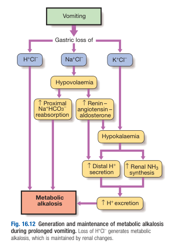

# Metabolic Alkalosis

- **Definition** - process of progressive alkalisation of plasma characterised by an increase in plasma pH and HCO3
- **Etiology of metabolic alkalosis** - classified by volume status:
    - **Hypovolaemic metabolic alkalosis** - process involving loss of **acid-rich fluid**:
        - <u>Vomiting</u> - primary mechanism is not through expulsion of gsatric acid, rather renal H+ loss due to secondary hypoaldosteronism and other tubular factors (arising from hypovolaemia)
        - <u>Diuretics</u> (loop or thiazide) - results from excess Na delivery to distal tubules and thus increased renal H+ loss

    
    
    - **Normovolaemic or hypervolaemic metabolic acidosis** - process involving HCO3 retention and volume expansion simultaneously:
        - <u>Primary hyperaldosteronism</u> - excessive aldosterone stimulation resulting in increased distal K and H+ secretion
        - <u>Cushing's syndrome</u> (incl. long-term corticosteroid therapy) - excessive minerocorticoid stimulation
        - <u>Overuse of antacids</u> - can produce a similar pattern
- **Clinical features of metabolic alkalosis** - Sx may be dominated by the underlying cause (e.g. vomiting):
    - <u>Tetany and carpopedal spasm</u> - showing signs of **functional hypocalcaemia** as alkalosis results in increased binding capacity of albumin for Ca, hence **reducing ionized Ca levels**
    - <u>Hypoventilation</u> - as a result of respiratory compensation to raise PCO2, but effect is **limited by the need to avoid hypoxia** and hence is **rarely observed**
- **Mx:**
    - **Principles of Mx** - depends on the volume status and underlying cause:
        - <u>Hypovolaemic metabolic alkalosis</u> - Tx by correcting hypovolaemia
        - <u>Normovolaemic and hypervolaemic metabolic alkalosis</u> - Dx and Tx of underlying endocrine pathology
    - **IV infusion of normal saline with potassium supplements** - indicated for hypovolaemic metabolic alkalosis:
        - <u>MOA</u>:
            - Normal saline (0.9%) infusion to correct hypovolaemia **aborts secondary hyperaldosteronism**, reducing distal H+ secretion and resulting in renal loss of excess alkaline in urine
            - K supplementation is necessary as most patients have concomittent renal loss of K
        - <u>S/E</u> - overcorrection results in **hyperchloraemic metabolic acidosis**
