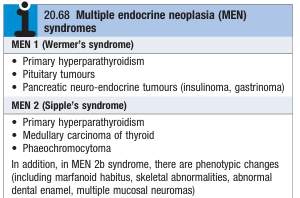

# Multiple Endocrine Neoplasia

- **Definition** - rare autosomal dominant syndromes characterised by hyperplasia and formation of adenomas or malignant tumours in multiple endocrine glands
- **Types of MEN syndromes:** 

    - <u>MEN 1</u> (Werner's syndrome) - Primary HyperPTH, Pituitary tumoures, Pancreatic NET
    - <u>MEN 2</u> (Sipple's syndrome) - Primary HyperPTH, phaeochromocytoma, medullary carcinoma of the thyroid
- **Pathophysiology of MEN syndromes:**
    - <u>MEN 1</u> - inactivation of MENIN, a tumour suppressor gene on chromosome 11
    - <u>MEN 2</u> - gain-of-function mutation of RET proto-oncogene in chromosome 10, resulting in constituitively active TK that controls development of cells originating from the neural crest (cf LOF mutation results in Hirschprung's disease)
- **Clinical suspicion of MEN syndrome:**
    - 1\. Two or more endocrine tumours within the same individual (esp. if one is primary hyperPTH)
    - 2\. Presentation with one endocrine tumour with FHx of other endocrine tumours
- **Dx** - genetic testing on individual and relatives
- **Mx of MEN 1:**
    - <u>Surveillance programe</u> - annual clinical assessment (Hx, P/E), serum Ca levels, GI hormones, and prolactin, with MRI of pituitary and pancreas at less frequent intervals
- **Mx of MEN 2:**
    - <u>Surveillance porgrame</u> - annual clinical assessment (Hx, P/E), serum Ca levels, urine catecholamines and metabolites
    - <u>Prophylactic thyroidectomy in childhood</u> - as penetrance of medullary carcinoma of thyroid is near 100% in individuals w/ RET mutation
