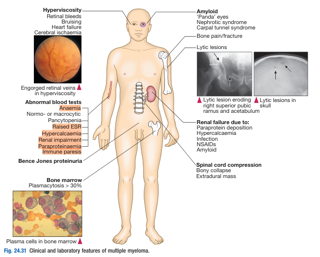
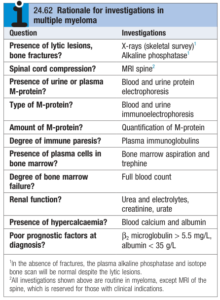
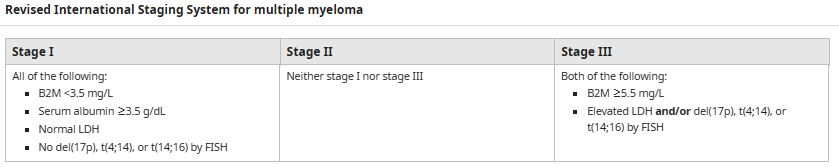
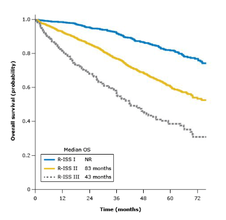
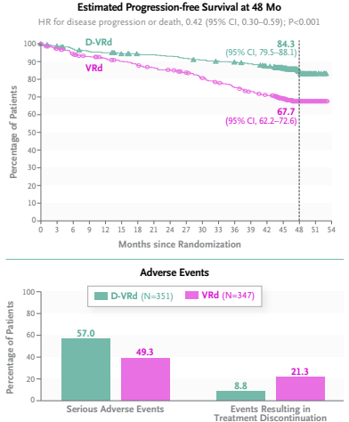
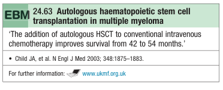

# Multiple Myeloma

- **Definition** - malignant clonal expansion of plasma cells a/w end-organ damage and myeloma defining events
- **Epidemiology:**
    - <u>Incidence</u> - 4/100000/y
    - <u>Demographic</u>:
        - Age - median age of Dx in 6-7th decade of life
        - Sex - male preponderance (M:F = 2:1)
- **Pathophysiology of multiple myeloma:**
    - **Clonal expansion of MM** - acquisition of multiple mutations within plasma cells results in accumulation of malignant plasma cells <u>within bone marrow</u>
    - **Paraproteinaemia** - clonal expansion of plasma cells results in secretion of single clone of immunoglobulin, with single heavy chain and <u>light-chain restriction</u> and **hyperviscosity**
    - **Manifestation of myeloma-defining events:**
        - <u>NcNc anaemia</u> - caused by 1) bone marrow infiltration, 2) reduced Epo stimulation, and 3) haemodilution due to Rouloeux formation
        - <u>Osteolytic bone disease and hypercalcaemia</u> - plasma cell clones release RANKL that stimulates osteoclasts, resulting in bone pain, hypercalcaemia and pathological fractures
        - <u>Renal insufficiency</u> - caused by:
            - Cast nephropathy - chronic interstial nephritis
            - Hypercalcaemia - nephrogenic DI resulting in volume contraction and pre-renal AKI
            - Nephrotic syndrome (rarely)
- **Clinical features of multiple myeloma:** 

- **Ix:**
    - **Routine bloods** - CBC, LRFT, ESR, CaPO4, urate, LDH, Ig pattern, SPE:
        - **CBC** - may show NcNc anaemia or pancytopenia due to marrow failure
        - **LFT:**
            - <u>Albumin</u> - prognostic marker (see below)
            - <u>Globulin</u> - may be normal or raised
            - <u>Bilirubin</u> - may be spuriously raised as a result of hyperviscosity
            - <u>ALP</u> - only raised in pathological fractures (normal if only lytic lesions)
        - **RFT** - renal insufficiency
        - **ESR** - spuriously raised due to hyperviscosity
        - **Ca** - hypercalcaemia
        - **Urate** - elevated due to cellular turnover (manifests as gout or urate nephropathy)
        - **LDH** - prognostic marker (see below)
        - **Ig pattern** - assess degree of <u>immunoparesis</u>
    - **PBS** - Rouleoux formation (\> 10%) indication of paraproteinaemia
    - **Detection and quantification of paraproteinaemia:**
        - <u>SPE and immunofixation</u> - narrow peak in gamma-globulin region and ascertain type of paraproteinaemia
        - <u>UPE and immunofixation</u> - adjunct to SPE
        - <u>FLC assay</u> - quantification of unbound kappa and gamma light-chain
    - **Skeletal survey** - X-Rays for detecting osteolytic lesions (MRI or low-dose CT also viable)
    - **BM examination** - demonstration of accumulation of plasma cells in BM:
        - <u>Percent myeloma cells</u> - Plasma cells \> 10% of BM cellularity defines multiple myeloma
        - <u>Morphology and immujnophenotyping</u> - flow cytometry to detect some normal plasma cell markers (Cd38, CD138, CD79a, but CD19 is -ve in most instance)
        - <u>Cytogenetics</u> - detected by karyotyping and FISH to identify poor prognostic mutations
    - **Ix of prognostic value:**
        - <u>Beta-2 microglobulin level</u> - \> 5.5 mg/L a/w poor prognosis
        - <u>Albumin</u> - \< 35 g/L a/w poor prognosis
        - <u>LDH</u> - high levels is of poor prognosis
    - **Additional Ix:**
        - <u>MRI spine</u> - if present w/ spinal cord compression
        - <u>WBI</u> (MRI, LDCT, PETCT) - acceptable alternative to skeletal survey

  
  
- **Dx** - Dx criteria of multiple myeloma:
    - **Evidence of paraproteinaemia** - serum and/or urinary M-protein (\>= 3g/dL)
    - **Clonal BM plasma cell expansion** - \>= 10% of BM cellularity is diagnostic, or biopsy proven extramedullary plasmacytoma
    - **\>= 1 myeloma defining events**:
        - <u>Hypercalcaemia</u> - \> 0.25 mmol above ULN
        - <u>Renal insufficiency</u> - SCr \> 177 micromol/L or eGFR \< 40ml/min
        - <u>Anaemia</u> (NcNc) - \< 10g/dL or 2g/dL below LLN
        - <u>Bone lesions</u> - Osteolytic bone disease demonstrated on radiological assessment (PET-CT, MRI, CT, skeletal survey)
    - **Myeloma-defining biomarkers** (if no evidence of target organ damage):
        - BM plasma cell \> 60% BM cellularity
        - FLC ratio \>= 100 w/ involved free light chain \>= 100 mg/L
        - One or more focal lesions (\>= 5mm) on MRI
- **Staging for multiple myeloma** - Revised International Staging System (R-ISS) for MM:  

- **Mx:**
    - **Principles of Mx:**
        - <u>Immediate supportive measures</u> - Tx of renal impairment, hypercalcaemia, urate nephropathy +/- hyperviscosity
        - <u>Systemic therapy</u> - standard myeloma therapy to improve overall survival until paraprotein level falls and plateaus
        - <u>HSCT transplantation</u> - adjunct to first-line chemotherapy in young, fit patients
        - <u>RT</u> - as palliative or as emergency Tx for spina cord compression
        - <u>Prevention of osteoporosis</u> - long-term anti-resorptive therapy to reduce risk of skeletal event
    - **Immediate supportive measures** - acute Mx for 1) bone pain, 2) hypercalcaemia, 3) renal impairment, or 4) hyperviscosity:
        - <u>Mx of hypercalcaemia</u> - high fluid intake, fluid replacement +/- IV zoledronate
        - <u>Mx of renal insufficiency</u> - high fluid intake to treat renal impairment
        - <u>Mx of bone pain</u> - analgesia (caution for NSAID which can precipitate AKI)
        - <u>Mx of hyperuricaemia</u> - prevention of tumour lysis syndrome, urate nephropathy and gout
        - <u>Mx of hyperviscosity</u> - plasmapharesis considered if extremely symptomatic
    - **Chemotherapy** - induction and maintenance chemotherapy:
        - **Induction regimens** - 4-drug regimen vs 3-drug regimen:
            - <u>4 drug regimen</u> - daratumumab, bortezomib, lenalidomide, dexamethasone (D-VRd)
            - <u>3 drug regiem</u> - bortezomib, lenalidomide, dexamethasone (VRd)
        - **Daratumumab:**
            - <u>MOA</u> - anti-CD38 mAb
            - <u>Clinical efffcacy</u> - Sonneveld et al 2023 (PERSEUS trial) demonstrated much improved progression free survival than standard VRd regimen: 
            
            - <u>Limitations</u> - extremely expensive drug
    - **HSCT** - indicated for young, fit, patients:
        - <u>Evidence of autologous HSCT</u> - improves PFS and OS but not curative: 
        
    - **Role of radiotherapy** - effective for:
        - Bone pain not responding to simple analgesia
        - Emergency treatment of spinal cord compression complicating extradural plasmacytomas
    - **Long-term anti-osteoporotic agents** - reduces bone pain, skeletal events, and potentially induces apoptosis of malignant plasma cells:
        - <u>Regimen</u> - standard osteoporotic agents (IV zoledronate + anti-myeloma therapy may confer survival benefit over oral bisphosphonate)
        - <u>S/E</u>:
            - ONJ (requires regular dental review)
