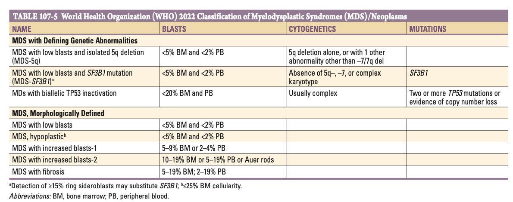
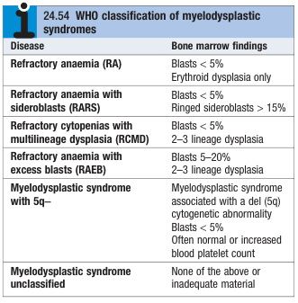
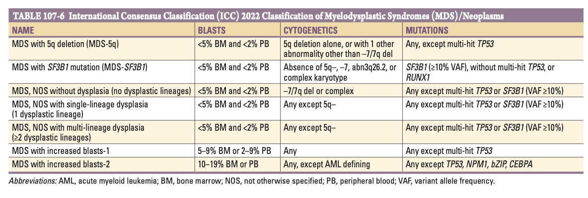
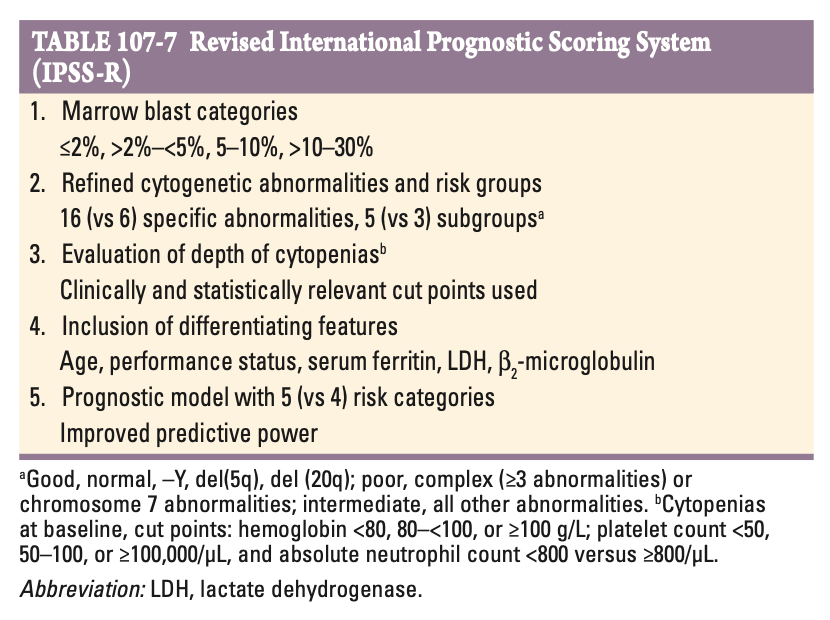

# Myelodysplastic Syndrome

- **Definition** - heterogenous group of haematological disorders characterised by 1) cytopenias due to bone marrow failure, and 2) high risk of development of AML, characterised by pancytopenia, dysmorphic formed elements, and normally a hypercellular marrow
- **Epidemiology** - disease of the elderly; rather common cause of "bone marrow failure":
    - <u>Incidence</u> - 4/100,000/y in general population (rises to 30/100000/y in \> 70ys)
    - <u>Demographic</u>:
        - Age - mean age of onset \> 70y (increasing incidence w/ age)
        - Sex - slight male predominance
- **Approach to classification of MDS:**
    - <u>French-America-British Classifcation</u> (FAB) - of historical interest, defines 5 types based on clinical picture, morphology, and presence of blasts
    - <u>WHO Classification of MDS</u> - incorporates morphology, cytopenias, bone marrow blasts, cytogenetics, and molecular findings
    - <u>ICC Classification of MDS</u> - similar approach as by WHO classification, but introduces category called MDS/AML, emphasising the disease continuum and similar outcomes between high-blast count MDS and AML
- **French-American-British Cooperative Group Classification of MDS** (1983) - 5 subtypes defined primarily based on clinical features and histopathological correlation:
    - Refractory anaemia (RA)
    - Refractory anaemia with ringed sideroblasts (RARS)
    - Refractory anaemia with excess blasts (RAEB)
    - Refractory anaemia with excess blasts in transformation (RAEB-t; subsequently noted by WHO to behave like a myeloproliferative disease and hence grouped w/ acute leukaemias)
    - Chronic myelomonocytic leukaemia (CMML)
- **World Health Organisation Classification of Myelodysplastic syndromes** - based on morphology, blast counts, cytogenetics, and defining mutations: 

- **Old WHO classification of MDS:**
    - <u>Refractory anaemia</u> (RA) - anaemia w/ erythroid dysplasia only and blast proportion \< 5%
    - <u>Refractory anaemia w/ sideroblasts</u> (RARS) - anaemia w/ ringed sideroblasts (\> 15%) and blast proportion \< 5%
    - <u>Refractory cytopenias w/ multilineage dysplasia</u> (RCMD) - cytopenias w/ evidence of dysplasia in 2-3 lineages in BM, and blasts \< 5%
    - <u>Refractory anaemia w/ excessive blasts</u> (RAEB) - evidence of dysplasia in 2-3 lineages in BM and blasts proportion 5-20%
    - <u>Myelodysplastic syndrome w/ 5q-</u> - MDS a/w del (5q) cytogenetic abnormality and blast proportion \< 5%
    - <u>Myelodysplastic syndrome unclassified</u> (MDS unclassified) - none of the above

  
  
- **International Consensus Classification of Myelodysplastic syndromes:** 

- **Etiology of MDS:**
    - **Idiopathic MDS** - related to environmental exposures, but may also arise on a background of bone-marrow failure syndrome:
        - <u>Environmental exposures</u> - radiation, smoking, benzene are the most consistently reported exposures but other risk factors are also noted
        - <u>Prior marrow failure syndromes</u> - acquired aplastic anaemia, fanconi anaemia, and other constitutional bone marrow failure syndromes can evolve into MDS
    - **Therapy-related MDS** - occurs as a result of late toxicity of cancer treatment:
        - <u>Radiation</u> -
        - <u>Radiomimetic alkylating agents</u> - busulfan, nitrosurea, cyclophosphamide, procarbazine a/w a longer latency period (7y)
        - <u>Topoisomerase inhibitors</u> - e.g. irenotecan a/w a shorter latency period (2y)
    - **Constitutial MDS** - considered in young MDS (e.g. \< 40y), caused by germline mutations to GATA2, RUNX1, or telomere gene mutations, instead of suggestive exposure Hx or a preceeding haematological disorders
- **Pathophysiology of MDS** - clonal HSC disroder characterised by disordered proliferation, impaired differention, and aberrant haematopoeisis, resulting in cytopenia and risk of AML transformation:
    - **Accumulation of mutations within a haematopoietic stem cell** - these may be from a germline mutation, or as a result of environmental exposure in an aging marrow:
        - <u>Accelerated telomere attrituion</u> - in an older individual or w/ FHx of teloremopathy, resulting in destabilisation of the genome in marrow failure predisposing to acquisition of chromosomal lesions
        - <u>Cytogenetic abnormalities</u> - non-random aneuploidy (chromosome 5, 7, and 20) and may related to underlying etiology (e.g. 11q23 following TopIIi)
        - <u>Somatic mutations</u> - about 100 genes implicated and are frequently seen in both AML and MDS, and may be a/w prognosis
    - **Pathophysiology linked to genetic and cytogenetic abnormalities in certain MDS syndromes** - this correlates to the clinical pictures:
        - <u>5q deletion</u> - heterozygous loss of a ribosomal protein gene, which mimicks constitutional red cell aplasia
- **Natural Hx of MDS** - will inevitably progress into AML (months to years), and can be predicted by an international prognostic scoring system (IPSS)
- **Clinical features of MDS** - anaemia dominates the early course (hence FAB description of "refractory" anaemia):
    - **Anaemia** - may be the dominant picture compared w/ effects on PLT and WCC:
        - <u>Asymptomatic</u> (50%) - incidental discovery of usually a **macrocytic anaemia** on routine blood counts but remain persistant
        - <u>Symptomatic chronic anaemia</u> - presentation w/ SOBOE, palpitations fatigue, weakness that is not explained by cardiopulmonary causes
    - **Bleeding tendancies** - may be present even w/ seemingly adequate PLT counts as the platelets are dysfunctional
    - **Infections** - usually absent in patient w/ MDS, but possibly slightly immunocomprimised due to dysplasia of the WCCs
    - **Constitutional Sx** - weight loss and fever are usually indicative of a myeloproliferative rather than myelodysplastic phenomenon (i.e. worrying for leukaemic transformation)
- **Signs of MDS:**
    - **General examination:**
        - <u>Features of constitutional syndromes</u> - in young patient w/ MDS:
            - Fanconi anaemia - short stature, abnormal thumbs
            - Telomeropathies - early graying of hair
            - GATA2 mutations - cutaneous warts and evidence of fungal infections
        - <u>Featuers of anaemia</u> - conjunctival and palmar pallor
        - <u>Features of thrombocytopenia</u> - usually not present in patients w/ MDS
    - **Abdominal examination:**
        - <u>Mild splenomegaly</u> - only present in 20% patients
- **Ix:**
    - **CBC** - anaemia is usually present either alone or as a part of bi- or pancytopenia; isolated neutropenia and thrombocytopenia is unusual:
        - <u>Anaemia</u> - a/w **macrocytosis**, as in most marrow failure syndrome
        - <u>WCC</u> - usually normal or low (pancytopenia); paradoxically high in CMML
    - **PBS:**
        - <u>Red cell lineage</u> - ringed sideroblasts may be present
        - <u>Granulocyte lineage:</u>
            - Hypogranulated, hyposegmented (ocassionally ringed or abnormally segmented) neutrophils; nat contain Dohl bodies
            - Circulating myeloblasts correlates w/ marrow blast numbers and quantity important for classification and prognosis
    - **Bone marrow examination:**
        - **Morphological examination:**
            - <u>Cellularity</u> - usually normal or hypercellullar marrow (20% may be hypocellular and confused w/ aplastic anaemia)
            - <u>Morphology</u>:
                - Erythroid lineage - ringed sideroblast; megaloblastic nuclei and defective haemoglobinzation
                - Granulocyte lineage - hypogranulation and hyposegmentation w/ an increase in blasts (proportion of marrow blasts determines prognosis)
                - Megakaryocytic lineage - reduced number of nuclei or disorganised nuclei
        - **Flow cytometry** - for enumeration of blasts
        - **Cytogenetic and genetic analysis** - to develop chromosomal abnormalities and pathogenic mutations
- **DDx of megaloblastic anaemia** - consider causes of bone marrow failure syndromes w/ macrocytic anaemia:
    - <u>Megaloblastic anaemia</u> - caused by deficiencies of vitamin B12 or folate
    - <u>B6 deficiency</u> - can cause ringed sideroblasts, and can be differentiated by a therapeutic trial of pyridoxine
    - <u>Transient marrow dysplasia</u> - can be observed in acute viral infections, drug reactions, or chemical toxicity
    - <u>Aplastic anaemia</u> - often difficult to differentiate from hypocellular MDS
    - <u>Acute myeloid leukaemia</u> - thought to be a disease continuum; WHO considered 20% blast in marrow as the criterion that separates AML from MDS
- **Limitations in Dx Myelodysplastic syndromes:**
    - Inter-observer reliability regarding morphological features limited: changes in appearance of megakaryocytes are more reliable to the hyppogranulation of neutrophil precursors or dyserythropoiesis
    - Dysplastic changes can be as a result of vitamin deficiencies and drug tests
    - Interpretation of genetic testing is difficult esp for mutations of unknown significance
- **Prognosis** - varies greatly from years in those w/ 5q- or sideroblastic anaemia, to a few months in those w/ high-risk MDS:
    - **Variable prognosis based on risk of MDS:**

        - <u>Low-risk MDS</u> (e.g. 5q- syndrome, sideroblastic anaemia) - median survival in terms of years
        - <u>High-risk MDS</u> (e.g. excessive blasts in BM) - median survival in terms of months

    - **Prognostic factors of MDS** - predicts risk of leukaemic transformation and mortality:

        - Revised international prognostic scoring system in 2012
        - Incorporation of molecular markers (IPSS-M 2022) emerging as the current standard tool for risk assessment (<https://mds-risk-model.com/>)

    
    

        - Prognosis of a patient with MDS often changes overtime, and HRs for survival and leukaemic transformation eventually converge over time among risk categories, in line w/ the dynamic changes of a clonal architecture
- **Mx:**
    - **Principles of Mx:**
        - <u>Goals of Mx</u> - prognosis improvement (delay onset of leukaemia and increase survival), Sx improvement (improvement of blood counts), minimise toxicity of Tx (dependent on patient commorbid factors)
        - <u>Supportive care</u> - most will have refractory anaemia and are transfusion dependent, thus at risk at significant iron overload
        - <u>Approach to prognostic Mx</u> - individualised to the patient:
            - Pharmacological therapy (e.g. hypomethylating agents, thalidomide, biologics)
            - Haematopoietic stem cell transplantation (theoretical curative Tx but a/w transplant conundrum)
    - **Haematopoietic stem cell transplantation:**
        - <u>Rationale</u> - in reality, HSCT is rarely pursued:
            - Theoretically the only offer of cure
            - However limited by the **transplant conundrum**, where high-risk patients (those most obviously indicated of HSCT), is a/w higher probability of Tx relapse and Tx-related mortality (while low-risk patients fare better w/ transplant but is may still do well w/ less aggressive therapy)
        - <u>Risk of Tx related mortality</u> - increases w/ age
    - **Hypomethylating agents** (HMA) - considered epigenetic modulators:
        - <u>Selection</u>:
            - Azacitidine (SC injection daily for 7 days at 4 week intervals, for at least 4 cycles)
            - Decitabine (IV regimens of varying dose and duration for 3-10 days in repeating cycle)
            - Decitabine-cedazuridine (oral HMA FDA-approved for high-risk MDS who are not candidates for HSCT)
        - <u>MOA</u> - demethylating agents:
            - Demethylation for epigenetic modulation, thus alter gene regulation
            - Enables differentiation to mature blood cells from the abnormal MDS stem cells
        - <u>Clinical efficacy</u> - prolongs survival; improvement of blood counts w/ decrease need for transfusion, but most eventually become refractory
        - <u>S/E</u>:
            - Myelosuppression (leading to worsening of cell counts)
            - GI disturbances
            - Injection site reaction
    - **Lenalidomide** (thalidomide derivative):
        - <u>MOA</u>:
            - Unclear MOA w/ many postulated biologic activities
            - Goes beyond "differentiation potential" of cytotoxics by in fact causing **normalisation of cytogenetics**
        - <u>Clinical efficacy</u>:
            - Most will improve in cell counts within 3 mo
            - Especially effetive in reversing anaemia w/ 5q- syndrome
        - <u>S/E</u>:
            - Myelosuppression (worsening thrombocytopenia and neutropenia)
            - DVT and pulmonary embolism
    - **Other immunosuppressive therapy:**
        - Anti-thymocyte globulin (ATG)
        - Cyclophosphamide
        - Alemtuzumab (anti-CD52 agents)
    - **Haematopoietic growth factors** - able to improve blood counts but is most beneficial to those w/ severe pancytopenia:
        - Epo alone or in combination with G-CSF can improve Hb levels, particularly those who are not transfusion dependent
        - TPO agonists may improve PLT counts but is associated w/ <u>increased leukaemic transformation in high-risk MDS</u>
        - Luspatercept (TGF-beta inhibitor) approved for low-risk MDS particularly those w/ SF3B1 mutation
        - Ivosidenib (IDH1 inhibitor), Venetoclax (BCL2 inhibitor) has recently been approved in selected cases
- **Additional details:**
    - <u>MonoMAC syndrome</u> - inherited GATA2 mutations w/ increased susceptibility to viral, mycobacterial, and fungal infections as well as deficient numbers of monocytes, NK cells, and B lymphocytes
    - <u>Germline RUNX1 mutation</u> - clinical picture of MDS and AML preceeded by years of modest thrombocytopneia
    - <u>Vacuoles, E1 enzyme, X-linked autoinflammatory, somatic (VEXAS) syndrome</u> - haematopoietic cell disorder caused by somatic mutation of UBA1 gene, characteristically manifests as MDS w/ co-existing autoinflammatory disorder (Sweet's syndrome)
