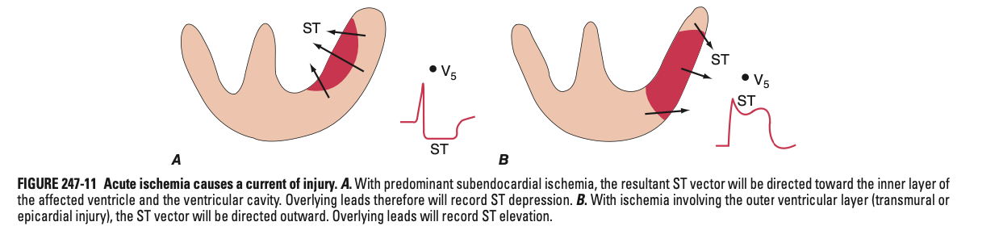
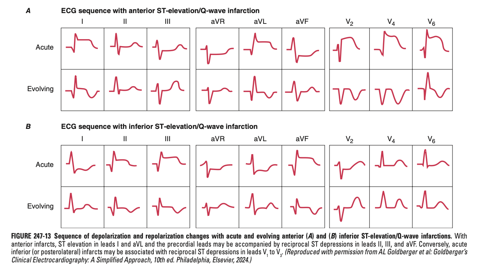
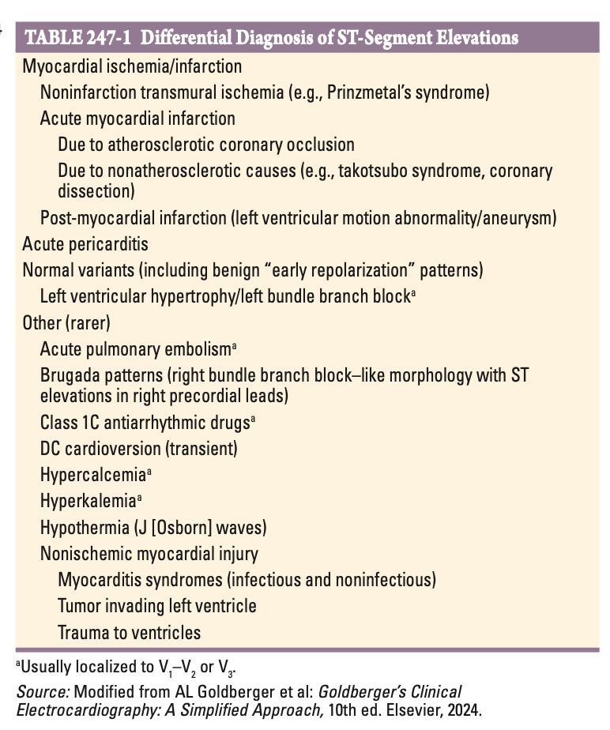

# Myocardial Ischaemia and Infarction on the ECG

- **Principles of ST segment changes in myocardial ischaemia and infarction** - areas of ischaemia lowers resting membrane potential and shortens duration of action potential:
    - <u>ST depression</u> - w/ subendocardial ischaemia, ST vector is directed towards the subendocardial tissue, resulting in ST depression
    - <u>ST elevation</u> - w/ transmural ischaemia, ST vector is directed outwards, resulting in ST elevation and ocassionally hyperacute T waves

  
  
- **Localisation of myocardial ischaemia** - usually more helpful in STE- compared w/ NSTE-ischaemia:
    - <u>Anterior wall ischaemia</u> (including apical and lateral) - caused by STE in \>=1 precordial leads (V1-6), lead I, and aVL
    - <u>Inferior wall ischaemia</u> - caused by STE in leads II, III, and aVL
    - <u>Posterior wall ischaemia</u> - results in reciprocal ST depressions in V1-3 (invariably w/ lateral or inferior involvement)
    - <u>Right wall ischaemia</u> - results in STE in V3R-V6R
- **Serial evolution of STE-ACS:** 

- **Differential diagnosis of ST-segment elevations:**
    - **Myocardial ischaemia or infarction** - almost always focal STE +/- reciprocal changes:
        - <u>Acute myocardial infarction</u> - 1) STE-ACS secondary to atherosclerotic coronary occlusion, or 2) non-atherosclerotic causes (e.g. coronary dissection, takatsubo syndrome)
        - <u>Non-infarction transmural ischaemia</u> - e.g. Prinzmetal's syndrome
        - <u>Post-myocardial infarction</u> - e.g. left ventricular motion abnormalities, LV aneurysms
    - **Acute pericarditis** - widespread up-sloaping STE in all leads except aVR, and upright T waves
    - **Brugada patterns** - RBBB-like pattern w/ coved STE in right precordial leads
    - **Other conditions w/ LV strain** (usu. V1-3):
        - LVH
        - LBBB
        - Acute pulmonary embolism
    - **Electrolytes** - hyperK, hyperCa
    - **Rare causes of non-ischaemic myocardial injuries** - e.g. myocarditis, DC cardioversion, tumour invading LV, trauma to ventricles

  
  
