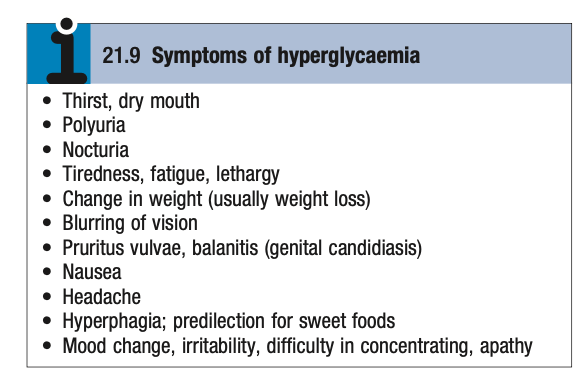
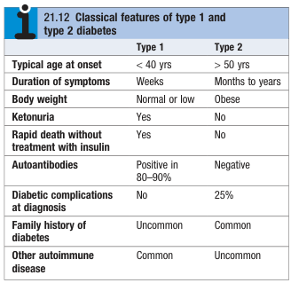
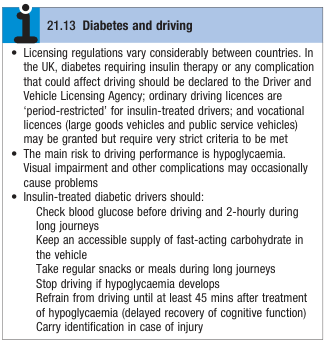

# Newly Discovered Hyperglycaemia and Suspected Diabetes

- **Definition** - biochemical abnormality of blood glucose often detected in patients with routine biochemical analysis
- **Clinical presentation of hyperglycaemia:**
    - **Asymptomatic** - discovered on routine biochemical analysis, following urine dipstick test revealing glycosuria
    - **Detection during critical illness** ('stress hyperglycaemia') - occurs during conditions which impose a burden on pancreatic beta-cells, e.g. during pregnancy, infection, MI, or other severe stress, or during Tx with diabetogenic drugs (e.g. glucocorticoids), which usually dissapears after the acute illness is resolved
    - **Symptoms of hyperglycaemia:**
        - <u>Polyuria and nocturia</u> - due to osmotic diuresis
        - <u>Polydipsia and dry mouth</u> - due to excessive urinary water loss stimulating the thirst mechanism

    
    
    - **Acute metabolic decompensation** - e.g. DKA, HHS etc.
- **Approach to Dx** - establish the diagnosis of glycaemia
- **Dx criteria of diabetes and pre-diabetes** - WHO guidelines (2011):
    - **Principles of Dx:**
        - <u>Asymptomatic patients</u> - requires 2 diagnostic test
        - <u>Symptomatic patients</u> - requires 1 diagnostic test or random blood glucose \>= 11.1 mmol/L
    - **Dx of DM** - 2 or more confirmatory tests:
        - Fasting blood glucose \>= 7.0 mmol/L
        - Oral glucose tolerance test - plasma glucose \>= 11.1 mmol/L 2h after 75g OGTT
        - HBA1c - \> 6.5%
    - **Dx of pre-diabetes:**
        - Impaired fasting glucose - fasting glucose \>= 6 mmol/L and \< 7 mmol/L
        - Impaired glucose tolerance - plasma glucose between 7.8-11.1 mmol/L 2h after a 75g OGTT
- **Clicial assessment and differentiation between T1DM and T2DM:** 

    - **Age of onset** - significant overlap as presentation of T2DM trending towards younger populations while subset of T1DM presents late (latent autoimmune diabetes of adults \[LADA\]):
        - <u>T1DM</u> - typically \< 40y
        - <u>T2DM</u> - typically \> 50y
    - **Clinical presentation** - difference in terms of chief complaint and symptomatology, onset, and duration:
        - <u>T1DM</u>:
            - Clinical presentation as the classical hyperglycaemic Sx (e.g. polyuria, nocturia, thirst, rapid weight loss)
            - Rapid onset over weeks
        - <u>T2DM</u>:
            - Clinical presentation as non-specific Sx (e.g. chronic fatigue, malaise, insomnia)
            - Uncontroled hyperglycaemia may clinicaly present with infections e.g. skin sepsis or genital candidiasis (e.g. pruritis vulvae or balanitis)
            - Marked weight loss and even DKA if <u>extremely late presentation</u>
            - Insiduous onset over months to years
    - **Physical signs and comorbidities:**
        - <u>T1DM</u> - normal body weight or marked weight loss
        - <u>T2DM</u>:
            - \>80% overweight at presentation in western population (less common in asian polulation), a/w central obesity
            - Often associated with comorbidities of metabolic syndrome - e.g. HTN (\> 50%), biochemical evidence of dyslipidaemia, NAFLD
- **Mx:**
    - **Principles of Mx:**
        - **Goals of Mx:**
            - <u>Symptomatic relief</u> - improve Sx of hyperglycaemia
            - <u>Prognostic Tx</u> - minimise the risk of long-term microvascular and macrovascular complications
        - **Approach to Mx:**
            - <u>Patient education</u> - multidisciplinary education regarding Mx and complications of DM to enable patients to adequately Mx there DM
            - <u>Self-assessment of glycaemia control</u> - role of self-aducation, detection of hypoglycaemia, and useful in acute-illness
            - <u>Dietary and lifestyle modification</u> - initiated if pre-diabetes to see if glycaemic control is adequate
            - <u>Oral hypoglycaemic agents and insulin</u> - initiated as per guidelines
    - **Patient education** - understand nature of DM and learn all aspects regarding all aspects of Mx:
        - **Approach to patient education** - structured education given in groups by trained educators in multidisciplinary approach (e.g. doctors, dietitians, specialised nurse, podiatrist)
        - **Patient education regarding insulin:**
            - Dose-measurement and injection techniques
            - Dose adjustment based on factors such as exercise, illness, episodic hypoglycaemia
            - Sx of hypoglycaemia and subsequent Mx
        - **Patient education regarding driving** - licensing regulations vary between countries: 
        
    - **Self-assessment of glycaemic control:**
        - <u>Indications</u> - only in insulin-treated patients, and risk of hypoglycaemia for patients on **sulphonylurea**
        - <u>Optimal glycaemic control</u>:
            - Pre-meal values - 4-7 mmol/L
            - 2h post-meal values - 4-8 mmol/L
        - <u>Capillary blood glucose monitor</u> - for insulin treated patients to detect hypoglycaemia and hyperglycaemia during illness (supplemented by urine ketones if unacceptablle hyperglycaemia)
    - **Lifestyle modification, oral hypoglycaemic agents, insulin** - see section on Mx of DM
