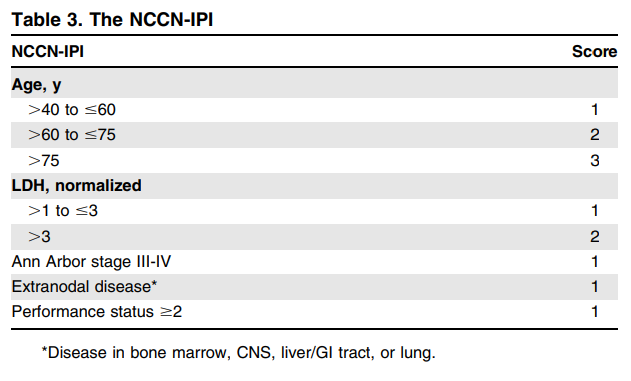

# Non-Hodgkin Lymphoma

- **Definition** - monoclonal proliferation of mature lymphoid cells of B cell (70%) or T cell (30%) origin
- **Epidemiology:**
    - <u>Incidence</u> - 12/100000/y
    - <u>Demographic</u>:
        - Age - increasing incidence w/ age (median age 65-70y)
        - Sex - slight male preponderance
- **WHO classification of lymphoma** - based on cell lineage, and incorporates clinical features, histology, chromosomal abnormalities and cell surface markers:
- **Classification of lymphoma clinically by grade** - differing proliferating rates, determing rate of onset of Sx:
    - <u>High-grade lymphoma</u> - rapidly dividing are typically present for a matter of weeks before onset of Sx and diagnosis (may be life-threatening)
    - <u>Low-grade lymphoma</u> - slowly dividinh, patient remains asymptomatic and may be present for many months before diagnosis
- **Common types of NHL** - two-thirds are either DLBCL (high-grade) or follicular NHL (low-grade):
    - Diffuse large B cell lymphoma (DLBCL)
    - Follicular non-hodgkin lymphoma
    - Burkitt lymphoma
    - Mantle cell lymphoma
    - MALT lymphoma
    - NK-/T-cell lymphoma
- **Etiology of NHL** - no single abnormality described:
    - **Relations to infection, typically viral:**
        - <u>Ebstein-Barr virus</u> (EBV) - a/w NK-/T-cell lymphoma, post-transpant NHL, Burkitt lymphoma
        - <u>Human T-cell lymphotrophic virus</u> (HTLV) - a/w adult T-cell leukaemia lymphoma
        - <u>Herpesvirus 8</u> (HHV8) - a/w primary effusion lymphoma
        - <u>H. pylori infection</u> - a/w gastric MALT lymphoma
    - **Certain driver mutations identified** - and are characteristic for some malignancies:
        - <u>t(14;18) resulting in dysregulated expression of BCL2</u> - seen in follicular lymphoma
        - <u>t(8;14) resulting in altered function of c-myc and cell cycle regulation</u> - seen in Burkitt lymphoma
        - <u>t(11;14) resulting in altered function of cyclin D1</u> - seen in mantle cell lymphoma
    - **Associations w/ immunosupperssion** - post-transplant, congenital immunodeficiency states, and HIV (NHL is an AIDS-defining malignancy)
- **Clinical features of NHL** - most present in advanced stage w/ extranodal involvement:
    - **Lymphadenopathy** - often generalised at presentation
    - **Constitutional B symptoms** - fever, unintentional weight loss, night sweats
    - **Abdominal mass** - hepatosplenomegaly is often present in NHL at presentation
    - **Features of extranodal involvement** - common sites of extranodal involvement include:
        - <u>Bone marrow</u> - manifests as pancytopenia and bone marrow failure (60% in low-grade NHL; 10% in high-grade NHL)
        - <u>Gut</u> - presents w/ abdominal Sx, especially resulting in **intestinal obstruction**
        - <u>Thyroid</u> - presents as hypothyroidism
        - <u>Skin</u> - manifests as skin and mucosal lesions
        - <u>Other sites</u> - testis, brain and bone
    - **Presentation as complications:**
        - Ascites
        - IO
        - SVCO
        - Spinal cord obstruction
- **Ix** - similar as HL but more extensive as greater propensity for advanced presentation and extranodal disease:
    - **Routine bloods** - CBC, LRFT, ESR, LDH, uric acid, serum protein electrophoresis:
        - **CBC** - may be normal:
            - <u>NcNc anaemia</u> - poor prognostic factor
            - <u>Lymphopenia</u> - poor prognostic factor
            - <u>Neutrophila or eosinophilia</u> - principally reactive
        - **LFT:**
            - Derranged LFT may reflect underlying hepatic infiltration but also unrelated liver disease
            - Cholestatic pattern may reflect porta hepatis involvement
        - **RFT** - ensure normal function prior to Tx
        - **LDH** (reflects cellular turnover) - raised levels are a <u>poor prognostic factor</u>
        - **ESR** - non-specifically elevated
        - **Uric acid** - aggressive tumours have high uric acid and can precipitate renal failure upon Tx initiation
        - **SPE** - a/w secretion of IgG or IgM manifesting as paraproteinaemia which can be used to assess treatment response
    - **Imaging** - CXR, CT T+A+P:
        - **CXR** - may show mediastinal widening and mass
        - **CT C+A+P** - for clinical staging (see below) and guidance of LN Bx
    - **LN Bx** - undergone surgically or under radiological guidance for <u>histological Dx</u>: 
    
    - **BM examination** - aspiration and trephine Bx to assess marrow involvement
    - **Genotyping and phenotyping:**
        - <u>Immunophenotyping</u> - of surface antigen to differentiate B cell from T cell
        - <u>Cytogenetic analysis</u> - to identify definint chromosomal translocations
    - **HIV testing** - if risk factors present
- **NCCN International Prognostic Index Index for NHL:** 

- **Mx:**
    - **Principles of Mx:**
        - <u>Dependent on histological grade</u> - more intense regimen may be necessary for high-grade NHL compared to low-grade NHL
        - <u>Dependent on stage of disease</u> - choice of RT or chemotherapy is dependent on stage of presentation
