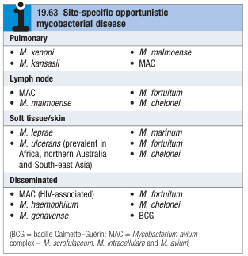

# Non-Tuberculous Mycobacteria

- **Definition** - infections caused by other environmental mycobacteria (i.e. non-tuberculous mycobacterium \[NTM\]) causing human diseases
- **Risk factors for opportunistic mycobacterial infections:**
    - <u>Immunocomprimised hosts</u> - severe HIV disease (CD4 count \< 50/mL) is a/w MAC pulmonary infection
    - <u>Immunocompetent host w/ chronic lung disease</u>:
        - COPD
        - Bronchiectasis (may present w/ lower-zone nodules)
        - Pneumoconiosis
        - Old TB
- **Forms of NTM** - most commonly reported organisms include M. kansasii, M. malmoense, M. xenopi, and M. abscessus: 

- **Rapid growers** - all others tend to grow slowly:
    - M. abscessus
    - M. fortuitum
