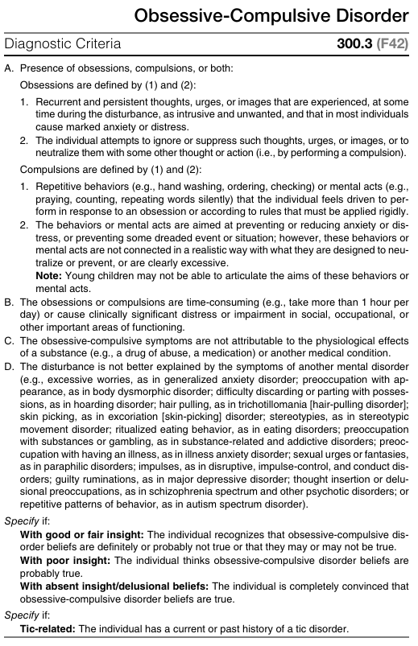
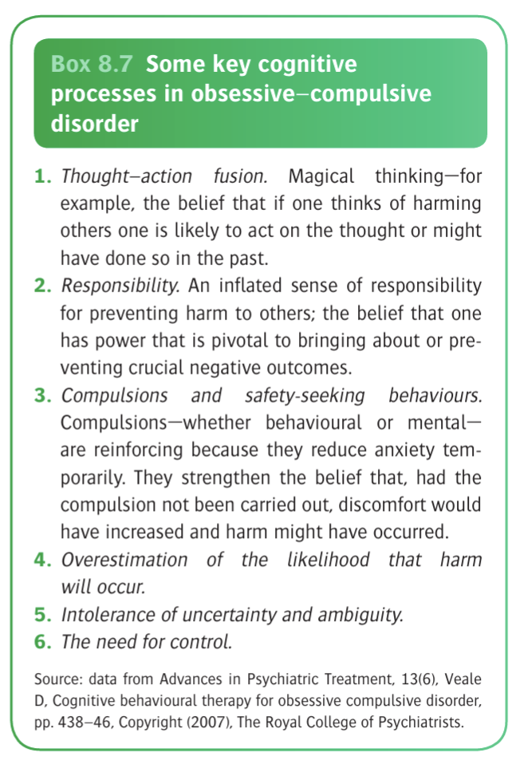

# Obsessive-Compulsive Disorder

- **Definition and terminology** - the description in ICD-9 remains valuable:
    - The outstanding symptom is a feeling of subjective compulsion - which must be resisted - to carry out some action, to dwell on an idea, to recall an experience, or ruminate on an abstract topic
    - Unwanted thoughts, which include the insistency of words or ideas, ruminations or train of thoughts are <u>perceived by the patient to be inappropriate or nonsensical</u>
    - The obsessional urges or ideas is recognised as <u>alien to the personality but coming from within the self</u>
    - Obsessional actions may be <u>quasi ritual performances designed to relieve anxiety</u>, e.g. washing the hands to deal with contamination
    - Attempts to dispel the unwelcomed thoughts or urges may lead to severe inner struggle, with intense anxiety
- **Epidemiology:**
    - <u>Prevalence</u> - lifetime risk of 2.1%; total 1y prevalence of OCD in the US ~ 2.1% in 2002 (roughly 1.2% if isolated and not comorbid w/ another anxiety disorder)
    - <u>Demographic</u>:
        - Age - variable age of onset (peak onset at adolescence)
        - Sex - unsure sex preponderance, likely no predisposition (although some studies describe slight female preponderance and allows a specific)
    - <u>Comorbidities</u> - high rates of comorbidities:
        - Anxiety disorders (including GAD, phobic disorders, and panic disorders)
        - Mood disorders
        - Impulse control disorders
        - Substance misuse
- **Contents of obsession and compulsion** - varies among individuals but certain symptom dimensions are common in OCD:
    - <u>Cleaning</u> - contamination obsession and cleaning compulsions
    - <u>Symmetry</u> - symmetry obsessions and repeating, ordering, and counting compulsions
    - <u>Forbidden or taboo thoughts</u> - aggressive, sexual, and religious obsessions and related compulsions
    - <u>Harm</u> - fear of harm to oneself or others and related checking compulsions
- **ICD-10 diagnostic criteria of OCD:**
    - For a definite diagnosis, symptoms must be present on most days for a duration of _at least 2 consecutives weeks_, and be a source of distress and/or interference with usual activities
    - Classifies OCD as predominantly taking the form of obsessional thoughts and ruminationos, or predominantly compulsive acts or mixed obsessional thoughts and act if both prominent, which implicates effectiveness of CBT
    - Thoughts or impulses are recognized as the person's own, and there must be at least one thought or impulse that had been resisted uncsuccessfully
    - The compulsions, while relieve tension, are not in themselves as intrinsically pleasurable, distinguishing compulsions from the immediate gratification such as those associated with addictions
- **DSM-V diagnostic criteria of OCD:** 
	
	
- **There are 4 domains in OCD psychopathology** ([Veale2004](https://www.notion.so/jethros-working-notes/vealePsychopathologyObsessivecompulsiveDisorder2004-33bb6ac73fa88185af3afd5c2cd7704c?pvs=26&qid=1%3A10cba9a3-2bae-4d4f-8033-f5b1a5dfcea0%3A1))
	- _Obsessions_ - repetitive/ persistent, unwanted, intrusive thoughts, imagery, urges or ruminations
	- _Compulsions_ - repetitive behaviours, which may be overt, or covert that a person feels driven to perform
	- _Emotional response_ - consequences to the intrusiveness and the detailed contents to the obsessions
	- _Avoidance behaviour_ (not in diagnostic criteria but integral in functional limitations) - active, or passive behaviours to limit contact with the feared situation
- **Obsessions** - repetitive, or persistent thoughts, urges, ruminations, or images, that at the time of the disturbance is experienced as intrusive and unwanted, causing significant distress:
	- _Core features and phenomenology of obsessions_ (form) - what makes an obsession:
		- **Recurrent and persistent** - obsessional manifestations occuring constantly and persistently
		- **Recognised as own but intrusive** - thoughts believed to be originating from the patient's mind (cf thought alienation which is imposed externally), but _uncontrollable_
		- **Distressing and ego-dystonic** - although recognised as own, appears inconsistent/ alien to the ego/ personality, often regarded by oneself as **unreasonable**, or **excessive**
		- **Attempts at ignoring, resistance, or suppression** - ignore through avoiding known triggers or use of thought suppression, or to neutralise them with another thought or action (i.e. the compulsion), where ICD-11 requires at least one failed attempt at ignoring the obsession (however, in _chronic cases_, _resistance may be minimal or absent_)
	- _Modal forms of the intrusive thought_:
		- **Obsessional thoughts** - varying forms of thoughts that are set in "language", from single words, phrases, rhymes etc. which may be shocking, unplesent, obscene or blasphemous
		- **Obsessional images** - imagery that is known to be imagined (cf believed to be real and external in VH), often of a violent, sexual, or disghusting
		- **Obsessional ruminations** - intense internal debates (w/ arguments for and against) reviewing endlessly even for simplest everyday actions
		- **Obsessional impulses** - urges to perform acts, usually of a violent or embarassing kind (e.g. leaping in front of car, injuring a child, or shouting blasphemies at a religious ceremony)
		- **Obsessional rituals** - mental activities or behaviours that are repeated but senseless, which may or may not be connected to an upstream obsesional thoughts
		- **Obsessional slowness** - slow performance, which may or may not be related to obsessional thoughts, rituals or compusions
		- **Obsessional phobias** - likely secondary to obsessional thoughts and impulses, which may be exacerbated in certain situations, resulting in marked anxiety and avoidance in these situations (i.e. definition of phobias)
	- _Associated disorders of thought content_ - often distinguished but not mutually exclusive:
		- Overvalued ideas (indirectly ?inflated sense of responsibility)
		- Delusions (rare)
	- _Content and prevalence of common obsessions_ - common themes are culturally-embedded (e.g. religious obsessions used to be common but declining in prevalence):
		- **Contamination** (dirt, germs, viruses like HIV, bodily fluids, chemicals): 37.8%
		- **Fear of harm** (e.g., insecure door locks): 23.6%
		- **Excessive concern with order or symmetry**: 10%
		- **Body/physical symptoms obsessions**: 7.2%
		- **Religious, sacrilegious, or blasphemous thoughts**: 5.9%
		- **Sexual thoughts** (e.g., fear of being a paedophile or homosexual): 5.5%
		- **Urge to hoard useless or worn-out possessions**: 4.8%
- **Compulsions** - can be thought as part of a larger group of "safety-driven behaviours" (behaviours to prevent feared catastrophes and reduce harm), defined as **repetitive behaviours or mental acts** that the person feels driven to perform:
	- _Core phenomenology of a compulsion_:
		- **Trigger** - often triggered by an intrusive, obsessive thought
		- **Aimed at relief** - to reduce the distress triggered by obsession or to prevent a feared event
		- **Lack of connection or clearly excessive** - the compulsions lack a connection to the feared event, or are clearly excessive (e.g. washig hours for 10 minutes)
	- _Overt vs covert compulsions_:
		- Overt - easily detectible as observable (e.g. repeatedly checking if a door is locked)
		- Covert - mental acts (e.g. repeating a phrase internally), typically more difficult to resist or monitor because they are **portable**, and **easy to perform**
	- _Types/ common forms of compulsions_ (Foa et al 1995):
		- Checking (e.g. gas taps) — 28.8%
		- Cleaning/washing — 26.5%
		- Repeating acts — 11.1%
		- Mental compulsions (e.g. repeating special words or prayers in a set manner) — 10.9%
		- Ordering, symmetry or exactness — 5.9%
		- Hoarding/collecting — 3.5%
		- Counting — 2.1%
	- _The purpose of compulsions_:
		- By definition **not performed for pleasure**, distinguishing them from impulsive, gratification-seeking acts (e.g. substance use, skin-picking, shopping)
		- Under DSM-5 conventions, defined as **aimed at relieving anxiety**, but are clearly excessive or not connected to the feared situation in a realistic way
		- However, not functionally can be aimed at **avoiding distress**, rather than relieving anxiety
		- ?Overarching theme from patient standpoint is **harm reduction**
	- _Effectiveness of compulsions in achieving their purposes_ - not always effective:
		- Compulsions are often **intermittently reinforcing** (i.e., relief is not consistently produced every time
		- Effectiveness may **vary based on the obsession**, e.g. cleaning compulsions generate short-term relief more effectively then checking compulsions
		- **Short-term relief maintains a vicious cycle**, as it increases the urge to perform the compulsion again
	- _Subjective termination rule_ - subjective feeling of "comfort" or being "just right" (not objective evidence) often used as a cue to stop compulsion as an important clinical features distinguishing OCD compulsion from ordinary behaviours:
		- A non-OCD person stops hand-washing when they can see their hands are clean, or imposes a sensible time criteria
		- Someone with OCD and contamination fear stops when they feel ‘comfortable’ or ‘just right, usually when the **sense of uneasiness and incompleteness fades**
- **Avoidance behaviours:** 
	- Not part of the formal diagnostic definition of OCD, it is an **integral feature** of the disorder and is particularly common in contamination fears
	- Not all feared situations can be fully avoided; in such cases, people frequently **rely on safety-seeking behaviours while within the feared situation**
	- voidance **reduces observable compulsions** but can **still cause severe disability: when avoidance is high, the frequency of compulsions may be low, and vice versa
- **Emotional or affective response** - often triggers wide range of emotion and is often hard for patients to articulate, commonly described simply as discomfort or distress, but reflects patient's appraisal of the experience (whether the primary response to obsession or secondary response to compulsion/ avoidance):
	- _Primary emotional response to the obsession_ - highly dependent on the obsessional theme:
		- **Fear of harm** (including contamination) - often a/w an over-inflated responsibility for preventing future harm/ catastrophy, the primary emotional response may be **anxiety**
		- **Contamination** - often provokes **anxiety**, and **disgust**, which is often difficult to articulate
		- **Sexual or aggressive thoughts** - judged to be morally unacceptable, where the primary emotional response is **shame**
		- **Past catastrophic events** - judged as morally reprehensible, where the primary emotional response may be **guilt**
	- _Secondary emotional response to compulsions/ avoidance_ - usually arising from handicapped nature of the disease e.g. guilt, depression
- **Interactions between the phenomenology in OCD** - often a very logical appraisal by the patients:
	- _Avoidance and compulsion_ - unavoidable feared situations trigger compulsions
	- _Avoidance/ compulsions and safety seeking behaviour and obsessions_ - short-term relief but counterproductive effects:
		- Increase in doubts
		- Prevents disconfirmation of fear
		- The cycle is self-reinforcing
- **Associated features of OCD:**
	- <u>Anxiety</u> - prominent component of OCDs where obsessions often cause marked anxiety, where some rituals are followed by a decrease in anxiety while others may increase anxiety
	- <u>Depression</u> - often depressed, where depression may be an understandable reaction to obsessional symptoms; in others, depression appears to vary independently
	- <u>Depersonalization</u> - through patient reports, although unclear the mechanism behind the connection between depersonalisation w/ the other features
	- <u>Relationship to obsessional personality</u> - no simple relationship between obsessive-compulsive personality disorder with OCD; in fact OCPD patients are more associated w/ depressive illnesses than OCD
- **Functional consequences of OCD** - caused by 1) time spent obsessing and doing compulsions, 2) avoidance, 3) developmental difficulties and difficulty socialising, and 4) effects on relationships:
    - <u>Nature of functional limitations</u> - social and occulational impairment depending on the nature of obsession:
        - Excessive obsessions in general may be time consuming and results in general social and occupational impairment
        - Obsessions of contamination may avoid visits to doctor and hospitals, and may develop dermatological problems (e.g. skin lesions due to excessive washing)
        - Obsessions of harm may interfere with relationships with family and friends, resulting in avoidance of relationships
        - Obsessions of symmetry may result in imposition of rules and prohibitions with family members and can lead to family dysfunction
    - <u>Correlation w/ severity</u> - degree of functional limitation often a/w symptom severity
- **Development and course:**
    - **Onset** - usually onset in adolesence and early adulthood (rarely \> 35y):
        - <u>Nature of onset</u> - onset of symptoms is typically gradual, but
        - <u>Earlier onset in M</u> - 25% onset \< 10y
    - **Clinical course** - typically follows such course and may be lifetime, and often <u>complicated by psychiatric comorbidities</u>:
        - Usually chronic, <u>waxing and waning course</u>
        - Some have an <u>episodic course</u>
        - Minority have a <u>deteriorating course</u>
    - **Remission rates** - generally low (20% if evaluated after 40y), but likely dependent on the age of onset:
        - <u>Onset at adulthood</u> - likely will lead to a lifetime of OCD
        - <u>Onset in children or early adolescence</u> - 40% will experience remission by early adulthood
- **Assessment of OCS:**
	
	![[Pasted image 20260407144407.png]]
	- **Assessment of obsessions:**
		- _Clarifying form_:
		- _Clarifying content_:
		- _Clarifying triggers and burden_:
		- _Clarifying insight_:
	- **Assessment of compulsions:**
		- _Clarifying contents and purpose_:
		- _Clarifying burden_
		- _Clarifying attempts at resistant and predicted distress_:
		- _Clarifying feared consequences of resisting compulsion_:
		- _Clarifying termination criterion of compulsions/ neutralizing behaviour_
	- **Assessment of primary emotions linked to obsessions:**
	- **Assessment of avoidance behaviour:**
		- _Clarifying list of all avoided situations and activities_:
		- _Clarify behaviour response if situation is unavoidable_:
		- _Clarify predicted distress if person confronts the situation without safety-seeking behaviours_:
	- **Indirect assessment methods:**
	- **Assessment of family involvement:**
	- **Assessment of functional limitations:**
- **Risk factors:**
    - **Temperamental factors:**
        - Behavioural inhibition
        - Negative emotionality/ affectivity
        - Greater internalizing symptoms
    - **Environmental factors:**
        - <u>Upbringing</u> - physical and sexual abuse, other traumatic events
        - <u>Infectious agents</u> - paediatric autoimmune neuropsychiatric disorders a/w Streptococcal infection (PANDAS)
    - **Genetic and physiological factors:**
        - <u>Genetic factors</u> - 2-3x risk if present in first-degree relatives (10x risk if onset of OCD in relative in childhood or adolesence)
        - <u>Physiological factors</u> - dysfunction of orbitofrontal cortex, anterior cingulate cortex and striatum heavily indicated
- **Differential diagnosis of OCD:**
    - <u>Anxiety disorders</u> - content of thought differ between the two disorders, where GAD (or other anxiety disorders) is often a/w worries about real-world concerns (e.g. personal health, finance), while OCD is often a/w worries that are odd, irational or of seemingly magical nature
    - <u>Major depressive disorder</u> - ruminations during depressive episodes but these depressive ruminations are usually mood-congruent and not necessary experienced as intrusive or distressing, and not linked to compulsions
    - <u>Schizophrenia or other psychotic disorders</u> - both disorders characterised by poor insight and delusional beliefs, and necessary to screen for other features of psychotic disorders; obsessional thoughts are usually perculiar, or the ritual is exceptionally odd
    - <u>Other compulsive-like behaviours</u> - e.g. paraphilia, gambling disorder, substance use, but the distinction is made where compulsions are driven to neutralise an obsession and obtain relief, while compulsive-like behaviours are aimed at deriving pleasure from the activity
    - <u>Other obsessive-compulsive related disorders</u> - dependent on the theme and nature of compulsion, where obsessions may or may not be present (e.g. hoarding disorders are usually not egodystonic)
    - <u>Obsessive-compulsive personality disorder</u> - more pervasive where compulsion-like activity is more driven by a pervasive maladaptive pattern of excessive perfectionalis and rigid control rather than an impulsive thought
    - <u>Eating disorders</u> - consider OCD if obsessions and compulsions are not limited to weight and food
    - <u>Tics and sterotyped movement</u> - aim of tics are not to neutralise an obsessions (difficult to differentiate especially 30% of OCD patients have documented tic disorders)
    - <u>Organic disorders</u> - ocassionally seen in organic cerebral disorders most strikingly in chronic cases of encephalitis lethargica following the 1920s epidemic
    - <u>Childhood-onset disorders</u> - may be comorbid wit developmental disorders such as Gilles de la Tourette syndrome and autism spectrum disorder
- **Psychiatric comorbidities of OCD:**
    - <u>Anxiety disorder</u> (76%) - e.g. panic disorder, social anxiety disorder, GAD, specific phobia
    - <u>Mood disorder</u> (63%) - e.g. depressive or bipolar disorders
- **Etiology:**
    - **Neurobiological hypothesis:**
        - **Genetics:**
            - <u>Twin studies</u> - higher concordance rates in monozygotic compared w/ dizygotic twin pairs, indicated at least in part of the familial loading is genetic
            - <u>Familial studies</u> - similar conclusion, indicating risk of OCD in 1st-degree relatives is increased approximately 4x compared w/ healthy controls (Perez et al 2013)
            - <u>Molecular genetics</u> - number of association between OCD and various genes including those encoding for glutamate and serotonin transporters (5-HT2A), and BNDF, but have yet been replicated in GWAS
        - **Neuroimaging and neuropathology:**
            - <u>Observational evidence</u> - increased correlation between obsessional symptoms with actual pathological processes in the brain, from encephalitis lethargica (Spanish Flu), Syndenham's chorea following rheumatic heart disease (PANDAS \[Singer et al 2012), and Tourette's syndrome
            - <u>Neuroimaging studies</u> - revealed variable:
                - Structural changes - increased grey matter volume in the striatum, and decrease in orbitofrontal, dorsomedial and anterior cingulate cortex
                - Functional changes - increased activity of orbitofrontal cortex, caudate, ACC, and thalamus when those w/ OC symptomatology are exposed to psychological challenging paradigm, which is established in the description of the cortico-striatal-thalamic loops (e.g. compulsive behaviours can be explained by projection from OFC to the caudate)
        - **Neurochemical hypothesis** - abnormal serotonergic function (?can be comorbid w/ depression although appears independent):
            - <u>Observational evidence</u> - hypothesis first proposed as OC symptomatology respodns to drugs that increase 5-HT functions, where full effect takes place slower than in depression, such that the late effects are more relevant
            - <u>Empirical evidence</u> - neuroendocrine tests, SPET imaging, and drug challenges have been inconsistent at best for the neurochemical hypothesis
    - **Freudian psychoanalysis** - obsessional symptoms result from unconscious umpulses of an aggressive or sexual nature:
        - <u>Source of anxiety</u> - these impulses can cause extreme anxiety at face value and hence are transformed
        - <u>Defense mechanisms</u> - defense mechanisms of repression or reaction formatio to keep the anxiety at bay, reflecte as a restraint on their own aggressive/ sexual impulse
        - <u>Regression to the anal stage of development</u> - hence related to frequent concerns of contamination/ excretory functions (and restraint in sphincteric actions); and as a means of avoiding impulses related to the subsequent genital stages
    - **Neuropsychological hypothesis:**
        - **Compulsivity vs impulsivity** - compulsivity and impulsivity heavily implicated in the cortico-striatal-thalamic loop:
            - <u>Compulsivity</u> - in psychological terms, describes a tendancy to perform repetitive acts in a habitual or stereotyped manner
            - <u>Impulsivity</u> - a failure to inhibit inappropriate behaviour that are driven by reward and gratification (?suicidality)
        - **Increased compulsivity in OCD patients:**
            - From neuropsychological tasks that require an altered response once 'habit' is established by previous learnings
            - OCD patients tend to perform less well on tasks of 'set-shifting', and 'reversal learning' than controls, and a similar abnormality has been detected in first-degree relatives of PCD patients (note: i.e. requires more time and evidence to break pattern recognition)
            - Phenomenologically, a preponderance to 'habit learning' over 'goal-directed learning', which underpins development of compulsive behaviour:
        - **Abnormal impulsivity in OCD patients** - although often viewed as opposite, can co-exist in OCD patients (Finberg et al 2014):
            - Neuropsychological studies demonstrate failure to inhibit incorrect responses in tasks assessing motor performance
            - Compulsion can thus be framed as a failure of inappropriate responses, as well as a compulsion to carry them out
    - **Cognitive theory:**
        - **Establishment of a cognitive theory of obsessions:**
            - No need to experience the genesis of intrusive thoughts as they are seen at times in healthy individuals
            - Phenomenon that requires explaining include:
                - 1\) The inability to control them
                - 2\) The distorted interpretation of them (e.g. thoughts as if they were personal consequences for their possible consequences)
        - **Cognitive processes driving obsessive-compulsive disorders** - the theory remains unproven but cognitive therapy can be adopted in OCD: 
            
            
        - **Dysfunctional beliefs** - altered cognition in individuals w/ OCD precipitating its pathogenesis:
            - Inflated sense of responsibility and tendancy to overestimate threats
            - Perfectionism and intolerance of uncertainty
            - Over-importance of thought and the need to control thoughts
- **Mx:**
    - **Principles of Mx:**
        - <u>Exhaustive search for comorbidities</u> - consistently look for MDD as often accompanying the illness
        - <u>General psychoeducation</u> - explanation of symptoms, and reassurance, and psychoeducation of patients and family
        - <u>Choice of therapy</u> - combined pharmacological and non-pharmacological therapy:
            - Pharmacologocal therapy aimed at symptom relief but most will relpase if ceased
            - Response prevention important, but difficult to achieve when symptomatology achieved
    - **Pharmacological therapy:**
        - **Approach:**
            - First line - SSRI
            - Second line - trial of other SSRIs
            - Third line - clomipramine or augmentation w/ SGA
        - **Clomipramine** (historical interest as first described for pharmacological management of OCD):
            - <u>Indications</u> - no longer first line treatment
            - <u>MOA</u> - late effects implicated (? 5-HT blockade as more effective than other TCA w/ less 5-HT blockade)
            - <u>Clinical efficacy</u>:
                - More effective than placebo in reducing obsessional Sx (Clomipramine Colaborative Study Group 1991)
                - Effects takes long to build up, first noticeable at around 6 weeks, and gradually increases another 6-12 weeks
            - <u>S/E</u> - generally tolerable:
                - General S/E of TCAs
                - Seizures occur w/ high dose
        - **Selective serotonin uptake inhibitors:**
            - <u>Indications</u> - first line (as less S/E than clomipramine)
            - <u>Selection</u>:
                - Unlikely any clinically important significance
                - Some patients may respond better to one SSRI than another
                - Likely beneficial agents dependent on patient characteristics, dosing, and tolerability
            - <u>Dosing</u> - up-titration, higher doses appear to be more efficacious (Bloch et al 2010)
            - <u>Efficacy</u> - only 50% of treated patients respond substantially:
                - Similar efficacy to clomipramine
                - Clomipramine treatment is associated w/ more dropouts from treatment
                - Generally relapse when off Tx
            - <u>Augmentations trategies</u> - attempts to increase response rates by:
                - Low-dose antipsychotic agent (FGA/SGA) (Veale et al 2014)
        - **Anxiolytic drugs:**
            - For symptom relief
            - Should not prescribed continuously for 2-4 weeks at a time
    - **Cognitive-behaviour therapy and other psychological therapy:**
        - **Cognitive-behaviour therapy:**
            - <u>Exposure and response prevention</u> - response prevention and exposure to any evironmental cues that increase symptoms:
                - 2*3 w* moderately severe rituals expected to improve substantially but not completely (Zohar 2009)
                - As rituals respond, accompanying obsessions will improve as well
            - <u>Behavioural therapy</u>:
                - Technique of thought-stopping has been used but no good evidence of a specific effect
                - Likely less effective if rituals are less prominent or less time consuming
            - <u>Cognitive therapy</u> - aims to reduce attempts to suppress and avoid obsession thoughts (i.e. decrease the frequency of thes ethoughts):
                - Approached by reviewing evidence for and against the conviction of thought
                - Explore other cognitive distortions along the lines of cognitive therapy
        - **Psychodynamic psychotherapy:**
            - Seldom help obsessional patients
            - Indeed, some made worse as procedures encourage painful and unproductive rumination about the subjects discussed during the treatment
    - **Neurosurgery, deep brain stimulation, and transcranial magnetic stimulation:**
        - Inducing an orbitomedial or cingulate lesion
        - Possible immediate relieve of stress and tension w/ neurosurgery
        - However long-term effects uncertain as no prospective trials performed
        - Short term effects variable, frequency of second operations and modest improvement rates indicate limitaiton of neurosurgery
