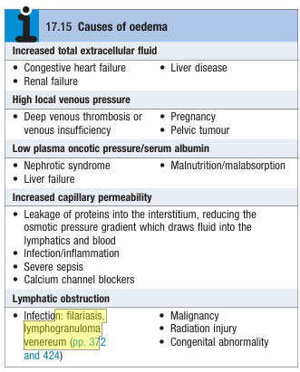

# Oedema

- **Definition** - excessive accumulation of fluid within the interstitial space
- **Pitting vs non-pitting oedema:**
    - <u>Pitting oedema</u> - clinically detected by persistence of indentation following pressure on the affected area
    - <u>Non-pitting oedema</u> - attributed to excessive matrix deposition in tissue (e.g. hypothyroidism, scleroderma), with swelling and rapid resolution of indentation following pressure
- **DDx of oedema:**
    - <u>Salt and water retention leading to increased ECF</u> - congestive heart failure, chronic liver disease, renal failure, COPD
    - <u>High local venous pressure</u>:
        - Deep vein thrombosis or chronic venous insufficiency
        - Pregnancy
        - Pelvic tumour resulting in IVC obstruction
    - <u>Hypoalbuminaemia leading to low oncotic pressure</u> - nephrotic failure, decompensated cirrhosis, malabsorption, severe malnutrition
    - <u>Increased capillary permeability</u> - **calcium channel blockers**, local infection/ inflammation, severe sepsis
    - <u>Lymphatic obstruction</u> - malignancy, radiation injury, congenital abnormality, infections

  
  
- **DDx for unilateral pitting oedema:**
    - DVT
    - Local inflammation
    - Local lymphatic disease
- **Clinical features of oedema:**
    - <u>Swelling in dependent areas</u> - ankle and lower parts of the legs affected first in mobile patients, or sacral areas (spread to genitalia, abdomen, and upper parts of the leg)
    - <u>Facial oedema</u> - periorbital oedema on waking is common
    - <u>Features of intravascular volume depletion</u> (e.g. tachycardia, orthostatic hypotension) - may be present when oedema is caused by hypoalbuminaemia or increased capillary permeability
- **P/E** - complete cardiovascular and abdominal examination will reveal a cause
- **Ix:**
    - **Urine** - dipstick for protein and blood
    - **Routine bloods** - LRFT:
        - <u>LFT</u> - detect hypoalbuminaemia
        - <u>RFT</u> - assess renal function and electrolytes
    - **Imaging** - of the liver, kidneys or heart depending on the suspected Dx
    - \+*- **Diagnostic paracentesis** - if presenting w* ascites
    - \+*- **Diagnostic thoracocentesis** - if presenting w* pleural effusion
- **Mx:**
    - **Principles of Mx:**
        - <u>Dx and Mx of underlying causes</u> - disease specific Tx (e.g. for DVT)
        - <u>Pharmacological therapy</u> - thiazide diuretics or low-dose loop diuretics (higher dose if heart failure, renal failure or nephrotic syndrome)
        - <u>Non-pharmacological therapy</u> - salt and fluid restriction
