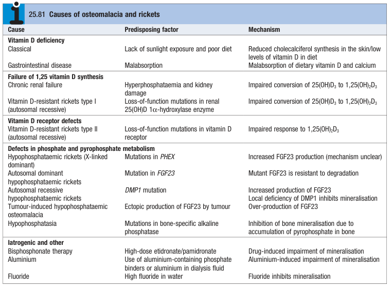

# Osteomalacia and Rickets

- **Definition** - two interrelated conditions related to 1) vitamin D deficiency, 2) resistance to vitamin D, and 3) hypophopshataemia:
    - <u>Osteomalacia</u> - syndrome in adults manifesting as defective bone mineralisation, bone pain, and increased bone fragility and fractures
    - <u>Rickets</u> - syndrome in children with similar manifestations and is characteristic of enlargement of growth plates and bone deformities (bowing of knees)
- **Etiology of osteomalacia and rickets** - 4 main causes:
    - **Vitamin D deficiency** - classical vitamin D deficiency (lack of sun exposure), gastrointestinal disease (malabsorption)
    - **Failure of 1,25(OH)2D synthesis:**
        - <u>Chronic renal failure</u> - impaired conversion of 25(OH)D to 1,25(OH)2D due to CKD
        - <u>Vitamin D-resistant rickets type I</u> (AR disorder) - LOF mutation in renal 1-alpha-hydroxylase enzyme
    - **Vitamin D receptor defects** - Vitamin D-resistance rickets type II (AR disorder w/ LOF mutation in vitD receptor)
    - **Defects in phosphate and pyrophosphate metabolism** - different genetic disorders or paraneoplastic manifestations
    - **Iatrogenic and others:**
        - <u>Bisphosphonate therapy</u> - drug-induced impairment of mineralisation
        - <u>Aluminium</u> (phosphate binders or dialysate) - aluminium induced impairment of mineralisation
        - <u>Fluoride</u> - F inhibits mineralisation

  
  
