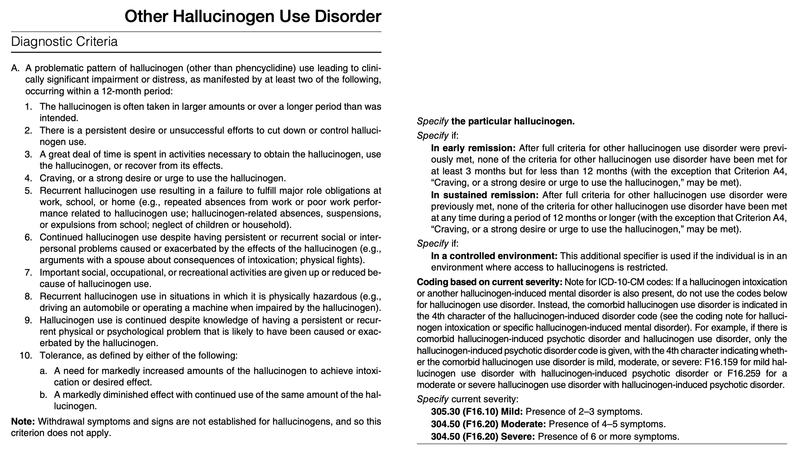
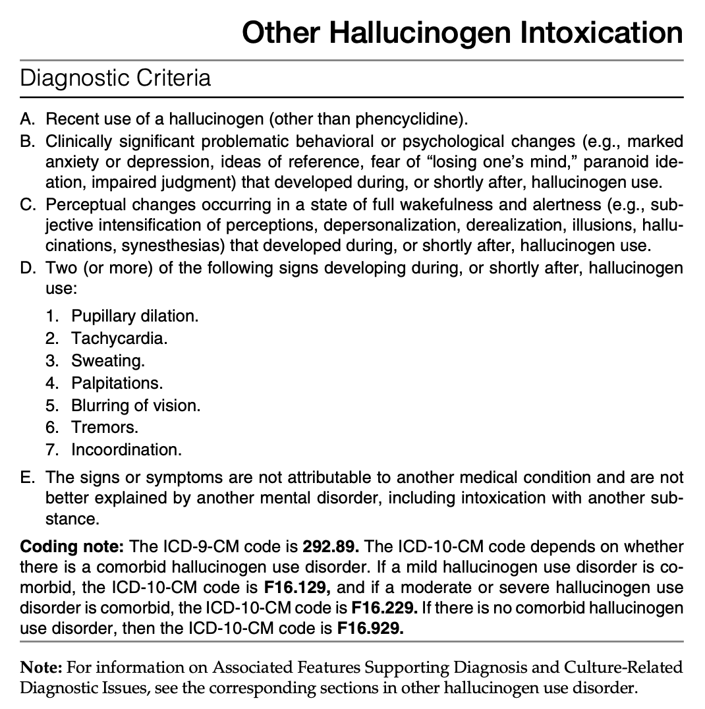

# Other Hallucinogen Use Disorder

- **Hallucinogens other than the phencyclidines:**
    - <u>Phenylalkylamines</u> - e.g. mescaline, DOM (2,5-dimethyl-4-methylamphetamines), MDMA (3,4-methylenedioxymethamphetamines; "ecstasy")
    - <u>Indoleamines</u> - psilocybin, DMT (dimethyltryptamine)
    - <u>Ergolines</u> - LSD (lysergic acid diethylamide), morning glowing seeds
    - <u>Others</u> - e.g. Salvia, divinorum, jimsonweed, THC (under cannabis-use disorder)
- **Route of administrations of other hallucinogens** - usually taken orally, rarely injected:
    - <u>Oral</u> - most hallucinogens
    - <u>Smoking</u> - DMT, salvia
    - <u>Injection</u> - e.g. ecstasy
- **Effects of MDMA/ ecstasy** - distinctive effects attributable to both its hallucinogenic and stimulant properties
- **DSM-5 diagnostic criteria of other hallucinogen use disorder:** 

- **DSM-5 diagnostic criteria of other hallucinogen intoxication:** 

- **Diagnostic features of other hallucinogen intoxication** - duration dependes on hallucinogen ingested, e.g. several minutes for salvia, or hours to days for LSD, and MDMA:
    - **Psychological manifestations:**
        - <u>Disorders of perceptions</u> - that must occur in state of full wakefulness and alertness:
            - Subjective intensification of perceptions
            - Dissociative Sx (depersonalisation, derealisation)
            - Illusions
            - Hallucinations
        - <u>Mood reactions</u> - primarily depression and anxiety
        - <u>Disordered thoughts</u> - ideas of reference/ persecution, fear of losing one's mind, paranoia
    - **Behavioural changes** - often steming from impaired judgement from perceptual disturbances:
        - Injuries or fatalities from automobile crashes
        - Physical fights and injuries
        - Unintentional self harm
        - itentional self harm and suicide
    - **Biological manifestations** (2/7):
        - <u>Autonomic manifestations</u> - pupillary dilatation, tachycardia, sweaating, tremors
        - <u>Neurological manifestations</u> - inocoordination
- **Differential diagnosis of other hallucinogen intoxication:**
    - <u>Other substance intoxication</u> - stimulants (e.g. amphetamines, cocaine), anticholinergics, inhalants, phencyclidine
    - <u>Other substance withdrawal</u> - sedatives, alcohol
    - <u>Other mental conditions</u> - depression, schizophrenia
    - <u>Other medical conditions</u> - metabolic, CNS disorders etc.
    - <u>Hallucinogen persisting perception disorder</u> - continued episodically or continuously for weeks (or longer) after the most recent intoxication
    - <u>Other hallucinogen-induced disorders</u> - e.g. hallucinogen-induced anxiety disorder w/ onset during intoxication, where the substance-induced disorder dominates the clinical picture warranting independent clinical attention
