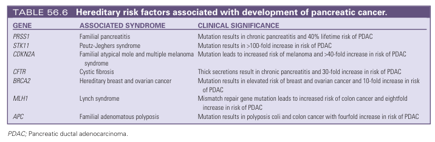
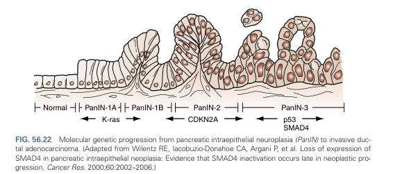
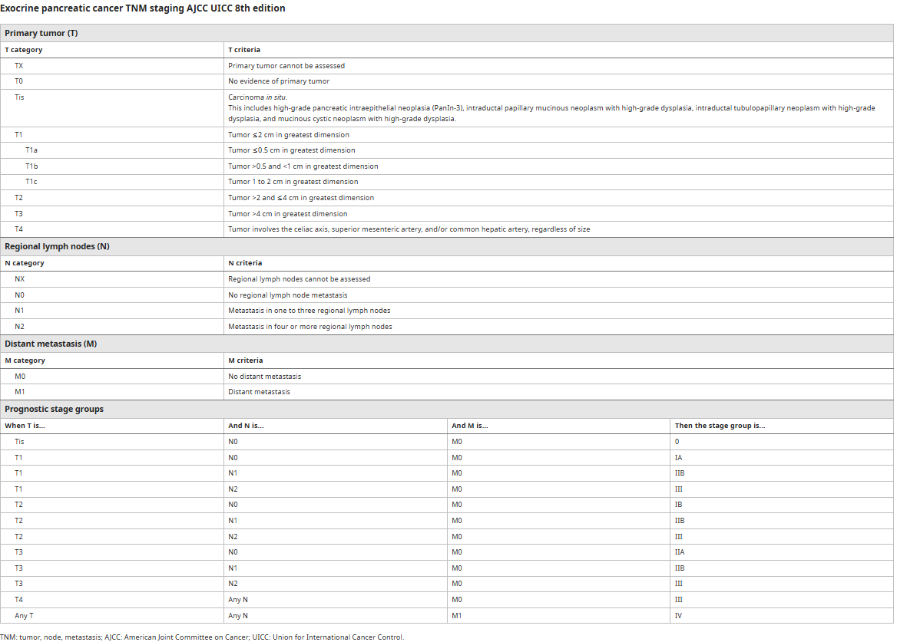
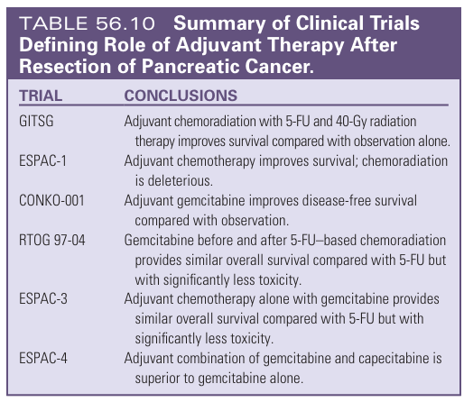

# Pancreatic Carcinoma

- **Definition** - ductal adenocarcinoma of the exocrine pancreas (acounts for 85% of all pancreatic neoplasms)
- **Epidemiology** - common and deadly cancer:
    - <u>Incidence</u> (HK cancer registry) - 10th in incidence (1037 new cases in 2022)
    - <u>Mortality</u> (HK cancer registry) - 4th in mortality (920 deaths in 2022):
        - **5y survival** - \< 8% overall, likely attributed to detection at locally advanced stage of metastatic stage
    - <u>Demographic</u>:
        - **Age** - increasing incidence w/ age (population aging may acount for increased incidence), w/ risk increasing significantly in the 6th decade (mean Dx age 72y)
        - **Sex** - slight male preponderance (M:F 1.3:1), similar distribution in HK 2022 (537 M vs 500 F)
- **Risk factors of pancreatic cancer:**
    - **Non-modifiable risk factor** - demographic (age, sex, race), genetics (see below)
    - **Hereditary risk factor** - roughly 80% have familial pancreatic cancer (FPC) where there is a +ve FHx but no known gene mutation, while 20% have known genetic syndromes (cancer predisposition syndromes or inherited pancreatic inflammatory diseases):
        - **Hereditary pancreatitis** (PRSS1 and SPINK1 mutation) - Hx of familial pancreatis caused by mutation of trypsinogen gene or trypsin inhibitor resulting in <u>chronic inflamation of the pancreas</u> (50x risk)
        - **Puetz-Jegher syndrome** (ST11 mutation) - colorectal polyposis syndrome a/w mucocutaneous pigmented lesions and increased risk in numerous cancers (100x risk)
        - **Cystic fibrosis** (CFTR mutation) - chronic inflammation of pancreas due to thickened secretions and partial ductal obstruction (30x increased risk)
        - **Familial atypical mole and multiple melanoma syndrome** (CD-KN2A mutation) - mutation of p16, a tumour supressor protein, results in increased risk of melenoma, but also confers an increased risk of CA pancreas (20x risk)
        - **Hereditary breast and ovarian cancer** (BRCA2 mutation) - breast cancer predisposition syndrome a/w increased in pancreatic cancer risk (10x risk)
        - **Lynch syndrome** - hereditary cancer predisposition syndrome caused by inheritence of defective DNA mismatch repair genes resulting in microsatellite instability (8x risk)
        - **Familial pancreatic cancer** (no identifiable mutations) - defined as having \>= 2 1st-degree relatives w/ pancreatic adenoCA that do not fulfill criteria of other inherited cancer predisposition syndromes

    
    
    - **Environmental risk factor:**
        - **Smoking** - linear correlation between pack years and pancreatic cancer incidence (1-3x risk)
        - **Obesity** - unknown mechanism on whether obesity itself or related co-morbidities confers this increased risk (3x risk)
        - **Diabetes mellitus** - controversial as new-onset DM in elderly may be a rare presentation of CA pancreas (N.B.strong ccorrelation of new-onset DM of elderly especially in setting of atypical features such as weight loss, no confounding effects of obesity, no FHx of DM or atypical abdominal Sx)
- **Pathology and histopathology:**
    - <u>Location of pathology</u> - 60% occurs in head, 15% in body/tail
    - <u>Histopathology</u> - ductal adenocarcinoma of the exocrine pancreas
- **Pathogenesis of sporadic pancreatic cancers** - likely pathogenic mechanism in most cases of CA pancreas:
    - <u>Progression from pancreatic intraductal neoplasia (PanIN) to invasive adenocarcinoma (PDAC)</u> - multiple oncogenic genes indicated (e.d. PDX1 KRAS2, p16, p53, SMAD4):
        - **PanIN-1** - KRAS2 oncogene activation (\> 85% of invasive CA) is thought to be the inciting event of tumourigenesis
        - **PanIN-2** - CD-KN2A tumour suppressor gene inactivation often found
        - **PanIN-3** - p53 or SMAD4 mutation are identified in most invasive CA and are often the final molecular genetic alteration in the PanIN-PDAC pathway

    
    
- **Clinical presentation of pancreatic cancer** - non-specific nature of Sx results presentation in late stage of disease (\< 15% are resectable at presentation):
    - **Initial presentation of CA pancreas** - dependent on tumour location:
        - <u>CA head of pancreas</u> - classically described as progressive <u>painless jaundice</u> (75%), but significant number of patient present w/ triad of jaundice, knawing epigastric pain radiating to the back and weight loss
        - <u>CA body or tail of pancreas</u> - abdominal pain and weight loss is more common at presentation, where onset of jaundice is delayed until there is LN metastasis to portal hepatis
    - **Features of local tumour:**
        - **Abdominal pain** (79%) - epigastric/ periumbilical gnawing visceral abdominal pain due to **invasion into coeliac axis**:
            - <u>Site</u> - generally epigastric or central, with various patterns of radiation
            - <u>Onset</u> - usually a **subacute onset which may be initially intermittent, and becomes constant**, rarely acute onset due to episode of acute pancreatitis due to tumoral occlusion of main pancreatic duct
            - <u>Progression</u> - progression of pain to incessant, constant pain
            - <u>Quality</u> - gnawing, visceral quality, which is poorly localised
            - <u>Radiation</u> - radiation to epigastrium, **through the back**, and along both sides
            - <u>Exacerbating factors</u> - exacerbated by eating (frequently nocturnal), and lying supine
            - <u>Relieving factors</u> - lying in fetal position or slightly bending forward
        - **Weight loss** (50% at presentation) - invariable in disease course due to anorexia and catabolic effects of tumour
        - **Obstructive jaundice** (~60%) - malignant biliary obstruction caused by pancreatic head cancer resulting in <u>progressive</u> generalised pruritis, tea-coloured urine, and pale stools (late feature of distal CA)
        - **Weight loss** (50%) - almost invariably resulting in cachexia due to loss of apetite and catabolic states
        - **Features of pancreatic insufficiency:**
            - <u>Stearrhoea</u> - due to insufficient bile and pancreatic lipase due to periampullary obstruction, manifesting as diarrhoea and stearrhoea
            - <u>New-onset diabetes mellitus</u> - new onset DM of the elderly, especially in those that have 1) atypical abdominal Sx, 2) low BMI, 3) recent weight loss, 4) no FHx of DM, may reflect pancreatic insufficiency due to CA pancreas (delay of dx around 36mo)
        - **N/V** - persistent N/V suggestive of gastric outlet obstruction as a result local mass effect of tumour (late feature)
    - **Paraneoplastic syndrome:**
        - <u>Thrombophlebitis migracans</u> (Trousseau's syndrome) - unexplained superficial thrombophlebitis reflecting hypercoagulable states
        - <u>Arterial and venous thrombosis</u> - typically occurs in setting of advanced disease
        - <u>Pancreatic panniculitis</u> - erythematous subcutaneous areas of nodular fat necrosis (due to autodigestion of subcutaneous fat secondary to systemic spillage of pancreatic enzymes)
    - **Features of metastatic disease** - dependent on site of metastasis (e.g. liver, lungs, peritoneum, bones)
- **Signs of pancreatic cancer:**
    - **General examination** - jaundice, pallor, cachexia, cervical LN
    - **Abdominal examination:**
        - <u>Inspection</u> - visible mass, sister mary joseph's node
        - <u>Palpation</u> - courvoisier's sign, RUQ mass, epigastric mass
        - <u>Ascites</u>
- **Signs of unresectability** - features of distant metastasis:
    - Left supraclavicular LN
    - Sister Mary Joseph's node or palpable rectal shelf
    - Hepatomegaly
    - Abdominal mass
    - Ascites
- **Initial Ix and Dx approach of pancreatic cancer:**
    - **Routine bloods** - CBC, LRFT, amylase, clotting profile, tumour markers
    - **Imaging:**
        - **Transabdominal US** - demonstrate biliary tract dilatation and a/w mass in pancreas:
            - <u>Test properties</u> - highly Sn (\> 95%) if \> 3cm, poor Sn for small lesions
            - <u>Sonographic findings</u> - focal hypoechoic, hypovascular mass with irregular margins +/- biliary tract dilatation
        - **Contrast CT A+P** - demonstration of pancreatic mass at higher Sn (see findings below)
    - **Diagnostic Ix** - performed only if initial Ix +ve:
        - **Multi-phase contrast-enhanced HRCT** ('pancreatic protocol') - initial Dx imaging performed if initial Ix return +ve for CA pancreas:
            - <u>Typical CT appearance</u>:
                - Ill-defined hypoattenuating mass within pancreas (smaller lesions may be iso-attenuating)
                - Secondary signs - e.g. pancreatic duct cutoff, dilatation of pancreatic duct or CBD ('<u>double duct sign</u>'), parenchymal atrophy, contour abnormalities, soft tissue cuff around SMA
        - **ERCP** - indicated if biliary decompression is required:
            - <u>Test properties</u> - Sn 92%, Sp 98%
            - <u>ERCP findings</u>:
                - Superimposed strictures or obstruction of CBD and pancreatic ducts
                - Pancreatic duct stricture \> 1cm in length
                - Pancreatic duct obstruction
                - Absence of changes suggestive of chronic pancreatitis
            - <u>Other roles of ERCP</u> - 1) biliary decompression (avoid stenting prior to CT in potentially resectable disease), 2) Tissue Bx or brush cytology for **histological Dx** (Sn 60%)
        - **Contrast MRI and MRCP** - for patients if ERCP is unsuccessful, or C/I
        - **Endoscopic US** - alternative to CT for loco-regional staging and allow EUS-guided Bx for histological diagnosis (Sn 90%)
- **Ix of CA pancreas:**
    - **Routine bloods** - CBC, LRFT, clotting profiles, amylase, tumour markers:
        - **CBC** - anaemia of chronic illness
        - **LFT** - nutritional values are key:
            - <u>Bilirubin</u> - elevated bilirubin is to be expected
            - <u>Liver enzymes</u> - cholestatic pattern +/- mild derrangements of liver function
            - <u>Albumin</u> - decreased reflects malnutritions and nutritional support must be offered prior to surgical intervention
        - **RFT** - eligibility for contrast studies
        - **Clotting profiles** - prolonged PT and aPTT reflecting vitamin K deficiency (correct bleeding tendancy by VitK1)
        - **Amylase** - r/o pancreatitis if presenting w/ abdominal pain
        - **Tumour markers** - non-diagnostic but useful in initial evaluation if accounted for limitations:
            - **CA 19-9** - most Sn for PDAC:
                - <u>Test properties</u> - 79% Sn, 82% Sp (moderate test performance)
                - <u>Limitations</u>:
                    - False +ve - CA 19-9 is secreted in bile, such that it may be elevated in any setting of biliary obstruction
                    - False -ve - 10-15% patients with PDAC have no elevation in CA19-9 which is associated w/ blood Lewis-antigen-negative status and lack of fucosyltransferase gene
                - <u>Clinical utility in suspicion of PDAC</u>:
                    - 1\. Pre-treatment evaluation - Dx evaluation and prognostic marker for metastasis (guides selection of patients for staging laparoscopy)
                    - 2\. Post-treatment surveillance - normalisation of CA 19-9 after neoadjuvant chemotherapy has been suggested as an important prognostic factor
            - **Other tumour factors** - CEA, AFP
    - **Initial imaging:**
        - **Transabdominal USG** (TAUS) - initial Ix for demonstration of biliary obstruction in patient presenting w/ jaundice:
            - <u>Test properties</u> - highly Sn (\> 95%) if \> 3cm, poor Sn for small lesions
            - <u>Sonographic findings</u> - focal hypoechoic, hypovascular mass with irregular margins +/- biliary tract dilatation
        - **CT abdomen** - identificaiton of pancreatic mass
    - **Diagnostic Ix:**
        - **Triphasic multidetector helical row CT A+P** (pancreatic protocol is not initial evaluation unless known Dx of pancreatic CA) - imaging modality of choice (diagnostic) for suspected peri-ampullary disease and evaluation of suspected PDAC:
            - <u>Test properties</u> - 85% Sn
            - <u>Findings</u>:
                - **Mass lesion in the pancreas** - hypoattenuating lesion during portal venous phase of imaging
                - **Level of biliary obstruction** - dilatation of biliary system up to level of obstruction and pancreatic duct cut-off +/- double duct sign (50% of ampullary CA)
                - **Relationship of tumour w/ critical vascular anatomy** - tissue cuff around SMA
                - **Presence of regional and metastatic disease**
        - **ERCP** - indicated if clinically unresectable disease for palliation of MBO:
            - <u>Test properties</u> - other imaging modalities (e.g. MRCP, CT A+P) is superior to ERCP (w/ reserved role for Dx)
            - <u>ERCP findings</u>:
                - Superimposed strictures or obstruction of CBD and pancreatic ducts
                - Pancreatic duct stricture \> 1cm in length
                - Pancreatic duct obstruction
                - Absence of changes suggestive of chronic pancreatitis
            - <u>Other roles of ERCP</u> - 1) biliary decompression (avoid stenting prior to CT in potentially resectable disease), 2) Tissue Bx or brush cytology for **histological Dx** (Sn 60%)
            - <u>Biliary decompression and stenting</u> - definitive role as palliative Tx, but questionable role in potentially resectable disease as risk of wound infection due to bactibilia (overall morbidity and mortality unchanged)
        - **Endoscopic USG** - complementary diagnostic role if CT not definitive:
            - <u>Role</u>:
                - **Sonographic diagnosis** - complementary role to CT for identification of small tumours (\< 2cm)
                - **Tissue diagnosis** - FNAC \> brush cytology w/ role in molecular evaluation
                - **Loco-regional staging** - evaluation of peritumoral vasculature and LN status (although not superior to CT)
        - **Contrast MRI and MRCP** - for patients if ERCP is unsuccessful, or C/I
- **Dx** - histological Dx through Bx theoretically, although clinically, further workup for suspected CA pancreas is generally <u>staging evaluation</u> to establish disease extent and resectability rather than Bx
- **Staging system** - AJCC 8th edition TNM staging: 

- **Principles of staging workup** - classification of 1) resectable, 2) borderline resectable or 3) unresectable disease:
    - **Resectable disease** - defined as:
        - 1\. Tumour localised to pancreas (i.e. not disseminated)
        - 2\. No evidence of SMA and portal vein involvement (i.e. no abutment, distortion, thrombus, or encasement)
        - 3\. Preserved fat plane around SMA and celiac artery branches (incl. hepatic a.)
    - **Borderline resectable disease** - CA exhibiting one or more of the following characteristics:
        - 1\. **Venous involvement:**
            - 1\) solid tumour contact with SMV and PV of \> 180 degrees, or
            - 2\) \> 180 degree contact w/ SMV or PV but w/ contact irregularity of vein or thrombosis, but with suitable <u>proximal and distal vessels to site of involvement</u> allowing resection and reconstruction
        - 2\. **Arterial involvement:**
            - 1\) <u>Hepatic artery involvement</u> - solid tumour contact w/ common hepatic artery (abutment or encasement) w/o extension to celiac axis or hepatic artery bifurcation enabling resection and reconstruction
            - 2\) <u>SMA involvement</u> - solid tumour contact w/ SMA of \< 180 degrees
    - **Unresectable disease** - defined as:
        - 1\. <u>Metastatic disease</u> - e.g. distant metastasis, beyond LN within field of resection (e.g. Virchow's node), peritoneal metastasis (i.e. presentation w/ ascites)
        - 2\. <u>Vascular involvement beyond definition of resectable disease</u> - see above
- **Staging Ix:**
    - **Multi-phase contrast multidector helical CT A+P** (pancreatic protocol) - beyond routine contrast CT A+P for better delineation of local anatomy, esp. main pancreatic duct:
    - **Assessment of lung metastasis** - CXR +/- CT thorax
    - **PET-CT** - routine use not advocated, but key if high suspicion of metastatic disease (up to 10% case a/ter clinical Mx)
    - **Endoscopic USG** - complementary role for Dx of small tumours (see above) +/- EUS-FNA for histological Dx if clinically doubtful
    - **Staging laparotomy** - reserved for selected w/ resectable disease:
        - <u>Role</u> (No level 1 evidence) - to detect occult peritoneal metastasis to avoid frequency of non-therapeutic operation at time of surgery due to unexpected metastatic disease (altered Mx in 30% cases)
        - <u>Indications</u> - general clinical consensus where there is high suspicion of metastatic disease:
            - **Clinical indicators of metastasis** - significant weight loss, malnutrition, pain
            - **Significantly elevated CA 19-9** - \> 100 U/mL
            - **Large primary tumour** - \> 3cm
            - **CA body or tail of pancreas** - irrespective of size
        - <u>Peritoneal cytology</u> - +ve cytology in peritoneal washing confers very po0or prognosis as it behaves like patients w/ overt metastasis
- **Mx:**
    - **Principles of Mx:**
        - **General measures:**
            - <u>Tx of biliary sepsis</u> - can quickly kill
            - <u>Nutritional support</u> - optimise nutrion pre-operatively
        - **Stage-dependent Tx** - dependent on resectability:
            - <u>Resectable disease</u> - upfront surgery vs neoadjuvant chemotherapy followed by surgery (due to demonstrated benefits in borderline cases)
            - <u>Borderline resectable disease</u> - neoadjuvant chemotherapy for downstaging folllowed by surgical resection
            - <u>Metastatic disease</u> - palliative biliary decompression + systemic chemotherapy
    - **Surgical Tx** - surgical resection as the only potential curative Tx:
        - **Selection of operations** - dependent on site of tumour:
            - <u>Whipple operation</u> - reserved for CA head of pancreas (and other peri-ampullary tumours)
            - <u>Distal pancreatomy and en bloc splenectomy</u> - for CA body or tail of pancreas (although most present late and are rarely operable)
        - **Whipple operation** - pancreatico-duodectomy and reconstruction
    - **Neoadjuvant therapy:**
        - **Rationale for neoadjuvant therapy:**
            - <u>Higher effiacy of chemotherapy</u> - efficacy improved pre-operatively due to an intact gland w/ established vascular supply
            - <u>Higher rate of completion of multimodal therapy</u> - 25% after surgical resection do not receive adjuvant therapy due to inability to recover, surgical complications or refusal
            - <u>Avoid unnecessary extensive surgery</u> - identify patients who cannot tolerate surgery by using chemoradiation as physiological stress test, and identify patients w/ cancers who do not have pathological response to chemotherapy, suggestive of aggressive tumour biology and limited benefits
            - <u>Level 1 evidence of better oncological outcomes</u> (PREOPANC-1) - improved OS, DFS and n-difference of adverse effects
    - **Adjuvant therapy:**
        - **Evidence for adjuvant chemotherapy and radiation** - chemotherapy alone (gemcitabine and capecitabine) preferred over chemoradiation: 
        
            - <u>Chemoradiation \> observation</u> - 5-FU based chemoradiation demonstrated improved survival
            - <u>Chemotherapy alone \> chemoradiation</u> - demonstrates radiation therapy may be deleterious
            - <u>Gemcitabine similar to 5-FU</u> - similar OS but less treatment-related toxicity, better compliance etc.
            - <u>Gemcitabine + capecitabine \> gemcitabine monotherapy</u> - better OS
        - **NCCN recommendations** - gemcitabine + capecitabine dual therapy as gold standard, w/ other acceptable alternatives:
            - 1\. Gemcitabine alone
            - 2\. 5-FU alone
            - 3\. 5-FU based chemoradiation
    - **Palliative therapy for CA pancreas:**
        - **Biliary decompression** - surgical or non-surgical options:
            - <u>ERCP w/ metalic stenting</u> - 1st line for most patients w/ non-resectable CA pancreas
            - <u>Percutaneous transhepatic biliary drainage w/ subsequent internalisation</u> - if failed ERCP or ERCP C/I
            - <u>Bypass surgery</u> (e.g. Roux-en-Y hepaticojejunostomy) - if found to have unresectable disease at laparotomy or failed non-surgical measures
        - **Gastric outlet obstruction** - palliative endoscopic luminal stenting or double bypass surgery
        - **Pain relief:**
            - <u>NSAIDS or long-acting opioids</u> - for most pain that can be controlled pharmacologically
            - <u>Celiac nerve block</u> - for those w/ uncontrollable pain or suffering from S/E of narcotics
            - <u>Neurolysis</u> - achieved by EUS guidance upon staging
